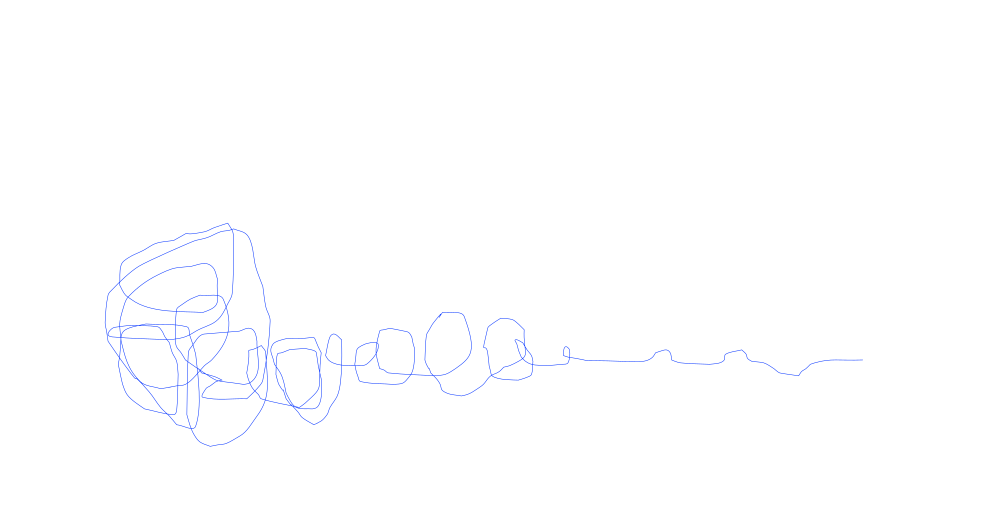
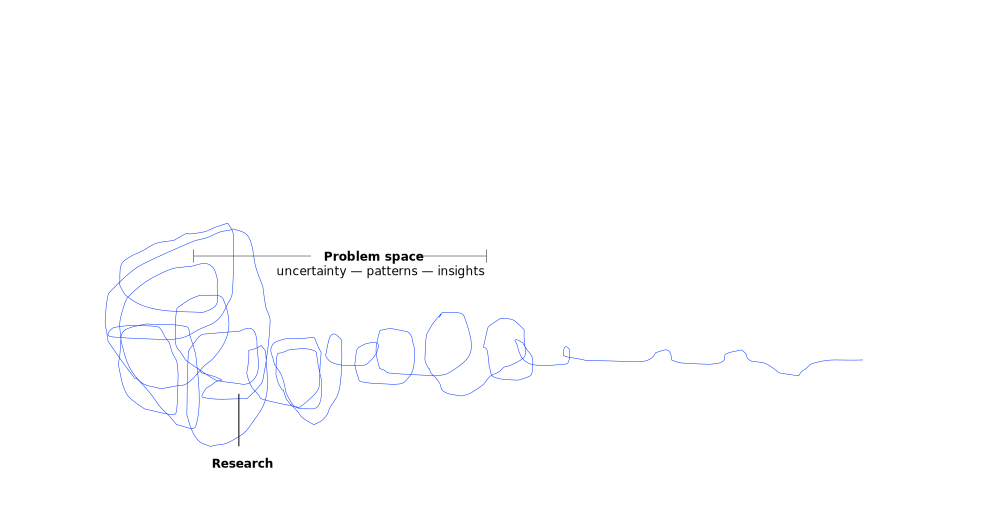
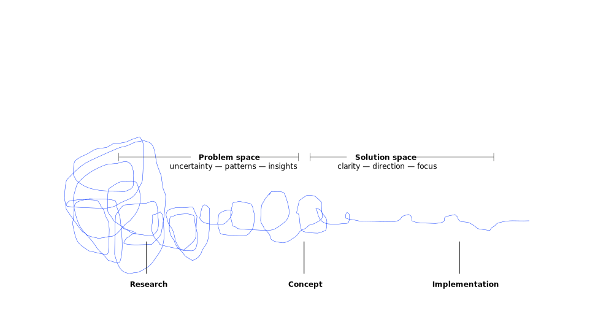
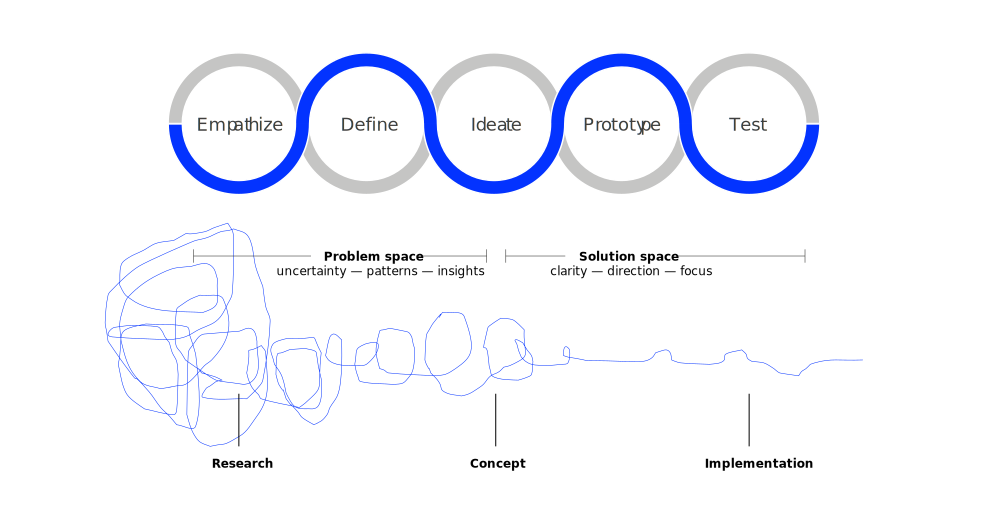

# What is design? {.headline-only .vertical-center background-color="black"}

## {background-color="black" background-image="images/aesthetics.jpg" .no-headline}

:::large
~~aesthetics~~
:::

## {background-color="black" background-image="images/lightning.jpg" .no-headline}

:::large
~~event~~
:::

## {background-color="white" background-image="images/product.jpg" .no-headline}

:::large
~~product~~
:::

## {background-color="black" background-image="images/experience.jpg" .no-headline}

:::large
~~experience~~
:::

## {background-image="images/dt-process.jpg" .no-headline}

:::large
Design is   
a process ...
:::

## {background-image="images/dt-mindsets.jpg" .no-headline}

:::large
... based on these mindsets.
:::

:::notes
The five principles of design thinking provide a framework for approaching complex problems with a human-centered mindset:

- **Human-centered**  
- **Collaborative**  
- **Experimental**  
- **Iterative**  
**Action-Oriented**  
Design thinking prioritizes concrete action over abstract analysis with a bias toward making and doing rather than just thinking and discussing. Rapid prototyping brings ideas into the physical world, real-world testing provides authentic feedback, and the ultimate goal is implementation and impact, not just insight.

These principles work together as an integrated system, encouraging teams to engage deeply with human needs, collaborate across boundaries, experiment boldly, refine solutions iteratively, and focus on tangible outcomes that truly meet user needs.
:::

## Human-centered {background-image="images/human-centered.jpg"}

**Understand people in context** — focus on how they do things and why, their physical and emotional needs, how they think about the world and what matters to them. 

:::notes
Design thinking places humans at the core of all problem-solving efforts. This means starting with deep empathy for the people you're designing for, understanding their needs, motivations, and pain points through observation and engagement. It values emotional and experiential insights as much as quantitative data and considers the full context of how people interact with products, services, and environments.
:::

## Collaborative {background-image="images/radical-collaboration.jpg"}

**Focus on diversity** — bring people with different backgrounds and experiences together to really understand a problem and evolve a solution.

:::notes
Design thinking embraces diverse perspectives and collective creativity. Cross-functional teams bring multiple viewpoints and expertise, while users and stakeholders become active participants in the design process. Power dynamics are flattened to encourage equal contribution, and the collective intelligence of the group is leveraged through structured collaboration.
:::

## Experimential {background-image="images/prototyping.jpg"}

**Embrace experimentation** — prototyping helps you learn and think — taking action on an idea to understand it better, validating it or gaining evidence of the right solution.

:::notes
Design thinking adopts a "build to think" approach where ideas are made tangible quickly through prototyping. Failure is reframed as learning through iteration, and solutions evolve through cycles of testing and refinement. The focus is on practical experimentation rather than theoretical perfection.
:::

## Iterative  {background-image="images/mindful.jpg"}

**Refine relentlessly** — circle back, reassess assumptions, and evolve your solution through continuous feedback and learning.

:::notes
Design thinking embraces a non-linear, cyclical approach where each phase informs and reshapes understanding of previous phases. Early failures guide subsequent iterations toward better solutions, and the process accepts that first solutions are rarely optimal. Continuous loops of feedback and improvement drive development.
:::

## Action-oriented  {background-image="images/show.jpg"}

**Make it real** - transform ideas into tangible prototypes that can be tested, experienced, and refined in the physical world.

:::notes
Design thinking prioritizes concrete action over abstract analysis with a bias toward making and doing rather than just thinking and discussing. Rapid prototyping brings ideas into the physical world, real-world testing provides authentic feedback, and the ultimate goal is implementation and impact, not just insight.
:::

# Design Thinking process {.headline-only .vertical-center background-color="black"}

## {.no-headline}

:::medium
Design thinking is the way designers think[: the mental processes they use to design objects, services or systems, as distinct from the end result of elegant and useful products.]{.fragment}
:::

:::aside
[@dunne2006design]
:::

## {.no-headline}

:::medium
Design thinking results from the nature of design work[: an interdisciplinary and projectbased work flow around “wicked” problems.]{.fragment}
:::

:::incremental
- Solving complex problems
- Holistic perspective 
- Consideration of the interests of as many stakeholders as possible
:::

:::aside
[@dunne2006design]
:::

## The process {.no-headline}

:::r-stack

{.fragment height="420"}

{.fragment height="420"}

{.fragment height="420"}

{.fragment height="420"}

:::

## {background-color="#0333ff" .no-headline .vertical-center}

:::medium
Designers can imagine the world from multiple perspectives – those of colleagues, clients, end users, and customers (current and prospective).
:::

:::aside
[@brown2008design]
:::

## Emphasize {background-color="#f4f4f4"}

:::medium
[We want to guide innovation efforts, ]{.fragment}
[find out everything about our customer or user ]{.fragment}
[and understand their problem]{.fragment}
[as well as uncover even latent needs and desires.]{.fragment}
:::

:::fragment
We can use *Stakeholder Mapping*, *Why-How Laddering*, and *Jobs to be Done*.
:::

### Emphasize — Stakeholder Mapping

Stakeholder mapping is the process of identifying a system of parties involved and interested in a particular outcome or product and their relations to one another.

::::fragment
Stakeholder maps create a solid foundation for user-centered design as they

:::incremental
- visualize and communicates the different parties involved and
- show hierarchies, key relationships, interests, problems, perspectives, etc.
:::
::::

::::fragment
:::medium
Start with a **simple brainstorming** and organize your results in **a comprehensive map.**
:::
::::

### Emphasize — Why-How Laddering

Why-How Laddering is a powerful technique used to explore both the deeper purpose (the "why") and practical implementation (the "how") of concepts or problems.

:::incremental
- **Moving up the ladder** (why questions):\
  When you ask "Why?" you move up to more abstract, purpose-driven thinking.
- **Moving down the ladder** (how questions):\
  When you ask "How?" you move down to more concrete, implementation-focused thinking.
:::

:::fragment
For each need, ladder up by asking *why* until you reach an abstract need. [Climb back down the ladder asking *how* to address the need.]{.fragment}
:::

:::fragment
This helps you to connect tactical actions to strategic purpose, [identify whether you're solving the right problem, ]{.fragment} [reveal assumptions that might need challenging]{.fragment}
[and provide multiple entry points for solution development.]{.fragment}
:::

### Emphasize — Why-How Laddering (Example)

:::medium
> We need to increase electric vehicle adoption.
:::

:::: {.columns}

::: {.column .fragment}
:::medium
Why?
:::

Up the ladder:

:::incremental
- ... to reduce transport emissions
- ... to mitigate climate change
- ... to ensure a sustainable future for people and ecosystems
:::
:::

::: {.column .fragment}
:::medium
How?
:::

Down the ladder:

:::incremental
- ... by making EVs more affordable
- ... by reducing battery production costs
- ... by scaling battery R&D and manufacturing
:::
:::

::::

### Emphasize — Jobs to be Done

People don't buy products or services — they **"hire"** them to make progress on a **job** in a specific situation.

:::incremental
- **Functional dimension**: the practical task to accomplish
- **Emotional dimension**: how the user wants to feel while doing it
- **Social dimension**: how they want to be perceived by others
:::

:::fragment
The job is the unit of analysis — not the user segment, not the product feature.
:::

::::fragment
This applies equally to **external customers** and **internal stakeholders,** making it directly useful for IT and process innovation challenges.

:::aside
[@christensen2016competing]
:::
::::

:::notes
The Jobs to be Done framework was developed by Clayton Christensen and colleagues. The core insight: people don't buy a quarter-inch drill — they buy a quarter-inch hole (and, more abstractly, they want to hang a picture and make their home feel like theirs).

The canonical illustration is McDonald's milkshake study. Milkshake sales peaked in the morning. Exit interviews revealed commuters were "hiring" the milkshake to make their drive less boring, keep one hand free, and stave off hunger until lunch. The real competition wasn't other milkshakes — it was bagels, bananas, and boredom. Improving the milkshake's flavor or cup size would have missed the point entirely.

This reframes who your competition is: not "who else sells milkshakes?" but "what else gets hired for the same job?"

For IT and process innovation, the same logic applies to internal stakeholders — production engineers, logistics planners, quality managers. Their workarounds (shadow Excel sheets, side Slack channels, "I just ask Klaus in IT") are the strongest signal of unmet jobs.
:::

### Emphasize — Job Statement

:::medium
When `[SITUATION]`, I want to `[MOTIVATION / PROGRESS]`, so I can `[OUTCOME]`.
:::

::::fragment
:::medium
Today I "hire" `[CURRENT WORKAROUND]` to do this job, but it falls short because `[FRICTION]`.
:::
::::

:::fragment
Workarounds are the key signal[: shadow Excel sheets, side Slack channels, and informal "ask Klaus" chains reveal exactly where progress is blocked.]{.fragment}
:::

:::fragment
A well-written job statement is essentially a pre-formed POV — feed it directly into the Define phase.
:::

### Emphasize — Jobs to be Done (Example)

**Weak / generic**

> A production engineer needs better data access because data is fragmented.

:::fragment
**Sharp / JTBD-style**\

> When scrap rates spike on line 3 mid-shift, I want to correlate machine telemetry with the last quality check and the current alloy batch, so I can decide within one shift whether to stop the line or adjust parameters. Today I 'hire' a colleague in IT plus three Excel exports to do this job, but by the time I have an answer the shift is over.
:::

:::fragment
The second framing makes the solution question answerable on the basis of *which option gets the job done fastest* — better SAP reporting, a departmental data mart, or an LLM-over-existing-sources approach — rather than which has the most features.
:::

## {background-color="#0333ff" .no-headline .vertical-center}

:::medium
> If I had one hour to solve a problem, I would spend the first fifty-five minutes thinking about the problem and five minutes thinking of the solutions. *Albert Einstein*
:::

## Define

:::medium
[We want to synthesize findings from the previous step, ]{.fragment}
[identify a **specific** and **meaningful** challenge to tackle, ]{.fragment}
[and create an **actionable** problem statement.]{.fragment}
:::

:::fragment
We can use a **Point of View (POV) Madlib** to synthesize our findings into a problem statement that defines the challenge[, and then transform this into **How Might We (HMW) questions** that open up opportunity spaces for ideation throughout the design process.]{.fragment}
:::

:::fragment
For further tools see [bootcamp bootleg [@plattner2010d]](https://hpi.de/fileadmin/user_upload/fachgebiete/d-school/documents/01_GDTW-Files/bootcampbootleg2010.pdf)
:::

### Define — POV Madlib

:::medium
`[USER]` needs to `[USER’S NEED]` because `[SURPRISING INSIGHT]`.
:::

:::fragment
Use a whiteboard or scratch paper to try out a number of options, playing with each variable and the
combinations of them.
:::

:::fragment
The need and insight should flow from your unpacking and synthesis work.
:::

::::fragment
:::smaller
For example, instead of “A teenage girl needs more nutritious food because vitamins are vital to good health”
try “A teenage girl with a bleak outlook needs to feel more socially accepted when eating healthy food,
because in her hood a social risks is more dangerous than a health risk.” [@plattner2010d]
:::
::::

### Define — How Might We (HMW)

:::medium
How might me `[ACTIONABLE PIECE]` for `[USER]` in order to `[NEED]`?
:::

:::fragment
The POV statement keeps you anchored to the core problem, while HMW questions open up thinking about potential solutions without losing sight of that problem.
:::

:::fragment
1. Begin with your POV or problem statement (user and need)
2. Generate as many potential HMWs as you can
3. Group and theme HMWs
4. Vote and/or select the top HMW question to anchor your project
:::

## {background-color="#0333ff" .no-headline .vertical-center}

:::medium
The ideate phase represents a process of “going wide” in terms of concepts and outcomes — **it is a mode of
“flaring” rather than “focus.”**
:::

The goal of ideation is to explore a wide solution space both a large
quantity of ideas and a diversity among those ideas [@plattner2010d].

## Ideate

:::medium
[We want to progress from defining problems to **exploring solutions,** ]{.fragment}
[spark creativity and innovation,]{.fragment}
[move **beyond the expected,**]{.fragment}
[and **exploit the multiplicity of perspectives** in your team.]{.fragment}
:::

:::fragment
We can use different *brainstorming* and *brainwriting methods* to create and evaluate ideas.
:::

### Ideate — Visual Brainstorming

Visual brainstorming uses **visualization as a tool to organize information,** capturing ideas by using something like a mindmap.

:::incremental
1. Write your problem statement in the middle.
2. Write all your ideas around it can connect it to the statement like in a mind map.
3. Continue ideation phase — go back through all of your ideas and write down every thought you have in connection to them, how they maybe relate to each other, support them with visuals, expand upon them etc.
4. Go through each of your ideas again and try to determine elements that are sticking out and color them.
5. Organize your ideas. E.g., create a summary in form of a text document, a more organized mind map etc.
:::

## Prototype

:::medium
[We want to learn and eliminate ambiguity,]{.fragment}
[fail quickly and cheaply by testing a number of ideas,]{.fragment}
[refine solutions with users,]{.fragment}
[and inspire others by showing your vision.]{.fragment}
:::

:::fragment
We can use multiple methods such as *paper prototyping*, *physical prototyping*, *click-dummies* or even tools like *LCDP*.
:::

## Test

:::medium
[We put our ideas into the appropriate context]{.fragment}
[to improve and understand the variables,]{.fragment}
[evaluate and refine the idea, and]{.fragment}
[receive constructive feedback]{.fragment}
:::

:::fragment
Methods such as *pitch*, *lean startup*, *surveys (quantitative and qualitative)*, *4-quadrant test* and many more are suitable for testing our ideas and prototypes.
:::

# Aim of todays workshop {.headline-only .vertical-center background-color="black"}

## {.no-headline}

:::large
Narrow down the problem space of your challenge
:::

:::incremental
1. Iterate through the **emphasize,** **define,** and **ideate** phases.
2. Get in touch with the challenge givers and get answers to your questions (1.00 pm).
3. Use the tools and templates presented or find others online.
4. Upload the results of today's workshop (at leat your POVs and HMW questions).
5. Optional: ask for feedback (I will walk around)
:::

## {.no-headline background-color="#0333ff" .vertical-center}

:::medium
> We spend a lot of time designing the bridge, but not enough time thinking about the people who are crossing it. *Dr. Prabhjot Singh, Director of Systems Design at the Earth Institute*
:::

## {.no-headline background-color="#0333ff" .vertical-center}

:::large
> If you can dream it,           
you can do it. *Walt Disney*
:::

# Q&A {.html-hidden .unlisted .headline-only}

# Literature
::: {#refs}
:::
