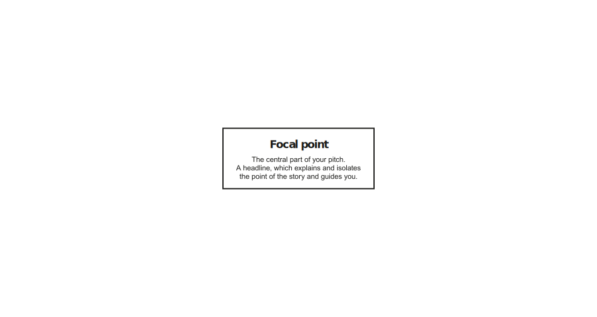
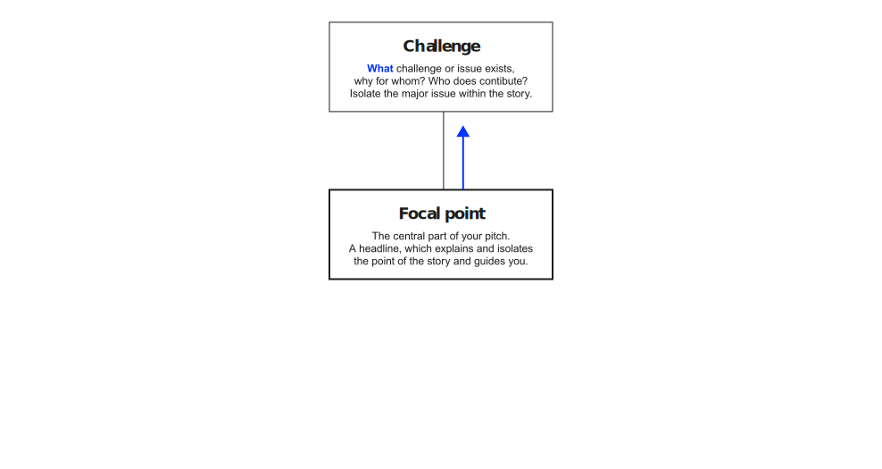
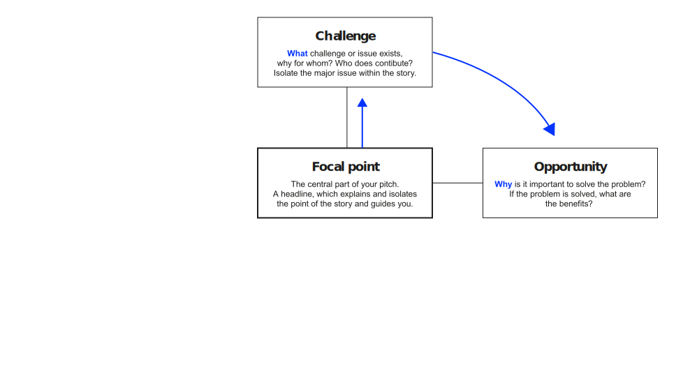
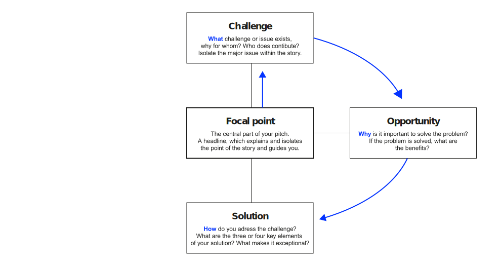
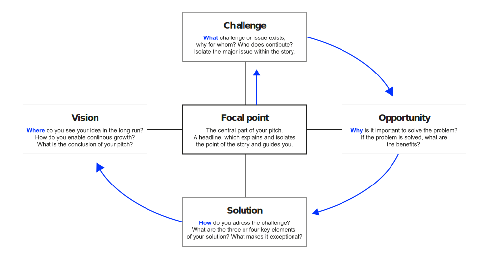

# Learning objectives

After this session, you should be able to:

:::incremental
- Explain why a convincing pitch starts with the problem, not the solution.
- Recognise the two failure modes of a pitch and how to avoid them.
- Translate your in-depth research into a problem statement decision-makers recognise as their own.
- Apply the modes of persuasion, the four truths of a story, and the narrative map to structure your pitch.
- Anticipate decision-makers' questions and rehearse your answers.
:::

# Agenda

:::medium
- Warm-up [10 min]{.smaller}
- Setting the scene [10 min]{.smaller}
- Two ways to lose the room [10 min]{.smaller}
- Problem first (incl. sprint) [30 min]{.smaller}
- [Break]{.highlight}
- Persuasion & narrative map (incl. sprint) [30 min]{.smaller}
- Delivery & evaluation [10 min]{.smaller}
- Wrap-up [5 min]{.smaller}
- Q&A [15 min]{.smaller}
:::

# Warm-up {.headline-only}

## A pitch that stuck {.discussion-slide}

:::large
Think of a pitch you remember.
:::

In pairs, share one pitch (a product, a project, an idea) that genuinely convinced you, or one that visibly failed to convince its audience.

What made it stick, or fall flat?



# Introduction {.headline-only}

## Relevance

:::fragment
Great ideas are a dime a dozen. What separates the dreamers from the doers is the ability to convince others to get behind the idea. This could mean securing funding, getting buy-in from colleagues, or attracting customers.
:::

:::fragment
:::medium
Without that ability to sell,\
your ideas are likely to stay just that: ideas.
:::
:::

:::notes
A pitch is not a presentation of work already accepted; it is the moment at which the work is decided. Decision-makers have limited time, conflicting priorities, and no obligation to engage with the depth of your investigation. The pitch is the bridge between what you have learned and what they can authorise.

This unit is designed to help you cross that bridge.
:::

## Setting

:::fragment
:::large
This is your unique opportunity to present your idea to the board.
:::
:::

:::fragment
You have 12 minutes to raise the funds for the market-ready development of your solution.
:::

:::fragment
Decision-makers will judge your solution along three dimensions:
:::

:::incremental
- [desirable]{.link-color} (it sufficiently addresses relevant parts of the challenge),
- [viable]{.link-color} (it creates business value for the company), and
- [feasible]{.link-color} (it can be implemented within a reasonable timeframe).
:::

:::aside
:::fragment
Note: Only your group knows the idea, the background, and the full process.\
Present in a way that is easy to follow.
:::
:::

:::notes
The three judgements run in parallel in the audience's mind, but they are not independent. *Desirability* is the gate. If decision-makers do not believe the problem matters in the way you frame it, viability and feasibility lose meaning; their assessment of cost, risk, and timeline collapses onto a problem they are not convinced is worth solving.

A strong showing on two of the three does not compensate for a weak showing on the third; all three must clear the bar.
:::

## One instance of a wider skill

:::medium
The board is your audience for this exam.\
It is not the only audience this skill serves.
:::

:::fragment
The same logic applies whenever you pitch to people who decide:
:::

:::incremental
- investors deciding whether to fund a venture,
- executives deciding whether to back an initiative,
- clients deciding whether to engage you, and
- hiring committees deciding whether to bring you on.
:::

:::fragment
:::smaller
Throughout this unit, *decision-makers* refers to the general role; *the board* refers to your specific audience on pitch day.
:::
:::

:::notes
This framing matters for two reasons. First, the techniques in this unit transfer directly to every future pitch you will give: the only thing that changes is who sits in the seats. Second, naming the abstraction explicitly helps you keep two things in your head at once during preparation: *what do decision-makers in general need to feel and conclude?* and *what does this particular board, with these particular priorities, need?*

For the BVC exam, the specifics are sharply defined: a 12-minute slot, a panel acting in the role of a board, a budget decision pending. For the rest of your career, the specifics will vary; the principles will not.
:::

# Two ways to lose the room {.headline-only}

## The asymmetry

:::medium
You have *(hopefully)* spent weeks on the problem.\
Your audience will spend minutes on it.
:::

:::fragment
Your group has investigated the challenge, talked to stakeholders, and tested ideas. [Decision-makers have not, or have done so under very different conditions.]{.fragment}
:::

:::fragment
:::{.large .link-color}
That gap is your central communication problem.
:::
:::

:::notes
Through your research, interviews, and prototyping, you almost certainly understand the problem in more depth than anyone else in the room, sometimes including the people who briefed you in the first place. That is the whole point of the assignment.

Decision-makers, however, come in with a different perspective, and the gap can take two shapes:

- *Narrower view.* They sit above many initiatives at once and see the challenge through the lens of a few priorities they have already chosen for themselves: cost, growth, risk, a strategic bet, a regulatory deadline. Their view is not wrong; it is more compressed than yours.
- *Different view.* They may already hold a working theory of what the problem "really" is, formed under tunnel vision, time pressure, or shallow research. That theory is not always compatible with what your investigation has surfaced. From their seat it is the obvious framing; from yours it is one of several you have already considered and rejected.

Both shapes are uncomfortable in different ways. With a narrower view, you have to translate depth into the slice they care about. With a different view, you have to *displace* a framing they already trust, which is harder: you are not filling an empty space, you are asking them to revise a position they have committed to.

If you simply pour out your depth on decision-makers, they will not follow you in either case. If you walk on stage assuming they share your map of the problem, you have already lost them.
:::

## Two failure modes

[Problem understanding fails]{.large .fragment .link-color}\
[Even the best solution lands in a vacuum. Decision-makers never feel the pain your solution would solve.]{.fragment}

[Solution falls short]{.large .fragment .link-color}\
[A sharp problem framing raises expectations. A weak solution then disappoints decision-makers twice: once for the problem, once for itself.]{.fragment}

:::notes
A pitch fails in two distinct ways, and the remedies differ.

*Failure mode 1: weak problem framing.* You present a solution to a problem decision-makers do not feel. They may concede in the abstract that the problem exists, but they do not see it as urgent or as a fit for their priorities. From that moment on, every solution detail registers as a "nice technical exercise" rather than as a strategic move. No demo, however impressive, recovers from this.

*Failure mode 2: weak solution.* You set up the problem cleanly, the audience leans in, and then the proposed solution does not match the bar you raised. This is in some ways the worse failure: you have invested decision-makers in caring, and then under-delivered on that caring. A solution that would have been "acceptable" against a soft problem framing now looks "inadequate" against a sharp one.

The takeaway is not that the problem matters and the solution does not. The order matters. Problem first, solution second; and the solution must be commensurate with the way you have framed the problem.
:::

## Implication

:::fragment
:::large
You have to earn [the right to talk]{.link-color} about your solution.
:::
:::

:::fragment
The price of admission is a problem framing decision-makers recognise as their own.
:::

:::fragment
This is also why the first minutes of the pitch are disproportionately important. You earn (or fail to earn) the right to spend the remaining ten minutes on your solution within the first two.
:::

:::fragment
Practically, this changes how you draft the deck. Most student groups start with the solution slides because that is where they have invested the most effort. Draft the problem slides first, get them right, and only then build the solution slides to match.
:::

# Problem first {.headline-only}

## Make the problem stick

:::large
Make your\
[problem statement]{.link-color}\
stick.
:::

:::fragment
Demonstrate understanding of the stakeholders, their values, and their interests before you offer a solution.
:::

:::notes
A problem statement is "sticky" when decision-makers can repeat it after the pitch without looking at the slides. That is the test: not whether *you* are happy with the wording, but whether *they* can carry it out of the room.

A sticky problem statement has three properties:

1. It names a *specific* stakeholder, not "the company" or "users".
2. It describes a *consequence* decision-makers care about, not a symptom only you find interesting.
3. It is short enough to be repeated in one breath.
:::

## A workable template

Based on the tools and templates discussed so far, you could use the following template to formulate your problem statement:

:::medium
For _\[stakeholder\]_, who _\[situation/pain\]_,\
the challenge is _\[problem\]_.\
If unresolved, _\[consequence\]_.\
_\[Decision-makers\]_ care because _\[their priority\]_.
:::

:::fragment
On point; no jargon; no solutioning yet.
:::

:::notes
The template is a scaffold, not a script. Its job is to force you to name the four ingredients decision-makers need in order to feel the problem: *who*, *what hurts*, *what happens if we do nothing*, and *why this slots into their existing priorities*.

For the BVC exam, the last clause reads "The board cares because…"; for an investor pitch it would read "Investors care because…", and so on. The clause exists to anchor the problem to the priorities the audience in front of you actually holds.

The last clause is where most student pitches under-invest. It is the clause that connects your depth to the audience's slice. If you cannot complete it, your audience probably will not, either.
:::

## Whose problem?

:::medium
:::incremental
- Whose pain is sharpest?
- Whose authority releases the budget?
- Whose support do you need after the pitch?
:::
:::

:::fragment
These are often three different people.\
Lead with the first; address the second; do not forget the third.
:::

:::notes
A typical mistake is to write the problem statement for the end user (whose pain is sharpest and most vivid) and then deliver it to decision-makers (whose authority releases the budget). The two need not be the same person, and the pitch must satisfy both.

Lead with the end user's pain because that is what makes the story land. Then translate it into the decision-makers' frame: cost, growth, risk, strategic fit. Decision-makers will not feel the pain on the end user's behalf; they will feel it through the lens of consequence for the organisation.
:::

## Decision-makers see a slice

[Your map of the problem and the one decision-makers carry into the room rarely overlap.]{.highlight}\
Side by side, the gap looks like this:

::::columns
:::{.column width="50%"}
[What you know:]{.h4}

- Full problem space
- Multiple stakeholder views
- Trade-offs explored
- Dead ends ruled out
:::
:::{.column width="50%"}
[What decision-makers care about:]{.h4}

- A few prioritised dimensions
- Strategic fit
- Speed and cost
- Risk
:::
::::

:::fragment
:::medium
Connect their slice back to your depth, not the other way around.
:::
:::

:::notes
The asymmetry is not a problem to be hidden; it is a resource. Your depth lets you confidently say, "Yes, we considered alternative X; here is why it does not solve the part you care about." Decision-makers do not need to see every alternative you considered, but they need to feel that *you* have, and that you can defend the choice.

The order of operations is critical. Start in the audience's frame; then prove, with brief evidence, that the broader investigation supports the framing. Reversing the order, with exhaustive depth first and "and so therefore your priority is served" at the end, almost always loses the room.
:::

## Exercise: problem-statement sprint {.html-hidden .unlisted .discussion-slide}

:::large
Sharpen the problem your audience will hear first.
:::

In your project group, run three rounds:

:::incremental
1. **Draft (4 min):** each member writes the problem statement using the template, individually.
2. **Compare (3 min):** read all drafts aloud. Mark the clauses that disagree.
3. **Refine (3 min):** agree on the version your team will lead with on pitch day.
:::

:::fragment
Be ready to send me your statement to the plenary at the end.
:::



:::notes
Walk the room during the draft round. The most common failures are:

- Naming "the company" or "the market" instead of a specific stakeholder.
- Stating the problem as the absence of your solution ("they need an AI agent").
- Skipping the last clause ("\[Decision-makers\] care because…").

After the refine round, ask two groups to read their statements aloud. Do not critique publicly; instead ask the other groups, "Can you repeat the problem in one sentence?" If they can, the statement is sticky. If they cannot, ask the presenting group what they would change.
:::

# Persuasion {.headline-only}

## Modes of persuasion

Aristotle suggested that any spoken or written communication intended to persuade contains three key rhetorical elements:

[Logos]{.large .fragment .link-color}\
[Appeals to the audience's reason, building up logical arguments.]{.fragment}

[Ethos]{.large .fragment .link-color}\
[Appeals to status or authority so that listeners trust the speaker.]{.fragment}

[Pathos]{.large .fragment .link-color}\
[Appeals to the emotions, e.g., making the audience feel concerned or hopeful.]{.fragment}

:::notes
A good pitch does not pick one mode; it weighs them differently for different audiences and moments.

- A pitch to senior decision-makers is logos-heavy (numbers, value mechanics, risk) with ethos supporting it; the team has done the work and earned the right to recommend a course of action.
- The problem section is where pathos belongs, briefly and concretely: a single stakeholder voice, an episode, a vivid number, so that the audience *feels* the problem before they evaluate the solution.
- Pathos without logos in a decision-making context reads as theatre. Logos without pathos reads as a report and rarely moves money.
:::

## Four truths of a story

@guber2007four argues that a story persuades when it carries four truths:

:::incremental
- **Truth to the teller:** you must believe your own problem framing.
- **Truth to the audience:** speak to decision-makers' priorities, not yours.
- **Truth to the moment:** the time you have, the room you are in, the decision pending.
- **Truth to the mission:** anchor your idea in business value creation, not in the elegance of the technology.
:::

:::notes
The four truths are a checklist to run over the draft of any pitch. The two students most often miss are *truth to the audience* and *truth to the mission*.

*Truth to the audience* is exactly the asymmetry discussed above. Students tend to tell the story they would want to hear; decision-makers need the story they can act on. For the BVC exam, that audience is the board; in a future role it might be an investor, a steering committee, or a client.

*Truth to the mission* is the one most easily smuggled past you by your own enthusiasm. In an IT-enabled value creation course, the mission is value, not technology. A pitch that lingers on the architecture, the model, or an agent's mechanics is failing this truth; decision-makers care about what those mechanisms *produce*.

The other two are usually safe in a student project: you believe in your work (truth to the teller) and you understand the format (truth to the moment).
:::

## Story elements

Behind every good story is a well-thought-out structure that forms its backbone. The essential elements are:

:::larger
[Characters]{.fragment}\
[Setup or conflict]{.fragment}\
[Sequence of events (plot)]{.fragment}\
[Resolution]{.fragment}
:::

:::notes
For a pitch, the elements map cleanly onto your structure:

- *Characters:* the stakeholder(s) whose pain anchors the problem, and the team that will own the solution.
- *Setup / conflict:* the problem statement and the consequence of inaction.
- *Plot:* your approach, the prototype, the evidence that it works.
- *Resolution:* the implementation plan and the value decision-makers will see.

A pitch with no character is a feature list with a slide deck. A pitch with character moves the room.
:::

## Narrative map

::: {.r-stack .html-hidden}
{.fragment height="420"}

{.fragment height="420"}

{.fragment height="420"}

{.fragment height="420"}

{.fragment height="420"}
:::

:::notes
The narrative map is a five-element backbone for any persuasive story. Each element corresponds to a question decision-makers silently ask:

- **Focus:** what is this fundamentally about? Not the technology; the value at stake.
- **Conflict / challenge:** what is the problem, and why does it persist?
- **Opportunity:** what changes once we act?
- **Approach:** how will we get there in practice?
- **Resolution:** what does success look like, and for whom?

![General structure of a good pitch [adapted from @guber2007four]](images/narrative-map.svg){#fig-map}
:::

## Exercise: narrative-map sprint {.html-hidden .unlisted .discussion-slide}

:::large
Build the backbone of your pitch.
:::

In your project group, fill in the narrative map for your own pitch. Work on a single sheet or shared canvas; keep each element to one or two sentences.

:::incremental
1. **Focus:** what is your pitch fundamentally about? Not the technology; the value at stake.
2. **Conflict / challenge:** the problem and why it persists.
3. **Opportunity:** what changes once decision-makers act.
4. **Approach:** how you get there in practice.
5. **Resolution:** what success looks like, and for whom.
:::

:::fragment
Your map stays inside the group; nothing is shared with the plenary.
:::



:::notes
The exercise is deliberately group-internal: groups have invested weeks in their idea and are protective of it. No plenary presentation, no swapping of maps, no whiteboard on the wall. Walk the room and coach quietly.

The most common failures to watch for:

- *Focus dressed as topic.* "Our pitch is about agentic AI" describes the topic, not the focus. Push for the value at stake: "Our pitch is about cutting onboarding time in half."
- *Conflict without consequence.* The conflict needs a why-now and a what-if-nothing. Without consequence, decision-makers register the problem as a curiosity rather than a decision.
- *Approach swallowing resolution.* Groups overrun the approach (it is where their work lives) and underspecify the resolution. The resolution is what decision-makers leave the room remembering.

A useful private question to ask each group near the end: "If every member of your team described the *focus* in one sentence, would they say the same thing?" Often the answer is no, and surfacing that disagreement is one of the most valuable things this sprint produces.

For the plenary debrief, ask only meta-questions that do not require disclosing content:

- "Which element was hardest to agree on inside your group?"
- "Did the map confirm your current draft, or did it reveal something you want to change?"
:::

# Delivery {.headline-only}

## Show, don't tell

:::{.large .link-color}
Show, don't tell.
:::

:::incremental
- Use valid facts and figures.
- Demonstrate your prototype rather than describe it.
- Make the value proposition tangible: a number, a workflow, a screen.
:::

:::notes
A demo is a special opportunity in your twelve minutes. It converts logos (this is how it works) and pathos (you can see it working) at the same time, and it adds ethos (we built it; we know it). Plan the demo as a tight, scripted slice. An unrehearsed demo destroys ethos faster than any other element of a pitch.
:::

## Sell yourself

:::{.large .link-color}
When you are selling your idea,\
the audience must first buy you.
:::

Make sure the audience trusts that you have recognised the problem correctly and can lead the solution to success.

:::notes
Ethos in a student pitch comes from three things: the *depth* of your problem framing (you have clearly done the work), the *crispness* of your team's allocation of speaking time (everyone owns a part competently), and your *handling of Q&A*. A team that defends its choices without becoming defensive earns the room. A team that flinches under one tough question loses it.
:::

## Look ahead

:::{.large .link-color}
Everything starts with an idea,\
but this is only the beginning.
:::

Present a roadmap: a plan for translating the idea into actions and results.

:::notes
The roadmap addresses *feasibility* directly. It does not need to be detailed; it needs to be credible. A two- or three-step horizon with named milestones is usually enough at this stage. Decision-makers read the roadmap as a proxy for "do these people understand what comes after the pitch?"
:::

## Time budget

A defensible default split for a 12-minute pitch:

| Section | Time |
|:---|---:|
| Hook and problem | 3 min |
| Approach and solution | 3 min |
| Prototype demo | 3 min |
| Value, roadmap, ask | 2 min |
| Buffer | 1 min |

: A 12-minute pitch time budget {#tbl-budget}

:::notes
Two warnings about the budget:

1. Overrunning the problem section is the single most common mistake. It sounds safe ("we want to make sure they get it"), but it eats the time you need for the demo and the ask.
2. The buffer is non-negotiable. A pitch that lands at 11:30 looks composed. A pitch that races to 12:00 looks stressed and erodes ethos at exactly the moment you need it.
:::

# Evaluation criteria

**The main criterion is how convincing your pitch and solution are.**

:::fragment
In addition, we look at:
:::

:::incremental
- The problem is clearly and comprehensively defined, with a strong understanding of the stakeholder(s) and their needs.
- The proposed approach to value creation is logical, complete, and well aligned with the problem and stakeholder needs.
- The solution is well developed, addresses the problem effectively, and reflects the characteristics of a viable MVP.
- The team communicates clearly, confidently, and professionally, telling a convincing story and using effective visuals.
- The presentation is well structured with clear flow, transitions, and effective use of time.
- The presentation is free from language, spelling, or formatting errors and demonstrates high attention to quality.
:::

:::notes
The criteria are roughly ordered by the sequence in which they are scored during the pitch. The first two, problem and approach, dominate. A pitch that does not clear them rarely recovers on the strength of the other four.
:::

:::{.content-visible when-format="revealjs"}

# Key takeaways

:::incremental
1. **Problem first:** You earn the right to talk about your solution by framing the problem in a way decision-makers recognise.
2. **Mind the asymmetry:** You see the full problem; decision-makers see the slice that matches their priorities, or hold a different framing of their own. Lead with their view; back it with your depth.
3. **Two failure modes:** A weak problem kills any solution; a strong problem framing raises the bar your solution must meet.
4. **Story moves money:** Modes of persuasion, four truths, and the narrative map are deliberate tools, not decoration.
5. **Rehearse the questions:** The pitch is often decided in Q&A, not in the prepared minutes.
:::

# Q&A {.headline-only .html-hidden .unlisted background-color="#0333ff"}

# Literature

:::{#refs}
:::
