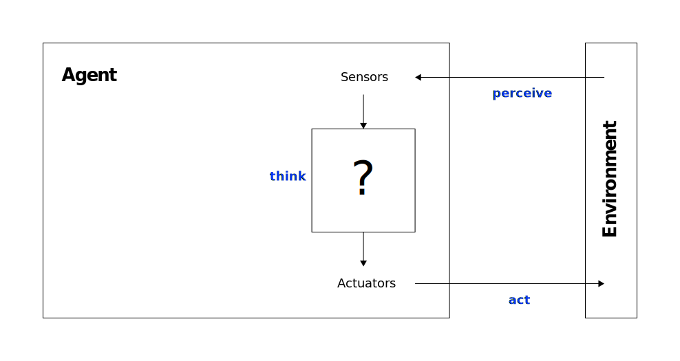
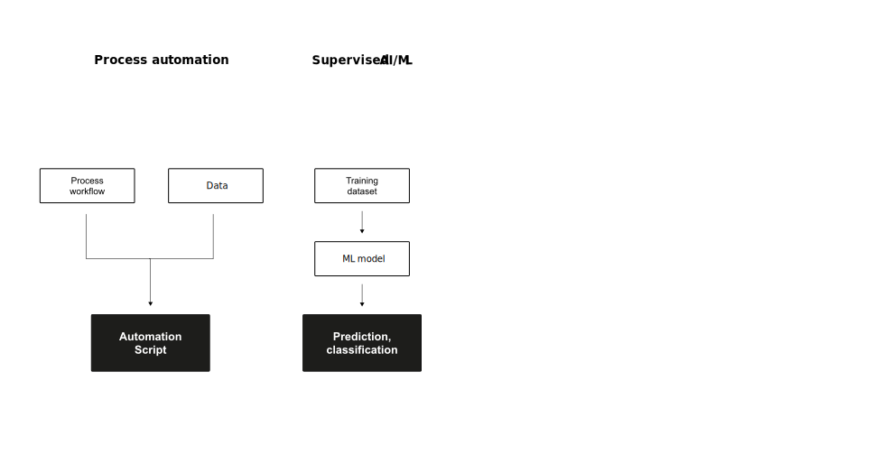

# Learning objectives

After completing this unit, you will be able to:

:::incremental
1. Explain human, collective, and artificial intelligence and their **complementary strengths.**
2. Describe the **evolution from rule-based agents to agentic AI** systems and their key characteristics.
3. Analyse how agentic AI **creates and conditions** business value in organisations.
4. **Design and evaluate** human-AI collaboration considering governance, explainability, and accountability requirements.
5. Reflect on the **ethical and organisational implications** of deploying autonomous AI systems.
:::

# Intelligence {.headline-only}

:::{.content-visible when-format="revealjs"}
## Discussion {.discussion-slide}

:::medium
What is intelligence?
:::
:::

## Definition

:::medium
> Intelligence is the ability to accomplish complex goals, learn, reason, and adaptively perform effective actions within an environment. *@gottfredson1997mainstream*
:::

:::{.content-visible when-format="revealjs"}
:::notes
This definition is deliberately broad — it covers humans, groups, machines, and hybrid systems alike. Ask students: "Is this definition technology-neutral?" (Yes — which is exactly why it is useful here.) Emphasise the four verbs: *accomplish*, *learn*, *reason*, *act*. All four apply to AI systems in different degrees, and tracking which degrees is what this session is about.
:::
:::

:::{.content-visible unless-format="revealjs"}
The definition by @gottfredson1997mainstream is intentionally broad. It covers individual humans, groups of people, artificial systems, and combinations thereof — which makes it an ideal starting point for a unit that ultimately asks: *how do humans and AI systems best combine their respective intelligence to create value?*

The four key verbs deserve attention: *accomplish goals* (orientation towards outcomes), *learn* (adaptive capacity), *reason* (capacity for inference and planning), and *act effectively* (not just think, but act in a way that changes the world). These four dimensions will reappear throughout both sessions.
:::

## Human intelligence

> **Human intelligence** "covers the capacity to learn, reason, and adaptively perform effective actions within an environment, based on existing knowledge. This allows humans to adapt to changing environments and act towards achieving their goals." *@dellermann2019hybrid [p. 632]*

:::fragment
@sternberg1985beyond proposes three distinctive dimensions:
:::

:::incremental
- **Componential (analytica) intelligence:** the ability to break down complex information and apply logical processes to find the most efficient solution
- **Experiential (creative) intelligence:** the ability to synthesize prior knowledge to navigate novel situations and automate new tasks
- **Contextual (practical) intelligence:** the ability to read environmental demands and adapt your behavior (or the environment) to achieve success
:::

:::{.content-visible when-format="revealjs"}
:::notes
Sternberg's triarchic theory is useful here not as an end in itself, but as a way to highlight *what humans do well that AI has historically struggled with*: contextual intelligence (reading implicit social cues, adapting to ambiguous environments) and experiential intelligence (generalising from small numbers of novel experiences). Componential intelligence — analytical problem-solving — is the domain where AI has made the most impressive progress.
:::
:::

:::{.content-visible unless-format="revealjs"}
@sternberg1985beyond's triarchic theory is valuable here because it illuminates *which dimensions of human intelligence AI systems complement most effectively*. Componential intelligence (i.e, structured analytical reasoning) is precisely where current AI systems (including large language models) excel. Contextual intelligence and the kind of wisdom that comes from lived experience remain harder to replicate artificially, which creates the design space for hybrid systems.

@kahneman2011thinking proposed a complementary two-system model: 

- **System 1** operates automatically, intuitively, and quickly with little effort; 
- **System 2** is deliberate, analytical, and effortful. 
 
Human cognition relies heavily on System 1, which makes us fast but susceptible to biases (i.e., cognitive shortcuts that work well most of the time but can fail systematically).
AI systems can help counteract some System 1 biases, but (as we will see in Block E) can also create new ones.
:::

## Cognitive architecture

@kahneman2011thinking distinguishes two modes of human cognition:

:::incremental
- **System 1:** fast, automatic, intuitive\
  Efficient for routine decisions, but prone to bias and heuristic errors
- **System 2:** slow, deliberate, effortful\
  Accurate for complex analysis, but resource-intensive and easily fatigued
:::

:::fragment
Both modes have blind spots. AI augmentation can (under the right conditions) compensate for System 1 biases without overwhelming System 2 capacity.
:::

:::{.content-visible when-format="revealjs"}
:::notes
This is motivation for AI augmentation from the human side. System 1 is why humans make predictable errors in forecasting, risk assessment, and pattern recognition at scale. AI can provide a kind of disciplined "second opinion." However — and this is the critical caveat that Block E will develop — AI systems can introduce their own systematic biases, and explanations of AI reasoning can trigger *new* System 1 shortcuts (confirmation bias). Mention this as a preview so students keep it in mind.
:::
:::

## Artificial intelligence

> The term **artificial intelligence** describes systems that perform "[…] activities that we associate with human thinking, activities such as decision-making, problem solving, learning […]" *@bellman1978introduction [p. 3]*

:::fragment
> AI can be defined as "[…] the art of creating machines that perform functions that require intelligence when performed by people […]" *@kurzweil1990age [p. 117]*
:::

:::fragment
The basic idea: systems that can *analyse* their environment, *adapt* to new circumstances, and *act* in ways that advance specified goals without explicit programming for every situation.
:::

:::{.content-visible when-format="revealjs"}
:::notes
Note the historical framing: both definitions are essentially *functional* — AI is whatever machines do that we previously considered to require human intelligence. This is a moving target (the "AI effect": as soon as AI can do X, X is no longer considered to require intelligence). What is stable is the underlying aspiration: systems that can reason and act under uncertainty. Today's large language models and agentic systems represent the latest frontier of that aspiration.
:::
:::

## Complementary strengths

![Complementary strengths of humans and machines [@dellermann2019hybrid, p. 640]](images/strengths.svg){#fig-strengths}

:::{.content-visible when-format="revealjs"}
:::notes
Walk through the figure. Humans bring: contextual understanding, creativity, ethical judgment, social/emotional intelligence, robustness to novelty. Machines bring: processing large volumes of structured data at high speed, consistency, pattern recognition at scale, perfect recall of stored information, and freedom from certain emotional biases. Neither side is uniformly superior. The value of hybrid systems lies precisely in combining both sets of strengths in tasks where they are complementary.

**Bridge:** @hemmer2025complementarity (EJIS 2025) formalises this: two sources of complementarity drive performance advantages in hybrid systems. First, *information asymmetry* — humans and AI have access to different types of information. Second, *capability asymmetry* — humans and AI are differentially capable of certain tasks. Both must exist for genuine complementarity. Mention this for now; we will return to design implications in Session 2.
:::
:::

:::{.content-visible unless-format="revealjs"}
@dellermann2019hybrid's framework of complementary strengths provides the conceptual foundation for the entire unit. AI systems excel at processing large datasets, recognising complex patterns consistently, maintaining recall, and performing at scale without fatigue. Humans provide contextual understanding, creativity, ethical judgment, and social intelligence — the kind of knowledge that is tacit, situationally embedded, and difficult to formalise.

@hemmer2025complementarity (EJIS 2025) subsequently formalised the sources of this complementarity. They identify two key drivers. First, *information asymmetry*: humans and AI have access to fundamentally different information types — machines process large volumes of structured data; humans bring tacit, experiential, and contextual knowledge that is difficult to encode formally. Second, *capability asymmetry*: humans and AI differ in which cognitive tasks they can perform well. Complementarity emerges when both asymmetries exist simultaneously, enabling the combined system to outperform either component alone.
:::

:::{.content-visible when-format="revealjs"}
## Discussion {.discussion-slide}

:::medium
What can AI do — and what can't it?
:::

- Where does AI surpass humans?\
- Where do humans surpass AI?\
- Where should they work together?

Think individually for two minutes, then discuss with a partner.



:::notes
AI strengths: pattern recognition in large datasets, consistency, speed, 24/7 availability, recall. 

Human strengths: moral judgment, handling true novelty, social interaction, accountability, creative leaps. 

"Together" examples: medical diagnosis (AI on imaging, human on patient context), legal research (AI on case law, human on strategy), financial risk (AI on signals, human on judgment calls).
:::
:::

## Collective intelligence

> **Collective intelligence** refers to "[…] groups of individuals acting collectively in ways that seem intelligent." *@malone2015handbook [p. 3]*

:::fragment
The concept implies that under certain conditions, a (large) group of *homogeneous* individuals can outperform any single individual or even a single expert [@leimeister2010collective].
:::

:::fragment
Today, research increasingly focuses on **hybrid collective intelligence:** connecting *heterogeneous* agents (e.g., humans and machines) so that they combine complementary intelligence and act more intelligently together [@malone2015handbook].
:::

:::{.content-visible when-format="revealjs"}
:::notes
The shift from homogeneous to heterogeneous collective intelligence is the conceptual pivot of the whole unit. Classical crowd wisdom (Galton's ox-weight estimation, prediction markets) relies on averaging out human errors. Hybrid collective intelligence is more ambitious: it combines fundamentally *different* types of reasoning — statistical pattern recognition at scale on the machine side, contextual judgment and creativity on the human side. Emphasise that this combination is only superior *under certain conditions*, which is exactly what the research in Session 2 will specify.
:::
:::

# Agent architectures {.headline-only}

## Rational agents

{#fig-agent}

:::{.content-visible when-format="revealjs"}
:::notes
A rational agent is anything that (1) *perceives* its environment through sensors, (2) *decides* on actions by mapping percept sequences to outputs, and (3) *acts* through actuators. "Rational" means the agent acts to maximise its expected performance measure, given its built-in knowledge, its percept history, and its available actions. Key point: rationality is not the same as perfection — it requires no omniscience, only the best possible action given *available* information. This will matter when we discuss agentic AI acting under uncertainty.
:::
:::

:::{.content-visible unless-format="revealjs"}
@RusselNorvig2022AIMA define a rational agent as an entity that (1) perceives its environment through sensors, (2) maps percept sequences to actions based on its agent function, and (3) executes actions through actuators. The *percept sequence* is the complete history of everything the agent has ever perceived. The *agent function* maps any percept sequence to an action — it is the abstract mathematical specification of what the agent does.

Rationality is tied to a *performance measure*: a criterion that evaluates the desirability of environment states from the agent's perspective. A rational agent selects the action expected to *maximise* the performance measure, given its percepts and built-in knowledge. Crucially, rationality maximises *expected* performance, not *actual* performance — the latter would require omniscience about the future, which is generally not available.
:::

## Performance measure

> If we use, to achieve our purposes, a mechanical agency with those operations we cannot interfere once we have started it [...] we had better be quite sure that the purpose built into the machine is the purpose which we really desire. *@Wiener1960Some [p. 1358]*

:::fragment
:::medium
Formulating a performance measure correctly is difficult — and **a reason to be careful.**
:::
:::

:::{.content-visible when-format="revealjs"}
:::notes
Wiener's warning from 1960 is remarkably prescient for the age of agentic AI. The problem of *misaligned* goals — where an agent optimises the stated objective but not the intended one — is one of the central challenges in AI safety. Classic example: an agent instructed to "maximise paperclip production" converts all matter to paperclips. Less extreme but practically relevant: a recommendation algorithm optimised for engagement time maximises outrage content. The performance measure is specified *by humans* and is therefore only as good as human foresight. Bridge to governance in Block F.
:::
:::

## Performance standards

To understand the engineering limits of AI, we distinguish between three standards:

| Metric          | Definition                              | Info Requirement                   | Feasibility                               |
|:----------------|:----------------------------------------|:-----------------------------------|:------------------------------------------|
| **Rationality** | Maximizing *expected* performance       | Percept sequence + prior knowledge | **High:** The engineering standard        |
| **Omniscience** | Knowing the *actual* outcome of actions | Complete future and present data   | **Impossible:** Requires a "crystal ball" |
| **Perfection**  | Maximizing *actual* performance         | Requires Omniscience               | **Impossible** in unpredictable worlds    |

## Overcoming ignorance

:::medium
To bridge the gap between initial ignorance and rational behavior, agents must utilize **information gathering** and **learning.**
:::

:::fragment
Since agents lack omniscience, they must be designed to:
:::

:::incremental
- **Information gathering:** take actions specifically to modify future percepts (e.g., looking both ways before crossing a street).
- **Learning:** modify their internal agent function based on experience to improve performance over time.
:::

:::fragment
As the environment is usually not completely known *a priori* and not completely predictable, these are vital parts of rationality [@RusselNorvig2022AIMA, p.59].
:::

:::notes
:::callout-note
### Example
The vacuum cleaner needs to explore an initially unknown environment (**exploration**) to maximize its expected performance. A vacuum cleaner that learns to predict where and when additional dirt will appear will do better than one that does not.
:::
:::

## Evolution of agents

:::{.content-visible when-format="revealjs"}

:::r-stack
{.fragment height="420"}

{.fragment height="420"}

{.fragment height="420"}

{.fragment height="420"}
:::

:::

:::{.content-visible unless-format="revealjs"}
{#fig-evolution}
:::

:::{.content-visible when-format="revealjs"}
:::notes
The trajectory is clear: each generation increases autonomy, reduces the need for human specification, and expands the range of situations the agent can handle. 

- Simple reflex → fixed rules. Model-based → world tracking. 
- Goal-based → flexible objective. 
- Utility-based → handling trade-offs. 
- Learning → self-improvement. 
 
Agentic AI (next slide): extended autonomy over long-horizon, multi-step tasks with minimal supervision. 

This evolution is why agentic AI is qualitatively different from earlier AI systems — not just faster or more accurate, but differently *structured* in its relationship to human oversight.
:::
:::

# Agentic AI {.headline-only}

## Definition

:::medium
> Agentic AI is an emerging paradigm in AI that refers to **autonomous systems** designed to pursue complex goals with **minimal human intervention.** *@acharya2025agentic [p. 18912]*
:::

:::fragment
[Core characteristics]{.h4}
:::

:::incremental
- **Autonomy & goal complexity:** handles multiple complex goals simultaneously; operates independently over extended periods
- **Adaptability:** functions in dynamic and unpredictable environments; makes decisions with incomplete information
- **Independent decision-making:** learns from experience; reconceptualizes approaches based on new information
:::

:::{.content-visible when-format="revealjs"}
:::notes
Stress the *qualitative* differences from classical AI: (1) multi-step, long-horizon tasks — not just responding to a single prompt but managing a workflow over time; (2) operating with minimal human intervention — the system takes initiative, not just responds; (3) real-world action — agentic systems can execute code, browse the web, send emails, call APIs. This changes the governance question fundamentally: we are no longer talking about a system that produces outputs humans act on; we are talking about a system that *itself acts* in the world.

@berente2021managing (MIS Quarterly 2021) frame this in terms of three dimensions: *autonomy* (acting with less human guidance), *learning* (improving through experience), and *inscrutability* (opacity in reasoning). These three dimensions jointly create new management challenges that did not exist with traditional AI — they cannot be addressed with the same governance approaches used for rule-based systems.
:::
:::

:::{.content-visible unless-format="revealjs"}
The shift to agentic AI is not merely incremental. @acharya2025agentic identify three technical foundations: *reinforcement learning* enables systems to refine strategies through trial and error; *goal-oriented architectures* manage complex, multi-step objectives; and *adaptive control mechanisms* allow recalibration in response to environmental changes. Together, these enable systems that can pursue extended task sequences with minimal human intervention.

@berente2021managing (MIS Quarterly, 2021) provide a complementary management perspective, arguing that AI systems create three interdependent management challenges: **autonomy** (the system acts with progressively less human guidance), **learning** (the system's behaviour changes over time through experience), and **inscrutability** (the system's internal reasoning is opaque to observers). Managing these three dimensions simultaneously — rather than treating each in isolation — is the central challenge of deploying agentic AI in organisations.
:::

## Agentic AI vs. traditional AI

| Feature | Traditional AI | Agentic AI |
|---|---|---|
| Primary purpose | Task-specific automation | Goal-oriented autonomy |
| Human intervention | High (predefined parameters) | Low (autonomous adaptability) |
| Adaptability | Limited | High |
| Environment interaction | Static or limited context | Dynamic and context-aware |
| Learning type | Primarily supervised | Reinforcement and self-supervised |
| Decision-making | Data-driven, static rules | Autonomous, contextual reasoning |

: Comparison of traditional AI and agentic AI based on @acharya2025agentic

:::{.content-visible when-format="revealjs"}
:::notes
Briefly walk through the table. The key column is "Human intervention": moving from high (human must specify every parameter and exception) to low (the system navigates novel situations on its own). This is what creates *business value* — tasks that required constant human attention can now be delegated — but also what creates *governance risk* — the system may pursue its goal in ways that are technically correct but organisationally undesirable. Both sides of this trade-off are central to the rest of the course unit.
:::
:::

## Workflow patterns in agentic systems

@agenticAI2024 discusses five key patterns for designing agentic AI workflows:

:::incremental
1. **Prompt chaining:** output of one step becomes input to the next; creates complex multi-step reasoning flows
2. **Routing:** directs tasks to specialised components based on type; improves efficiency through targeted processing
3. **Parallelisation:** processes independent subtasks simultaneously; increases throughput
4. **Orchestrator-workers:** central orchestrator delegates to specialised worker agents; manages coordination and integration
5. **Evaluator-optimizer:** separate components generate, evaluate, and refine; enables iterative quality improvement
:::

:::{.content-visible when-format="revealjs"}
:::notes
These patterns are important for students designing systems in their projects. The four most practically relevant: *prompt chaining* is the simplest — chain LLM calls like a workflow. *Orchestrator-workers* is the most powerful but hardest to govern: a central agent autonomously decomposes a problem and delegates to specialists. *Evaluator-optimizer* is most similar to how humans work: generate a draft, evaluate it, revise. Emphasise that the pattern choice affects both performance *and* how much human oversight is feasible — orchestrator-worker systems are harder to supervise than sequential prompt chains.
:::
:::

:::{.content-visible unless-format="revealjs"}
**Prompt chaining** works best for tasks with clear sequential dependencies — each step must complete before the next can begin. It is the easiest pattern to audit and debug.

**Routing** is particularly valuable when tasks are heterogeneous: a general-purpose system can direct customer service queries to a billing specialist, a returns specialist, or a technical support specialist, rather than attempting to handle all cases with one agent.

**Parallelisation** (i.e., processing multiple independent subtasks simultaneously) is most valuable for high-volume, time-sensitive tasks (e.g., analysing 500 customer reviews simultaneously).

**Orchestrator-workers** is the most powerful and the most governance-intensive. The orchestrator autonomously decomposes a high-level goal into subtasks, delegates, monitors, and integrates. This is the pattern underlying most enterprise AI agent systems (e.g., AutoGPT, LangGraph, Microsoft Copilot agents).

**Evaluator-optimizer** creates a feedback loop: a generator agent produces an output, an evaluator agent scores it, and the loop continues until quality criteria are met. This is particularly valuable for tasks with objectively measurable quality (e.g., code correctness, document compliance).
:::

:::{.content-visible when-format="revealjs"}
## Workflow mapping exercise {.discussion-slide}

:::medium
Identify a process relevant to your project challenge.
:::

Choose **one process step** from your project and work through these questions in pairs:

1. Which workflow pattern (chaining, routing, parallelisation, orchestrator-workers, evaluator-optimizer) could structure this process?
2. What would humans still need to do?
3. Where is the risk of things going wrong?



:::notes
Walk around and prompt groups who are stuck. Expected difficulty: identifying what "humans still need to do" — this is often underspecified in initial designs. Encourage students to think about: where is contextual judgment irreplaceable? Where is accountability required? Where is the information structured enough for automation? The third question (risk) is a preview of Block F. Harvest 2–3 examples briefly. Connect: the pattern you choose determines both the value *and* the governance requirements of your solution.
:::
:::

# Hybrid Intelligence {.headline-only}

## Concept

:::medium
> The idea is to combine the complementary capabilities of humans and computers to augment each other. *@dellermann2019hybrid*
:::

:::{.content-visible when-format="revealjs"}
:::notes
This is the pivot from "what is agentic AI?" to "how do we harness it to create value?" 

The concept of hybrid intelligence frames AI not as a replacement for humans, but as a *partner* that is enhanced by human input and enhances human capability in return. 

This framing shapes the entire design space — it leads to different questions (how do we best combine?) rather than purely optimisation questions (how do we automate most efficiently?). 

There is also a technology-centric counter-perspective that we should acknowledge: 

@peeters2021hybrid note that some researchers argue human intelligence is biologically limited and that sufficiently advanced AI will eventually outperform humans across all domains. This view leads to a different design logic — but it remains contested and, for now, practically premature.
:::
:::

## Definition

> **Hybrid intelligence** is defined as the ability to achieve complex goals by combining human and artificial intelligence, thereby reaching **superior results** to those each of them could have accomplished separately, and **continuously improving** by learning from each other. *@dellermann2019hybrid [p. 640]*

. . .

Main characteristics:

:::incremental
- **Collectively:** tasks are performed jointly; activities are conditionally dependent
- **Superior results:** neither AI nor humans could have achieved the outcome without the other
- **Continuous learning:** all components of the socio-technical system learn from each other through experience
:::

:::{.content-visible when-format="revealjs"}
:::notes
The third characteristic (*continuous learning*) needs to be emphasized as it distinguishes hybrid intelligence from simple human-tool interaction. 

A hammer does not learn from how you use it. A hybrid intelligence system does: the AI component improves through human feedback; the human component develops new mental models through AI exposure. 

This mutual adaptation is what makes hybrid systems *dynamically valuable* — they get better over time, not just in initial deployment.
:::
:::

## Distribution of roles

![Distribution of roles in hybrid intelligence [@dellermann2019hybrid, p. 640]](images/visualization.svg){#fig-roles}

:::{.content-visible when-format="revealjs"}
:::notes
The visualisation shows a spectrum: fully human on one end, fully automated on the other, with hybrid systems in between. The point is not that "50-50 is best" but that the *optimal* split depends on the task, the context, and the capabilities of both human and AI components. Tasks where one side is clearly dominant should be allocated accordingly; tasks where both sides bring irreplaceable strengths warrant genuine hybrid designs. In practice, the split often shifts over time as AI capabilities develop and as humans adapt their working practices.
:::
:::

:::{.content-visible unless-format="revealjs"}
The distribution of roles in hybrid intelligence is not fixed — it is a design choice that should be calibrated to the specific task, context, and goals. @dellermann2019hybrid illustrate this with a spectrum from fully human to fully automated, with hybrid systems occupying the middle space where complementarities are exploited.

Importantly, this spectrum is *dynamic*: as AI capabilities develop, some tasks
that once required human judgment can increasingly be automated. Conversely,
as AI systems are deployed, human roles often *evolve* rather than disappear.
@spring2022information show this pattern in law and accountancy firms:
AI-based systems selectively automate high-volume, back-office tasks, but
this automation simultaneously *augments* adjacent professional work —
reconfiguring rather than replacing the human role. The two cannot be
neatly separated.
:::

## The Automation–augmentation paradox

@raisch2021automation argue that automation and augmentation are *not* opposing strategies — they are **interdependent:**

:::incremental
- Overemphasising **automation** (machines replacing humans) creates reinforcing cycles that erode human capability, ultimately making humans less able to provide value when it matters most
- Overemphasising **augmentation** (humans plus machines) can under-exploit AI capabilities and leave significant efficiency potential unrealised
:::

:::fragment
**Effective AI deployment** requires holding *both* logics simultaneously, managing their tensions across time and space
:::

:::fragment
:::medium
The question is not *"automate or augment?"*\
— but *"when, where, and how to combine both?"*
:::
:::

:::{.content-visible when-format="revealjs"}
:::notes
@raisch2021automation use paradox theory from organisation science to make this argument rigorous. 

Their key insight: automation and augmentation create *circular* causality. Automation that erodes human skills eventually undermines the oversight capacity that makes automation safe. Augmentation that preserves all human roles prevents the scale and consistency advantages of automation from materialising. The productive resolution is not a compromise but a *dialectical* management of the tension: design systems that automate where appropriate while deliberately maintaining and developing human capabilities where they remain essential. This has direct implications for students' project designs — they should ask: what human capabilities must not atrophy?
:::
:::

:::{.content-visible unless-format="revealjs"}
@raisch2021automation develop their argument using paradox theory from organisational science. They identify that automation and augmentation create reinforcing causal loops that can become self-sustaining and difficult to reverse. An automation-dominant logic progressively reduces human skill through disuse, eventually leaving organisations without the human capacity to maintain systems, handle novel exceptions, or provide meaningful oversight. An augmentation-dominant logic may preserve human roles but prevent the efficiency, scale, and consistency gains that make AI economically viable. The solution is not a "balance" between the two poles but a *dynamic* management of their interdependence — deliberately choosing where each logic applies, across time, task type, and organisational level.
:::

## Managing AI

@berente2021managing identify three interdependent dimensions that define the management challenge of AI systems:

:::incremental
- **Autonomy:** AI acts with progressively less human guidance; requires careful scoping of delegated decision authority
- **Learning:** AI behaviour changes over time through experience; creates challenges for quality control and accountability
- **Inscrutability:** AI reasoning is opaque; limits the ability to audit, explain, and correct decisions
:::

:::fragment
These three dimensions interact: *higher autonomy + higher inscrutability* creates accountability gaps. *Learning + higher inscrutability* can produce *invisible drift* in system behaviour.
:::

:::{.content-visible when-format="revealjs"}
:::notes
The interaction effects are the key insight here. Each dimension alone is manageable: autonomy can be scoped, learning can be monitored, inscrutability can be addressed through XAI. But all three together — which characterises agentic AI — create novel governance challenges. The "invisible drift" point is particularly important: a learning agentic system deployed today may behave differently six months from now in ways that are not immediately visible, and the opacity means the drift may not be detected until a significant error occurs. This is a direct preview of the governance section in Block F.
:::
:::

## From tools to teammates

@seeber2020machines highlight a fundamental shift in how AI systems are positioned in organisations:

. . .

| Traditional AI | AI as Teammates |
|---|---|
| **Role**: Tool to be used | **Role**: Active collaboration partner |
| **Interaction**: Responds to commands | **Interaction**: Engages proactively |
| **Function**: Task automation | **Function**: Complex problem-solving |
| **Agency**: Limited / directed | **Agency**: Autonomous with initiative |
| **Integration**: Technical system integration | **Integration**: Social & team integration |

:::{.content-visible when-format="revealjs"}
:::notes
This shift is not just conceptual — it changes what *design* means. Designing AI as a tool is primarily a software engineering problem. Designing AI as a teammate is a sociotechnical design problem that involves role clarity, trust calibration, communication protocols, and institutional structures. @seeber2020machines argue this shift requires new frameworks — the old categories of "user" and "system" no longer apply when AI systems take initiative, participate in defining problems, and generate solutions unprompted. Ask students: "In your project, are you designing a tool or a teammate? And does the design reflect that choice?"
:::
:::

## Critical design areas

@seeber2020machines identify three interconnected design areas for AI teammates:

:::incremental
1. **Machine artifact design:** the AI system itself: appearance, capabilities, interaction modalities
2. **Collaboration design:** how humans and AI work together: team composition, task allocation, workflows, communication protocols
3. **Institution design:** the broader context: responsibility frameworks, liability, training requirements, governance structures
:::

:::fragment
These areas are *interdependent*: decisions in one area constrain and shape the others. Effective design requires a **holistic** rather than purely technical approach.
:::

:::{.content-visible when-format="revealjs"}
:::notes
People focus only on machine artifact design (the technology) and underestimate collaboration design (how work is organised) and institution design (who is responsible for what). 

- A well-designed AI system deployed in a poorly designed workflow creates chaos. 
- A well-designed workflow with no clear accountability framework creates risk. 

All three areas must be addressed.
:::
:::

## Implications for hybrid intelligence

According to @peeters2021hybrid:

:::incremental
- Intelligence should be studied at the **group level** of humans and AI-machines working together — not at the level of individual components
- Increasing system intelligence means **increasing the quality of interaction** between components — not merely improving individual components
- Both human and artificial intelligence are shallow when considered in isolation
- **No AI is an island:** value emerges from the system, not the artefact
:::

:::{.content-visible when-format="revealjs"}
:::notes
This is the main theoretical takeaway for Session 1. "No AI is an island" is a memorable encapsulation of the whole unit's argument. It counters the tendency to evaluate AI systems by their isolated capabilities (benchmark performance, parameter count, etc.) and reframes evaluation in terms of *systemic performance*: what does the combined human-AI system achieve in context? This has direct implications for how students should evaluate their project solutions — not "how capable is the AI?" but "how well does the combined system perform the task?"

Bridge to Session 2: We've established the conceptual framework. In Session 2, we ask: under what specific conditions does hybrid intelligence actually create business value, and what must be in place (design, governance, responsibility structures) for it to do so sustainably?
:::
:::

# Value creation with Agentic AI {.headline-only}

## IT value creation

The IT value creation process [@soh1995creates]:\
IT investments only translate into performance if three linked processes work:

:::incremental
1. **IT conversion:** IT expenditure *lead to* IT assets (requires appropriate conversion)
2. **IT use:** IT assets *create* IT impacts (usage is the critical missing link)
3. **Competitive process:** IT impacts *foster* organisational performance (depends on context and competitors)
:::

:::fragment
:::medium
When AI *agents* close the *mising link* (i.e., IT usage), what changes?
:::
:::

:::{.content-visible when-format="revealjs"}
:::notes
The key question: the model identifies *IT use* as the missing link — but it conceptualises use as *human* behaviour (adoption, effective use, workarounds). 

When agentic AI replaces or augments the human as the primary "user," this changes the value creation logic fundamentally. 

The missing link is no longer (only) human adoption — it is system design quality, governance, and the quality of human-AI interaction.
:::
:::

:::{.content-visible unless-format="revealjs"}
@soh1995creates proposed the process model of IS value creation as a response to the "productivity paradox" — the observation that IT investments often did not produce measurable performance improvements. Their central insight was that IT assets do not create value automatically; *IT use* is the essential linking process. Without effective use — defined by @burton2013use as transparent interaction, representational fidelity, and informed action — IT assets produce no organisational benefit.

In the context of agentic AI, this model requires reinterpretation. The "user" is no longer exclusively human. The agent *itself* interacts with information systems, processes data, and executes actions. This shifts the governance question: instead of asking how to ensure *humans* use AI effectively, organisations must ask how to ensure AI *agents* act in ways that reliably advance organisational goals — which leads directly to the design and governance questions of this session.
:::

## Shifting the "missing link"

:::medium
The shift from human use to **agent action** changes where value is created and where it can break down:
:::

:::{.content-visible when-format="revealjs"}
:::fragment

| Characteristic   | Traditional IT                    | Agentic AI                                       |
|------------------|-----------------------------------|--------------------------------------------------|
| **Missing link** | *Human adoption & use*            | *Agent design & governance*                      |
| **Risk**         | Non-adoption, misuse, workarounds | Misaligned objectives, invisible errors, drift   |
| **Remedy**       | Training, UX design, change mgmt  | Careful design, monitoring, oversight structures |
| **Value driver** | Effective human behaviour         | System-level performance & accountability        |

:::
:::

:::{.content-visible unless-format="revealjs"}

| Characteristic   | Traditional IT                    | Agentic AI                                       |
|------------------|-----------------------------------|--------------------------------------------------|
| **Missing link** | *Human adoption & use*            | *Agent design & governance*                      |
| **Risk**         | Non-adoption, misuse, workarounds | Misaligned objectives, invisible errors, drift   |
| **Remedy**       | Training, UX design, change mgmt  | Careful design, monitoring, oversight structures |
| **Value driver** | Effective human behaviour         | System-level performance & accountability        |

: Comparison of traditional IT and agentic AI {#tbl-ai-comparison}

:::

:::{.content-visible when-format="revealjs"}
:::notes
With traditional IT, the biggest risk is that people *don't use* the system, or use it incorrectly. 

With agentic AI, the risk profile shifts: people may *over-delegate* to a system that is subtly misaligned, or fail to detect gradual behavioural drift. 

The "invisible error" problem is particularly dangerous: agentic systems that perform well on average but fail systematically in edge cases can cause large-scale harm before the failure is detected. Connect to IS business value taxonomy: internal/external × tangible/intangible — agentic AI can create value in all four quadrants, but also creates risk in all four.
:::
:::

## AI-augmented decisions

@herath2024design derive seven evidence-based design principles from action design research across three business decision contexts:

:::incremental
1. **Transparent uncertainty communication:** AI should signal its confidence, not just its recommendation
2. **Explainable reasoning paths:** users need to understand *why*, not just *what*
3. **Scoped autonomy:** AI should act autonomously only within well-defined task boundaries
4. **Human override capability:** human judgment must remain exercisable at every stage
5. **Feedback integration:** systems should learn from human corrections in near-real time
6. **Accountability anchoring:** every AI decision output must be linked to a responsible human
7. **Context-sensitive presentation:** recommendations should be tailored to the decision context, not generic
:::

:::{.content-visible when-format="revealjs"}
:::notes
@herath2024design worked with actual companies in customer segmentation, retention, and portfolio design contexts — this is applied research, not theoretical. The most important principle for students to internalise is *accountability anchoring*: in a world where AI makes recommendations and humans act on them, there is a structural tendency for accountability to "fall through the gap" — the AI is not accountable, and humans claim they were only following the AI. Designing systems with explicit accountability anchoring — specific humans are responsible for verifying and owning AI outputs — prevents this. This connects directly to Block F.
:::
:::

:::{.content-visible unless-format="revealjs"}
@herath2024design conducted action design research across three business contexts — customer segmentation, customer retention, and portfolio redesign — iterating design artefacts with practitioner partners. Their seven principles address both technical design (how the AI system presents information) and sociotechnical design (how responsibility is structured). The *accountability anchoring* principle is particularly consequential: without an explicit design decision linking AI outputs to accountable humans, organisations risk creating what @berente2021managing call "accountability voids" — situations where AI acts but no human is clearly responsible for the outcome.
:::

## Valueable collaboration

@fugener2022cognitive conducted experiments on human-AI prediction tasks and found:

:::fragment
:::medium
Human-AI teams achieve superior performance **only when AI delegates to humans,** not vice versa.
:::
:::

:::fragment
**Human metaknowledge,** i.e., the ability to assess your own reliability in a specific context ("knowing what you know"), seems to be the critical variable:
:::

:::incremental
- AI can assess its own certainty well and delegates effectively (even to low-performing humans) because it knows what it knows and what it doesn't
- Humans, by contrast, lack metaknowledge: they cannot accurately judge *their own* reliability, leading to poor delegation decisions despite genuine willingness to collaborate
- This metaknowledge deficit is unconscious and cannot be explained by algorithm aversion — subjects tried to follow delegation strategies diligently and appreciated the AI support
:::

:::{.content-visible when-format="revealjs"}
:::notes
This is a counterintuitive and important result.

The popular narrative is: let humans decide when to delegate to AI, and they will learn to use it well.

@fugener2022cognitive show that this fails — not because humans distrust AI, but because they cannot accurately assess their own capabilities. Subjects *wanted* to collaborate and *tried* to delegate rationally, but they were systematically wrong about which cases they could handle themselves.

The AI, by contrast, delegated effectively because it could assess its own certainty. It knew which cases were difficult for it and handed those to humans — and this worked even when the humans were low performers.

The asymmetry is key: AI has good self-knowledge, humans do not. This means effective collaboration requires designing interfaces that support human self-assessment — helping users judge their own reliability — rather than assuming humans will naturally calibrate their reliance on AI.
:::
:::

:::{.content-visible unless-format="revealjs"}
@fugener2022cognitive's findings challenge a common assumption in human-AI collaboration design. The typical expectation is that humans can learn to delegate effectively to AI over time. Their experimental evidence shows that this fails — not because of algorithm aversion, but because humans lack *metaknowledge*: the ability to accurately assess their own reliability on a specific task.

The asymmetry is striking: AI delegated effectively because it could assess its own certainty, handing off difficult cases to humans — and this improved performance even when those humans were low performers. Humans, by contrast, made poor delegation decisions because they were systematically wrong about which cases they could handle. Subjects tried to follow delegation strategies diligently and appreciated the AI support, but their lack of self-knowledge undermined collaboration.

Design implication: interfaces should support *human self-assessment* (helping users judge their own reliability) rather than assuming humans will naturally calibrate their reliance on AI. Metaknowledge deficits are unconscious — they cannot be addressed through motivation or training alone.
:::

## The delegation paradox

Traditional AI design assumes "top-down" delegation: humans decide when to hand tasks to AI. However, empirical evidence suggests this is often ineffective [@fugener2022cognitive].

:::fragment
[Why human delegation fails]{.h4}
:::

:::incremental
- Humans cannot accurately assess their own reliability as they are systematically wrong about which cases they can handle, leading to poor delegation decisions. 
- This failure is not caused by distrust of AI (i.e., AI aversion). Subjects tried to follow delegation strategies diligently and appreciated AI support, but their lack of self-knowledge undermined collaboration.
:::

:::fragment
[Why AI delegation works]{.h4}
:::

:::incremental
- AI can assess its own certainty and effectively hand off difficult cases to humans. This improved performance even when the humans were low performers.
- Interfaces should support **human self-assessment** rather than relying on humans to calibrate their own reliance on AI naturally.
:::

## Context-dependence of value

@revilla2023human conducted a field experiment in retail demand forecasting. Their results reveal the *conditionality* of hybrid intelligence value:

| Context                            | Superior Strategy            | Explanation                                                                               |
|------------------------------------|------------------------------|-------------------------------------------------------------------------------------------|
| Short horizon, high uncertainty | Automation (AI only)      | AI extracts signal from noise better; humans "tinker at the edges" and add bias           |
| Long horizon, low uncertainty   | Augmentation (human + AI) | AIML model is well-grounded; humans add contextual knowledge the algorithm misses         |
| Short horizon, low uncertainty  | Adjustable automation        | Some contextual knowledge helps, but short-horizon noise limits full augmentation benefit |
| Long horizon, high uncertainty  | Mixed                        | Long horizons favor human input, high uncertainty favors AI — effects partially offset    |

: Effectiveness of human-AI collaboration in retail demand forecasting [@revilla2023human] {#tbl-humanAIcollabDemand}

:::fragment
There is no universal best practice. **Task context** determines optimal collaboration strategy.
:::

:::{.content-visible when-format="revealjs"}
:::notes
This is the "it depends" result with specificity. Short horizon + high uncertainty: no time for human deliberation, and patterns are too volatile for human pattern-matching — AI wins. Long horizon + low uncertainty: human judgment about structural factors, business context, and anomalies adds genuine value. The practical implication: organisations should *analyse* their task context before choosing an automation vs. augmentation strategy, rather than applying a blanket policy. Connect to Raisch & Krakowski: the paradox is not just philosophical — it has concrete, measurable implications for which strategy to choose in specific operational contexts.
:::
:::

:::{.content-visible when-format="revealjs"}
## Exercise {.discussion-slide}

:::medium
Where does agentic AI create value in your project?
:::

Map your project's core AI component to the **IS business value matrix** (Schryen 2013):

- **Internal tangible**: Cost reductions, productivity gains, efficiency improvements
- **Internal intangible**: Better decisions, improved capabilities, organisational learning
- **External tangible**: Revenue growth, market share, customer retention
- **External intangible**: Brand trust, customer satisfaction, reputation

Where is the primary value? Where are the risks? What conditions must hold?



:::notes
- *Which* process, *by how much*, under *what conditions*? 
- What if the AI makes systematic errors? Who bears the cost? Where would errors be most visible / most damaging? 
- What must be true about data quality, user behaviour, and governance for the value to materialise? 
:::
:::

# Explainability & trust {.headline-only}

## Effective hybrid intelligence

@peeters2021hybrid identify four properties that human-AI systems must exhibit for effective collaboration:

:::incremental
- **Observability:** an actor should make its status, knowledge of the team, task, and environment visible to collaborators
- **Predictability:** an actor should behave consistently so others can anticipate its actions when planning their own
- **Explainability:** agents should be capable of explaining their behaviour to collaborators
- **Directability:** collaborators should be able to re-direct each other's behaviour when necessary
:::

. . .

:::fragment
These properties enable *calibrated trust* (i.e., humans trusting AI appropriately): neither too much nor too little.
:::

:::{.content-visible when-format="revealjs"}
:::notes
Calibrated trust is the target state. Automation bias (over-trust) leads to humans accepting AI errors uncritically. Algorithm aversion (under-trust) leads to humans ignoring useful AI recommendations. Both destroy value. The four properties are essentially the *design conditions* for calibrated trust: if AI is observable, predictable, explainable, and directable, humans can rationally calibrate how much to rely on it in specific contexts. Note that these are also the properties that make governance feasible — you cannot govern what you cannot observe, predict, or redirect.
:::
:::

## The XAI dilemma

@bauer2023expl show that AI systems providing explanations (XAI) alongside predictions may:

:::incremental
- Draw users' attention *excessively* to explanations that **confirm prior beliefs** (confirmation bias) rather than the prediction itself
- **Diminish** employees' decision-making performance for the task at hand
- Lead individuals to **carry over** biased explanatory patterns to other domains
- **Decrease individual-level noise** (consistency increases) but *increase* systematic error
- **Foster differences** across subgroups with heterogeneous prior beliefs
:::

:::fragment
:::medium
Transparency ≠ better decisions.\
**How** XAI is designed determines **whether** it helps or hurts.
:::
:::

:::{.content-visible when-format="revealjs"}
:::notes
This is a critical and counter-intuitive finding. The policy and regulatory direction (EU AI Act, financial services regulations) is toward *mandatory* XAI for high-stakes AI decisions. @bauer2023expl show this can backfire: explanations trigger System 1 processing (fast, associative, confirmation-seeking) rather than System 2 deliberation, making decisions *less* accurate on average while *appearing* more legitimate. Key design implication: XAI should be designed to support deliberative reasoning (System 2), not just to provide transparency for its own sake. This means: targeted explanations for high-stakes exceptions rather than universal explanations for every decision; structured interfaces that require explicit reasoning before accepting AI recommendations; and careful testing of whether explanations actually improve decisions or just increase confidence.
:::
:::

:::{.content-visible unless-format="revealjs"}
The @bauer2023expl findings have significant practical and regulatory implications. Many AI governance frameworks — including the EU AI Act — require explainability as a condition for deploying AI in high-risk contexts. The implicit assumption is that explanations improve decision-making by enabling meaningful human oversight. @bauer2023expl provide experimental evidence that this assumption is frequently violated.

Their mechanism: explanations activate *confirmation bias* — the tendency to interpret new information in ways that confirm existing beliefs. When an AI provides an explanation (e.g., "this loan application was rejected because of low income and high debt") alongside a prediction, users attend selectively to the parts of the explanation that confirm what they already believed, and ignore or discount evidence that contradicts it. The result is more *consistent* decisions (less random variation) but more *systematically biased* decisions (more strongly shaped by prior beliefs). Subgroups with different prior beliefs can arrive at very different conclusions from the same AI recommendation.

The design implication: explainability mechanisms should be evaluated empirically — not assumed to improve decision quality — and should be calibrated to the specific cognitive risks of the user population and decision context.
:::

## Types of AI explanations

Different explanation types serve different cognitive needs [@miller2019explanation; @wang2019designing]:

:::incremental
1. **How explanations:** describe the AI's process:\
   *"I used features X, Y, Z to reach this conclusion"*
2. **Why explanations:** justify the AI's reasoning:\
   *"This is the dominant factor because ..."*
3. **What-if explanations:** counterfactual analysis:\
   *"If feature X changed, the outcome would be ..."*
4. **Confidence indicators:** uncertainty communication:\
   *"I am 73% confident in this recommendation"*
:::

:::fragment
The most effective explanation type depends on **user expertise,** **time pressure,** **decision stakes,** and **potential for bias activation.**
:::

:::{.content-visible when-format="revealjs"}
:::notes
Novice users often benefit most from *why* explanations (they help build mental models); experts often prefer *what-if* (counterfactuals support their existing reasoning patterns); time-pressured users need concise *confidence indicators*. The @bauer2023expl caution applies especially to *why* explanations in contexts where users have strong prior beliefs — this is where confirmation bias is most likely to be activated. The safest approach is to test explanation formats with representative users rather than choosing based on theoretical appeal alone.
:::
:::

## Designing for complementarity

@hemmer2025complementarity identify the organisational factors that enable effective human-AI complementarity:

:::incremental
- **Digital infrastructure:** quality and accessibility of data and AI tools
- **Governance mechanisms:** clear rules for how AI outputs are used and overridden
- **Change management:** deliberate support for users adapting to hybrid workflows
- **Trust calibration:** training and feedback mechanisms that help users calibrate AI reliance
:::

:::fragment
Optimal **task allocation**:\

- AI automates easy tasks
- *Augmentation* on tasks of similar difficulty
- Humans handle difficult tasks alone.
:::

:::{.content-visible when-format="revealjs"}
:::notes
The task allocation principle from @hemmer2025complementarity is intuitive but practically underutilised. Organisations often default to either "automate everything AI can do" or "AI supports humans on every task." The evidence suggests a more nuanced strategy: AI should *fully automate* tasks where it has a clear capability advantage; *augment* humans on tasks where both can contribute; and *step back* on tasks that are genuinely above current AI capability or where human judgment is irreplaceable. The four organisational enablers (infrastructure, governance, change management, trust calibration) are all necessary — the absence of any one can prevent the others from working.
:::
:::

## AI affordances in teams

According to @dennis2023ai, AI agents provide three fundamental affordances to human teams:

:::incremental
- **Communication support:** coordination and reminders, review and feedback, delegation capabilities
- **Information processing support:** data cataloguing, search and retrieval, information analysis, content organisation
- **Process structuring:** planning and scheduling, task breakdown, delivery tracking, quality assurance
:::

:::fragment
These affordances enable AI to contribute to team processes in ways that *complement* human team members and, thus, enable superior collective outcomes.
:::

:::{.content-visible when-format="revealjs"}
:::notes
@dennis2023ai's affordance framework is useful for students designing their project solutions: it shifts the question from "what can AI do?" to "what does the team need?" — and then asks which AI capabilities address those needs. Process structuring support is often underexplored: many students design AI for information processing (which is well understood) but overlook the potential of AI to improve *how work is organised and tracked* within the team or organisation. Connect this to students' own team work: could an AI affordance reduce coordination friction in their own projects?
:::
:::

# Governance & responsible AI {.headline-only}

## The stakes

:::medium
As agentic AI systems act **autonomously,** safety and accountability are critical — not optional [@shavit2023practices].
:::

:::fragment
Three compounding factors raise the stakes:
:::

:::incremental
- **Autonomy:** systems act without direct human instruction; errors compound before detection
- **Scale:** agentic systems can act on thousands of cases before a human review cycle completes
- **Opacity:** inscrutability makes post-hoc attribution of errors difficult
:::

:::fragment
The governance question is not "how do we prevent AI from making mistakes?" — but **"how do we detect, correct, and account for mistakes when they inevitably occur?"**
:::

:::{.content-visible when-format="revealjs"}
:::notes
The framing shift in the last point is important: from *prevention* (unrealistic; all complex systems produce errors) to *detection, correction, and accountability* (realistic; what good governance can actually achieve). This is the "resilient AI governance" perspective. It accepts that agentic AI will sometimes act in ways that are wrong or harmful, and designs governance structures that limit the impact of those errors and ensure they are addressed. Connect to Wiener's performance measure warning from Session 1: the difficulty of specifying what we actually want (performance measure formulation) means errors are nearly inevitable; governance must create the structures to catch and correct them.
:::
:::

## Practices for safe operation

@shavit2023practices proposes a series of practices for the responsible deployment of agentic AI:

:::incremental
- **Suitability assessment:** evaluate whether the agent is appropriate for the specific task and context
- **Scope limitation:** restrict agent action to well-defined domains; require approval for consequential actions
- **Default behaviour establishment:** define explicit defaults for ambiguous situations
- **Traceability:** ensure all agent actions can be logged and attributed
- **Automated monitoring:** implement real-time anomaly detection
- **Attributability:** every action must be linkable to an accountable actor (human or system)
- **Interruptibility:** the agent must be stoppable; human control must be maintainable at all times
:::

:::{.content-visible when-format="revealjs"}
:::notes
*Interruptibility* is non-negotiable for any agentic system deployed in a real organisational context. 
An agentic system that cannot be stopped is not safe to deploy, regardless of its performance.

*Attributability* — the question "who is responsible?" must have a clear answer for every AI action. 
Without this, organisations face legal and reputational exposure that can far outweigh the value created by the system.

:::
:::

## The principal-agent view

@jarrahi2025rethinking apply **principal-agent theory** to reframe AI agents as *delegated actors* rather than autonomous systems:

:::incremental
- **Principals** (organisations, humans) delegate tasks to **agents** (AI systems) in exchange for performance
- The core problem: *information asymmetry* — agents have knowledge principals lack; interests may diverge
:::

:::fragment
Three design principles follow:
:::

:::incremental
- **Guided autonomy:** AI acts within principal-defined constraints, not freely
- **Individualisation:** AI behaviour adapts to the specific context and stakeholder
- **Adaptability:** AI can revise its approach as contexts change, within defined limits
:::

:::fragment
This framing keeps accountability firmly with the *principal* — AI is an agent, not an autonomous actor with its own standing.
:::

:::{.content-visible when-format="revealjs"}
:::notes
Principal-agent theory is well-established in economics and organisation science (e.g., executive compensation, outsourcing contracts). @jarrahi2025rethinking's contribution is to show it applies directly to AI: the agency problem (the agent acts in its own interest, or in ways the principal didn't specify) is not uniquely a human problem — it is a structural feature of delegating complex tasks to any actor whose reasoning is not fully visible to the principal. The implication: organisations should treat agentic AI as they would treat a new employee in a high-trust role — establish clear scope, monitor performance against explicit criteria, build in escalation mechanisms, and maintain the right to override. This is emphatically not about distrust; it is about well-designed accountability structures.
:::
:::

:::{.content-visible unless-format="revealjs"}
Principal-agent theory, developed in economics and organisation science to analyse relationships like executive compensation and outsourcing contracts, has a clear structural parallel to human-AI delegation. In both cases, a *principal* (organisation, human supervisor) delegates tasks to an *agent* (AI system, employee or contractor) with the expectation of performance in the principal's interest. The core challenge is *information asymmetry*: the agent has knowledge, capabilities, and perhaps interests that the principal cannot fully observe.

@jarrahi2025rethinking's contribution is to show that the traditional agency problem — agents acting in their own interest or in ways that deviate from the principal's intentions — applies to AI systems structurally, not just metaphorically. The design principles that follow are therefore not arbitrary but grounded in decades of research on how to structure delegation relationships that are both effective and accountable.
:::

## Responsible AI governance

@papagiannidis2025responsible identify a systematic gap between AI *principles* and AI *governance*:

:::incremental
- **AI principles:** high-level commitments: ethics, transparency, fairness, accountability, privacy
- **Governance mechanisms:** operational structures: oversight processes, accountability roles, audit procedures, escalation paths
:::

:::fragment
Their framework spans four phases:
:::

:::incremental
- **Design phase:** embed governance requirements into system architecture from the start
- **Execution phase:** operational oversight during deployment; exception handling protocols
- **Monitoring phase:** continuous tracking of system behaviour, performance drift, and error patterns
- **Evaluation phase:** periodic review of whether the system is meeting its intended purpose
:::

:::{.content-visible when-format="revealjs"}
:::notes
The principles-governance gap is well-documented and practically significant. Many organisations (and many AI providers) have published ethics principles — responsible AI, fair AI, trustworthy AI — but have not operationalised them into governance mechanisms that actually change how AI systems are built and operated. @papagiannidis2025responsible provide a framework for closing this gap. The four-phase structure maps onto the system development lifecycle: you cannot retrofit governance into production systems as an afterthought (evaluation-only governance); it must be embedded from the design phase. Connect to students' projects: governance design is not a separate activity to be added after the prototype — it should be part of the design from day one.
:::
:::

:::{.content-visible unless-format="revealjs"}
@papagiannidis2025responsible conducted a systematic review of empirical research on responsible AI implementation in organisations. Their central finding is that most organisations have progressed from *no principles* to *stated principles* but have not made the transition from stated principles to *operational governance*. The gap manifests in predictable ways: AI ethics committees that issue guidance but have no enforcement authority; fairness commitments that are not operationalised into auditing procedures; transparency principles that are not reflected in documentation practices.

The four-phase governance framework they propose maps onto the system development lifecycle deliberately: governance embedded at the *design phase* shapes architecture choices (e.g., what data is collected, which decisions are automated, where humans remain in the loop). Governance at the *execution phase* provides real-time oversight and exception handling. *Monitoring* creates the evidence base for accountability. *Evaluation* enables learning and adaptation at the governance level, not just the model level.
:::

## Ethical dimensions

:::medium
Agentic AI raises ethical questions that governance frameworks must address:
:::

:::incremental
- **Bias and fairness:** AI trained on historical data can perpetuate and amplify existing inequalities; emergent effects at scale can be unforeseen [@peeters2021hybrid]
- **Responsibility attribution:** as AI acts more autonomously, the question of "who is responsible?" becomes harder — and more important
- **Human agency:** systems designed to reduce human effort may inadvertently reduce human capacity and meaningful judgment
- **Regulatory context:** EU AI Act: risk-based classification; high-risk AI systems require conformity assessment, human oversight, and transparency
:::

:::{.content-visible when-format="revealjs"}
:::notes
The bias point connects to empirical evidence @peeters2021hybrid cite: hiring software, credit scoring, and recidivism prediction systems have all produced documented discriminatory outcomes — not because they were designed to discriminate, but because they were trained on historically biased data and deployed in contexts that amplified rather than corrected those biases. The governance challenge is that these "emergent effects at the systemic level" are often invisible until they affect many people. The EU AI Act's risk classification (prohibited, high-risk, limited-risk, minimal-risk) is the current EU regulatory response. For students' projects: if their solution involves decisions affecting individuals (employment, credit, healthcare, etc.), it likely falls in the high-risk category and would require formal conformity assessment under the Act.
:::
:::

:::{.content-visible when-format="revealjs"}
## Exercise {.discussion-slide}

:::medium
What governance does your project solution need?
:::

1. **Suitability:** Is agentic AI appropriate for this task? What are the risks of errors?
2. **Scope:** What decisions should the agent *never* make autonomously?
3. **Accountability:** Who is responsible for the agent's outputs?
4. **Monitoring:** How will you detect errors or unwanted behaviour?
5. **Override:** Under what circumstances must a human be able to intervene?



:::

# Synthesis {.headline-only}

## An integrated model

:::medium
Agentic AI creates value not through autonomy alone — but through **thoughtful design of human-AI interaction** and **clear governance.**
:::

The key connections:

:::incremental
- Intelligence is complementary — neither humans nor AI alone are sufficient for complex, high-stakes tasks
- Agentic AI shifts the missing link from *human adoption* to *system design and governance*
- Hybrid intelligence is the productive frame — value emerges from the *system*, not the artefact
- Complementarity requires design across three levels: *artifact*, *collaboration*, and *institution*
- Governance is an enabling condition — without it, autonomy creates risk rather than value
:::

## Transfer to your projects

Three questions your project design must answer:

:::incremental
1. **Complementarity:** What do *humans* contribute that your AI system cannot? How does the design ensure this contribution is made?
2. **Value:** What IS business value does your solution create, and under what conditions does it actually materialise?
3. **Governance:** Who is accountable for AI actions in your solution? How are errors detected, corrected, and attributed?
:::

:::fragment
:::medium
A solution that cannot answer all three questions is not ready for deployment, regardless of its technical performance.
:::
:::

:::{.content-visible unless-format="revealjs"}
The three transfer questions are not rhetorical — they map directly to the final project deliverables.

**Complementarity** requires specifying the human roles in the system explicitly: not as a residual category ("humans handle exceptions") but as a designed element ("humans provide domain expertise at these specific decision points, and the interface is designed to support their judgment by presenting information in this specific way").

**Value** requires connecting the system's outputs to the IS business value taxonomy: which quadrant(s) does the solution primarily target, what is the mechanism of value creation, and what conditions must hold for the value to materialise? This is the foundation of the business case.

**Governance** requires answering the accountability question concretely: a named role (not "a human") is responsible for reviewing AI outputs with a defined frequency, against explicit criteria, with the authority and information to act. The system must be stoppable and its actions must be attributable. These are minimum conditions for responsible deployment.
:::

:::{.content-visible when-format="revealjs"}
## Looking ahead

:::medium
Multi-agent systems, foundation models as agents, and AI-to-AI coordination represent the **next wave,** raising the same questions of complementarity, value, and governance at a larger scale.
:::

. . .

The concepts we have discussed today (hybrid intelligence, managed autonomy, responsible governance) are not specific to current AI technology. They are **enduring** frameworks for navigating the evolving boundary between human and machine capability.
:::

# Q&A {.headline-only .html-hidden .unlisted}

# Literature

::: {#refs}
:::
