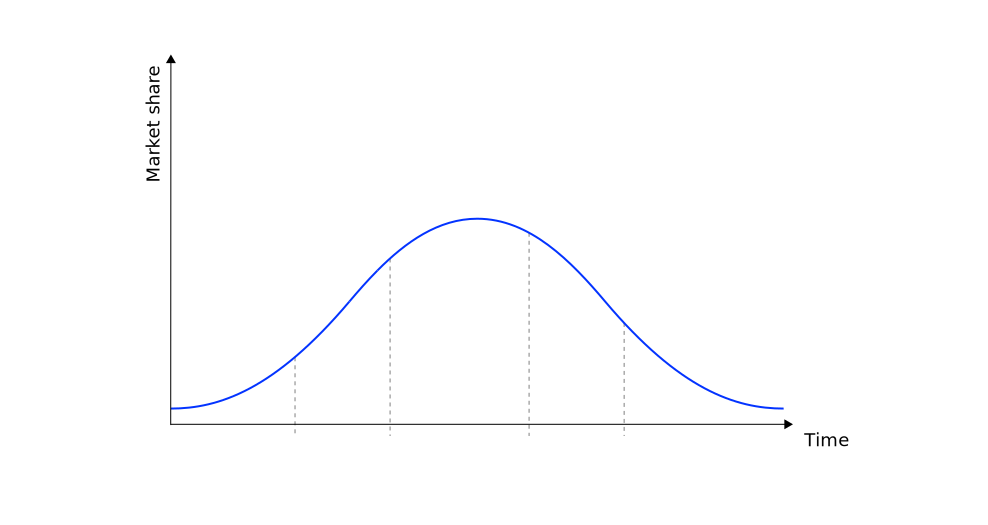
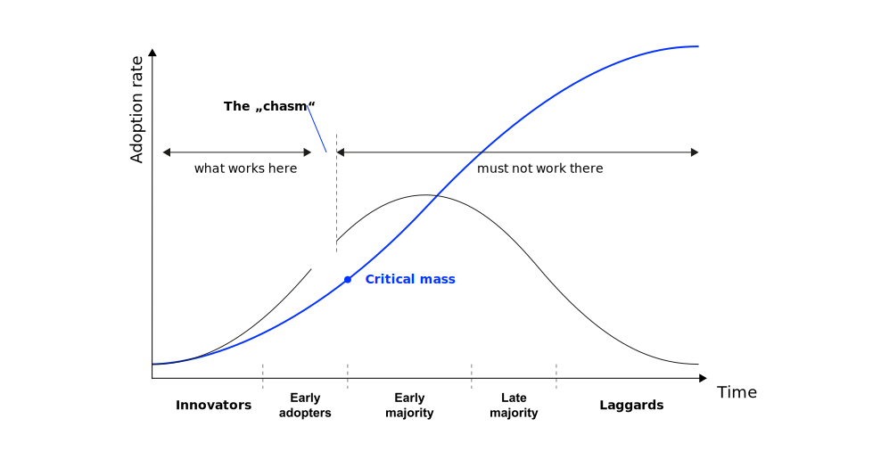
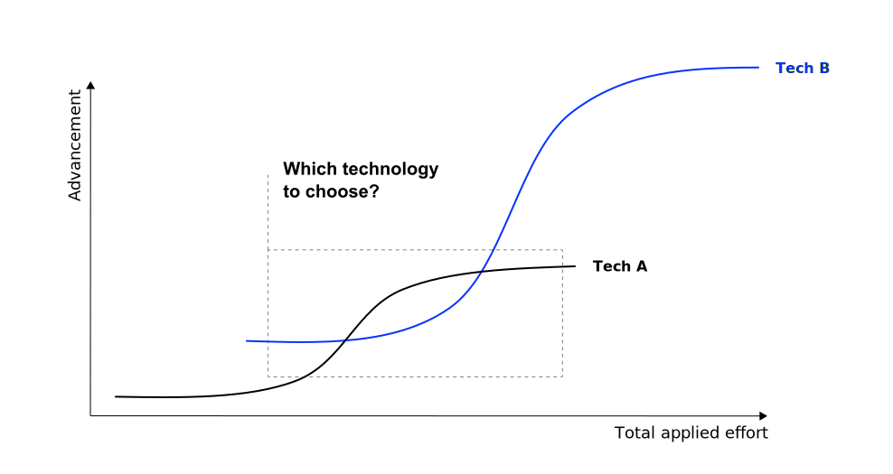
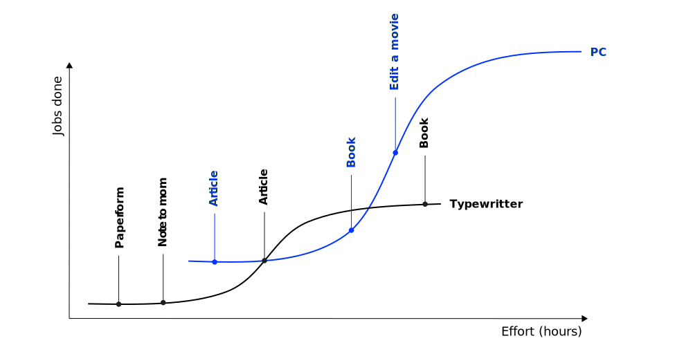
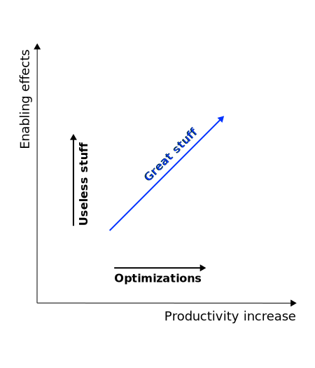

# Innovation in the digital age {.headline-only}

## Digital technologies

Digital technologies have **lowered the cost** of producing and disseminating knowledge. 

:::fragment
This induces four key **changes in innovation practices and outcomes** across industries [@OECD2019digitalInnovation]:
:::

:::incremental
- **Data** are becoming a key input for innovation
- A focus on **service innovation** enabled by digital technologies (i.e., servitisation)
- **Innovation cycles** are accelerating
- **Collaboration** is becoming a more critical component in innovation
:::

## Discussion {.html-hidden .unlisted .discussion-slide background-color=black}

:::large
How does data change innovation practices and outcomes?
:::

## Data as core input

Data from a variety of sources (e.g., consumer behavior, business processes, research) are a **key driver** of innovation.

:::notes
The exponential growth of **generation of data** of various kinds and the new ways of **collecting** and **utilizing** such data have made it a key input for innovation in all sectors of the economy. The development of the Internet of Things (IoT) is contributing to a steady increase in data generation as more devices and activities are connected. The use of AI, including machine learning, further increases the expected value of data [@OECD2019digitalInnovation, p. 27].

Data and data analytics provide opportunities for research and driving innovation, including in the following ways.
:::

:::incremental
- Changing the **research process**  
(e.g., large-scale computerized experiments and ML for vaccine development)
- Enabling **new products**, services and business models  
(e.g., on-demand-mobility services)
- Enhancing **customization**  
(e.g., marketing, precision medicine)
- Guiding **process optimization**  
(e.g., real-time supply chain systems, traceability)
:::

## Servitisation

Digital technologies are leading to a **blurring of the boundaries** between services and manufacturing

:::notes
As data and software are replacing many physical components and products, opportunities arise in particular for the creation of entirely new digitally enabled services (e.g., predictive maintenance, on-demand transportation). New digital technologies have also propelled the expansion of sharing or renting as service models that replace selling (e.g., of equipment), and the customization of products as a service [@OECD2019digitalInnovation, p. 29].

Also, rising competitive pressures linked to the entry of digital players in traditional sectors and changing consumer demands, are pushing incumbent manufacturing firms to offer new digitally enabled services, while allowing service providers to improve their offerings [@OECD2019digitalInnovation, p. 30].

Digital technologies like data analytics capabilities, augmented and virtual reality, and IoT provide opportunities for new services and service innovations, including in the following ways.
:::

:::incremental
- Enabling new **complementary services** (i.e., servitisation of manufacturing due, e.g., real-time monitoring of products' status, performance and usage and growing data analytics capabilities)
- Enhancing the **service experience** (e.g., personalized promotions, digital mirrors, "pay as you live")
:::

## Discussion {.html-hidden .unlisted .discussion-slide}

:::large
How can digital technologies accelerate innovation cycles?
:::

## Faster innovation cycles

Digital technologies offer new opportunities to experimentation and version and thus allow accelerating innovation cycles.

:::incremental
- Accelerating **design, prototyping and testing** (e.g., 3D printing, digital twin)
- Allowing **experimenting** with (not fully finished) products and services on the market (e.g., public beta, lean-start-up method)
- Enabling regular **upgrading and versioning** (e.g., "over the air" updates)
- Increasing the **flexibility of manufacturing**, enabling small series production at low cost, and allowing for higher **customization** (e.g., Industry 4.0. 3D printing, software-based customization)
:::

## Collaborative innovation

Innovation ecosystems are becoming more and more open and diverse.

:::notes
Companies are increasingly interacting with research institutions and businesses. The reasons for this are complex. First, such collaborations provide access to a richer pool of expertise and skills that complement their own competencies. Access to talent is expected to spur creativity and enable innovation in new areas. Second, such collaborations enable the sharing of costs and risks of uncertain investments in digital innovation. Companies often face multiple potential research and technology development paths that require substantial investments with uncertain outcomes to master (e.g., the vaccine development collaborations during the Covid 19 pandemic). Finally, lower communication and collbaboration costs enable greater interaction among actors involved in innovation, regardless of their location [@OECD2019digitalInnovation, p. 32].

These collaborations take different forms, including the following.
:::

:::incremental
- **Data sharing** (e.g., sharing data with supply chain partners and retailers)
- **Business incubation** (e.g., accelerator programs)
- **Open innovation** (involves collaboration with other businesses, public research and university partners, digitalization reduced the costs for open innovation partnerships)
- **Platforms** (e.g., open software platforms) and other **innovation ecosystems** (e.g., crowdsourcing platforms)
- **Corporate ventures** capital investments and acquisitions
- **In-house collaborations** (e.g., digital innovation labs or innovation garages)
:::
 
# Sectors {.headline-only}

## Differences

Since industries significantly differ in their products and processes, their structures, and in how they engage in innovation, the approaches and outcomes to **digital innovation** are unlikely to be the same. 

:::notes
For example, end products in primary sectors such as the food industry or mining remain largely unchanged, while the media, music and games industries have completely digitized their offerings in recent decades and healthcare innovations draw significantly on advances in AI and biotechnology. Production and innovation processes have also been transformed by digital technologies, but in different ways: while robots are used extensively in the automotive industry to automate processes, automation is still in its infancy in sectors such as agriculture and retail [@OECD2019digitalInnovation, p. 45].
:::

:::fragment
According to @OECD2019digitalInnovation [p. 42ff] three main dimensions shape the differences:
:::

:::incremental
- The scope of **opportunities for digital innovation**
- The **types of data needed** for innovation and related challenges for exploration and exploitation
- The conditions for **digital technology adoption and diffusion**
:::

## Opportunities

Depending on the sectorial characteristics, digital technologies may offer different opportunities for 

:::medium
:::incremental
- creating digitalized **products and services**,
- digitalizing **business processes**, and
- establishing new **digitally enabled business models.**
:::
:::

## Discussion {.html-hidden .unlisted .discussion-slide background-color=black}

:::large
Why do **opportunities** to create digitalized products and services **differ between sectors?**
:::

## Digitalized offerings

:::notes
Digital technologies have the potential to create new or expand existing goods and services with digital features.

![Opportunities to digitalize end products based on @OECD2019digitalInnovation [p. 47]](images/opportunities.svg){#fig-opportunities}

:::

::: {.r-stack .html-hidden}

![Opportunities to digitalize end products based on @OECD2019digitalInnovation [p. 47]](images/opportunities-1.svg){.fragment height="420"}

{.fragment height="420"}

{.fragment height="420"}
:::

## Digitalized processes

Digital technologies offer opportunities for

:::medium
:::incremental
- **automation** of business processes,
- **interconnected supply chains** to increase transparency and agility, and
- **improved interactions** with the consumer
:::
:::

## Digital business models

In some cases/sectors new business models largely **displace** incumbent ones (e.g., online booking platforms)

:::fragment
In other sectors they may **co-exist** (e.g., combined brick-and-mortar and online shopping experiences)
:::

## Examples

Let's look at **three distinct sectors** and how digital innovation is changing these.

:::incremental
- **Agri-food** (production, processing, distribution and commercialization of food)
- **Automotive** (manufacturing, distribution, and commercialization of vehicles, as well as after-sales activities)
- **Retail** (selling consumer goods or services to ultimate consumers, both online and at physical stores including transportation of products from warehouses to stores and directly to customers)
:::

### Agri-food sector

Digital innovations in the agri-food sector focus on production processes and supply chain management [@OECD2019digitalInnovation, p. 44].

:::incremental
- **Precision farming** — using digital technologies to optimize use of inputs for crops to grow optimally (e.g., managing inputs like water, fertilizers, pesticides)
- Introduction of **robots** (e.g., for fruit-picking, harvesting and milking)
- **Big data analytics & AI** to inform farm management decision-making [@wolfert2017big]
- Potential to **trace products** along supply chains using IoT and blockchain technology [@shahid2020blockchain]
:::

:::notes

+----------------------+--------------------------------------------+------------------------------------------------------------+
| Innovation           | Data needs                                 | Challenges                                                 |
+======================+============================================+============================================================+
| **Precision farming**| Aggregated sensor data from many farms     | - Low levels of digital technology adoption                | 
|                      | (fields, machinery, drones, satellite data)| - Data quality & integration                               | 
|                      |                                            | - Standards and platforms                                  | 
+----------------------+--------------------------------------------+------------------------------------------------------------+
| **Product            | Product-level sensor data                  | - Engagement of the whole supply chain                     | 
| traceability**       | (origin, processing stages, actors         | - Differences in capacities for digital technology uptakes | 
|                      | involved, transportation and storage       | - Standards, data quality, and integration                 |
|                      | conditions)                                |                                                            |
+----------------------+--------------------------------------------+------------------------------------------------------------+

: Data needs and challenges for the agri-food sector [@analytics2016age] {#tbl-agri-food}

:::

### Automotive industry

Digital innovations are completely reshaping the automotive sector including the products, production, and business models.

:::incremental
- **Connected cars** and value-add services (e.g., automatic emergency, real-road hazard warnings, car repair diagnostic, networked parking)
- **Autonomous cars** and driving assistance systems
- **Alternatives to car ownership** (e.g., vehicle subscription services, car-sharing services, ride-hailing platforms)
- **Smart factories** using IoT & robotics in production processes
:::

:::notes

+----------------------+--------------------------------------------+----------------------------------------------+
| Innovation           | Data needs                                 | Challenges                                   |
+======================+============================================+==============================================+
| **Conected cars**    | Sensor data from cars and infrastrucutre,  | - Standards and data integration             | 
|                      | GIS, real-time traffic information, etc.   | - Data privacy                               | 
|                      |                                            | - Road safety (risk of cyber attacs)         | 
+----------------------+--------------------------------------------+----------------------------------------------+
| **Optimization of    | Production and processing data along the   | - Standards and data integration             | 
| value chain          | supply chain, real-time demand data        | - Data quality                               | 
| processes**_         |                                            |                                              |
|                      |                                            |                                              |
+----------------------+--------------------------------------------+----------------------------------------------+

: Data needs and challenges for the automotive sector [@analytics2016age] {#tbl-automotive}

:::

### Retail sector

In the field of retail, digital innovations aim at enhancing the consumer experience and optimizing processes.

:::incremental
- **Big data analytics** for customized and targeted marketing
- Enhanced online and physical **shopping experience** (e.g., smart dressing rooms, automatic payment systems, 3D visualization)
- IoT and robotics for better **inventory management**
:::

## Discussion {.html-hidden .unlisted .discussion-slide background-color=black}

:::large
Why does the **diffusion of digital innovations** vary between sectors?
:::

# Diffusion trends {.headline-only}

## Differences between sectors

The level of digital technology adoption varies across sectors [@calvino2018taxonomy].

:::fragment
Differences in adoption rates stem from variances in sectors' capabilities and incentives to adopt new technologies [@andrews2018digital]. 
:::

:::fragment
Key factors influencing adoption include
:::

:::incremental
- Individual and organizational capabilities
- Presence of market disruptors (e.g., digital start-ups or tech firms)
- Sectoral characteristics (e.g., access to relevant infrastructure)
- Consumer demands and attitudes towards change
:::

:::notes

:::callout-note
### Sectoral characteristics [@OECD2019digitalInnovation]

**Distribution of firm size and sectoral fragmentation**: large firms have usually the resources to adopt new technology, while small firms are more risk-averse. On the other hand, large firms can suffer from inertia, rigid hierarchical structures, and legacy systems that may hamper the diffusion of digital innovations. Technology diffusion may also be slower in highly fragmented sectors.

**Access to relevant infrastructure**: this might be a challenge for sectors and firms located in more remote or rural areas.

**Complexity of supply chains**: tight connections among firms along the supply chains also influence dynamics of innovation diffusion — suppliers may adjust more rapidly upon requests from upstream partners.

**Level of public investments**: the public sector is the main (direct or indirect) provider of services such as education and healthcare. Thus, the level of diffusion depends on the capacity of the pbulic sector to invest in these areas.
:::
:::

## Technology lifecycle

:::notes

{#fig-rogers2}

@rogers1962diffusion introduced the technology lifecycle to describe the diffusion of innovations, which follows this progression:

- Innovators — technology enthusiasts who embrace new technology first
- Early adopters — visionaries who see strategic advantage in new technology
- Early majority — pragmatists who want proven solutions
- Late majority — conservatives who adopt only when necessary
- Laggards — skeptics who avoid new technology

:::

::: {.r-stack .html-hidden}

{.fragment height="420"}

{.fragment height="420"}

{.fragment height="420"}

{.fragment height="420"}

{.fragment height="420"}

{.fragment height="420"}

:::

## Cross the chasm

{#fig-rogers1}

:::notes

What makes crossing the chasm so challenging is that the strategies that work for early markets often fail in mainstream markets, as mainstream markets differ substantially for several key reasons:

**Different buyer motivations**

- Early adopters (visionaries) seek revolutionary change and competitive advantage. They're willing to tolerate incomplete products.
- Early majority (pragmatists) seek evolutionary improvement and risk reduction. They want complete, proven solutions.

**Reference requirements**

- Early adopters make decisions based on technology and future potential.
- Pragmatists need social proof - they want to see others like them successfully using the product.

**Support expectations**

- Early markets accept minimal support as part of being on the cutting edge.
- Mainstream markets demand comprehensive support infrastructure.

**Product completeness**

- Early adopters accept core technology with gaps they'll fill themselves.
- The early majority requires a "whole product" solution - the core product plus everything needed to achieve their desired outcome.

**Sales approach**

- Selling to visionaries requires executive-level relationships and focuses on strategic potential.
- Selling to pragmatists requires industry-specific expertise and focuses on operational improvements.

**Pricing models**

- Early adopters often pay premium prices for strategic advantage.
- Mainstream markets expect more standardized, value-based pricing.

These fundamental differences mean companies must essentially transform their entire go-to-market strategy - from product development to marketing messaging to sales channels - to successfully cross the chasm. Making this transition is particularly difficult for startups with limited resources who must maintain their existing early-adopter business while simultaneously building a completely different approach for mainstream markets.

:::

# Evaluation of innovation   {.headline-only}

## Strategic leaps

:::medium
> The key to getting beyond the enthusiasts and winning over a visionary is to show that the new technology enables some [strategic leap forward, something never before possible,]{.link.color} which has an intrinsic value and appeal to the nontechnologist. *Geoffrey Moore, American organizational theorist, management consultant, and author*
:::

## Effects of innovations

:::notes
The S-curve describes the return (advancement, progress, functionality, etc) on investment (total applied effort, time, money, etc).
:::

{#fig-scurve}

## Example: typwriter vs. PC

::: {.r-stack .html-hidden}

{.fragment height="420"}

{.fragment height="420"}

:::

:::notes

{#fig-scurve-example}

:::

## Success criteria of innovations

::::columns

::: {.column width="33%"}

{#fig-tech-effects}
:::

::: {.column width="66%"}

Successful innovations ...

:::incremental
- increase productivity **and**
- make something possible, that was not possible before (innovation)
:::

:::

::::

## Example: typwriter vs. PC

{#fig-tech-effects-example}

# Data-oriented innovation  {.headline-only}

## Patterns

:::medium
Besides competency-based, customer focused and externally-oriented approaches, managers can also take a **data-oriented approach** to systematically tackle business innovation.
:::

:::fragment
@parmar2014new identified five distinct patterns that answer following question:\
*How can we create value for customers using data and analytic tools?*
:::

## Augmenting products to generate data

Because of advances in sensors, wireless communications, and big data, it is now feasible to **gather and crunch enormous amounts of data**.

:::fragment
Those data can be used to **improve the design, operation, maintenance, and repair of assets** or to enhance how an activity is carried out.
:::

:::fragment
*Examples: SKF’s intelligent bearings, "pay-as-you-life" insurances*
:::

:::notes
:::callout-note
#### Questions to be asked [@parmar2014driving]

- Which of the data relate to our products and their use?
- Which data do we now keep and which could we start keeping?
- What insights could be developed from the data?
- How could those insights provide new value to us, our customers, our suppliers, or our competitors?
:::
:::

## Digitizing assets

Over the past two decades, the digitization of music, books, and videos has turned the entertainment industry on its head, introducing new models such as music and video streaming.

:::fragment
Digitization has typically **reduced distribution costs**, making the ability to efficiently transport physical inventory or secure low-cost warehouse locations less relevant.
:::

:::fragment
Also regarding the operation of the digital services, company can realize **economies of scale** and decrease **time-to-market** by moving the business to the cloud.
:::

:::fragment
*Examples: Disney Plus, 3D printed spare parts.*
:::

:::notes
:::callout-note
#### Questions to be asked [@parmar2014driving]

- Which of our assets are either wholly or essentially digital?
- How can we use the digital nature of assets to improve or augment their value?
- Do we have physical assets that could be turned into digital assets?
:::
:::

## Combining data within and across industries

Data across supply chains and allied industries has been uncoordinated.

:::fragment
Big data, along with new IT standards and APIs allow **enhanced data integration**.
:::

:::fragment
This enables **coordination across industries or sectors** in new ways.
:::

:::fragment
*Examples: smart cities, integrated supply chains, electronic health record.*
:::

:::notes
:::callout-note
#### Questions to be asked [@parmar2014driving]

- How might our data be combined with data held by others to create new value?
- Could we act as the catalyst for value creation by integrating data held by other players?
- Who might benefit from this integration and what business model might make it attractive to us or our collaborators?
:::
:::

## Trading data

The ability to **combine disparate data sets** allows companies to develop a variety of new offerings for adjacent businesses.

:::fragment
Seemingly useless data could be a gold mine for some other business.
:::

:::fragment
**Data marketplaces** facilitate the exchange of data.
:::

*Examples: [Quandl](https://demo.quandl.com/monetize-data)*

:::notes
:::callout-note
#### Questions to be asked [@parmar2014driving]

- How could our data be structured and analyzed to yield higher-value information?
- Is there value in the data to us internally, to current customers or to potential new customers?
- Is there value in the data to other industries?
:::
:::

## Codifying a distinctive service capability

Companies that have perfected their business processes and systems can **standardize** them and **sell** them to other parties.

:::fragment
**Cloud computing** has put such opportunities within close reach, as it allows companies to easily distribute software, simplify version control, and offer customers "pay as you go" pricing.
:::

:::fragment
*Examples: AWS, Trumpf XETICS Lean*
:::

:::notes
:::callout-note
#### Questions to be asked [@parmar2014driving]

- Do we possess a distinctive capability that others would value?
- Is there a way to standardize this capability so that it could be broadly useful?
- Can we deliver this capability as a digital service?
- Who in our industry or other industries would find this capability attractive?
:::
:::

# Q&A {.html-hidden .unlisted .headline-only background-image="../assets/bg.jpg"}

# Homework

@kavadias2016transformative identified six features that characterize successful innovation, which link a recognized technology trend and a recognized market trend.

Read the [paper](https://hbr.org/2016/10/the-transformative-business-model), understand the trends and features and link them to the industries you are interested in.

# Literature
::: {#refs}
:::
