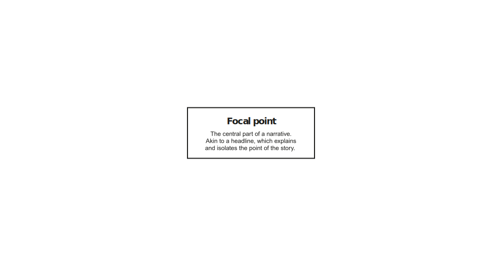
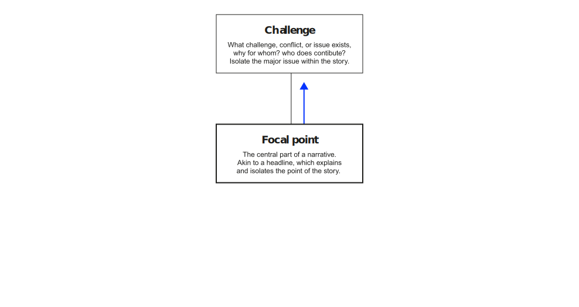
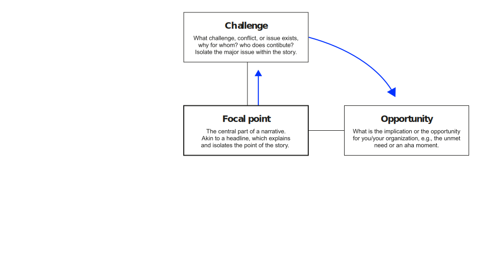
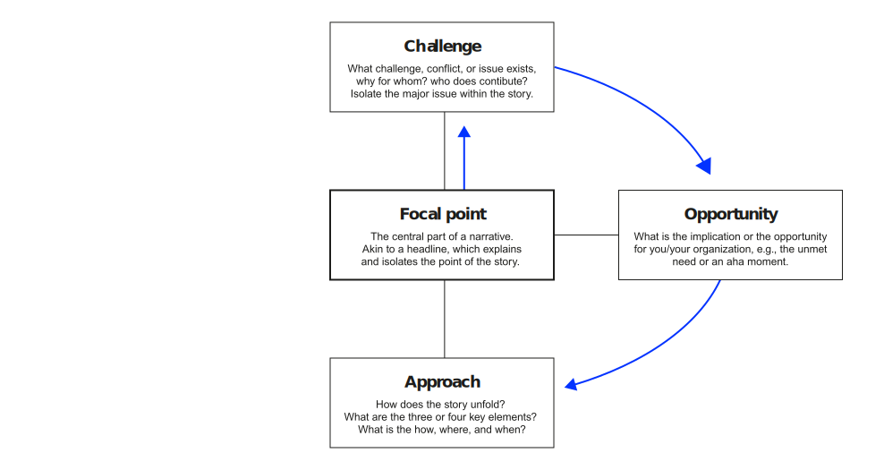
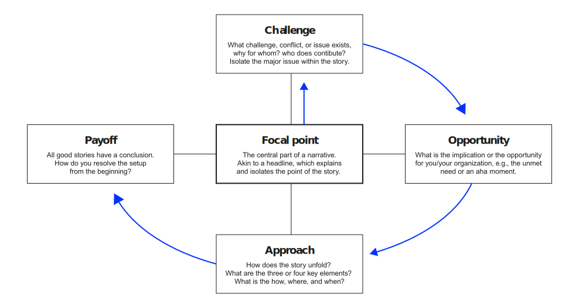
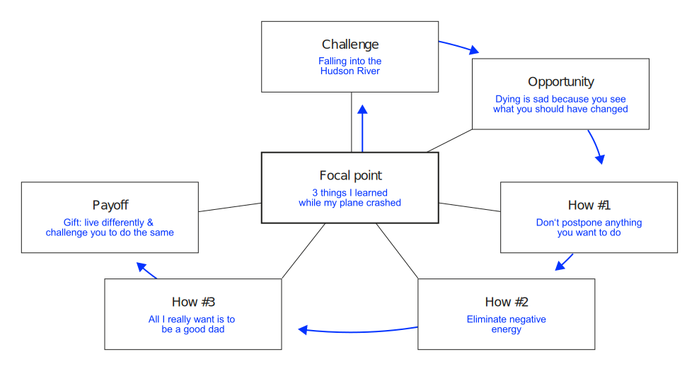

# Learning objectives

After completing this unit, you will be able to:

::: incremental
1. Explain why storytelling is a leadership necessity and identify the four truths of effective stories.
2. Apply Aristotle's persuasion model (ethos, pathos, logos) to structure compelling narratives.
3. Adapt stories for different stakeholder audiences using the stakeholder engagement spectrum.
4. Create a narrative using story elements and a narrative map structure.
:::

:::{.content-visible when-format="revealjs"}
# Agenda

:::medium
- Warm-up [15 min]{.smaller}
- Storytelling × leadership [25 min]{.smaller}
- Story structure & persuasion [25 min]{.smaller}
- [Break]{.highlight}
- Storytelling practice [25 min]{.smaller}
- Adapting to audiences [20 min]{.smaller}
- Delivering [15 min]{.smaller}
- Wrap-up [5 min]{.smaller}
:::

:::{.content-visible when-format="revealjs"}
# Warm-up {.headline-only}

## Story check-in {.discussion-slide}

:::large
Share the leadership story you reflected on for homework.
:::

Form groups of 4–5. Each student **tells** their leadership story to the group in 60 seconds.

Important: Don't explain the moment where someone’s communication made a real difference, **tell** the story they told.

Vote for the story you liked best.



:::{.content-visible when-format="revealjs"}
:::notes
Emphasize: this is storytelling, not summarizing. Use first person, set the scene, create tension, land the message.
After all members have told their stories, the group votes: which story was most compelling?
The winner will represent the group in the plenary.
:::
:::

## Story sharing {.discussion-slide}

:::large
Perform the story for the plenary.
:::

Listeners: What did you feel?



## Story elements {.discussion-slide}

:::large
What elements did the most compelling stories have in common?
:::



:::{.content-visible when-format="revealjs"}
:::notes

After all performances, ask: "What patterns do you see in the words on the board?"

Expected patterns: personal connection, emotional resonance, concrete details, clear message, authenticity.

Storytelling is the skill that makes all other leadership skills communicable.
:::
:::
:::

# Storytelling x leadership {.headline-only}

----

::: large
The most powerful person in the world is the storyteller.
:::

:::fragment
> The storyteller sets the vision, values and agenda of an entire generation that is to come. *Steve Jobs*
:::

:::{.content-visible when-format="revealjs"}
:::notes
Leadership is fundamentally about communication. A leader with the right analysis but the wrong story will fail to mobilize action. Storytelling is not optional — it is a core leadership competency.
:::
:::

## Recap: Leadership

> A leader is one or more people who selects, equips, trains, and influences one or more follower(s) who have diverse gifts, abilities, and skills and **focuses the follower(s) to the organization's mission and objectives, causing the follower(s) to willingly and enthusiastically expend spiritual, emotional, and physical energy** in a concerted coordinated effort to achieve the organizational mission and objectives. *@winston2006integrative[p. 8]*

:::{.content-visible when-format="revealjs"}

:::notes
This integrative definition by @winston2006integrative captures several key aspects:

- leadership is a *relational* process (it requires followers),
- it is *purposeful* (directed toward organizational objectives),
- and it is *voluntary* (followers expend energy willingly).

:::
:::

## Storytelling

How will you inspire others to be part of your vision/mission if you can't communicate it?

:::fragment
::: larger
Storytelling is a necessity of leadership.
:::
:::

:::fragment
> I've learned that people will forget what you said, people will forget what you did, but people will never forget how you made them feel. *Maya Angelou (American writer, poet, and civil rights activist)*
:::

## The power of good stories

> I've learned that the ability to articulate your story or that of your company is crucial in almost every phase of enterprise management. *@guber2007four*

:::fragment
[**Examples:**]{.h4}
:::

::: incremental
-   A great salesperson knows how to tell a story in which the product is the hero.
-   A successful line manager can rally the team to extraordinary efforts through a story that shows how short-term sacrifice leads to long-term success.
-   An effective CEO uses an emotional narrative about the company's mission to attract investors and partners, to set lofty goals, and to inspire employees.
:::

## The leader as storyteller

> For the leader, storytelling is action oriented---a force for turning dreams into goals and then into results. *@guber2007four*

:::fragment
:::medium
Great storytelling does not conflict with truth. In the business world and elsewhere, it is always built on the integrity of the story and its teller.
:::
:::

::: incremental
-   Storytelling has always been also about instructing and leading
-   Great storytelling does not conflict with truth
:::

:::{.content-visible unless-format="revealjs"}
It was he who recorded the oral history of the tribe, encoding its beliefs, values, and rules in the tales of its great heroes, of its triumphs and tragedies. The life-or-death lessons necessary to perpetuate the community's survival were woven into these stories: "We don't go hunting in the Great Wood---not since that terrible day when three of our bravest were killed there by unknown beasts. Here's how it happened ..." [@guber2007four]

Great storytelling does not conflict with truth. In the business world and elsewhere, it is always built on the integrity of the story and its teller. [@guber2007four].
:::

:::{.content-visible when-format="revealjs"}
:::notes
Key insight from @guber2007four: 

- Storytelling has always been about instructing and leading. 
- At the tribal fire, the storyteller encoded the community's beliefs, values, and survival lessons into tales. 
- The same function exists in organizations today.

The critical point: 

- Storytelling is NOT manipulation. 
- Effective leadership storytelling is built on authenticity and integrity: connecting to authentic leadership.
:::
:::

## Truth found in an effective story

@guber2007four distilled four kinds of truth found in an effective story:

::: incremental
- **Truth to the teller:** what a storyteller says must be consistent in their heart and mind
- **Truth to the audience:** the storyteller has to understand and recognize what the audience wants and needs and address those wants and needs
- **Truth to the moment:** a storyteller adapts a story to the context in which the story is told
- **Truth to the mission:** a storyteller is "devoted to a cause beyond self."
:::

:::{.content-visible unless-format="revealjs"}
Adapting to the audience and moment demands **behavioral complexity** ([Unit 3](../adaptive-behavior/index.qmd)).

**Truth to the audience** means *different truths for different stakeholders*. The story you tell investors is not the story you tell engineers — not because you are dishonest, but because their concerns, values, and decision criteria differ. Your stakeholder analysis ([Unit 7](../stakeholder/index.qmd)) tells you *who* you are speaking to; storytelling tells you *how*.

Consider the stakeholder engagement spectrum: when you are *informing* stakeholders, your story is factual and clear. When you are *consulting*, your story invites response. When you are *collaborating*, you co-create the narrative. The engagement level shapes the story structure.
:::

:::{.content-visible when-format="revealjs"}
:::notes
- **Truth to the teller** connects to authentic leadership: if you don't believe your own story, no one else will.
- **Truth to the audience** connects to stakeholder analysis ([Unit 7](../stakeholder/index.qmd)): different audiences need different stories. The story you tell investors is not the story you tell engineers — not because you're dishonest, but because their concerns differ.
- **Truth to the moment** connects to behavioral complexity ([Unit 3](../adaptive-behavior/index.qmd)): a story that inspires during a product launch may fall flat during a crisis.
- **Truth to the mission** connects to engaging leadership ([Unit 4](../motivation/index.qmd)): the *inspiring* behavior is about enthusing people about a vision beyond themselves.

The four truths together form a complete framework: the teller must be authentic, the audience must be understood, the moment must be read, and the mission must transcend self-interest. When all four align, the story becomes a force multiplier for leadership.
:::
:::

# Structure {.headline-only}

## Layers of conviction

Aristotle argued that a good speech contains three types of persuasion

:::fragment
::: larger
Ethos, pathos, logos
:::
:::

::: incremental
-   **Logos** appeals to the audience's reason, building up logical arguments.
-   **Ethos** appeals to the status or authority so that listeners are more likely to trust the speaker.
-   **Pathos** appeals to the emotions, e.g., trying to make the audience feel angry or sympathetic.
:::

:::{.content-visible unless-format="revealjs"}
**Telling good stories includes:**

-   Thinking up in advance exactly what arguments can be made both for and against a given proposition, selecting the best on your own side, and finding counterarguments to those on the other.
-   You need to be clear about what your audience needs to know (or believe, which is the same thing in rhetoric) in order to understand that you are trustworthy, that you have the right to speak on the subject and that you are speaking in good faith. Your audience needs to believe that you are "a pretty honest guy".
-   Finding ways to drive your argument forward. This is the stuff of your arguments, the way one point proceeds to another, as if to show that the conclusion to which you are aiming is not only the right one, but so necessary and reasonable as to be more or less the only one.

Good read: [Ethos, Logos and Pathos: The Structure of a Great Speech](https://fs.blog/ethos-logos-pathos/#:~:text=Ethos%20is%20about%20establishing%20your,what%20the%20three%20look%20like.)
:::

:::{.content-visible when-format="revealjs"}
:::notes
Good storytelling includes all three, but the *balance* depends on the audience and moment:

- A board presentation is logos-heavy (data, projections) with ethos (your credibility) supporting it
- A team rally is pathos-heavy (shared purpose, emotional connection) with logos providing grounding
- A client pitch balances all three: ethos (why trust us), logos (how it works), pathos (imagine the impact)

:::
:::

## Story structure

Behind really good stories is a well thought-out structure that forms the backbone of the story. This backbone, called the story elements, help writers develop great stories. The essential elements of a story are:

:::fragment
:::larger
[Characters]{.fragment}\
[Setup or conflict]{.fragment}\
[Sequence of events (plot)]{.fragment}\
[Resolution]{.fragment}
:::
:::

:::{.content-visible when-format="revealjs"}
:::notes
Every effective leadership story has these elements, even when told briefly:

- **Character**: Who is the story about? (Often the audience themselves)
- **Conflict**: What challenge or tension drives the story forward?
- **Plot**: What happens? How does the tension build?
- **Resolution**: How is the conflict resolved? What's the takeaway?

When you strip away the theory, every great leadership story is:

1. Here was the challenge
2. Here's what we did 
3. Here's what we learned/achieved.
:::
:::

## Narrative map

:::{.content-visible when-format="revealjs"}
::: {.r-stack}
{.fragment height="420"}

{.fragment height="420"}

{.fragment height="420"}

{.fragment height="420"}

{.fragment height="420"}
:::
:::

:::{.content-visible unless-format="revealjs"}
Narrative maps consist of several important elements that make it easier to explain messages and give them clarity and context.

-   **Focus:** This is the central part of a narrative. It is comparable to a headline that explains and highlights the core of the story. Is the focus about innovation, change, competition or something else?
-   **Conflict or challenge:** What is the challenge, conflict or problem in the market that your company is dealing with? Why does this problem exist? Who is contributing to it? This begins to isolate the main problem within the story.
-   **Opportunity:** What is the impact or opportunity for your organisation? This is what some people call an unmet need or an aha moment. This is something you can use to bring about change or to address and solve a problem.
-   **Approach:** How does your story unfold? What are the three or four characters or key elements? What is the how, where and when?
-   **Resolution:** All good stories have an ending or conclusion. How do you resolve the build-up from the beginning? Let's say your story is about innovation and there are four ways the company will create something new. What is the benefit to a customer, an employee, the industry or the community? Where does this story end? Who sees the benefits?

{#fig-map}
:::

:::{.content-visible when-format="revealjs"}
:::notes
Walk through the narrative map structure:

- **Focus**: The central theme — what is this story fundamentally about?
- **Conflict/challenge**: What is the problem? Why does it matter?
- **Opportunity**: The "aha moment" — what insight or possibility changes the game?
- **Approach**: How does the story unfold? What are the key elements?
- **Resolution**: How does it end? Who benefits?
:::
:::

## Example

Ric Elias had a front-row seat on Flight 1549, the plane that crash-landed in the Hudson River in New York in January 2009. What went through his mind as the doomed plane went down?

<iframe width="560" height="315" src="https://www.youtube.com/embed/8_zk2DpgLCs?si=oZRyzKNLNjNtQ-bO" title="YouTube video player" frameborder="0" allow="accelerometer; autoplay; clipboard-write; encrypted-media; gyroscope; picture-in-picture; web-share" referrerpolicy="strict-origin-when-cross-origin" allowfullscreen></iframe>

:::{.content-visible when-format="revealjs"}
:::notes

- What are the four truths in this story? 
- Where are the story elements? 
- Where does ethos, pathos, logos appear?

Expected: 
 
- Truth to the teller (deeply personal), 
- truth to the audience (universal human themes), 
- truth to the moment (TED talk format), 
- truth to the mission (living fully). 

Heavy on pathos, with logos emerging from the specific experience.
:::
:::

## Narrative map

{#fig-hudson}

:::{.content-visible unless-format="revealjs"}

The four truths in this story:

- Truth to the teller: deeply personal
- Truth to the audience: universal human themes
- Truth to the moment: TED talk format
- Truth to the mission: living fully

:::

:::{.content-visible when-format="revealjs"}

# Storytelling practice {.headline-only}

## Exercise {.discussion-slide}

:::medium
Create and perform a story.
:::

Imagine you are a tech lead at a mid-sized software company. You are convinced the company must invest seriously in AI tools for coding and design: not as a side experiment, but as a strategic commitment that reshapes how the teams work.

You have the opportunity to pitch this to the CEO and the board.\
You want to convince them to take a leap of faith.

Form teams of max. 3 students. Write your story using the narrative map structure. Be ready to perform it.



:::notes
**Pitch tournament with peer scoring (20 min total: 12 min writing, 8 min tournament).**

Writing phase (12 min): groups write their pitch using the narrative map. Walk around coaching: "What's your conflict? Where's the pathos? How does your resolution connect to the company's mission?"

Tournament phase (8 min): Each pair performs (90 sec max, strictly timed). After each pitch, the audience scores on a simple rubric (hand signals 1 to 5):

- **Truth to the teller:** Did you believe them?
- **Story structure:** Was there a clear conflict, opportunity, resolution?
- **Emotional impact:** Did you *feel* something?

The scoring creates metacognition: students must evaluate storytelling quality in real time, which deepens their understanding of the framework. Announce the highest-scoring pitch at the end and celebrate it briefly.
:::

## Narrative map (example)

{#fig-marker}

:::

# Audiences {.headline-only}

## Adapting your story

The interest/influence matrix ([Unit 7](../stakeholder/index.qmd)) tells you *how much* engagement each quadrant needs; storytelling theory tells you *what kind* of narrative fits.

:::fragment

| Matrix quadrant                                                            | Engagement                                           | Story emphasis                                                                                                                                                        |
|----------------------------------------------------------------------------|------------------------------------------------------------------------------------|-----------------------------------------------------------------------------------------------------------------------------------------------------------------------|
| **Manage closely** (high interest, high influence)                         | Active engagement, involve in decisions              | Co-created narrative. Ethos, pathos & logos: *"Let's shape this together."* At the far end, the story is no longer yours to tell: the stakeholder becomes its author. |
| **Keep satisfied** (low interest, high influence)                          | Address concerns, don't overwhelm                    | Concise strategic narrative. Logos-heavy: the decision, the rationale, the numbers, nothing more.                                                                     |
| **Keep informed** (high interest, low influence)                           | Regular, transparent updates                         | Narrative of shared purpose. Pathos & ethos: *"This is our challenge, here is where we stand."*                                                                       |
| **Monitor** (low interest, low influence)                                  | Minimal effort, watch for changes                    | Clear factual updates only when relevant. Logos, low-touch.                                                                                                           |

: Communication strategy by stakeholder quadrant {#tbl-story-matrix}
:::

:::{.content-visible unless-format="revealjs"}
Different stakeholders require fundamentally different narratives, not because the leader is being manipulative but because effective communication means meeting people where they are. A board of directors (kept satisfied, or managed closely on a major issue) needs a strategic narrative grounded in data and financial projections. A demoralized team (typically high interest, limited formal influence, so kept informed) needs an inspirational narrative of resilience and shared purpose. A key partner you are co-creating with (managed closely) needs a collaborative narrative of mutual benefit.

Engagement within the "manage closely" quadrant is itself a spectrum. It runs from involving stakeholders in shaping a narrative you still own, through genuine co-authorship, to the point where you hand the story over entirely. The strongest form of leadership communication is not telling the most compelling story yourself but enabling others to tell theirs. That shift, from "our challenge" to "your story to tell," is how a narrative outlives the leader who started it.

The salience model adds a second layer. Salience is dynamic, so the narrative a stakeholder needs changes as they gain or lose attributes. A dormant stakeholder you currently only monitor can become definitive, and at that point your story for them has to shift from a brief factual update to an urgent strategic narrative. Reading salience tells you *when* the story needs to change, not only how.
:::

:::{.content-visible when-format="revealjs"}
## Exercise {.discussion-slide}

:::medium
Same story, three audiences.
:::

Return to your AI investment pitch. Imagine you now deliver it to **different stakeholders**:

1. **The engineering team, in a town hall.**
2. **A junior developer, one to one, worried about their job.** 
3. **A senior developer, one to one, worried about their job.**

What changes across versions? What stays the same?



:::{.content-visible when-format="revealjs"}
:::notes
Which truth stayed constant? Which shifted?

*Truth to the teller* and *truth to the mission* stay constant. Only *truth to the audience* and *truth to the moment* change. This is ethical adaptability, not manipulation.
:::
:::
:::

# Delivering  {.headline-only}

-------

Some advice on public speaking from David JP Phillips, who has spent 7 years studying 5000 speakers, amateurs and professionals.

<iframe width="560" height="315" src="https://www.youtube.com/embed/K0pxo-dS9Hc" title="YouTube video player" frameborder="0" allow="accelerometer; autoplay; clipboard-write; encrypted-media; gyroscope; picture-in-picture; web-share" allowfullscreen></iframe>

:::{.content-visible when-format="revealjs"}
:::notes
This provides practical delivery tips after students have already practiced content creation. Brief debrief: "What resonated most? What will you try next time you present?"
:::
:::

# Wrap-up {.headline-only}

## Mental model

:::medium
Mental models help you think clearly.\
Storytelling is how you move others to act.
:::

:::fragment
Storytelling rests on one mental model: humans think, remember, and decide in stories.
:::

:::fragment
A latticework of mental models sharpens *your* judgement. It helps you read a situation clearly and decide which way to go. But judgement alone moves no one, and leadership is about followers. Storytelling is the other half of the work: it brings people toward the direction your analysis identified and gives them the conviction to act on it.
:::

:::fragment
My suggestions for your latticework are now complete. Building it further, by **learning, applying, and reflecting**, is a lifelong project. Storytelling is how you turn what you learn into something others can follow.
:::

## Closing quote

:::large
People will forget what you said, people will forget what you did, but people will never forget how you made them feel.\
[Maya Angelou]{.smaller}
:::

# Q&A {.headline-only .html-hidden .unlisted}

# Literature

::: {#refs}
:::
