# Revision {.headline-only .vertical-center background-color="#0333ff"}

## Hypothesis 1 {background-color="#0333ff"}

:::large
Emerging information technologies enable **multimodal** and **immersive** systems.
:::

## Multimodality

:::large
Multimodality refers to the use of [multiple modes of communication]{.link-color} to to create meaning.
:::

. . .

Multimodality implies that the use of several means of communication contributes to a better overall understanding of a message.

:::aside
@adami2016introducing
:::

## Immersion

:::medium
Immersion refers to the state of [being deeply engaged, absorbed, or submerged in an environment]{.link-color}, either physically or mentally.
:::

. . .

Immersion implies that the consciousness of the immersed person is detached from their physical self. Immersiveness is the quality or degree of being immersive.

:::aside
@suh2018state, @lee2013presence
:::

## Interdependency

:::medium
Stimuli that determine the [immersiveness]{.link-color} of environments created by technology are [multimodal]{.link-color}.
:::

:::medium
[Visual, ]{.fragment .fade-in-then-semi-out} 
[auditory, ]{.fragment .fade-in-then-semi-out} 
[tactile,]{.fragment .fade-in-then-semi-out} 
[olfactory, and]{.fragment .fade-in-then-semi-out} 
[interactive.]{.fragment .fade-in-then-semi-out} 
:::

# Hypothesis 2 {background-color="#0333ff"}

:::large
Emerging information technologies enable **intelligent** and **affective** systems.
:::

# Intelligence {.headline-only}

## Discussion {.discussion-slide background-color="#000"}

:::medium
What do we mean \
by **intelligence**?
:::

Provide a description that outlines what intelligence could mean. 

## Human intelligence

> **Human intelligence** "covers the capacity to learn, reason, and adaptively perform effective actions within an environment, based on existing knowledge. This allows humans to adapt to changing environments and act towards achieving their goals." *@dellermann2019hybrid [p. 632]*

:::fragment
@sternberg1985beyond proposes three distinctive dimensions:
:::

:::incremental
- **Componential (analytica) intelligence**\
  the ability to break down complex information and apply logical processes to find the most efficient solution
- **Experiential (creative) intelligence**\
  the ability to synthesize prior knowledge to navigate novel situations and automate new tasks
- **Contextual (practical) intelligence**\
  the ability to read environmental demands and adapt behavior (or the environment) to achieve success
:::

## Artificial intelligence

> ‘AI system’ means a machine-based systems designed to [operate with varying levels of autonomy]{.fragment .highlight-current-blue} and that may [exhibit adaptiveness after deployment]{.fragment .highlight-current-blue} and that, [for explicit or implicit objectives, infers, from the input it received]{.fragment .highlight-current-blue}, how to [generate output such as content, predictions, recommendations, or decisions]{.fragment .highlight-current-blue}, that can [influence physical or virtual environment]{.fragment .highlight-current-blue} [@euAIAct2024].

:::fragment
Based on this definition, three main properties of intelligent agents can be distinguished:
:::

:::medium
[Capacity to work in a complex environment^[The capacity to work in a complex environment is described as agency],]{.fragment .fade-in-then-semi-out} 
[cognitive abilities^[Cognitive abilities are, for instance, perception and language], and ]{.fragment .fade-in-then-semi-out} 
[complex behavior^[Behavior refers the observable patterns of actions and responses that an AI system exhibits. Autonomy, adaptiveness, goal-directedness, emergence, and context-sensitivity makes it complex].]{.fragment  .fade-in-then-semi-out}
:::

# Complex environments {.headline-only}

## Agents

:::medium
An agent is anything that can be viewed as perceiving its [environment]{.fragment .highlight-current-blue} through [sensors]{.fragment .highlight-current-blue} and acting upon that environment through [actuators.]{.fragment .highlight-current-blue}
:::

## Agents and environments

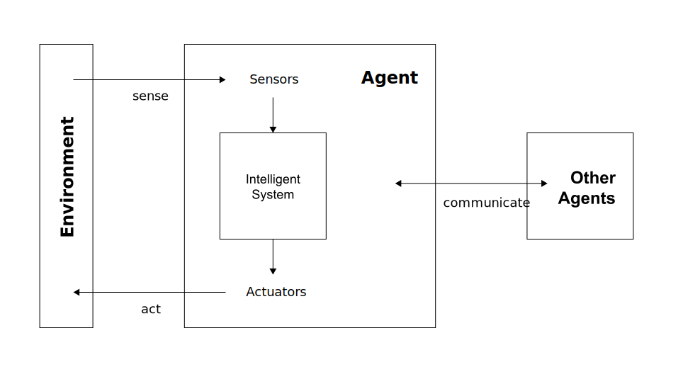

## Example

## Task environment

When designing an intelligent system, the **task environment** (i.e., the problem) must be specified as fully as possible, including

:::medium
[The [p]{.link-color}erformance measure]{.fragment} \
[the task [e]{.link-color}nvironment,]{.fragment} \
[the [a]{.link-color}ctuators,]{.fragment} \
[and the [s]{.link-color}ensors]{.fragment}
:::

:::fragment
@RusselNorvig2022AIMA call the task environment PEAS.
:::

::: {.notes}
::: {.callout-note}
## Example of an PEAS description

Task environment of a taxi driver agent

- __P__: Safe, fast, legal, comfortable, maximize profits, minimize impact on other road users
- __E__: Roads, other road users, police, pedestrians, customers, weather
- __A__: Steering, accelerator, brake, signal horn, display, speech
- __S__: Cameras, radar, speedometer, GPS, engine, sensors, accelerometer, microphones, touchscreen

Source: @RusselNorvig2022AIMA [p. 61]

:::
:::

## Properties

Task environments can be categorized along following dimensions [@RusselNorvig2022AIMA, p.62-64]:

::: {.incremental}
- Fully observable ⇠⇢ partially observable
- Single agent ⇠⇢ multi-agent
- Deterministic ⇠⇢ nondeterministic
- Episodic ⇠⇢ sequential
- Static ⇠⇢ dynamic
- Discrete ⇠⇢ continuous
- Known ⇠⇢ unknown
:::

::: {.notes}
__Explanations__

- If an agent's sensors give it access to the full state of the environment at any point in time, then we say that the task environment is *fully observable* (e.g., image analysis).
- When multiple agents intend to maximize a performance measure that depends on the behavior of other agents, we say the environment is *multi-agent* (e.g., chess).
- When the environment is completely determined by the current state and the actions performed by the agent(s), it is called a *deterministic* environment (e.g., crossword puzzle). When a model of the environment explicitly uses probabilities, it is called a *stochastic* environment (e.g., poker).
- If an agent's experience is divided into atomic episodes in which the agent receives a perception and then performs a single action, and if the next episode does not depend on the actions performed in the previous episodes, then we say that the task environment is *episodic* (e.g., image analysis).
- If the environment changes while an agent is deliberating, then the environment is *dynamic* (e.g., taxi driving).
- If the environment has a finite number of different states, we speak of *discrete* environments (e.g., chess).
- If the outcomes (or outcome probabilities) for all actions are given, then the environment is *known* (e.g., solitaire card game).

Source: @RusselNorvig2022AIMA, p.62-64

:::

:::notes
The hardest case is *partially observable, multi-agent, nondeterministic, sequential, dynamic, and continuous.*
:::

## Exercise {.discussion-slide}

:::medium
Describe the task environment of a [chess player]{.link-color} and an [autonomous car]{.link-color}.
:::



:::notes

**Chess player:**

- static
- discrete
- fully-observable
- deterministic
- sequential
- known

**Autonomous car**

- dynamic
- continuos
- partial-observable
- stochastic
- sequential
- known

:::

## Autonomous vs. advisor system

:::r-stack

![Types of intelligent systems in terms of their interaction with the environment [@Molina2020Intelligent]](images/systemTypes-1.svg){.fragment height="400"}

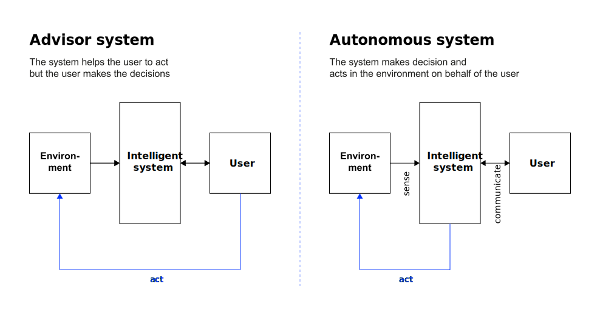{.fragment height="400"}

:::

# Cognitive abilities {.headline-only}

## Definition

Cognitive abilities—or **"thinking skills"**—are mental capacities that enable us to acquire knowledge, process information, and solve problems.
They involve processing mental information through [@carroll1993human]:

:::large
[perception, ]{.fragment .fade-in-then-semi-out} [attention,]{.fragment .fade-in-then-semi-out} 
[memory,]{.fragment .fade-in-then-semi-out} [reasoning, ]{.fragment .fade-in-then-semi-out}
[language, ]{.fragment .fade-in-then-semi-out} [and executive functions]{.fragment .fade-in-then-semi-out}
:::

## Implementation in AI systems

:::r-stack

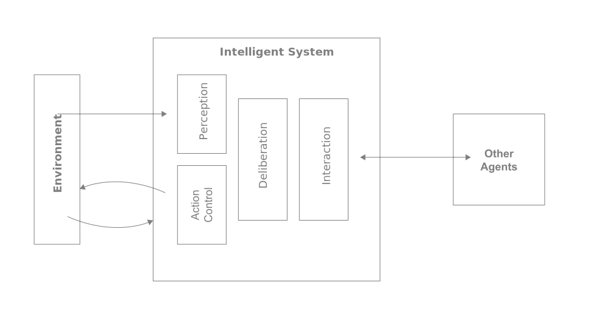{.fragment 
height="400"}

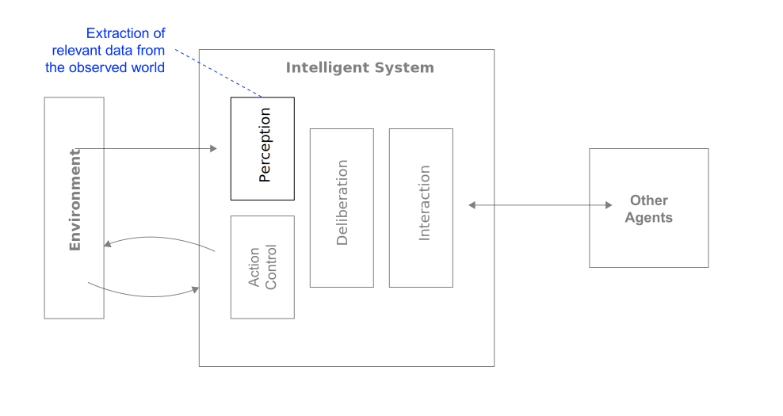{.fragment height="400"}

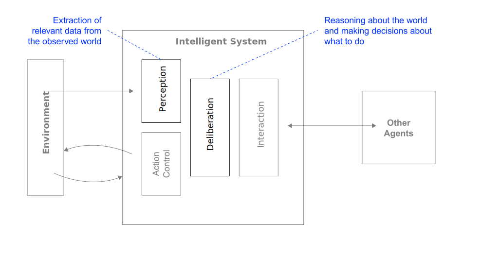{.fragment height="400"}

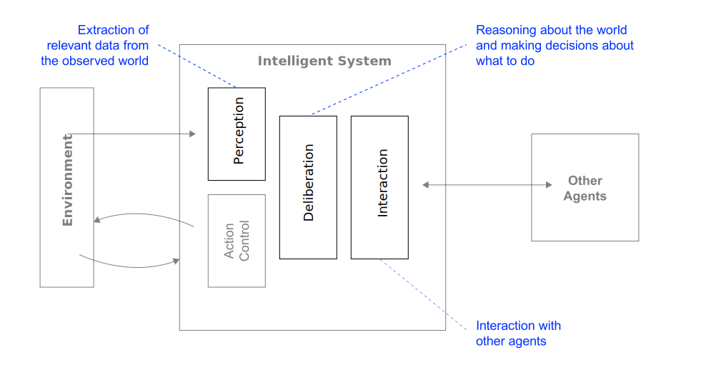{.fragment height="400"}

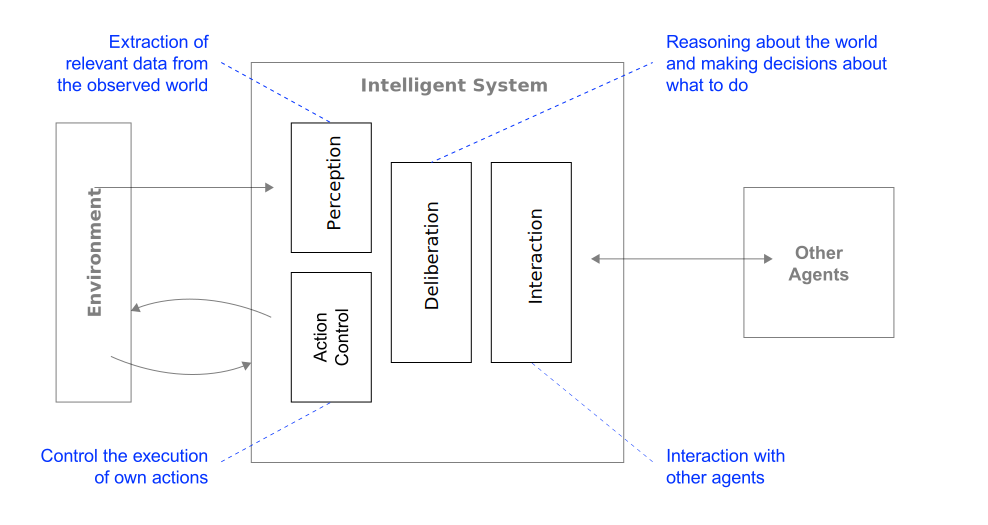{.fragment height="400"}

:::

:::notes

**Perception** refers to AI systems' ability to gather and interpret data from their environment through sensors, 
cameras, microphones, or data inputs

**Deliberation** refers to the computational processes of analyzing information, drawing conclusions, and making 
decisions.

**Interaction** refers to the communication capabilities with AI systems, including natural language processing and 
generation.

**Action control** refers to the mechanisms that translate decisions into actions or outputs in the environment.

:::

## Discussion {.discussion-slide}

:::medium
What are the basic cognitive abilities of a **chatbot**?
How they are technically implemented?
:::

Think on your own, then share your thoughts. 



## Deliberation and reactive behavior

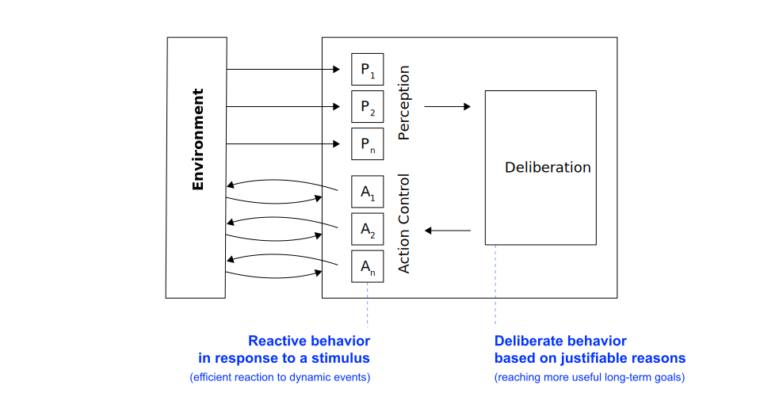{ height="400"}

## Multiagent systems

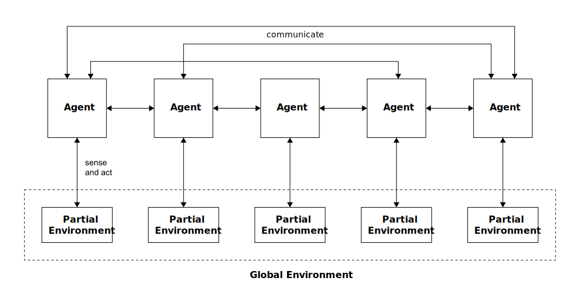{ height="400"}

:::notes
Metacognition is "thinking about thinking" — the ability to reflect on, monitor, and regulate one's own cognitive 
processes.

It involves two main components:

- **Metacognitive knowledge:** Understanding and awareness of your own cognitive abilities, strategies, and 
  limitations. This includes knowing what you know and don't know, understanding how you learn best, and recognizing the demands of different tasks.
- **Metacognitive regulation:** The active control and monitoring of cognitive processes during learning or 
problem-solving. This includes planning how to approach a task, monitoring your comprehension or progress, evaluating your performance, and adjusting strategies when needed.

In traditional (single-agent) systems, metacognition is about self-monitoring: "Do I know enough to solve this problem?" But in multiagent systems, metacognition becomes distributed and "social".

This architecture supports metacognitive abilities because agents can reflect on their own knowledge, recognize the limitations of their partial view, communicate to fill knowledge gaps, and reason about what other agents might know or perceive. The distributed nature of the system requires agents to be aware of their own cognitive boundaries.

**Example scenario:** Imagine robots exploring a building. Each sees only their room (partial environment). A 
metacognitive agent recognizes "I can't see the exit from here" (knowledge limitation), reasons "Agent 3 near the entrance likely knows" (distributed knowledge model), and initiates communication (regulatory action).
:::

### Exercise {.discussion-slide background-color="#000"}

:::medium
Find two real-world examples of multi-agent systems (one digital, one physical)
:::

For each system, document:

- What are the individual agents?
- How do they jointly perceive and deliberate?
- How do agents interact/coordinate?



# Complex behavior {.headline-only}

### Properties

Complex behavior refers to the **observable patterns of actions and responses that an AI system exhibits** (*i.e., what the system does*), particularly sophisticated, adaptive, or emergent conduct that goes beyond simple stimulus-response patterns.

[To realize complex behavior, the components of an intelligent system (*i.e., what the system can do cognitively*) must have the following properties (to some extent):
]{.fragment}

:::large
[Autonomy, ]{.fragment} [rationality, ]{.fragment} \
[learning, ]{.fragment} [and introspection]{.fragment}
:::

### Rationality

A rational agent is one that does the right thing—it is goal directed.

:::fragment
> For each possible percept sequence, a rational agent should select an __action__ that is expected to maximize its 
> __performance measure__, given the evidence provided by the __percept sequence__ and whatever built-in 
> __knowledge__ the agent has. *@RusselNorvig2022AIMA [p.58]*
:::

:::notes

What is rational at any given time depends on four things:

- The performance measure that defines the criterion of success
- The agent's prior knowledge of the environment
- The actions that the agent can performance
- The agent's percept sequence to date

:::

:::fragment
It can be quite hard to formulate a performance measure correctly, however:

> If we use, to achieve our purposes, a mechanical agency with those operation we cannot interfere once we have 
> started it [...] we had better be quite sure that the purpose built into the machine is the purpose which we 
> really desire *@Wiener1960Some [p. 1358]*
:::

### Discussion {.discussion-slide}

:::large
Under which circumstances does a **chatbot** act rational?
:::

:::notes
Under following circumstances, the vacuum cleaning agent is rational:

- The performance measure of the vacuum cleaner might award one point for each clean square at each time step, over a "lifetime" of 1,000 time steps (to prevent the cleaner to oscillate needlessly back and forth).
- The "geography" of the environment is known *a priori* but the dirt distribution and the initial location of the agent are not. Clean squares stay clean and sucking cleans the current square. The *Right* and *Left* actions move the agent one square except when this would take the agent outside the environment in which case the agent remains where it is.
- The only available action is *Right*, *Left*, and *Suck*.
- The agent correctly perceives its location and whether that location contains dirt.

For details such as tabulated agent functions please see @RusselNorvig2022AIMA.
:::

### Rationality and perfection

:::large
Rationality != perfection
:::

:::incremental
- Rationality maximizes *expected* performance
- Perfection maximizes *actual* performance
- Perfection requires omniscience
- Rational choice depends only on the percept sequence *to date*
:::

:::notes

As the environment is usually not completely known *a priori* and completely predictable (or stable), information gathering and learning are important parts of rationality [@RusselNorvig2022AIMA, p.59].

**Example:** The vacuum cleaner needs to explore an initially unknown environment (i.e., exploration) to maximize its expected performance. In addition, a vacuum cleaner that learns to predict where and when additional dirt will appear will do better than one that does not.

:::

### Rationality and cognitive abilities

:::r-stack

![Rational decisions affect different cognitive abilities [@Molina2020Intelligent]](images/rationalQuestions-1.svg){.fragment height="400"}

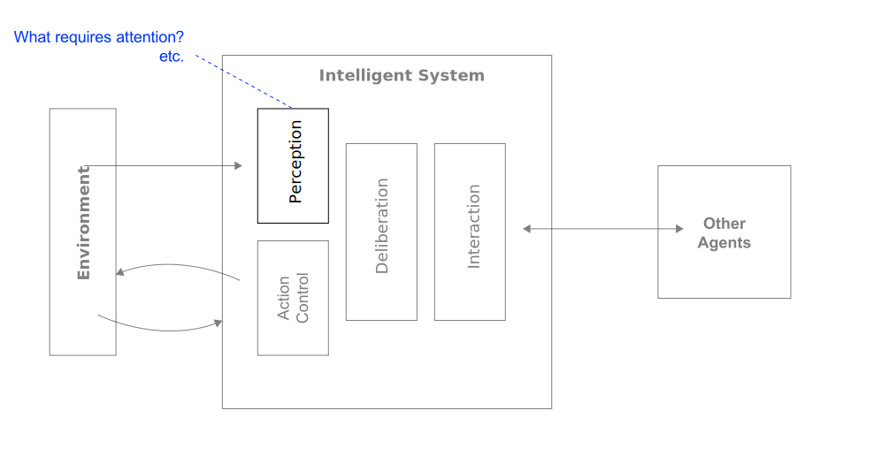{.fragment height="400"}

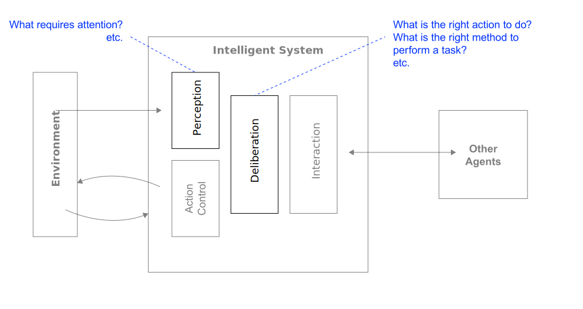{.fragment height="400"}

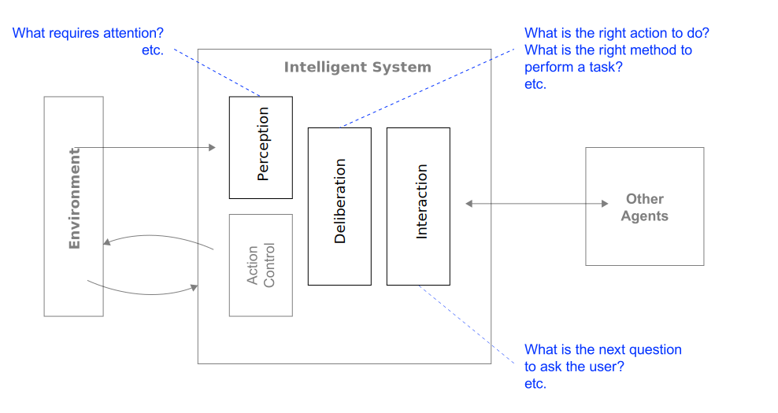{.fragment height="400"}

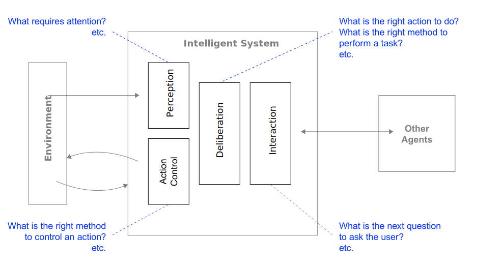{.fragment height="400"}

:::

### Learning

> Learning agents are those that can improve their behavior through diligent study of past experiences and predictions of the future *@RusselNorvig2022AIMA [p. 668]*

. . .

A learning agent

:::incremental
- uses so-called __machine learning__ (ML), if it is a computer;
- improves performance based on experience (i.e., observations of the world);
- is required when the designer lacks omniscience (i.e., in unknown environments) and/or
- has no idea how to program a solution themselves (e.g., recognizing faces)
:::

### Learning types

[Supervised learning]{.large} \
[Involves learning a function from examples *➞ test and training data*]{.link-color .fragment}

[Unsupervised learning]{.large} \
[The agent has to learn patterns in the input *➞ identification of categories or classifications*]{.link-color .fragment}

[Reinforcement learning]{.large} \
[The agent must learn from punishments or rewards *➞ learning by trial and error*]{.link-color .fragment}

### Learning and cognitive abilities

:::r-stack

![Adaptation through learning can affect differnt cognitive abilities [@Molina2020Intelligent]](images/learning-1.svg){.fragment height="400"}

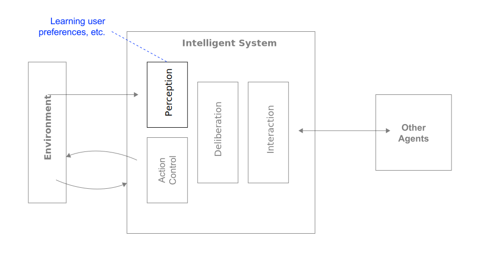{.fragment height="400"}

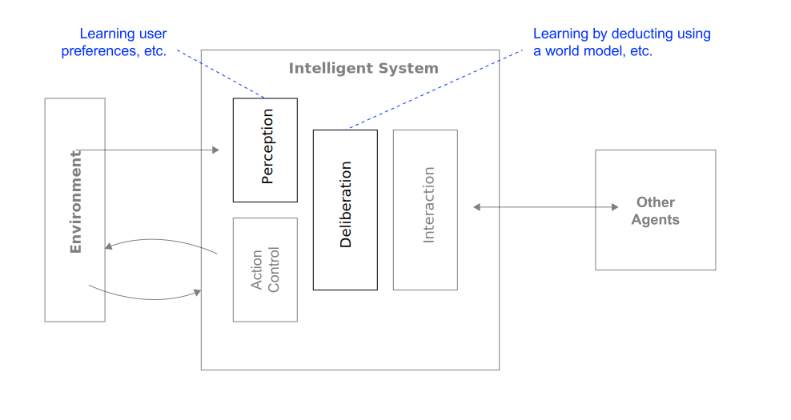{.fragment height="400"}

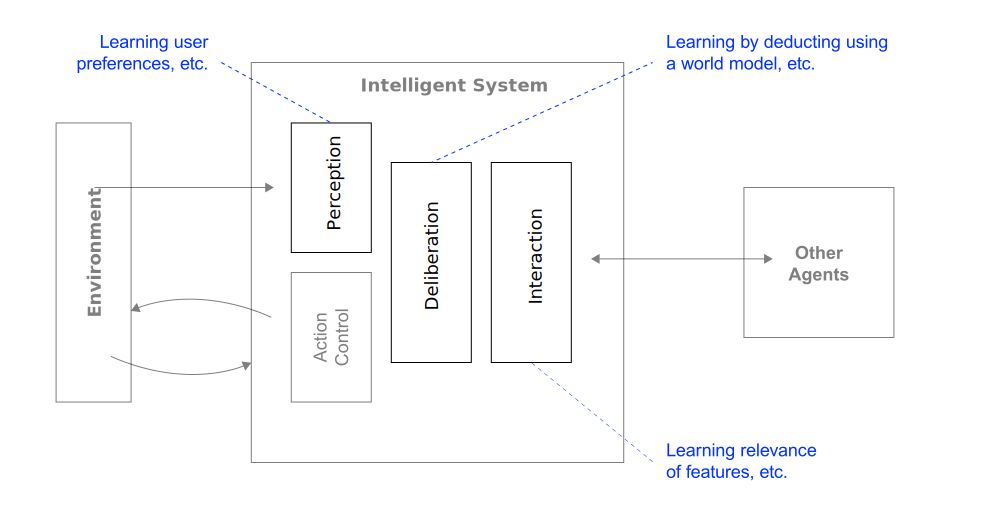{.fragment height="400"}

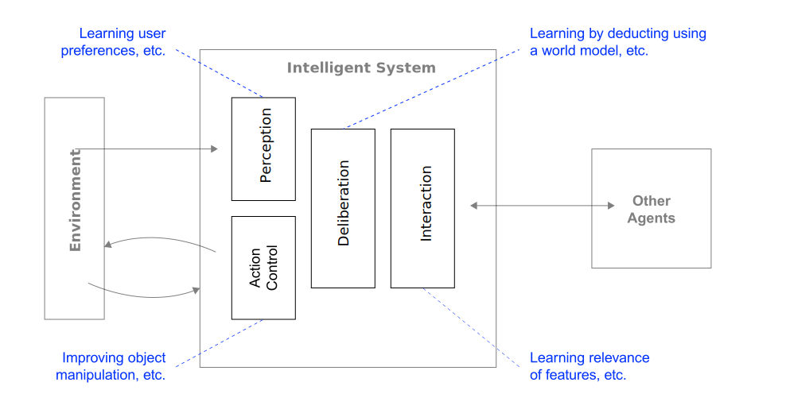{.fragment height="400"}

:::

### Introspection 

:::medium
Introspection refers to the capabilitiy to **analyze one's cognitive abilities**.
:::

The system uses an [observable model of its own abilities]{.link-color}.\   
[This model is used to simulate self-awareness processes.]{.fragment}

. . .

Introspection allows the system ...

:::incremental
- ... to judge its own actions and, thus, provides [learning opportunities]{.link-color}  
  (e.g., analyzing past outputs ot identify errors or biases) and
- ... to [generate explanations]{.link-color} and, thus, to justify decisions to the user   
  (e.g., explainable AI — showing how a systems arrives at a solution)
:::

## Summary {background-color="#f0f0f0"}

The properties of an intelligent system are

[Capacity to work in a   complex environment]{.medium .fragment} \
[Interaction with the environment and other agents]{.fragment .fade-in-then-semi-out}

[Cognitive abilities]{.medium .fragment} \
[Perception, action control, deliberation, and interaction]{.fragment .fade-in-then-semi-out}

[Complex behavior]{.medium .fragment}\
[Acting autonomously, rationally, adaptation through learning, and introspection]{.fragment .fade-in-then-semi-out}

### Homework {.html-hidden .unlisted .discussion-slide background-color=black}

:::medium
Select an intelligent system and analyse it using the properties outlined here.
:::

Note: This is an excellent task to prepare for the exam.

:::medium
Read @dellermann2019hybrid.
:::

# Recap {.headline-only}

## Discussion {.discussion-slide}

:::large
What is intelligence?
:::

## Intelligence

:::medium
> Intelligence is the ability to accomplish complex goals, learn, reason, and adaptively perform effective actions within an environment. *@gottfredson1997mainstream*
:::

:::{.content-visible when-format="revealjs"}
:::notes
This definition is deliberately broad — it covers humans, groups, machines, and hybrid systems alike. Ask students: "Is this definition technology-neutral?" (Yes — which is exactly why it is useful here.) Emphasise the four verbs: *accomplish*, *learn*, *reason*, *act*. All four apply to AI systems in different degrees, and tracking which degrees is what this session is about.
:::
:::

## Artificial intelligence

> The term **artificial intelligence** describes systems that perform "[…] activities that we associate with human thinking, activities such as decision-making, problem solving, learning […]" *@bellman1978introduction [p. 3]*

:::fragment
> AI can be defined as "[…] the art of creating machines that perform functions that require intelligence when performed by people […]" *@kurzweil1990age [p. 117]*
:::

:::fragment
The basic idea: systems that can *analyse* their environment, *adapt* to new circumstances, and *act* in ways that advance specified goals without explicit programming for every situation.
:::

:::fragment
This requires **agency** (i.e., the capacity to work in complex environments), **thinking skills** (i.e., cognitive abilities) as well as **observable patterns of actions and responses** (i.e., complex behavior).
:::

## Anthropocentrism

:::medium
Are we defining intelligence, or just **human-ness**?
:::

:::incremental
- **Anthropocentric bias**\
  We use the human mind as the "Gold Standard" for all intelligence.
- **Cognitive narrow-mindedness**\
  We often ignore forms of intelligence that don't solve "human" problems (e.g., navigation without landmarks, multi-agent coordination in insects).
- **The mimicry trap**\
  We build AI to pass human tests (e.g., Turing, Bar Exam), which prioritizes *imitation* over *novel synthetic cognition*.
::: 

## Mimicking the mind

:::fragment
Current AI architectures seem to be inspired by cognitive architectures as, e.g., proposed by **Dual Process Theory** [@kahneman2011thinking].
:::

:::fragment

| Feature                | **System 1** (Intuitive)         | **System 2** (Analytical)          |
|:-----------------------|:---------------------------------|:-----------------------------------|
| **Human Equivalent**   | Fast, automatic, "gut feeling"   | Slow, effortful, logical reasoning |
| **AI (LLM)**           | Next-token prediction (Instinct) | Chain-of-Thought (Reasoning)       |
| **Computational Cost** | Low / immediate                  | High (requires more "tokens")      |

: Cognitive architecture based on @kahneman2011thinking {#tbl-sys1sys2}

:::

:::fragment
**Observation:** By forcing LLMs to "think before they speak" (using reasoning traces), we are literally programming a digital version of human **introspection.**
:::

## Thinking as a group {.no-headline background-color="black" background-image="images/fishes.jpg"}

## Alternative intelligences

:::fragment
:::medium
What if *human-like* isn't the only way to be smart?
:::
:::

:::incremental
- **Swarm intelligence:** Ants and bees solve massive optimization problems through collective simple actions rather than individual complex thought.
- **Decentralized intelligence:** Can "thinking" happen without a central CPU? Think of the Octopus where two-thirds of neurons are in the limbs.
- **Non-biological scales:** Mycelial (fungal) networks that process information across entire ecosystems over months, rather than seconds.
:::

:::fragment
By building AI to mimic *our* brains, are we missing out on "Alien" forms of intelligence that could solve problems humans can't even perceive?
:::

# Hybrid intelligence {.headline-only}

## Collective intelligence

> **Collective intelligence** refers to "[…] groups of individuals acting collectively in ways that seem intelligent." *@malone2015handbook [p. 3]*

:::fragment
The concept implies that under certain conditions, a (large) group of *homogeneous* individuals can outperform any single individual or even a single expert [@leimeister2010collective].
:::

:::fragment
Today, research increasingly focuses on **hybrid collective intelligence:** connecting *heterogeneous* agents (e.g., humans and machines) so that they combine complementary intelligence and act more intelligently together [@malone2015handbook].
:::

## Exercise

Synthesize your findings from reading @dellermann2019hybrid by findings answers to following questions:

1. How can hybrid intelligence be defined?
2. What are main characteristics of hybrid intelligence?
3. What are complementary strengths of humans and machines?
4. What implications does that concept have for practice?



## Concept

:::large
The idea is to combine the complementary capabilities of humans and computers to augment each other.
:::

:::aside
@dellermann2019hybrid
:::

## Complementary strengths

:::columns

:::column
[Human intelligence]{.medium .link-color}

[Flexibility & transfer]{.fragment fragment-index="1"}

[Empathy & creativity]{.fragment fragment-index="2"}

[Eventualities]{.fragment fragment-index="3"}

[Common sense]{.fragment fragment-index="4"}

[**Intuition**]{.fragment fragment-index="5"}
:::

:::column
[Artificial intelligence]{.medium .link-color}

[Pattern recognition]{.fragment fragment-index="1"}

[Probabilistic]{.fragment fragment-index="2"}

[Consistency]{.fragment fragment-index="3"}

[Speed & efficiency]{.fragment fragment-index="4"}

[**Analysis**]{.fragment fragment-index="5"}

:::
:::

:::notes
Humans are flexible, creative, empathic, and can adapt to various settings. This allows, for instance, human domain experts to deal with so called ‘‘broken-leg’’ predictions that deviate from the currently known probability distribution. However, they are restricted by bound rationality that prevents them from aggregating information perfectly and drawing conclusions from that. On the other hand, machines are particularly good at solving repetitive tasks that require fast
processing of huge amounts of data, at recognizing complex patterns, or weighing multiple factors following consistent rules of probability theory [@dellermann2019hybrid].

However, there is also a technology-centric perspective that assumes that true intelligence can ultimately only be found in well-developed and mature (general) AI systems. Humans are biologically limited in their information processing and reasoning abilities and exhibit many types of cognitive biases, while computers offer virtually infinite possibilities to develop rational intelligence at human levels and beyond [@peeters2021hybrid].

**Model of human cognition**

@kahneman2011thinking proposed a two-system model of human cognition, which he called System 1 and System 2.

System 1 is an intuitive, automatic, and fast mode of thinking that operates outside of our conscious awareness. It is responsible for generating impressions, making quick judgments, and executing routine tasks with minimal effort.

System 2, on the other hand, is a more analytical, controlled, and deliberate mode of thinking that requires conscious effort and attention. It is responsible for problem-solving, critical thinking, and decision-making.

While System 1 operates quickly and automatically, it can be prone to biases and errors, particularly in complex or unfamiliar situations. System 2, though slower and more effortful, can help us avoid these biases and make more accurate decisions.

:::

## Definition

> **Hybrid intelligence** is defined as the ability to achieve complex goals by combining human and artificial intelligence, thereby reaching superior results to those each of them could have accomplished separately, and
continuously improve by learning from each other. *@dellermann2019hybrid [p. 640]*

:::fragment
Main characteristics of hybrid intelligence are:
:::

:::incremental
- **Collectively**\
  Tasks are performed collectively and activities are conditionally dependent
- **Superior results**\
  Neither AI nor humans could have achieved the outcome without the other
- **Continuous learning** \
  All components of the socio-technical system learn from each other through experience
:::

## Visualization

![Distribution of roles in hybrid intelligence [@dellermann2019hybrid, p. 640]](images/hybridIntelligence.svg)

## The automation–augmentation paradox

@raisch2021automation argue that automation and augmentation are *not* opposing strategies — they are **interdependent:**

:::incremental
- Overemphasising **automation** (machines replacing humans) creates reinforcing cycles that erode human capability, ultimately making humans less able to provide value when it matters most
- Overemphasising **augmentation** (humans plus machines) can under-exploit AI capabilities and leave significant efficiency potential unrealised
:::

:::fragment
**Effective AI deployment** requires holding *both* logics simultaneously, managing their tensions across time and space
:::

:::fragment
:::medium
The question is not *"automate or augment?"*\
— but *"when, where, and how to combine both?"*
:::
:::

:::{.content-visible when-format="revealjs"}
:::notes
@raisch2021automation use paradox theory from organisation science to make this argument rigorous.

Their key insight: automation and augmentation create *circular* causality. Automation that erodes human skills eventually undermines the oversight capacity that makes automation safe. Augmentation that preserves all human roles prevents the scale and consistency advantages of automation from materialising. The productive resolution is not a compromise but a *dialectical* management of the tension: design systems that automate where appropriate while deliberately maintaining and developing human capabilities where they remain essential. This has direct implications for students' project designs — they should ask: what human capabilities must not atrophy?
:::
:::

:::{.content-visible unless-format="revealjs"}
@raisch2021automation develop their argument using paradox theory from organisational science. They identify that automation and augmentation create reinforcing causal loops that can become self-sustaining and difficult to reverse. An automation-dominant logic progressively reduces human skill through disuse, eventually leaving organisations without the human capacity to maintain systems, handle novel exceptions, or provide meaningful oversight. An augmentation-dominant logic may preserve human roles but prevent the efficiency, scale, and consistency gains that make AI economically viable. The solution is not a "balance" between the two poles but a *dynamic* management of their interdependence — deliberately choosing where each logic applies, across time, task type, and organisational level.
:::

## From tools to teammates

@seeber2020machines highlight a fundamental shift in how AI systems are positioned in organisations:

. . .

| Traditional AI                                | AI as Teammates                            |
|-----------------------------------------------|--------------------------------------------|
| **Role**: Tool to be used                     | **Role**: Active collaboration partner     |
| **Interaction**: Responds to commands         | **Interaction**: Engages proactively       |
| **Function**: Task automation                 | **Function**: Complex problem-solving      |
| **Agency**: Limited / directed                | **Agency**: Autonomous with initiative     |
| **Integration**: Technical system integration | **Integration**: Social & team integration |

:::{.content-visible when-format="revealjs"}
:::notes
This shift is not just conceptual — it changes what *design* means. Designing AI as a tool is primarily a software engineering problem. Designing AI as a teammate is a sociotechnical design problem that involves role clarity, trust calibration, communication protocols, and institutional structures. @seeber2020machines argue this shift requires new frameworks — the old categories of "user" and "system" no longer apply when AI systems take initiative, participate in defining problems, and generate solutions unprompted. Ask students: "In your project, are you designing a tool or a teammate? And does the design reflect that choice?"
:::
:::

## Examples

[Robots in de klas](https://www.robotsindeklas.nl/)
: A team consisting of a remedial teacher, an educational therapist, and a Nao robot collaborate to support a child with learning difficulties. The robot provides expertise and advice while also helping the child stay focused and engaged.

. . .

[Spawn](https://www.thefader.com/2019/05/21/holly-herndon-proto-ai-spawn-interview)
: The musician Holly Herndon created "Spawn," an AI system that generates unique music different from her usual style. By using Spawn as a tool, Holly is able to avoid creating music that repeats her previous works but to to expand the possibilities of their music.

. . .

[GitHub Copilot](https://github.com/features/copilot)
: In collaborative coding, Copilot can engage in back-and-forth dialogue about software design decisions, propose implementations, and explain reasoning about technical approaches - moving beyond simply generating code.

## Delegation

@fugener2022cognitive conducted experiments on human-AI prediction tasks and found:

:::fragment
:::medium
Human-AI teams achieve superior performance **only when AI delegates to humans,** not vice versa.
:::
:::

:::fragment
**Human metaknowledge,** i.e., the ability to assess your own reliability in a specific context ("knowing what you know"), seems to be the critical variable:
:::

:::incremental
- AI can assess its own certainty well and delegates effectively (even to low-performing humans) because it knows what it knows and what it doesn't
- Humans, by contrast, lack metaknowledge: they cannot accurately judge *their own* reliability, leading to poor delegation decisions despite genuine willingness to collaborate
- This metaknowledge deficit is unconscious and cannot be explained by algorithm aversion — subjects tried to follow delegation strategies diligently and appreciated the AI support
:::

## Critical design areas

@seeber2020machines identify three interconnected design areas for AI teammates:

:::incremental
1. **Machine artifact design:** the AI system itself: appearance, capabilities, interaction modalities
2. **Collaboration design:** how humans and AI work together: team composition, task allocation, workflows, communication protocols
3. **Institution design:** the broader context: responsibility frameworks, liability, training requirements, governance structures
:::

:::fragment
These areas are *interdependent*: decisions in one area constrain and shape the others. Effective design requires a **holistic** rather than purely technical approach.
:::

## Implications for hybrid intelligence

According to @peeters2021hybrid:

:::incremental
- Intelligence should be studied at the **group level** of humans and AI-machines working together — not at the level of individual components
- Increasing system intelligence means **increasing the quality of interaction** between components — not merely improving individual components
- Both human and artificial intelligence are shallow when considered in isolation
- **No AI is an island** — value emerges from the system, not the artefact
:::

:::{.content-visible when-format="revealjs"}
:::notes
This is the main theoretical takeaway for Session 1. "No AI is an island" is a memorable encapsulation of the whole unit's argument. It counters the tendency to evaluate AI systems by their isolated capabilities (benchmark performance, parameter count, etc.) and reframes evaluation in terms of *systemic performance*: what does the combined human-AI system achieve in context? This has direct implications for how students should evaluate their project solutions — not "how capable is the AI?" but "how well does the combined system perform the task?"

Bridge to Session 2: We've established the conceptual framework. In Session 2, we ask: under what specific conditions does hybrid intelligence actually create business value, and what must be in place (design, governance, responsibility structures) for it to do so sustainably?
:::
:::

# Affection {.headline-only}

## Affective computing {background-color="#f0f0f0"}

:::large
Computing that relates to, arises from or deliberately influences emotion.
:::

:::aside
@picard2000affective
:::

## Objectives

:::medium
Assigning systems "the human-like capabilities of observation, interpretation and generation of affect features^["Affect" is basically a synonym for emotion.]" [[@tao2005affective, p. 981]]{.smaller}
:::

. . .

The goal is to simulate empathy: affective systems are designed to interpret the emotional states of humans and adapt their behavior to them, giving an appropriate response for those emotions (i.e., *emotion aware systems*).

## Properties

[Emotion recognition]{.large .fragment} \
[Interpreting the emotional states of humans]{.fragment .fade-in-then-semi-out}

[Emotion expresssion]{.large .fragment} \
[Ability to simulate human affects (e.g. 'emotional modality')]{.fragment .fade-in-then-semi-out}

[Adequate response to emotion]{.large .fragment}\
[Linking emotion recognition and expression e.g., to reinforce the meaning of messages]{.fragment .fade-in-then-semi-out}

## Emotional signals

:::medium
[Facial expression]{.highlight-current-blue .fragment}, [posture]{.highlight-current-blue .fragment}, [speech]{.highlight-current-blue .fragment}, [force or rhythm of key stroke]{.highlight-current-blue .fragment}, [temperature change]{.highlight-current-blue .fragment} (e.g., hand on mouse) can signify changes in user's emotional state.
:::

. . .

These can be detected and interpreted by an affective system.

. . .

Affective systems can use some of these to simulate emoptions.

## Basic emotions

@ekman1987universals categorized emotions into 6 groups:

:::large
[Fear,]{.fragment .fade-in-then-semi-out}
[surprise,]{.fragment .fade-in-then-semi-out}
[disgust,]{.fragment .fade-in-then-semi-out}
[anger,]{.fragment .fade-in-then-semi-out}
[happiness,]{.fragment .fade-in-then-semi-out}
[and sadness]{.fragment .fade-in-then-semi-out}
:::

:::fragment
All of these can facially expressed.
:::

## The circumplex model

While @ekman1987universals uses categories, many AI systems use a **dimensional approach** to map human affect.

[Valence]{.medium .fragment} \
[How positive (pleasant) or negative (unpleasant) is the emotion?]{.fragment}

[Arousal]{.medium .fragment} \
[How intense is the physical/mental energy (from calm to excited)?]{.fragment}

:::fragment
The circumplex model [@russell1980circumplex] allows the system to map "nuance." A user isn't just "sad"; they might be "slightly frustrated" (low valence, medium arousal) or "severely depressed" (very low valence, low arousal).
:::

## Examples

:::incremental
- **Facial expression analysis**\
Using computer vision and machine learning to analyze facial expressions and determine the emotional state of a person.
- **Voice analysis**\
Analyzing the tone, pitch, and other characteristics of a person's voice to determine their emotional state.
- **Physiological sensing**\
Using wearable devices to monitor physiological signals such as heart rate, skin conductance, and body temperature to detect emotional responses.
- **Emotion simulation**\
Developing systems that can generate emotional responses, such as a virtual assistant that can express empathy or a chatbot that can adapt its tone based on the user's emotional state.
:::

## The CASA paradigm

:::large
[C]{.link-color}omputers [A]{.link-color}re [S]{.link-color}ocial [A]{.link-color}ctors.
:::

:::fragment
Research by @reeves1996media shows that humans naturally and unconsciously treat computers and AI as if they were **real people.**
:::

:::incremental
- We apply **social rules** to machines (e.g., being polite to a voice assistant). 
- We feel **social pressure** from affective displays (e.g., feeling "guilty" if an AI avatar looks sad).
:::

:::fragment
Implication: If an AI doesn't have an "affective" layer, it feels "broken" or "rude" to the human brain, even if the logic is perfect.
:::

## Affection x hybrid teams

:::large
In hybrid intelligence, **trust** is the most critical variable.
:::

:::fragment
Affective systems are used to build **rapport,** that is the feeling of being *in sync* with a teammate.
:::

:::incremental
- **Trust calibration**\
  An AI that expresses "uncertainty" (a form of affect) through its tone helps humans know when *not* to rely on it.
- **Empathy as utility**\
  In high-stress environments (e.g., healthcare or cockpits), an AI that recognizes "cognitive load" or "stress" and adjusts its tone can prevent human burnout.
:::

## Exercise {.html-hidden .unlisted .discussion-slide background-color=black}

:::large
Think of/identify a real-life use case for affective computing.
:::

- Relate it to the basic properties of affective systems.
- Argue why affective computing is effective in this use case.



## The Uncanny Valley

:::large
More "affection" is not always better.
:::

:::fragment
The **Uncanny Valley** describes the dip in human comfort when an AI/Robot becomes "almost human" but not quite—leading to a sense of eeriness or revulsion [@mori2012uncanny].
:::

:::fragment
Some ethical questions to be asked:
:::

:::incremental
- Should a system "feign" empathy to sell a product?
- Does a company have the right to "read" your stress levels via your keyboard rhythm or webcam?
- Can an AI accurately read "anger" across different cultures?
:::

# Q&A {.html-hidden .unlisted .headline-only .vertical-center background-color="#0333ff" background-image="../assets/bg.jpg"}

## Homework

Listen to the Decoder podcast episode with [Google CEO Sundar Pichai on AI-powered search and the future of the web](https://www.theverge.com/24158374/google-ceo-sundar-pichai-ai-search-gemini-future-of-the-internet-web-openai-decoder-interview) and reflect on the problems with the Internet and responses discussed.

# Literature
::: {#refs}
:::
