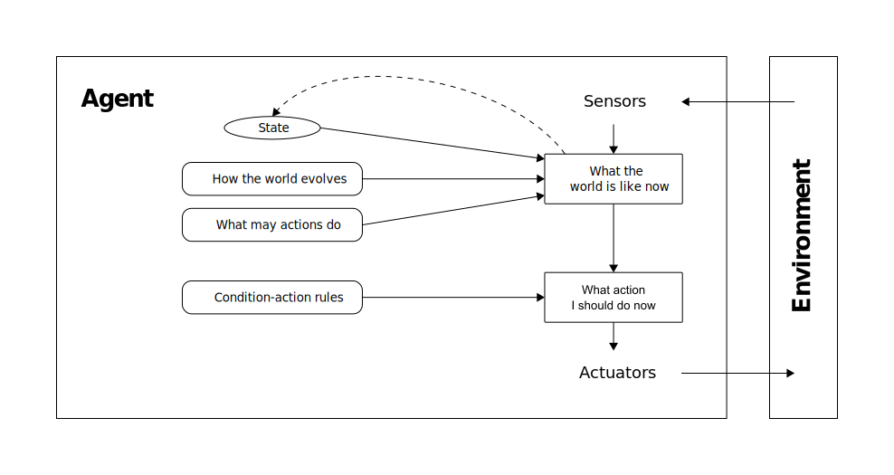
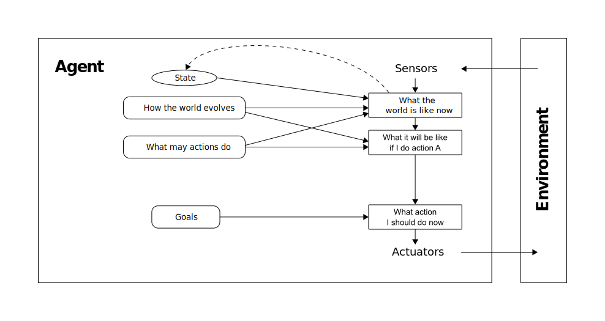
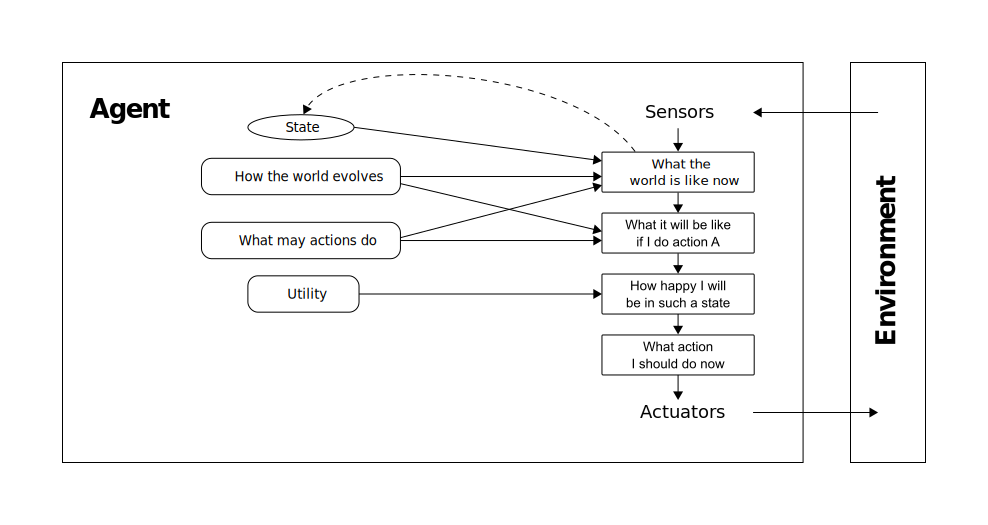
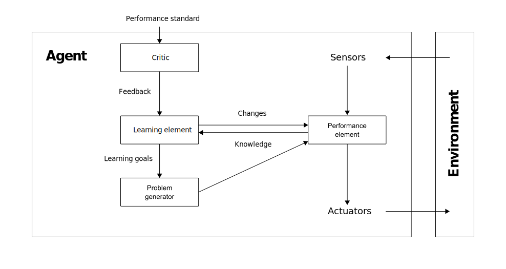
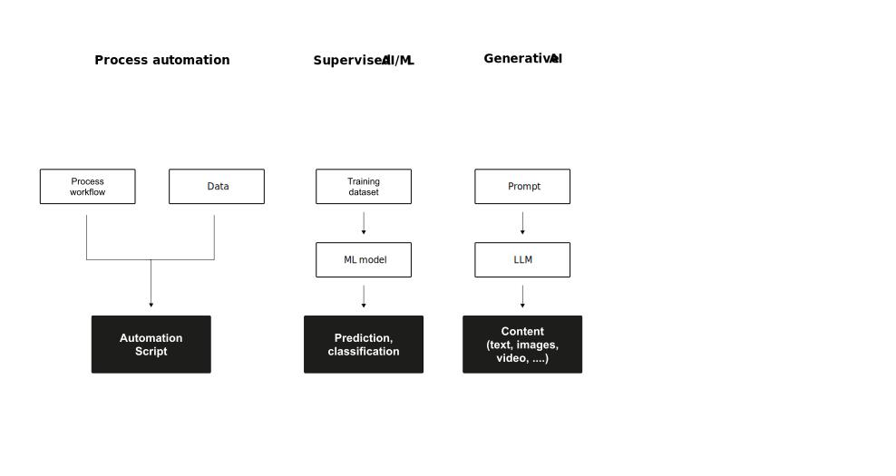
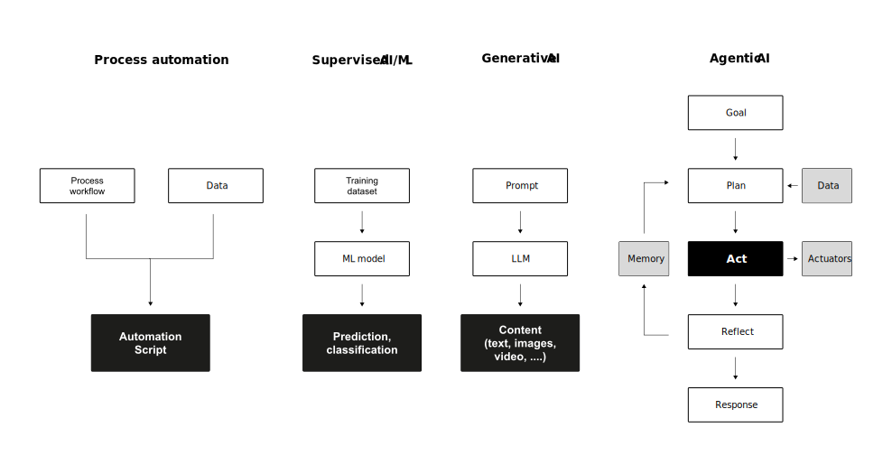

# Agents {.headline-only}

## Agency

:::medium
Agency is the capacity of a system to maintain a continuous feedback loop with its environment. Agency requires a mapping of a history of environmental percepts to a sequence of actions designed to achieve a goal or maximize a performance measure [@RusselNorvig2022AIMA].
:::

:::notes
In the evolution of Artificial Intelligence, we have moved beyond viewing systems as isolated "calculators" that perform fixed computations. Modern AI is built on the paradigm of Agency. This shift is fundamental because it moves our engineering focus from "correct output" to "intelligent behavior".

By viewing a system as an agent coupled with an environment, we account for the feedback loops, uncertainties, and real-time constraints that define intelligence in the physical and digital worlds.

Systems architects use _agency_ as a tool for analysis, but should avoid over-applying it to trivial tools where it provides no design leverage:

> One could view a hand-held calculator as an agent that chooses the action of displaying '4' when given the percept sequence '2 + 2 =,' but such an analysis would hardly aid our understanding of the calculator... AI operates at... the most interesting end of the spectrum, where the artifacts have significant computational resources and the task environment requires nontrivial decision making. *@RusselNorvig2022AIMA [p. 36]*

:::

## Core components

To analyze these systems, we define the following core components:

:::incremental
- **Agent:** anything that perceives its environment through sensors and acts upon it through actuators.
- **Percept:** The agent's perceptual inputs at any given instant.
- **Percept sequence:** The complete history of everything the agent has ever perceived; an agent’s choice of action depends on this sequence observed to date.
- **Sensors:** Mechanisms (cameras, GPS, microphones) that receive environmental input.
- **Actuators:** Mechanisms (wheels, display screens, robotic joints) that execute actions.
::: 

## Architecture
 
We must distinguish between the abstract logic and the physical implementation:

:::incremental
- **Agent function:** An abstract mathematical mapping ($f: \mathcal{P}^* \to \mathcal{A}$) that describes how any given percept sequence results in an action.
- **Agent program:** The concrete physical implementation (the actual code) running on a specific architecture.
:::

## Rational agents

{#fig-agent}

:::notes

A rational agent is one that "does the right thing." Rationality is not about the internal process, but the external outcome.

The agent acts to maximize its **performance measure**, based on three factors:

1. The **percept sequence** (its experience to date).
2. The **built-in knowledge** (the logic within the agent function).
3. The **actuators** (its physical ability to change the world).

:::callout-note
### Example

A robotic vacuum cleaner moves around a grid of squares, some of which are dirty and some of which are clean. The vacuum cleaner *perceives* where it is and if there is dirt there. It's *actions* are move to the right or left, suck up the dirt, or do nothing. The *agent function* prescribes that if the current square is dirty, it should suck up the dirt; otherwise, it should move to the other square. 

Under following circumstances, the vacuum cleaning agent is rational [@RusselNorvig2022AIMA]:

- The *performance measure* of the vacuum cleaner awards one point for each clean square at each time step
- The only available actions are *right*, *left*, and *suck*.
- The "geography" of the environment is known *a priori* but the dirt distribution and the initial location of the agent are not. Clean squares stay clean and sucking cleans the current square. 
- The *right* and *left* actions move the agent one square except when this would take the agent outside the environment. Then it remains where it is.
- The robot correctly perceives its location and whether the square is dirty.

:::
:::

## Exercise {.html-hidden .unlisted .discussion-slide}

:::large
Under which circumstances does a **vacuum cleaning agent** act rational?
:::

## Performance measure

> If we use, to achieve our purposes, a mechanical agency with those operation we cannot interfere once we have started it [...] we had better be quite sure that the purpose built into the machine is the purpose which we really desire *@Wiener1960Some [p. 1358]*

. . .

:::medium
It is difficult to formulate a performance measure correctly.\
**This is a reason to be careful.**
:::

## Rationality vs. perfection

:::large
Rationality is *not* the same as perfection. 
:::

:::incremental
- Rationality maximizes *expected* performance.
- Perfection maximizes *actual* performance.
- Perfection requires omniscience.
- Rational choice depends only on the percept sequence *to date*.
:::

## Performance standards

To understand the engineering limits of AI, we distinguish between three standards:

| Metric          | Definition                              | Info Requirement                   | Feasibility                               |
|:----------------|:----------------------------------------|:-----------------------------------|:------------------------------------------|
| **Rationality** | Maximizing *expected* performance       | Percept sequence + prior knowledge | **High:** The engineering standard        |
| **Omniscience** | Knowing the *actual* outcome of actions | Complete future and present data   | **Impossible:** Requires a "crystal ball" |
| **Perfection**  | Maximizing *actual* performance         | Requires Omniscience               | **Impossible** in unpredictable worlds    |

## Information gathering & learning

:::medium
To bridge the gap between initial ignorance and rational behavior, agents must utilize **information gathering** and **learning.**
:::

:::fragment
Since agents lack omniscience, they must be designed to:
:::

:::incremental
- **Information gathering:** take actions specifically to modify future percepts (e.g., looking both ways before crossing a street).
- **Learning:** modify their internal agent function based on experience to improve performance over time.
:::

:::fragment
As the environment is usually not completely known *a priori* and not completely predictable, these are vital parts of rationality [@RusselNorvig2022AIMA, p.59].
:::

:::notes
:::callout-note
### Example
The vacuum cleaner needs to explore an initially unknown environment (**exploration**) to maximize its expected performance. A vacuum cleaner that learns to predict where and when additional dirt will appear will do better than one that does not.
:::
:::

# Environments {.headline-only}

## Components 

Before designing an agent (i.e., *the solution*), the task environment (i.e., *the problem*) must be specified as fully as possible, including

:::medium
:::incremental
- the **p**erformance measure,
- the **e**nvironment,
- the **a**ctuators, and
- the **s**ensors. 
:::
:::

. . .

[@RusselNorvig2022AIMA uses the short form PEAS to describe these parts of the task environment.]{.smaller}

:::notes

:::callout-note
### Example of an PEAS description

Task environment of a taxi driver agent:

- __P__: Safe, fast, legal, comfortable, maximize profits, minimize impact on other road users
- __E__: Roads, other road users, police, pedestrians, customers, weather
- __A__: Steering, accelerator, brake, signal horn, display, speech
- __S__: Cameras, radar, speedometer, GPS, engine, sensors, accelerometer, microphones, touchscreen

Source: @RusselNorvig2022AIMA [p. 61]
:::

:::

## Properties

Task environments can be categorized along following dimensions:

:::hmtl-hidden
:::incremental
- Fully observable &harr; partially observable
- Single agent &harr; multi-agent
- Deterministic &harr; nondeterministic
- Episodic &harr; sequential
- Static &harr; dynamic
- Discrete &harr; continuous
- Known &harr; unknown
:::
:::

:::notes

Fully observable &harr; partially observable
: In a *fully observable* task environment, the agent has access to the complete state of the environment at all times. There is no hidden information, and the agent can make decisions based on full knowledge of the current state (e.g., chess). In a partially observable task environment, the agent does not have access to the complete state of the environment. Some information is hidden or uncertain, and the agent must make decisions based on incomplete or noisy data (e.g., poker).

Single agent &harr; multi-agent
: In a *single-agent* task environment, there is only one agent interacting with the environment. The agent's actions are solely based on its own goals and perceptions (e.g., crossword puzzles). In a multi-agent task environment, multiple agents interact with each other and the environment. The agents may cooperate, compete, or have mixed interactions.

Deterministic &harr; nondeterministic
: When the environment is completely determined by the current state and the actions performed by the agent(s), it is called a *deterministic* environment (e.g., crossword puzzle). When a model of the environment explicitly uses probabilities, it is called a *stochastic* environment (e.g., poker).

Episodic &harr; sequential
: In an *episodic* task environment, each task or episode is independent of the others. The agent's actions in one episode do not affect future episodes (e.g., spam email filtering). In a sequential task environment, the current task is dependent on previous tasks. The agent's actions have long-term consequences and affect future states (e.g., chess game).

Static &harr; dynamic
: In a *static* task environment, the environment does not change while the agent is deliberating. The agent can take its time to make decisions without worrying about the environment changing (e.g., chess game). In a *dynamic* task environment, the environment can change while the agent is deliberating. The agent must account for changes and adapt its actions accordingly (e.g., stock-trading).

Discrete &harr; continuous
: In a *discrete* task environment, the state space, actions, and time are all distinct and separate. The environment can be broken down into a finite number of states and actions. (e.g., chess). In a continuous task environment, the state space, actions, and time are continuous. The environment cannot be broken down into a finite number of states and actions (e.g., driving).

Known &harr; unknown
: In a *known* task environment, the agent has complete information about the environment and the outcomes of its actions. The rules, states, and effects of actions are fully understood. (e.g., solitaire card game). In an *unknown* task environment, the agent lacks complete information about the environment or the outcomes of its actions. The agent must learn or infer the rules and effects through interaction.

:::

. . .

The hardest case is partially observable, multi-agent, nondeterministic, sequential, dynamic, and continuous [@RusselNorvig2022AIMA, p.62-64].

## Exercise {.html-hidden .unlisted .discussion-slide}

:::large
Describe the task environment of a **taxi driver agent**.
:::

# Agent types {.headline-only}

## Simple reflex agents

![A simple reflex agent[^legend]](images/simple-reflex-agent.svg){#fig-sr-agent}

:::notes

[^legend]: Rectangles are used to denote the current internal state of the agent's decision process, rectangles with rounded corners to represent the background information used in the process.

Simple reflex agents select actions on the basis of the *current* percept, ignoring the rest of the percept history. Thus, these agents work only if the correct decision can be made on the basis of just the current percept. The environment needs to be fully observable [@RusselNorvig2022AIMA, p.68].

:::callout-note
### Example

A **thermostat** makes decisions based solely on the current temperature reading, without considering past temperatures or future predictions.
:::

:::

## Model-based reflex agents

{#fig-mr-agent}

::: notes
Model-based reflex agents maintain an internal models of the world, which helps them keep track of the current state and make decisions based on this model. This allows them to handle partially observable environments more effectively [@RusselNorvig2022AIMA, p.70].

- The __transition model__ reflects how the world evolves (a) independently of the agent and (b) depending on the agent's actions.
- The __sensor model__ reflects how the state of the world is reflected in the agent's percepts (i.e., by its sensors).

:::callout-note
### Example

A **self-driving car** uses its transition model to predict the state of the environment reflected in the sensor model and make decisions accordingly.
:::

:::callout-note
### Types of representation of states

The representations of states can be placed along an axis of increasing complexity and expressive power [@RusselNorvig2022AIMA p. 76-77]:

- An __atomic representation__ is one in which each state is treated as a black box with not internal structure, meaning the state either does or does not match what you're looking for. In a sliding tile puzzle, for instance, you either have the correct alignment of tiles or you do not.
- A __factored representation__ is one in which the states are defined by set of features (e.g., Boolean, real-valued, or one of a fixed set of symbols). In a sliding puzzle, this might be a simple heuristic like "number of tiles out of place".
- A __structured representation__ is one in which the states are expressed in form of objects and relations between them (e.g., expressed by logic or probability). Such knowledge about relations called facts.

The more expressive language is much more concise, but makes reasoning and learning more complex.

:::
:::

## Goal-based agents

{#fig-gb-agent}

:::notes
Goal-based agents make decisions based on a set of goals they aim to achieve. They consider the current state, possible actions, and the outcomes of these actions to determine the best path to reach their goals [@RusselNorvig2022AIMA, p. 72].

Goal-based agents often use search and planning algorithms to find the optimal sequence of actions to achieve their goals, best-case considering both immediate and long-term consequences.

:::callout-note
### Example

A **delivery robot** is designed to navigate from a starting point to a destination within an environment, often avoiding obstacles and optimizing its route.
:::

:::

## Utility-based agents

{#fig-ub-agent}

:::notes
Utility-based agents make decisions by evaluating the utility (or value) of different possible actions and choosing the one that maximizes their overall utility. These agents consider not only the goals but also the trade-offs and preferences to achieve the best possible outcome [@RusselNorvig2022AIMA, p. 73].

The **utility function** is a mathematical function that calculates **expected utility** for all possible states, weighted by the probability of the outcome. The agent evaluates the utility of different actions and selects the one that **maximizes its expected utility**.

A utility-based agent has many advantages in terms of flexibility and learning, which are particularly helpful in environments characterized by partial observability and nondeterminism. In addition, there are cases where the goals are insufficient but a utility-based agent can still make rational decisions based on the probabilities and the utilities of the outcomes: 

- When there are conflicting goals, the utility function specifies the appropriate tradeoff.
- Likelihood of success (i.e., goal achievement) can be weighed against the importance of the goals

Model- and utility-based agents are difficult to implement. They need to model and keep track of the task environment, which requires ingenious sensors, sophisticated algorithms, and a high computational complexity. There are also utility-based agents that are not model-based. These agents just learn what action is best in a particular situation without any "understanding" of its impact on the environment (e.g., based on reinforcement learning).

:::callout-note
### Example

A **smart thermostat** continuously evaluates the utility of different temperature settings and adjusts accordingly to maximize overall utility, balancing comfort and energy savings.
:::

:::

### Main differences {visibility=hidden}

The main difference between __simple reflex agents__ and __model-based reflex agents__ is that the latter keep track of the state of the world. Model-based reflex agents generate knowledge about how the world evolves independently of the agent and how actions of the agent change the world (i.e., they have knowledge about “how the world works”). This knowledge is “stored” in the transition model of the world. A model-based reflex agents still decides on condition-action rules which action to take (i.e., the codified reflexes).

The main difference between __model-based reflex agents__ and __goal-based agents__ is that it does not act on fixed condition-action rules, but on some sort of goal information that describes situations that are desirable (e.g., in the case of route-finding the destination). Based on the goal, the best possible action (based on the knowledge of the world), needs to be selected. Goal-based decision making involves consideration of the future based on the transition model (i.e., “what will happen if I do such-and-such?”) and how it helps to achieve the goal. In reflex agents designs, this information I not explicitly represented, because the built rules map directly from the percepts to actions, without considering/knowing the future state.

The main difference between __goal-based agents__ and __utility-based agents__ is that the performance measure is more general. It does not only consider a binary distinction between “goal achieved” and “goal not achieved” but allows comparing different world states according to their relative utility or expected utility, respectively (i.e., how happy the agent is with the resulting state). Utility-based agents can still make rational decisions when there are conflicting goals for which only one can be achieved (here the utility function needs to specify a trade-off) and when there are several goals that the agent can aim for, none of which can be achieved with certainty (here the utility function provides a which in which the likelihood of success can be weighed against the importance of the goals, e.g., speed and energy consumption in routing).

Example: A goal-based agent for routing just selects actions based on a single, binary goal — reaching the destination; a utility-based agents also considers additional goals like spending as less time as possible on the road, spending as less money as possible, having the best scenery on the trip, etc. and tries to maximize overall utility across these goals. In this example, reaching the destiny is the ultimate goal, without achieving that utility would be zero. However, utility will increase or decrease related to how the actions chosen impact the achievement of the other goals, which importance need to be weighed.

## Recap {.html-hidden .unlisted .discussion-slide}

:::large
What are the **main differences** between the agents?
:::

## Learning agents

{#fig-l-agent}

:::notes

Learning agents are AI systems designed to improve their performance over time by learning from their environment and experiences. Unlike traditional AI systems that operate with fixed programming, learning agents adapt, evolve, and refine their actions based on feedback and data. Thus, learning agents have greater **autonony**.

A learning agent consists of four conceptual components [@RusselNorvig2022AIMA, p- 74-75], as shown in @fig-l-agent:

- **Learning element**: Acquires knowledge and improves performance by analyzing data, interactions, and feedback. Uses techniques such as supervised, unsupervised, and reinforcement learning.
- **Performance element**: Executes tasks based on the knowledge acquired by the learning element.
- **Performance standard** or critic: Evaluates the actions taken by the performance element and provides feedback.
- **Problem generator**: Identifies opportunities for further learning and exploration. Exploratory actions may be suboptimal in the short term, but can lead to the discovery of better actions in the long term.

:::

## On rationality

:::html-hidden
:::large
A rational agent is one\
that does **the right thing**.
:::
:::

. . .

Utility-based learning agents are rational agents as they act so as to achieve the best outcome or, when there is uncertainty, **the best expected outcome**. [This means that for each possible percept sequence,]{.fragment} [a rational agent should select an __action__ that is expected to maximize its __performance measure__,]{.fragment} [given the evidence provided by the __percept sequence__]{.fragment} [and whatever built-in __knowledge__ the agent has, ]{.fragment} [which evolves over time [@RusselNorvig2022AIMA, p.58].]{.fragment}

## Evolution of agents

:::html-hidden
:::r-stack

{height="420"}

{.fragment height="420"}

{.fragment height="420"}

{.fragment height="420"}

:::
:::

:::notes

{#fig-evolution}

:::

# Agentic AI {.headline-only}

## Definition

:::medium
> Agentic AI is an emerging paradigm in AI that refers to **autonomous systems** designed to pursue complex goals with **minimal human intervention.** *@acharya2025agentic [p. 18912]*
:::

. . .

Core characteristics of Agentic AI are

:::html-hidden
:::incremental
- higher autonomy and goal complexity,
- ability to adapt to environmental and situational unpredictabilities, and
- independent decision-making.
:::
:::

:::notes

- **Autonomy and goal complexity**, as agentic AI systems
  - can handle multiple complex goals simultaneously,
  - can operate independently over extended periods,
  - can shift between tasks to achieve higher-order objectives, and
  - makes decisions with minimal human supervision
- **Environmental and situational adaptability**, as agentic AI systems
  - opperate effectively in dynamic and unpredictable environments
  - adapt to changing conditions in real-time
  - make decisions with incomplete information
  - handle uncertainty effectively
- **Independent decision-making**, as agentic AI systems
  - can learn from experience and improve over time
  - use reinforcement learning and meta-learning
  - demonstrate flexibility in strategy selection
  - reconceptualizes approaches based on new information

Agentic AI systems need to have the ability to

- gather information from the environment,
- maintaining the execution context over long periods,
- develop strategies to achieve goals (i.e, independent decision-making),
- communicate plans and goals at appropriate abstraction levels, 
- perform operations that can influence the environment's state,
- learn and adapt to their environment, and
- coordinate with other agents or humans in response to current situations [@agenticAI2024].

:::

## Agentic AI vs. traditional AI {visibility=hidden}

@acharya2025agentic identify three key technical foundations for Agentic AI:

1. **Reinforcement learning** enables systems to learn through trial and error, continuously refining strategies based on feedback.
2. **Goal-Oriented architectures** provide frameworks for managing complex objectives, breaking larger goals into manageable sub-goals.
3. **Adaptive control mechanisms** allow agents to adjust to changing environments, recalibrating parameters in response to external variations.

## Comparison with traditional AI

| Feature                 | Traditional AI               | Agentic AI                        |
|-------------------------|------------------------------|-----------------------------------|
| Primary purpose         | Task-specific automation     | Goal-oriented autonomy            |
| Human intervention      | High (predefined parameters) | Low (autonomous adaptability)     |
| Adaptability            | Limited                      | High                              |
| Environment interaction | Static or limited context    | Dynamic and context-aware         |
| Learning type           | Primarily supervised         | Reinforcement and self-supervised |
| Decision-making         | Data-driven, static rules    | Autonomous, contextual reasoning  |

: Comparison of traditional AI and Agentic AI based on @acharya2025agentic

## Comparison of agent types

| Feature             | Classical Agents         | Learning Agents                | Agentic AI                           |
|---------------------|--------------------------|--------------------------------|--------------------------------------|
| **Primary Purpose** | Fixed-task automation    | Reward-driven optimization     | Goal-oriented autonomy               |
| **Adaptability**    | Low                      | Moderate                       | High                                 |
| **Learning Type**   | Supervised               | Reinforcement Learning         | Hybrid, including RAG and Memory     |
| **Applications**    | Static systems           | Dynamic environments           | Complex, multi-objective tasks       |

: Comparison between classical agents, reinforcement learning agents, and agentic AI based on @acharya2025agentic

# Q&A {.html-hidden .unlisted .headline-only}

# Exercises {.headline-only background-color=black}

## Concepts

Define in your own words the following terms:

- Rationality
- Autonomy
- Agent
- Environment
- Sensor
- Actuator
- Percept
- Agent function
- Agent program

## Agent types

Explain the differences between the following agent types in your own words. Describe the component(s) that is/are specific for each type.

- Reflex agent
- Model-based agent
- Goal-based agent
- Utility-based agent
- Learning agent

## Vacuum cleaner

Under which circumstances does a **robotic vacuum cleaner** act rational?

Describe the task environment of such an agent.

## PEAS

For each of the following agents, specify the performance measure, the environment, the actuators, and the sensors.

- Microwave oven
- Chess program
- Autonomous supply delivery

## Performance measure

Describe a task environment in which the performance measure is easy to specify completely and correctly, and a in which it is not.

## Assertions

For each of the following assertions, say whether it is true or false and support your answer with examples or counterexamples where appropriate.

1. An agent that senses only partial information about the state cannot be perfectly rational.
2. There exist task environments in which no pure reflex agent can behave rationally.
3. There exists a task environment in which every agent is rational.
4. Every agent is rational in an unobservable environment.
5. A perfectly rational poker-playing agent never loses.
6. An agentic AI system always outperforms a classical goal-based agent.
7. Agentic AI systems can be fully rational without learning capabilities.
8. An agentic AI system that can decompose goals into sub-goals is always more rational than one that cannot.

:::notes
:::{.callout-tip collapse="true"}
#### Solution notes

1. **False.** Perfect rationality refers to the ability to make gooddecisions given the sensor information received.
2. **True.** A pure reflex agent ignores previous percepts and cannot obtain an optimal state estimate in a partially observable environment
3. **True.** For example, in an environment with a single state, such that all actions have the same reward, it does not matter which action is taken.
4. **False.** Some actions are stupid (and the agent may know this if it has a model) even if it has no environment input.
5. **False.** Unless it draws the perfect hand, the agent can lose if an opponent has better cards.
6. **False.** In simple, fully observable, deterministic environments (e.g., a thermostat controlling room temperature), a classical goal-based agent can perform optimally. The overhead of autonomy, adaptation, and sub-goal management in an agentic AI system adds complexity without improving performance. Agentic AI provides advantages primarily in complex, dynamic, and partially observable environments.
7. **False.** Rationality requires the agent to maximize expected performance given its percept sequence and built-in knowledge [@RusselNorvig2022AIMA]. In dynamic and unpredictable environments — which are precisely the environments agentic AI is designed for — an agent without learning capabilities cannot adapt to changing conditions or improve from experience. Its built-in knowledge would become increasingly misaligned with the actual environment, leading to suboptimal actions. While a non-learning agent could be rational in a static, fully known environment, such environments do not require agentic AI in the first place.
8. **False.** Sub-goal decomposition is beneficial for complex, multi-step tasks, but rationality depends on maximizing expected performance — not on the internal architecture. In simple environments with a single, clearly defined goal (e.g., a binary classification task), decomposition adds unnecessary complexity and potential failure points without improving the outcome.

:::
:::

## Task environment

For each of the following activities characterize the task environment it in terms of the properties discussed in the lecture notes.

- Playing soccer
- Exploring the subsurface oceans of Titan
- Shopping for used AI books on the internet
- Playing a tennis match

## Task environment properties

For each of the following task environment properties, rank the example task environments from most to least according to how well the environment satisfies the property.

Lay out any assumptions you make to reach your conclusions.

a. Fully observable: driving; document classification; tutoring a student in calculus; skin cancer diagnosis from images
b. Continuous: driving; spoken conversation; written conversation; climate engineering by stratospheric aerosol injection
c. Stochastic: driving; sudoku; poker; soccer
d. Static: chat room; checkers; tax planning; tennis

## Task environment for Agentic AI

For an AI agent that independently conducts scientific literature reviews, characterize the task environment in terms of the properties discussed in the lecture notes.

Then argue why the scenario requires an agentic AI approach rather than a classical agent design.

:::notes
:::{.callout-tip collapse="true"}
#### Solution notes

- **Partially observable:** The agent cannot access all publications (paywalls, preprints, unpublished work); relevance of a paper is not fully apparent from metadata alone.
- **Single agent:** Typically operates independently, though it may interact with the user for clarification.
- **Nondeterministic:** Search results vary; the relevance and quality of papers are uncertain until processed.
- **Sequential:** Findings from one paper inform which papers to search for next; the synthesis builds cumulatively.
- **Semi-dynamic:** New publications appear during the review process.
- **Discrete:** Actions (search, read, summarize, compare) are distinct steps, though the information space is vast.
- **Unknown:** The agent does not know the full landscape of relevant literature in advance and must discover it through exploration.

:::
:::

# Literature
::: {#refs}
:::