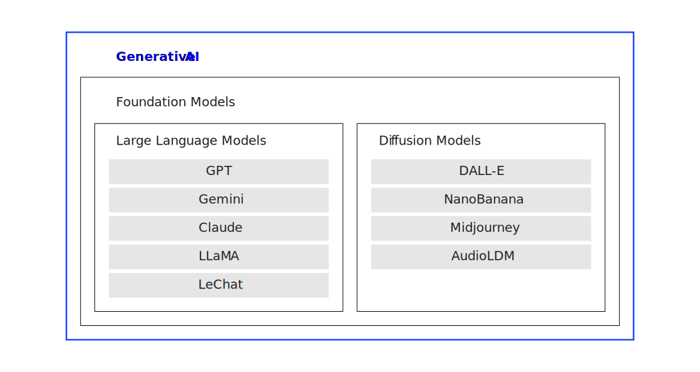

# Introduction {.headline-only}

## Discussion {.html-hidden .discussion-slide .unlisted}

::: medium
When you hear "Generative AI", what comes to mind?
:::

And what do you think it actually means for a machine to *create* something?

## From recognition to generation

:::large
Neural networks learn to *recognize* patterns. Generative AI learns to *create* them.
:::

:::fragment
The shift is fundamental [@goodfellow2016deep; @urbach2026genai]:
:::

:::incremental
- **Discriminative AI** asks:\
  *"What is this?"* (i.e., classifying, predicting, deciding)
- **Generative AI** asks:\
  *"What could this be?"* (i.e., creating text, images, audio, video)
- Instead of mapping inputs to labels, generative models learn the **underlying distribution** of data
- They can then **sample new instances** from that distribution (i.e., producing new content)
:::

:::notes
:::callout-note
#### Why generative AI is different

A digit classifier takes in pixel values and outputs one of ten class labels. Its "knowledge" is encoded as a decision boundary separating classes in high-dimensional space. It cannot produce a new digit, it can only evaluate ones it is given.

Generative AI systems learn something richer: a model of the data distribution itself. A generative model trained on handwritten digits does not just learn "this looks like a 3"; it learns what makes a 3 look like a 3 (i.e., the curves, the proportions, the variations) well enough to synthesize new, plausible examples from scratch.

This distinction has deep practical implications. Discriminative models are extraordinarily useful for classification and prediction tasks. But generative models unlock an entirely new class of capabilities: content creation, augmentation, simulation, and creative assistance. The explosion of tools like ChatGPT, DALL-E, and Midjourney is the direct result of scaling generative approaches using the [transformer architectures](../neural-networks/index.qmd#transformers).
:::
:::

## The generative AI landscape

:::medium
Generative AI has rapidly transitioned from a niche research domain to a significant driver of innovation across industries [@urbach2026genai].
:::

:::fragment
Two major families of **foundational models** dominate today:
:::

:::incremental
- **Large Language Models (LLMs):** generate coherent, contextually relevant *text*\
  Examples: GPT-4, Gemini, Claude, LLaMA
- **Diffusion Models:** generate high-quality *visual and audio content* from noise\
  Examples: DALL-E, Midjourney, Stable Diffusion, AudioLDM
:::

:::fragment
Beyond standalone models, **Agentic AI** combines these capabilities with planning, memory, and tool use and, thus, enable AI to *act*, not just generate.
:::

:::notes

{#fig-genai-landscape}

The diagram above captures the nested relationship between these concepts. All the systems discussed in this lecture sit within the broad category of "Generative AI." The two main architectural families — LLMs and diffusion models — are both instances of a broader category called **foundational models**.

**Foundational models** are large-scale models trained on massive multimodal datasets that generalize knowledge across diverse applications. They are designed not just to perform specific tasks, but to serve as versatile bases from which specialised applications can be derived. The term was introduced by researchers at Stanford to capture the idea that these models are *foundational* for other, more specialised systems, that are built on top of them.

This lecture follows the structure of the book chapter by @urbach2026genai and proceeds through three layers of increasing sophistication: first LLMs (pure language generation), then diffusion models (visual and audio generation), and finally agentic AI systems (goal-directed action).
:::

## The catalyst: ChatGPT

The introduction of ChatGPT by OpenAI in **November 2022** marked a turning point:

:::incremental
- Built on the GPT architecture (Generative Pre-trained [Transformer](../neural-networks/index.qmd#transformers))
- Its simple, user-friendly interface made **advanced AI accessible** to a mass audience
- Within **2 months** it attracted over **100 million users**, one of the fastest-growing applications in digital history [@reuters2023]
- Major tech companies (Microsoft, Google) immediately intensified their generative AI investments [@theverge2024]
:::

:::fragment
:::medium
ChatGPT is a catalyst, not the full picture.
:::
:::

:::notes
:::callout-note
#### Why ChatGPT succeeded where earlier models did not

GPT-2 and GPT-3 had already demonstrated remarkable language capabilities, yet neither achieved mainstream cultural impact. ChatGPT's breakthrough was not primarily technical, it was the **interaction design**. By wrapping a powerful LLM in a simple chat interface, OpenAI made it trivially easy for non-technical users to experience the model's capabilities directly.

Two factors drove adoption: (1) the interface required no technical knowledge and enabled diverse practical applications (e.g., writing assistance, coding help, tutoring); and (2) the underlying model had reached a threshold of quality where outputs were routinely impressive and useful, rather than merely interesting.

This combination of technical capability and accessible design is a recurring pattern in technology adoption. The lesson for AI management is that the path from capable technology to widespread impact often runs through thoughtful design and user experience, not just raw performance improvements.
:::
:::

# Large Language Models {.headline-only}

## What are LLMs?

:::medium
LLMs are neural networks trained on vast amounts of text, capable of generating coherent, contextually appropriate language [@vaswani2017attention; @brown2020language].
:::

:::fragment
[Key characteristics]{.h4}
:::

:::incremental
- Built on the **[Transformer](../neural-networks/index.qmd#transformers) architecture** with self-attention
- Trained via **next-token prediction** on internet-scale text corpora
- Process all tokens in a sequence **simultaneously** (unlike sequential RNNs)
- Represent words as **high-dimensional embedding vectors** capturing semantic meaning
- Scale dramatically: GPT-3 has 175 billion parameters; GPT-4 is estimated at over 1 trillion
:::

:::notes
Every LLM discussed here is, at its core, a transformer (i.e., the architecture built around attention mechanisms), token embeddings, feed-forward layers, and next-token prediction (see [neural networks unit](../neural-networks/index.qmd)).

Think of the transformer as the *engine*, and the LLM as the *vehicle*. In this picture, the LLM reflects the complete system that results from scaling and training the engine (i.e., the LLM) on enormous amounts of data, then fine-tuning it to be useful and safe.
:::

## How LLMs generate text

The generation process in an LLM follows a clear probabilistic pipeline [@sanderson2024gpt]:

:::incremental
1. **Tokenization:** input text is split into tokens; each token becomes a numerical ID
2. **Embedding:** token IDs are mapped to high-dimensional vectors capturing semantic meaning
3. **Transformer layers:** self-attention and feed-forward layers refine contextual representations
4. **Output projection:** final vector is mapped to scores over the entire vocabulary
5. **Softmax & sampling:** scores become probabilities; the next token is sampled
6. **Repeat:** the generated token is appended to the context and the process continues
:::

:::notes
:::callout-note
#### The probabilistic nature of LLM outputs

LLMs do not "know" the correct answer to a question. They assign probabilities to possible continuations and sample from that distribution. When you ask "What is the capital of France?" the model is not looking up a stored fact; it is computing a probability distribution over all tokens in its vocabulary, and the token "Paris" happens to receive very high probability because it appeared consistently after similar contexts during training.

This has important consequences:

- **Temperature controls creativity**: A low temperature (e.g., 0.2) concentrates probability mass on the most likely tokens, producing focused, predictable outputs. A high temperature (e.g., 1.0–1.5) spreads probability more evenly, producing more varied, creative (but less reliable) outputs.
- **Outputs are not deterministic**: Running the same query twice with the same temperature can yield different outputs.
- **Confidence is not visible**: The model can assign high probability to incorrect tokens. There is no built-in mechanism to flag uncertainty unless specifically trained to do so.

Understanding this probabilistic nature is essential for using LLMs responsibly and for understanding why hallucinations occur.
:::
:::

## Training phases

LLMs are not trained in a single step, they go through **three distinct phases** [@ouyang2022training]:

:::incremental
1. **Pretraining:** self-supervised learning on massive, unlabelled text corpora (internet archives, books, scientific articles); the model learns linguistic patterns, factual associations, and reasoning structures through next-token prediction
2. **Fine-tuning:** supervised learning on smaller, high-quality, labelled datasets; adapts the general model to specific tasks (summarisation, Q&A, coding) with more precise, contextually relevant outputs
3. **Reinforcement Learning from Human Feedback (RLHF):** human evaluators score model outputs; a reward model is trained on these scores; the LLM is then optimised to produce outputs humans prefer (i.e., aligning behaviour with expectations and ethical considerations)
:::

:::notes
:::callout-note
#### Why all three phases matter

**Pretraining** establishes the model's broad capability. It is extremely data-intensive and computationally expensive (GPT-3's pretraining was estimated at ~$4.6 million in compute costs). The model emerges from pretraining knowing a great deal about language and the world, but it is not yet useful as an assistant. It would complete prompts in bizarre ways, generate harmful content, and fail to follow instructions.

**Fine-tuning** makes the model task-appropriate. By training on carefully curated input-output pairs, the model learns to produce the type of response a user would find useful. However, this alone is insufficient for safety, as the model might still produce plausible-sounding but harmful outputs.

**RLHF** is where alignment happens. Human raters compare pairs of model outputs and indicate which is better. A reward model learns to predict human preferences and the LLM is updated using reinforcement learning to maximise predicted reward. This is what makes ChatGPT feel helpful, honest, and (usually) harmless. It is also one of the most active areas of AI safety research, as it requires careful design to avoid teaching models to "game" the reward signal.

The progression "BabyGPT" described by @bhatia2023 illustrates pretraining vividly: a model trained on Jane Austen begins producing gibberish, gradually forms recognisable words at 500 rounds, coherent fragments at 5,000 rounds, and grammatically correct sentences at 30,000 rounds.
:::
:::

## Discussion {.html-hidden .discussion-slide .unlisted}

:::large
Consider the tasks you do in a typical working day. **Where could an LLM genuinely help?** And where might it do more harm than good?
:::

## Application scenarios

LLMs are applied across a broad spectrum of domains [@gimpel2023; @gimpel2024]:

:::incremental
- **Content creation:** drafting emails, blog posts, reports, code, and creative writing
- **Text summarisation:** condensing lengthy documents into concise, actionable summaries
- **Knowledge dissemination:** explaining complex concepts accessibly for varied audiences
- **Research support:** structuring literature reviews, drafting paper sections, suggesting methodology
- **Customer service:** powering conversational agents that handle routine queries at scale
- **Code generation:** writing, explaining, and debugging software across programming languages
- **Translation:** converting documents between languages while preserving context and register
:::

:::notes
The breadth of LLM applications reflects a key property: unlike narrow AI tools (which solve one task), LLMs are **general-purpose text processors**. The same model that drafts a legal contract can explain a physics concept to a school student or translate a marketing brief into Japanese.

In higher education specifically, LLMs are becoming embedded in the learning process. Students use them as tutoring systems, writing assistants, and research partners. This shift raises important questions about the competencies education should develop: as LLMs handle routine writing and information retrieval, critical reflection, judgment, and responsible AI use become more central to what it means to be an educated person [@gimpel2024].

From a business perspective, the key strategic question is not "can we use LLMs?" but "which processes benefit most, and how do we manage the risks?" The answer depends heavily on the specific task, the tolerance for error, and whether human oversight is built into the workflow.
:::

## Limitations of LLMs

:::medium
Despite remarkable capabilities, LLMs have fundamental limitations that any responsible deployment must address [@riemer2023; @verma2023].
:::

:::incremental
- **Hallucination:** Generates plausible but factually incorrect information.
- **No genuine understanding:** Relies on statistical patterns rather than logic or reasoning.
- **Training data bias:** Reflects and amplifies prejudices found in its source material.
- **Legal & privacy risks:** Can leak sensitive data or infringe on intellectual property.
- **Static knowledge:** Limited by a "cutoff date" and cannot learn post-training.
- **Resource intensive:** Demands massive energy and expensive infrastructure.
:::

:::notes
:::callout-note
#### Hallucination

Hallucination is arguably the most consequential limitation for practical deployment. It arises from the model's core mechanism: generating high-probability continuations. If a prompt leads the model into a context where fabricated content is statistically plausible, the model will produce it confidently.

A famous example: ChatGPT produced a legal brief citing case law that did not exist. The lawyer who submitted it did not verify the citations. The cases were entirely fabricated. This illustrates the danger of treating LLM output as authoritative without independent verification.

Hallucination is not simply a "bug" that can be patched". It is a structural consequence of probabilistic text generation. Mitigation strategies exist (Retrieval-Augmented Generation, confidence calibration, human-in-the-loop verification), but none eliminates the risk entirely. Any organisation deploying LLMs in high-stakes contexts (law, medicine, finance, education) must build verification workflows into their processes.

The ethical and legal landscape is also evolving rapidly. The EU AI Act represents the first major legislative framework for AI governance, but global consensus on acceptable AI use remains elusive.
:::
:::

# Diffusion Models {.headline-only}

## A different generative paradigm

:::medium
While LLMs generate text token by token, diffusion models generate images, video, and audio through an **iterative denoising** process inspired by physics [@ho2020denoising; @urbach2026genai].
:::

:::fragment
The core intuition:
:::

:::incremental
- **Forward diffusion:** Take a real image and **gradually add Gaussian noise** over many timesteps until it becomes pure random noise
- **Reverse diffusion:** Train a neural network to **reverse this process** (to predict and remove the noise at each step)
- At generation time: **start from pure noise** and apply the learned denoising process to produce coherent, realistic content
:::

:::notes
:::callout-note
#### Why noise-to-image works

It may seem paradoxical that starting from random noise and iteratively removing it yields a coherent image. The key is in what the neural network learns during training.

The network (typically a U-Net architecture) is trained on enormous datasets of real images. For each training image, the forward diffusion process creates a series of increasingly noisy versions. The network learns to predict, at each noise level, which direction of denoising makes the result more "image-like" given the statistical patterns in training data.

Over hundreds of denoising steps, this process progressively imposes structure on the noise, guided by the network's learned understanding of what real images look like. The result is a new image that was not in the training set, but shares the statistical properties of real images.

Conditioning on text (as in text-to-image models) adds a further layer: the denoising network is also conditioned on a text embedding, so the denoising process is guided not just toward "something that looks like a real image" but toward "something that looks like a real image matching this description."

**Comparison to GANs**: Earlier generative image models, especially Generative Adversarial Networks (GANs), used a competitive dynamic between a generator and a discriminator. GANs could produce impressive results but were notoriously unstable to train and prone to "mode collapse" (producing limited variety). Diffusion models offer a more principled, likelihood-based training objective, producing more stable training and greater output diversity [@cao2023].
:::
:::

## Text-to-image generation

The most prominent application of diffusion models is generating images from text descriptions [@rombach2022]:

:::incremental
1. **Text embedding:** the text prompt is encoded into a high-dimensional semantic vector
2. **Noise-to-image:** a diffusion model starts from random noise and iteratively denoises it, conditioned on the text embedding
3. **Super-resolution:** the rough initial image (e.g., 64×64 pixels) is progressively upscaled through further diffusion passes to high resolution (e.g., 1024×1024)
:::

:::notes
:::columns
:::column
[Key models]{.h4}

- **DALL-E 3** (OpenAI)
- **Stable Diffusion** (Stability AI)
- **Midjourney**
:::

:::column
[Applications]{.h4}

- Graphic design and advertising
- Game asset generation
- Rapid visual prototyping
- E-commerce product visualisation
:::
:::

:::callout-note
#### Real-world impact on creative industries

Text-to-image diffusion models are already reshaping creative workflows. Companies like Edelman and BMW use AI-generated images for rapid prototyping of visual campaigns. Activision has integrated AI-generated assets into "Call of Duty" production pipelines. E-commerce platforms use Midjourney and DALL-E to generate product visuals tailored to seasonal trends at a fraction of traditional photography costs.

A survey of video game studios found that nearly 90% had experimented with generative AI in their development pipelines. The implications for creative labour markets are profound and contested: some see these tools as powerful amplifiers of human creativity; others are concerned about the displacement of commercial illustrators and designers.

The process in detail: the initial 64×64 image generated by the base diffusion model is passed through one or more **super-resolution diffusion models** —which also denoise, but conditioned on the low-resolution image— progressively refining detail until reaching the final output resolution. Throughout this pipeline, the original text embedding continues to guide denoising, ensuring that fine-grained detail remains faithful to the original description [@rombach2022].
:::
:::

## Beyond images: video and audio

Diffusion models extend naturally to other modalities:

:::incremental
- **Text-to-video** (Runway Gen-2, Imagen Video)\
  Temporal coherence between frames is learned from large video datasets; enables visualisation of storyboards, animation, and promotional content directly from text
- **Text-to-audio** (AudioLDM)\
  Musical pieces and soundscapes from descriptive prompts; learns from mood, instrumentation, and genre cues embedded in text; applications in entertainment scoring, advertising jingles, and rapid audio prototyping
:::

:::fragment
All three modalities share the same fundamental mechanism: **embedding the prompt** to **iterative denoising** to **structured output** [@singh2023; @liu2023].
:::

:::notes
**Text-to-video** technically extends text-to-image by adding a temporal dimension. Rather than generating a single frame, the model generates sequences of frames, learning temporal coherence and realistic motion from large-scale video datasets. Early models struggled with maintaining consistent subjects across frames; newer models (Sora, Runway Gen-3) have made dramatic progress.

**Text-to-audio** models like AudioLDM apply diffusion in the audio latent space (typically operating on mel-spectrograms rather than raw waveforms). The text embedding encodes genre, tempo, instrumentation, and mood, guiding the denoising toward musically coherent outputs. The speed of audio prototyping these tools enable is already reshaping workflows in game audio, advertising production, and independent music creation.

The cross-modal nature of these applications points toward a future of **unified multimodal generative models**, i.e., systems that can generate any combination of text, image, audio, and video from any combination of inputs.
:::

## Limitations of diffusion models

:::incremental
- **Limited controllability:** precise steering of outputs (exact positions, specific faces, fine typography) remains difficult; users often resort to trial and error for nuanced requirements [@peng2024]
- **Embedded bias:** models trained on internet imagery inevitably reflect and can amplify societal biases relating to gender, race, and culture ("data mirror effect") [@milne2023]
- **Copyright and IP concerns:** outputs may closely resemble training images; legal questions about ownership, attribution, and infringement are unresolved [@brittain2023]
- **Deepfakes and misinformation:** realistic images and videos can be used to fabricate convincing false narratives, threatening trust in media
- **Safety vs. freedom trade-offs:** content filters introduce new complexities; defining universally acceptable generation criteria is culturally contested
:::

:::notes
:::callout-note
#### The deepfake problem

Diffusion models have dramatically lowered the cost and skill required to create realistic synthetic media. While earlier deepfake techniques required large datasets of the target person and significant compute, modern diffusion-based methods can produce convincing fake images from a handful of reference photos.

This capability poses serious threats to political discourse (fabricated images of public figures), to individuals (non-consensual synthetic intimate imagery), and to epistemics in general (undermining confidence in photographic evidence). Responses include digital watermarking (embedding imperceptible signatures in AI-generated content), synthetic media detectors, and legislative frameworks (the EU AI Act, various national laws).

The broader challenge is that content restriction is fundamentally difficult. Safety filters can be circumvented by adversarial prompting; they can also over-restrict legitimate creative uses. There is no technically clean solution. The governance of generative media ultimately requires a combination of technical controls, legal frameworks, and social norms.
:::
:::

# Agentic AI {.headline-only}

:::html-hidden
:::medium
From generation to action
:::
:::

## Definition

:::medium
> Agentic AI is an emerging paradigm in AI that refers to **autonomous systems** designed to pursue complex goals with **minimal human intervention.** *@acharya2025agentic [p. 18912]*
:::

:::fragment
[Core characteristics]{.h4}
:::

:::incremental
- **Autonomy & goal complexity:** handles multiple complex goals simultaneously; operates independently over extended periods
- **Adaptability:** functions in dynamic and unpredictable environments; makes decisions with incomplete information
- **Independent decision-making:** learns from experience; reconceptualizes approaches based on new information
:::
 
:::notes
The shift to agentic AI is not merely incremental. @acharya2025agentic identify three technical foundations: *reinforcement learning* enables systems to refine strategies through trial and error; *goal-oriented architectures* manage complex, multi-step objectives; and *adaptive control mechanisms* allow recalibration in response to environmental changes. Together, these enable systems that can pursue extended task sequences with minimal human intervention.

@berente2021managing (MIS Quarterly, 2021) provide a complementary management perspective, arguing that AI systems create three interdependent management challenges: **autonomy** (the system acts with progressively less human guidance), **learning** (the system's behaviour changes over time through experience), and **inscrutability** (the system's internal reasoning is opaque to observers). Managing these three dimensions simultaneously — rather than treating each in isolation — is the central challenge of deploying agentic AI in organisations.
:::

## Agentic AI vs. Traditional AI

| Feature                 | Traditional AI               | Agentic AI                        |
|-------------------------|------------------------------|-----------------------------------|
| Primary purpose         | Task-specific automation     | Goal-oriented autonomy            |
| Human intervention      | High (predefined parameters) | Low (autonomous adaptability)     |
| Adaptability            | Limited                      | High                              |
| Environment interaction | Static or limited context    | Dynamic and context-aware         |
| Learning type           | Primarily supervised         | Reinforcement and self-supervised |
| Decision-making         | Data-driven, static rules    | Autonomous, contextual reasoning  |

: Comparison of traditional AI and agentic AI based on @acharya2025agentic

## Building blocks

Four key components transform LLMs into agents [@urbach2026genai]:

:::incremental
1. **Reasoning-augmented LLMs:** chain-of-thought prompting and multi-path reasoning enable systematic, verifiable problem-solving rather than surface-level pattern matching
2. **Retrieval-Augmented Generation (RAG):** integrates real-time access to external knowledge bases, addressing the static knowledge limitation of standard LLMs
3. **Conversational agents:** maintain context over extended dialogues; bridge human intent and machine execution; manage conversation history within token limits
4. **Multi-agent systems (MAS):** multiple specialised agents collaborate and delegate tasks, enabling scalable, modular architectures for complex domains
:::

:::notes

Each building block addresses a specific limitation of standalone LLMs:

- **Reasoning augmentation** addresses the surface-level reasoning problem: standard LLMs can produce confident-sounding wrong answers. By explicitly generating and checking intermediate reasoning steps (chain-of-thought), the model's logical process becomes visible and verifiable.
- **RAG** addresses the knowledge cut-off problem: rather than relying solely on what was encoded during training, the model retrieves relevant documents at query time. A medical RAG system might retrieve the latest clinical guidelines before generating a recommendation.
- **Conversational agents** address the single-turn limitation: by maintaining structured dialogue history, agents can support extended, coherent interactions where context from earlier in the conversation shapes later responses.
- **MAS** addresses the single-agent capability ceiling: no single agent can be expert in everything. By coordinating specialised agents (e.g., a planning agent, an execution agent, a validation agent, a writing agent) multi-agent systems achieve greater accuracy, efficiency, and robustness than any individual agent could.

- :::

## Workflow patterns in agentic systems

@agenticAI2024 discusses five key patterns for designing agentic AI workflows:

:::incremental
1. **Prompt chaining:** output of one step becomes input to the next; creates complex multi-step reasoning flows
2. **Routing:** directs tasks to specialised components based on type; improves efficiency through targeted processing
3. **Parallelisation:** processes independent subtasks simultaneously; increases throughput
4. **Orchestrator-workers:** central orchestrator delegates to specialised worker agents; manages coordination and integration
5. **Evaluator-optimizer:** separate components generate, evaluate, and refine; enables iterative quality improvement
:::

## Retrieval-Augmented Generation (RAG)

:::medium
RAG combines the generative power of LLMs with dynamic access to external, up-to-date knowledge [@lewis2020].
:::

:::fragment
The mechanism:
:::

:::incremental
1. **Retrieval:** a retrieval module searches an external knowledge base (databases, documents, web APIs) for passages relevant to the query
2. **Augmentation:** retrieved passages are injected into the context alongside the original query
3. **Generation:** the LLM generates a response grounded in the retrieved evidence, not just its training data
:::

:::fragment
**Key advantages:** factual accuracy, updatability without retraining, and interpretability (users can inspect which sources were used)
:::

:::notes
:::callout-note
#### Why RAG is strategically important

For enterprise deployment, RAG resolves the two most critical practical limitations of standalone LLMs: knowledge staleness and hallucination.

A hospital deploying a clinical decision support system cannot use a model whose knowledge was frozen at a training date, medical guidelines update continuously. RAG allows the model to retrieve current clinical literature at query time, ensuring responses reflect current evidence. When a clinician asks "what is the current recommended first-line treatment for X?", the system retrieves relevant recent guidelines rather than relying on possibly outdated training knowledge.

Hallucination risk also decreases substantially with RAG, because the model is conditioned on externally retrieved, verifiable content. The generation is grounded, which means that there is a retrievable source that can be shown to the user, enabling verification.

The adaptability advantage is equally important operationally: updating a RAG system's knowledge requires only updating the external knowledge base, not retraining the (extremely expensive) generative model. This makes RAG-based systems practical to maintain and keep current at a fraction of the cost of full model retraining.
:::
:::

## Multi-agent systems

:::medium
Multi-agent systems (MAS) represent the frontier of agentic AI: multiple specialised agents collaborating to solve problems beyond any single agent's capabilities [@vanderhoek2008; @doran1997].
:::

:::{.columns .fragment}
:::column
**Architecture**:

:::incremental
- A **manager agent** orchestrates the overall workflow
- **Specialist agents** handle specific subtasks (analysis, reasoning, writing, validation)
- Agents share a **common knowledge base** and communicate through structured protocols
:::
  
:::
:::column
**Benefits**:

:::incremental
- **Division of labour:** tasks broken into components matched to agent strengths
- **Scalability:** add specialised agents without redesigning the whole system
- **Robustness:** multiple agents can check each other's outputs
:::

:::
:::

:::notes
The analogy to human organisations is apt and intentional. Effective human teams work because different members bring different expertise; a project manager coordinates their contributions; clear communication protocols prevent misunderstandings. MAS architectures mirror this: a manager agent with planning capabilities directs a research agent, a coding agent, a reviewing agent, and a writing agent. Each contributing specialised skills to a shared objective.

The coordination challenges are also analogous. Ensuring that agents understand each other's capabilities, align their individual decisions with overarching objectives, and resolve conflicts when they produce contradictory outputs requires sophisticated orchestration. This is an active area of research, and production-grade MAS deployments remain technically demanding.

Nevertheless, MAS are already used in production: in software development (agents that plan, write, test, and review code), in financial analysis (agents that gather data, model scenarios, and write reports), and in customer service (agents that route, retrieve information, and compose responses across a support workflow).
:::

## The road ahead

:::incremental
- **Agentic AI is not a distant future;** systems like AutoGPT, Microsoft Copilot, and Anthropic's Claude already exhibit agentic behaviour in production deployments [@plaat2025]
- **Governance challenges grow** with agency: autonomous systems that take actions in the world require more robust oversight than text-generation systems
- **Human-AI collaboration models** are evolving rapidly: from AI as assistant, to AI as collaborator, toward AI as (supervised) autonomous actor
- **Responsibility questions intensify:** when an agentic system makes a consequential mistake, who is accountable (e.g., the user, the deploying organisation, or the model developer)?
:::

:::aside
[@wang2024; @urbach2026genai]
:::

:::notes
The progression from generative AI to agentic AI represents a qualitative shift in what AI systems do. A text-generation system is a tool: a human poses a question, the system generates a response, a human decides what to do with it. An agentic system is closer to an autonomous process: it receives a goal, plans a sequence of actions, executes those actions (potentially interacting with external systems, databases, or other agents), monitors its own progress, and adapts its approach.

This shift has significant implications for AI governance and risk management. The EU AI Act, which came into force in 2024, addresses AI systems partly by their risk level. Autonomous systems operating in high-stakes domains (healthcare, critical infrastructure, law enforcement) face the highest regulatory burden. As agentic systems proliferate, organisations deploying them will need robust human oversight mechanisms: checkpoints where humans review and approve agent decisions before consequential actions are taken.

The technical challenges are also substantial: ensuring that goals are correctly specified (the alignment problem), that agents do not take unintended shortcuts (specification gaming), and that multi-agent systems do not exhibit emergent behaviours that no individual designer intended.
:::

# Exercises {.headline-only}

## GenAI landscape mapping

You are advising a media company that produces news articles, photographs, video segments, and podcast episodes.

1. **Map the technologies**: For each content type, identify which generative AI technology (LLM, diffusion model, or a combination) would be most relevant and explain why.
2. **Identify risks**: For each application, identify the most significant risk that would need to be managed (e.g., hallucination, bias, copyright, deepfake potential).
3. **Prioritise**: If the company can only pilot one generative AI application in the first year, which would you recommend and why?

:::html-hidden
:::notes
:::{.callout-tip collapse="true"}
#### Solution notes

**Technology mapping**

- **News articles (text):** LLMs are the natural fit: drafting, summarising wire reports, translating. Risk: hallucination — factual errors in published news. A RAG-based system grounded in verified news agency feeds would substantially reduce this risk.
- **Photographs (images):** Diffusion models (DALL-E, Stable Diffusion) can generate illustrations or supplement stock imagery. Risk: copyright ambiguity (training data provenance), bias in representation, and deepfake potential if photo-realistic people are generated.
- **Video segments:** Text-to-video models (Runway, Sora). Risk: deepfake potential is highest here; realistic synthetic video could be mistaken for documentary footage. Robust labelling and watermarking are essential.
- **Podcast episodes (audio):** Text-to-audio/speech synthesis (AudioLDM, ElevenLabs voice cloning). Risk: voice cloning could enable fraud or impersonation; consent and disclosure requirements are both ethical and increasingly legal obligations.

**Recommendation rationale**

A reasonable first-year pilot is LLM-assisted article drafting with RAG. It has the clearest productivity ROI (journalists save time on first drafts), the risk is manageable with human editorial review, and the legal landscape around text generation is more settled than around synthetic imagery or audio. The pilot also builds organisational competence in prompt engineering, output review workflows, and quality standards — a foundation for expanding to other modalities in subsequent years.
:::
:::
:::

## Training phase analysis

A startup has built a general-purpose LLM through pretraining on a large web corpus. They now want to deploy it as a legal document assistant for law firms.

1. **Fine-tuning**: What kind of training data would you recommend for fine-tuning, and why?
2. **RLHF**: Who would you recruit as human raters, and what specific quality criteria would you have them evaluate?
3. **Trade-offs**: Fine-tuning makes the model more specialised, but it risks "catastrophic forgetting" of general knowledge. How would you design the training process to mitigate this?
4. **Evaluation**: Before deploying to law firms, what evaluation would you run to assess the model's readiness?

:::html-hidden
:::notes
:::{.callout-tip collapse="true"}
#### Solution notes

**Fine-tuning data**

- Legal briefs, contracts, court opinions, regulatory filings with high-quality, verified content (e.g., from LexisNexis or Westlaw databases)
- Include diverse jurisdictions (if multi-jurisdiction deployment is planned) and legal domains (contract law, IP, labour law, etc.)
- Include human-annotated "ideal" responses to common legal drafting tasks for supervised fine-tuning
- Crucially: ensure data is properly licensed, e.g., by using copyrighted legal databases without authorisation creates legal risk

**RLHF rater profile**

- Practising lawyers or senior paralegals with relevant domain expertise
- Mix of jurisdictions if multi-jurisdiction deployment is intended
- Quality criteria: legal accuracy (most important), citation correctness, appropriate hedging (legal advice must acknowledge uncertainty), clarity and professional tone, absence of fabricated citations or case law

**Catastrophic forgetting mitigation**

- Use **mixed fine-tuning datasets**: combine legal-domain data with a small proportion of general-domain data to preserve general capabilities
- **Parameter-efficient fine-tuning (PEFT)** methods such as LoRA (Low-Rank Adaptation) update only a small subset of parameters, preserving most of the pretrained knowledge
- Monitor performance on a general benchmark (e.g., MMLU) throughout fine-tuning to detect degradation early

**Pre-deployment evaluation**

- **Domain accuracy**: Test on a held-out set of verified legal questions with known correct answers; have lawyers rate outputs on accuracy
- **Hallucination rate**: Include questions where the correct answer is "I don't know" or where verifiable citations are required — assess how often the model fabricates case law or statutes
- **Adversarial testing**: Red-team the model to see if it can be prompted to give dangerous advice (e.g., advising a client to take an action that would be legally disastrous)
- **Bias audit**: Check whether outputs differ systematically across client characteristics (e.g., does advice quality vary by the perceived socioeconomic status implied in the prompt?)

:::
:::
:::

## Diffusion model design

A pharmaceutical company wants to use generative AI to visualise molecular structures and simulate how proposed drug compounds might interact with target proteins. They are considering adapting diffusion models for this scientific domain.

1. **Analogy**: The text-to-image pipeline uses (i) text embedding, (ii) denoising conditioned on the embedding, (iii) super-resolution. Design an analogous pipeline for text-to-molecule generation.
2. **Training data**: What would a training dataset look like, and where might it come from?
3. **Evaluation challenge**: Unlike image generation (where human aesthetic judgement provides a useful signal), how would you evaluate whether a generated molecule is "good"?
4. **Limitations**: What specific limitations of diffusion models become especially problematic in this scientific context?

:::html-hidden
:::notes
:::{.callout-tip collapse="true"}
#### Solution notes

**Text-to-molecule pipeline (analogous design)**

- Step 1 **Molecular description embedding**: Convert a textual description of desired properties ("small molecule with high binding affinity for EGFR, low molecular weight, water soluble") into a semantic embedding vector using a chemistry-aware LLM (e.g., ChemBERTa)
- Step 2 **Structure denoising**: Start from a random molecular graph (atoms as nodes, bonds as edges) and iteratively denoise it using a graph diffusion model conditioned on the embedding, guided toward chemically valid structures with the desired properties
- Step 3 **Energy minimisation/refinement**: Pass the generated structure through a physics-based energy minimisation module to correct bond lengths, angles, and stereochemistry — analogous to super-resolution but in chemical property space

**Training data**

- Public databases: PubChem (~116 million compounds), ChEMBL (bioactivity data), PDB (Protein Data Bank for protein-ligand interactions)
- Company's proprietary assay data (binding affinities, toxicity screens)
- Each entry: molecular structure + associated property measurements (binding affinity, solubility, toxicity) used to condition generation

**Evaluation approaches**

- **Chemical validity**: What percentage of generated molecules are syntactically valid (no broken valences, etc.)?
- **Predicted bioactivity**: Use established computational docking tools (AutoDock Vina, Schrödinger) to estimate binding affinity of generated molecules to the target protein
- **Synthesisability**: Score how feasible the molecule would be to actually synthesise in the lab (using tools like SAScore or RetroSynthesis AI)
- **Diversity**: Assess whether generated candidates explore different regions of chemical space or cluster around known compounds
- **Experimental validation**: Ultimately, synthesise and test a subset of top-ranked generated molecules — this is the ground truth

**Critical limitations in this context**

- **Controllability**: The difficulty of precisely steering diffusion outputs is far more consequential here than in image generation; a pharmaceutical error (generating a toxic compound misidentified as safe) has life-or-death implications
- **Out-of-distribution extrapolation**: Diffusion models generate compounds similar to those in training data; truly novel scaffolds outside the training distribution may be unreachable or generated incorrectly
- **No physical grounding**: Diffusion models learn statistical patterns, not physical laws; generated structures may violate thermodynamic or quantum-chemical constraints in subtle ways that are hard to detect without expensive wet-lab validation
- **Dataset bias**: Chemical databases over-represent certain drug classes (small molecules, carbon-based compounds); biased training data produces biased generation

:::
:::
:::

## RAG system design

Your university wants to deploy a student support chatbot that can answer questions about study regulations, course requirements, examination procedures, and administrative processes. The university updates its regulations each semester.

1. **Architecture**: Sketch a RAG architecture for this system. What are the components, and what documents belong in the knowledge base?
2. **Retrieval quality**: A student asks: "Can I take my bachelor's thesis exam if I still have one failed elective from last semester?" Describe the retrieval steps and explain what could go wrong.
3. **Knowledge base maintenance**: How would you ensure the knowledge base stays up to date as regulations change each semester?
4. **Failure modes**: Identify three ways this system could fail in ways that harm students, and propose mitigations for each.

:::html-hidden
:::notes
:::{.callout-tip collapse="true"}
#### Solution notes

**RAG architecture components**

- *Knowledge base*: Study and examination regulations (Prüfungsordnung), module handbooks, administrative process guides, FAQ documents, course catalogues — all updated each semester. Documents stored in a vector database (e.g., Pinecone, Weaviate, ChromaDB) as chunked, embedded passages.
- *Retrieval module*: A dense retrieval system (e.g., bi-encoder with a fine-tuned sentence embedding model) that takes the student's query, embeds it, and retrieves the top-k most relevant document chunks by cosine similarity.
- *Re-ranking*: An optional cross-encoder re-ranker that scores query-passage pairs more precisely to improve retrieval precision for the top results.
- *LLM (generator)*: A fine-tuned or prompted LLM that receives the retrieved passages as context and generates a clear, accurate answer with references to specific document sections.
- *Source attribution*: The response should cite the specific regulation document and section, enabling students to verify independently.

**Retrieval for the complex exam question**

- The query involves multiple conditions: (a) bachelor's thesis exam eligibility, (b) failed elective module, (c) interaction between the two.
- Good retrieval should return: thesis examination admission requirements AND elective failure / retake regulations.
- What could go wrong: (1) retrieval returns only the thesis admission requirements without the elective rules — the model generates a partial or incorrect answer; (2) regulations have been updated this semester but the knowledge base has not been refreshed — the model gives outdated advice; (3) the relevant rule is buried inside a long document chunk that gets cut off — the model misses the nuance.

**Knowledge base maintenance**

- Implement a **versioned document pipeline**: when new semester regulations are published (PDF/Word), an automated ingestion process re-chunks, re-embeds, and replaces the old versions in the vector database.
- Tag all documents with their effective semester date; at query time, the retrieval is filtered to the current semester's documents.
- Maintain a **change log**: human administrators review and approve new regulation documents before ingestion to catch formatting errors or unexpected changes.

**Failure modes and mitigations**

1. *Hallucinated regulation details*: The model fabricates a regulation that does not exist. Mitigation: require that every factual claim in the response is directly supported by a retrieved passage; display the source passage alongside the answer.
2. *Stale knowledge*: A student receives advice based on last semester's regulations, which have since changed. Mitigation: semester-versioned document tagging + automated ingestion pipeline + a prominent "effective from" label on all responses.
3. *Out-of-scope confidence*: A student asks about a very specific edge case not covered in any regulation; the model invents an answer rather than saying "I don't know". Mitigation: train or prompt the model to abstain when retrieval similarity is below a threshold, and escalate to a human advisor.

:::
:::
:::

## Agentic AI evaluation

Consider the following agentic AI scenario: a university deploys an AI research assistant agent that, given a research question, autonomously searches academic databases, reads and synthesises relevant papers, identifies gaps in the literature, and produces a structured literature review draft.

1. **Agent architecture**: Identify which building blocks from the lecture (reasoning-augmented LLM, RAG, conversational agent, MAS) are present in this system, and describe the role of each.
2. **Goal specification**: How would you specify the agent's goal precisely enough that it produces useful output without over- or under-shooting? What could go wrong with vague goal specification?
3. **Human oversight**: At which points in the agent's workflow should a human researcher be consulted or able to intervene? Design a human-in-the-loop workflow.
4. **Ethical considerations**: Identify two ethical issues this deployment raises for academic integrity, and discuss how they might be addressed.

:::html-hidden
:::notes
:::{.callout-tip collapse="true"}
#### Solution notes

**Building blocks present**

- *RAG*: Central to the system — the agent retrieves papers from academic databases (Semantic Scholar, PubMed, arXiv) at query time rather than relying on the LLM's training data. Without RAG, the agent would produce a review based on papers it was trained on, missing recent work and potentially hallucinating citations.
- *Reasoning-augmented LLM*: The agent must synthesise across multiple papers, identify thematic patterns, assess methodological quality, and reason about gaps — tasks requiring multi-step inference beyond surface-level pattern matching. Chain-of-thought prompting or structured reasoning prompts would be essential.
- *Conversational agent*: The researcher may need to refine the scope mid-task ("focus more on intervention studies and less on observational work"); the agent maintains context of the evolving research question and earlier retrieved papers.
- *MAS (optional but valuable)*: A well-designed system might decompose the task: a planning agent defines the search strategy; a retrieval agent queries databases; a reading agent processes and summarises each paper; a synthesis agent integrates findings; a writing agent produces the draft. Each specialises, improving quality.

**Goal specification**

Vague goal: "Do a literature review on AI in education." Problems: unclear scope, depth, methodology focus, time range, target audience, output format.

Precise specification should include: research question, date range, databases to search, inclusion/exclusion criteria (study type, language, methodology), desired output format (introduction, thematic sections, gap analysis, reference list), intended audience (conference paper, PhD thesis, industry report), and approximate length target.

What goes wrong with vague goals: agent retrieves too broadly (50,000 papers) or too narrowly (misses a relevant sub-field); synthesises at the wrong depth; produces a general overview when a methodological critique was needed.

**Human-in-the-loop design**

Key checkpoints:
1. *After query formulation*: Human reviews and approves the search queries and inclusion criteria before any retrieval happens.
2. *After initial retrieval*: Human reviews the list of retrieved papers (titles + abstracts); can remove irrelevant results and flag missed important works.
3. *After synthesis outline*: Human reviews the thematic structure the agent has identified before writing begins — ensuring the framing matches the researcher's intent.
4. *After draft*: Human reviews the complete draft for accuracy, tone, and completeness; all citations must be verified against source documents.

**Ethical considerations**

1. *Academic integrity and authorship*: If an agent writes a literature review that appears in a PhD thesis or paper without disclosure, this raises questions of authorship and academic honesty. Mitigation: institutions should develop and enforce clear AI disclosure policies; journals and thesis committees should require explicit statements about AI tool use.
2. *Citation fabrication*: Even with RAG, the agent's writing layer may introduce subtle misrepresentations of source papers or generate plausible-looking but incorrect citations. Mitigation: every citation in the agent's output must be verifiable against a retrieved source passage; the system should flag any generated reference for which no retrieved source exists; human reviewer must check a sample of all citations.

:::
:::
:::

# Literature
::: {#refs}
:::
