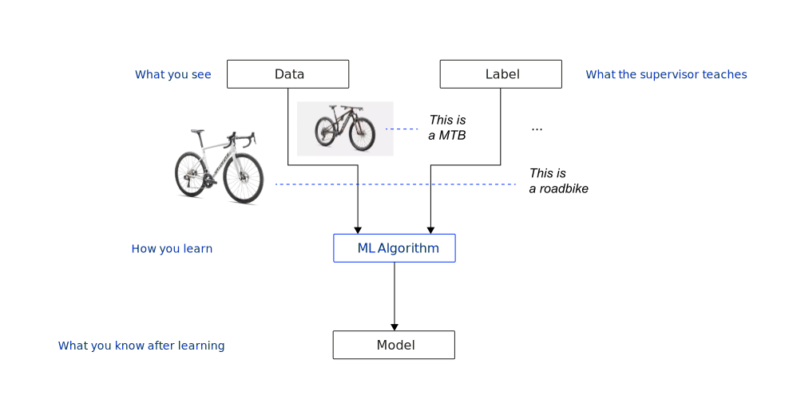
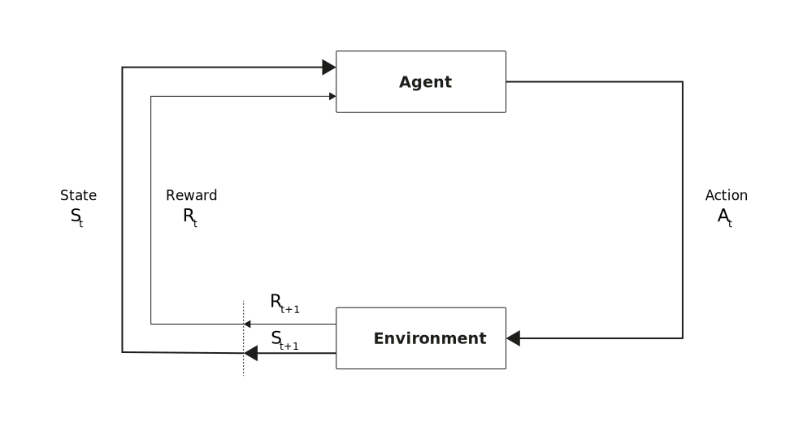
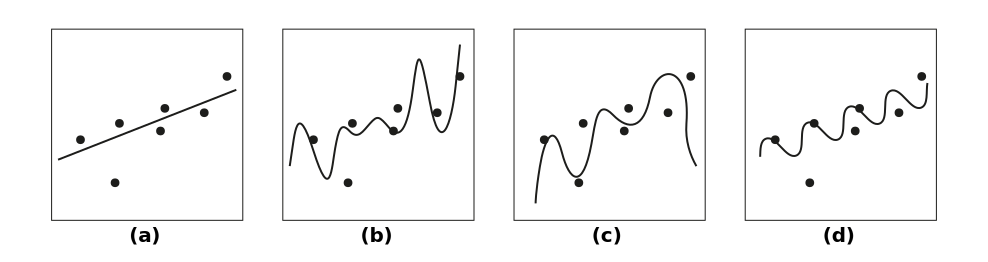

# Agenda

:::medium
- What is ML? [15 min]{.smaller}
- Three learning paradigms [25 min]{.smaller}
- The learning process & what can go wrong [25 min]{.smaller}
- Ockham's razor & wrap-up [15 min]{.smaller}
:::

# What is ML? {.headline-only}

## Mitchell's definition

:::medium
> A computer is said to learn from experience E with respect to some task T and some performance measure P, if its performance on T, as measured by P, improves with experience E. *@mitchel1997machine [p. 2]*
:::

:::incremental
- **Traditional programming:** humans encode rules; the computer follows them
- **Machine learning:** the computer discovers rules from data (the "experience")
- **T** and **E** are usually tractable to define; **P** is the hardest to get right
- **Goodhart's Law:** once a measure becomes the explicit optimization target, it loses value as a proxy for what we actually care about
:::

:::notes
Prompt the class: "Why is P the hardest to get right?" to surface Goodhart's Law before moving on.

Examples for Goodhart’s Law in ML: A recommendation system optimized solely for clicks might discover that clickbait titles and thumbnails maximize this metric, even if the content quality suffers and user satisfaction decreases long-term. If a content filter is optimized only to minimize false negatives (letting harmful content through), it might become overly restrictive and block large amounts of legitimate content.

:::

## Learning agent architecture

::::columns
:::{.column width="55%"}
![A learning agent based on @RusselNorvig2022AIMA [p. 74]](images/learning-agent.svg){#fig-learning-agent}
:::
:::{.column width="45%"}
:::incremental
- **Performance element:** processes percepts and selects actions
- **Learning element:** carries out improvements using feedback from the critic
- **Critic:** evaluates behavior against an external performance standard
- **Problem generator:** suggests explorative actions that lead to new experience
:::
:::
::::

:::notes
The critic provides the signal that drives improvement; the learning element acts on it to update the performance element; the problem generator ensures the agent explores rather than only exploiting what it already knows. This is the formal structure behind T/E/P: T is what the performance element does, E comes from the problem generator and environment, P is what the critic measures.
:::

## Map the Scenario {.discussion-slide}

Consider: *Me learning to play tennis.*

[Tasks]{.h4}

1. What is the **task T,** the **experience E,** and the **performance measure P?**
2. Who or what acts as the **critic** and the **problem generator?**
3. What type of feedback is available: supervised, unsupervised, or reinforcement?



:::notes
**T:** returning the ball to the opponent's court; winning points.\
**E:** practice sessions, matches, coach feedback.\
**P:** percentage of points or matches won.

**Critic:** the outcome of each point (won or lost), or a coach giving technique feedback.\
**Problem generator:** the coach suggesting new drills, or the player trying new shots in practice.

**Paradigm:** primarily reinforcement learning (the reward is points won; feedback is delayed). Supervised elements appear when a coach demonstrates correct technique and provides corrective feedback. This ambiguity is the teaching point.

Debrief: collect 2–3 answers; highlight that the paradigm boundary is blurry here, previewing Block 2. (5 min pair work, 5 min debrief.)
:::

# Three learning paradigms {.headline-only}

## Three paradigms visualized

:::large
Supervised  
Unsupervised   
& Reinforcement
:::

What type of **feedback** does the agent receive?

-------

{#fig-sl-training}

:::notes
Supervised: A teacher provides the correct answer for each input.
:::

-------

{#fig-usl-training}

:::notes
Unsupervised: The agent sees data but no labels and must find structure.
:::


-------

{#fig-rl-training}

:::notes
Reinforcement: the agent acts, the environment returns a reward or penalty (no correct answer per input, only a signal for the cumulative outcome). (3–4 min.)
:::


## Learning paradigm comparison

|       | **Supervised**                   | **Unsupervised**                 | **Reinforcement**        |
|-------|--------------------------------|----------------------------------|--------------------------|
| **Feedback** | Correct answer per instance      | None (structure only)            | Reward/punishment signal |
| **Goal** | Learn input, map output          | Discover hidden patterns         | Learn optimal policy     |
| **Examples** | Classification, regression       | Clustering, dimension reduction | Game play, robotics      |

: Three learning paradigms compared {#tbl-paradigms}

:::fragment
The boundaries are not rigid:\
Semi-supervised and self-supervised learning blend elements of multiple paradigms.
:::

:::incremental
- **Semi-supervised learning** uses a small amount of labeled data together with a large amount of unlabeled data
- **Self-supervised learning** creates its own supervision signal from unlabeled data by defining a "pretext task" derived from the data's structure (e.g., masked language modelling; next-token prediction)
:::

:::notes
This table is the anchor students return to during Exercise B. Stress that the distinguishing criterion is the feedback type, not the application domain. That is exactly what the next exercise will test. (3–4 min including discussion of the fragment.)
:::

## Classify & Justify {.discussion-slide}

For each scenario, decide: **supervised, unsupervised, or reinforcement learning?**\
For each, specify **T**, **E**, and **P**.

:::smaller
1. A streaming service groups its catalog into clusters of similar movies to improve its recommendation interface.
2. A bank builds a model to predict whether a loan applicant will default, trained on 10 years of labeled application outcomes.
3. A warehouse robot learns to pick and place objects by trying different grasping strategies and receiving a success/failure signal.
4. An email provider trains a filter using a dataset of messages manually labeled "spam" or "not spam."
5. A retailer analyzes purchase histories to discover which products are frequently bought together.
6. A self-driving car's lane-keeping system is trained on thousands of hours of human driving footage with the correct steering angle recorded for each frame.
:::



:::notes
**1. Unsupervised.** T: group movies by similarity. E: movie metadata or viewing patterns (no labels). P: cluster cohesion/separation.

**2. Supervised.** T: predict default (yes/no). E: labeled historical applications. P: accuracy, AUC, F1.

**3. Reinforcement.** T: pick and place objects. E: trial-and-error grasping attempts. P: success rate over episodes.

**4. Supervised.** T: classify email as spam or not spam. E: labeled email corpus. P: precision, recall, F1.

**5. Unsupervised** (association rule mining). T: discover product co-occurrence patterns. E: transaction records (no labels). P: support, confidence, lift of discovered rules.

**6. Supervised** (the deliberately tricky one). T: predict steering angle from a camera image. E: labeled image-angle pairs from human driving. P: mean squared error of predicted vs. actual angle. It looks like reinforcement learning because the domain is autonomous driving, but the feedback is a correct label per frame. That makes it supervised (imitation learning).

Debrief: spend most time on scenario 6. The key insight is that the feedback type determines the paradigm, not the application domain. (12 min pair work, 5 min debrief.)
:::

# Learning {.headline-only}

## The learning process

```{mermaid}
flowchart LR
    TD[(Training Data)] --> T[Training]
    T --> M[Model]
    VD[(Validation Data)] --> V[Validation]
    M --> V
    V --> |"Hyperparameter Tuning"| T
    V --> |"Model Selection"| SM[Selected Model]
    TestD[(Test Data)] --> TE[Testing]
    SM --> TE
    TE --> |"Performance Estimation"| FM[Final Model]
    ND[(New Data)] --> AP[Application]
    FM --> AP
    AP --> PR[Predictions]
    
    style TD fill:#f9f9f9,stroke:#333,stroke-width:1px
    style VD fill:#f9f9f9,stroke:#333,stroke-width:1px
    style TestD fill:#f9f9f9,stroke:#333,stroke-width:1px
    style ND fill:#f9f9f9,stroke:#333,stroke-width:1px
    style M fill:#c0f0c0,stroke:#333,stroke-width:1px
    style SM fill:#c0f0c0,stroke:#333,stroke-width:1px
    style FM fill:#c0f0c0,stroke:#333,stroke-width:1px
    style PR fill:#ffe0c0,stroke:#333,stroke-width:1px
```

**Three separate datasets** 

- Training = dataset to learn a general model
- Validation =  dataset for selection and tuning
- Test = dataset to detect problems in a controlled environment

:::notes
Students often confuse validation and test. Stress that the test set is touched exactly once, at the very end. 

The validation set is used iteratively (hyperparameter search, model selection), so it cannot serve as a clean estimate of generalization. 
If you tune on the test set, you are no longer estimating real-world performance; you are fitting to it. (3–4 min.)
:::

## Bias-variance tradeoff

{#fig-bias-variance}

:::incremental
- **Underfitting (high bias, low variance):** the model is too simple to capture the underlying pattern
- **Good fit (balanced):** complexity matches the data; the model generalizes
- **Overfitting (low bias, high variance):** the model memorizes training noise and fails on new data
:::

:::notes
Walk through the three curves. Ask: "Which model would you trust for a new data point?" The high-degree polynomial passes through every training point but wiggles badly between them; it has memorized noise rather than learned the pattern. This sets up Exercise C. (3–4 min.)
:::

## What Went Wrong? {.discussion-slide}

For each case, **diagnose the problem** (name it) and **propose a fix.**

**Case 1:** A sentiment classifier trained on electronics reviews achieves 99.2% training accuracy. After deployment to restaurant and hotel reviews, accuracy drops to 61%.

**Case 2:** A student fits a degree-15 polynomial to 20 data points. The curve passes through every training point (training error ≈ 0). With 10 new measurements, predictions are wildly off.

**Case 3:** A hospital trains a readmission model. Training accuracy: 58%. Validation accuracy: 57%. Adding more training data does not improve performance.



:::notes
Allow 12 min for pair work, 6 min for debrief. Circulate during pair work; check that students use the terms "overfitting," "underfitting," and "distribution shift" rather than vague descriptions. Connect each case back to the bias-variance slide during debrief.

**Case 1: Distribution shift.** The training distribution (electronics reviews) does not represent the deployment distribution (restaurants, hotels). Fix: collect training data across all relevant domains, or apply domain adaptation techniques. Also illustrates why the test set must mirror the deployment distribution.

**Case 2: Overfitting** (high variance). The model memorized noise in the training data. Fix: reduce model complexity (lower polynomial degree), apply regularization, or collect more data. Connect to the polynomial fitting figure.

**Case 3: Underfitting** (high bias). The model is too simple, or the features are insufficient to capture the underlying pattern. Fix: use a more expressive model, or engineer better features. Signature clue: more data does not help when the problem is bias, not variance.
:::

# Ockham's razor & wrap-up {.headline-only}

## Ockham's Razor {.discussion-slide}

In your own words, explain what Ockham's razor is. Find an example from everyday life or from ML that you can use to enrich your explanation.



:::notes
Brief pair work (4 min), then collect 2–3 examples from the class. Good everyday examples: choosing the simpler medical diagnosis before ordering exotic tests; preferring a linear trend line over a wiggly one when both fit equally well. This consolidates the bias-variance insight from Block 3 and gives it a historical name: entities should not be multiplied beyond necessity.
:::

## Key takeaways

[What is ML?]{.h4 .fragment}

:::incremental
- ML is improvement through experience; define T, E, and P carefully, especially P
- Goodhart's Law: once a metric becomes the optimization target, it loses value as a proxy for the goal
:::

[Three learning paradigms]{.h4 .fragment}

:::incremental
- The distinguishing criterion is the feedback type, not the application domain
- Supervised: correct answer per instance. Unsupervised: structure only. Reinforcement: reward signal
:::

:::notes
If time remains, ask: "Where does human judgment enter the ML workflow?" (Feature selection, performance measure definition, model complexity choice, training data curation.) This mirrors the probability session's closing question and reminds students that ML is not assumption-free.
:::

## Key takeaways #2

[The learning process]{.h4 .fragment}

:::incremental
- Train/validate/test separation protects the evaluation from contamination; the test set is touched exactly once
- Distribution shift between training and deployment is a silent failure mode
:::

[Bias, variance, and Ockham's razor]{.h4 .fragment}

:::incremental
- High bias: the model is too simple and underfits. High variance: the model is too complex and overfits
- The simplest model that adequately explains the data is preferred (Ockham's razor)
:::

# Q&A {.html-hidden .unlisted .headline-only background-image="../assets/bg.jpg"}

# Literature
::: {#refs}
:::
