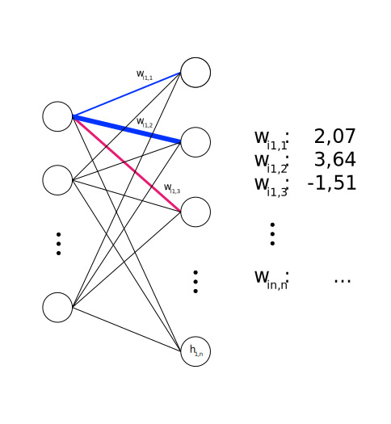
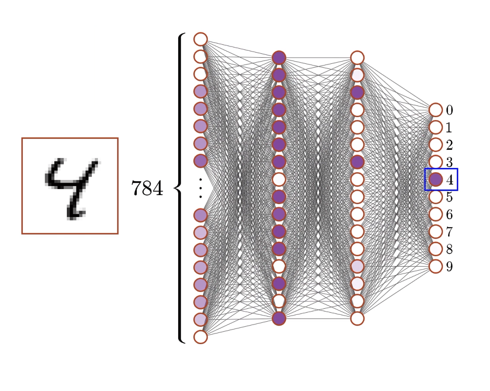

# Agenda

:::medium
- Warm-up [8 min]{.smaller}
- How a network learns [32 min]{.smaller}
- Transformers & LLMs [32 min]{.smaller}
- Wrap-up [8 min]{.smaller}
:::

:::notes
This is a flipped-classroom session. Students have worked through the lecture notes beforehand. The slides here are recap anchors, not first exposure. Keep each recap slide short (1 to 2 minutes); the bulk of the time goes to the two exercises.

Time budget: 8 + 32 + 32 + 8 = 80 minutes. Each 32-minute block is roughly 10 minutes recap and 22 minutes exercise plus debrief.
:::

# Warm-up {.discussion-slide}

:::medium
The digit classifier from the notes keeps confusing **4** and **9.**
:::

What could you change to improve the classifier?

Think alone 1 min, then discuss with your neighbour 2 min.



:::notes 
- more or better training data (especially hard 4/9 cases)
- train longer / lower the learning rate
- add neurons or a layer
- adjust weights via more gradient-descent steps. 
 
In ML you change data and parameters, not rules. This sets up the whole fundamentals block.
:::

# How a network learns {.headline-only}

## Neurons

:::large
A neuron [**receives inputs,**]{.fragment} [**weights them,**]{.fragment} [**sums up**]{.fragment} [and (maybe) **activates.**]{.fragment}
:::

:::incremental
- Weighted sum: $z = \sum_i w_i x_i + b$
- Activation functions determine the output:
    - **Binary Step:** Fires ($1$) or stays silent ($0$) based on a strict threshold.
    - **Sigmoid / Tanh:** Squashes $z$ into a smooth probability range (like 0 to 1), e.g., $\sigma(z) = \frac{1}{1 + e^{-z}}$.
    - **ReLU:** Passes positive values through, outputs $0$ for any negative $z$.
:::

:::notes
Inputs, weights, bias, weighted sum, activation.

Remind them sigmoid maps any real number into the range 0 to 1, so the output reads as an activation level.
:::

## Recap: weights and bias

:::columns
:::column
{#fig-nnweights}
:::
:::column
- **Positive weight:** input encourages the neuron to fire
- **Negative weight:** input discourages firing
- **Bias:** shifts the firing threshold
- Weights and the bias are the **knobs** learning adjusts
:::
:::

:::notes
One minute. Emphasize that the weights are the learned knowledge of the network. Everything in training comes down to nudging these numbers.
:::

## Recap: the digit network

:::columns
:::column

From **28×28 pixels**\
to a **neural network**\
to **10 probabilities**

:::incremental
- **Input:** 784 neurons (one per pixel)
- **Hidden:** 2 × 16 neurons
- **Output:** 10 neurons (digits 0 to 9)
- **Total:** about 13,000 adjustable parameters
:::
:::
:::column
{#fig-MNIST-4}
:::
:::

:::notes
One minute. The point students need for the exercise: learning is just finding good values for those ~13,000 numbers. We will now shrink that to a single neuron so they can do it by hand.
:::

## Recap: the learning loop

:::medium
:::incremental
1. **Forward pass:** make a prediction
2. **Cost:** measure how wrong it is, $C = \sum_j (a_j - y_j)^2$ [^1]
3. **Backpropagation:** find which weights are responsible
4. **Gradient descent:** nudge each weight to reduce the cost
5. **Repeat** with the next example
:::
:::

[^1]: This is the **Quadratic Cost** (or Mean Squared Error) formula. It calculates the squared difference between the network’s actual output ($a_j$) and the correct target label ($y_j$) across all final output neurons ($j$). Squaring the error ensures the result is always positive and penalizes larger mistakes more heavily.

:::notes
1. Forward Pass: The AI takes the input data (like an image of a cat), passes it through its layers of neurons, and makes its best guess (e.g., "I'm 70% sure this is a dog").
2. Cost: The Cost (or Loss) is a single number that calculates the exact size of the AI's mistake. It compares the AI's guess to the actual truth. If the guess was way off, the cost is high; if the guess was perfect, the cost is close to zero. The goal of the whole process is to get this cost as low as possible.
3. Backpropagation: The AI works backward from the error to find the culprit. It looks at every single connection (weight and bias) in the network and calculates exactly how much that specific parameter contributed to the wrong answer. It calculates gradients, which are just clues telling the network: "If you change this specific weight or bias, the cost will go up or down."
4. Gradient Descent: Now that the AI knows which weights or biases messed up, Gradient Descent is the rule it uses to actually change them. It takes a tiny step (a "nudge") to adjust them in the direction that makes the cost smaller. It doesn't rewrite everything at once—it just makes a small, smart adjustment.
5. Repeat: The AI takes a new piece of data and does the whole thing over. By doing this millions of times across thousands of examples, the "nudges" add up, the cost shrinks, and the AI becomes incredibly accurate.
:::

## Exercise A: be the network {.discussion-slide}

A single neuron has two inputs with weights $w_1 = 0.5$, $w_2 = -0.4$, bias $b = 0.1$.
You feed it one example: $x_1 = 1.0$, $x_2 = 0.0$. The correct answer is $y = 1$.

[Tasks (pairs)]{.h4}

1. Compute $z$, then $a = \sigma(z)$. ^[$e^{-0.6} \approx 0.549$.]
2. Compute the cost $C = (a - y)^2$.
3. For each of $w_1$, $w_2$, $b$, decide whether to **increase,** **decrease,** or **leave unchanged** to reduce the cost. Justify each in one sentence.
4. Why is $w_2$ a special case here?



:::notes
Expected answers:

1. $z = 0.5(1.0) + (-0.4)(0.0) + 0.1 = 0.6$; $a = 1/(1 + 0.549) \approx 0.646$.
2. $C = (0.646 - 1)^2 \approx 0.125$.
3. The output (0.646) is below the target (1), so we want it higher. Increase $w_1$ (its input is active and positive, so a larger $w_1$ raises $z$). Increase $b$ (always raises $z$). Leave $w_2$ unchanged.
4. $x_2 = 0$, so $w_2$ has no effect on this example; its gradient is exactly 0. The network cannot learn anything about $w_2$ from an example where that input is silent.

Formal check (optional, only if a group asks): $\partial C / \partial w_i = 2(a - y)\,a(1 - a)\,x_i$. This gives $-0.16$ for $w_1$ and $b$, and $0$ for $w_2$; negative gradient means "increase to reduce cost".

Debrief in 5 minutes. Draw out the general principle: gradient descent over ~13,000 parameters is just this single step, done for every weight, over millions of examples. Connect step 4 back to the learning-loop slide.
:::

# Transformers & LLMs {.headline-only}

## Recap: the transformer pipeline

:::medium
Digits have **fixed size;** language has **variable length** and **order matters.** The transformer is built for sequences.
:::

:::fragment
Running example: **"Was the bank flooded?"**
:::

:::incremental
1. **Tokenize:** split the text into tokens, the units the model processes
2. **Embed:** give each token a vector, a fixed starting point that is not yet context-aware
3. **Transform (×N):** every block runs **attention,** then a **feed-forward network**
4. **Unembed:** turn the last token's final vector into a probability over the vocabulary
:::

:::notes
Two minutes. Give the whole map before the parts. The block in step 3 repeats N times (96 in GPT-3); early blocks catch surface patterns, later blocks catch abstract meaning. Steps 1, 2, and 4 are bookkeeping; the real work is step 3, unpacked on the next slides.
:::

## Recap: embeddings 

:::medium
Embeddings are a starting point, not a meaning.
:::

:::incremental
- Each token maps to a **high-dimensional vector** (a lookup); similar tokens get **similar vectors**
- Directions in this space encode meaning: *"king" − "man" + "woman" ≈ "queen"*
:::

:::fragment
:::medium
"Bank" maps to the **same vector** in every sentence, financial or river. That is the problem **attention** solves next.
:::
:::

:::notes
The point to land, and the bridge to attention: at this stage the embedding is **static.** The same token gets the same vector regardless of context. Attention is what makes it context-sensitive.
:::

## Recap: attention in three steps

Each token produces three vectors via learned matrices:

:::incremental
- `Query` $W_Q$: what context do I need?
- `Key` $W_K$: what context can I offer?
- `Value` $W_V$: what information do I send?
:::

:::fragment
For every token, in parallel:
:::

:::incremental
1. **Scores:** `Query` · `Key` for each pair, how relevant is each token to me?
2. **Softmax:** turn the scores into weights between 0 and 1 that sum to 1
3. **Weighted sum:** mix the `Value` vectors using those weights
:::

:::fragment
Attention does **not pick** one token; it **weights all of them.**\
For "bank": $0.6 \times V(\text{flooded}) + 0.3 \times V(\text{was}) + 0.1 \times V(\text{the}) + \dots$ → the riverbank meaning.
:::

:::notes
Three minutes; this is the heart of the block. Walk the running example: "bank's" query matches "flooded's" key (water context), so "flooded's" value dominates the mix and the vector shifts toward riverbank. Stress step 3: every token contributes something, relevance is a weight rather than a yes/no choice.

After attention, a feed-forward network processes each token on its own to extract meaning, then the whole block repeats N times. Multi-head attention just runs several of these in parallel, each specialising (grammar, coreference, long-range links).
:::

## Recap: unembedding and temperature

The **last token's** final vector carries the whole context, since through attention it has seen every earlier token.

:::columns
:::column
- Last vector × $W_U$ → a raw score for every token
- **Softmax** turns scores into probabilities
- **Temperature** $T$ reshapes the distribution before sampling

$P(t_i) = \frac{e^{s_i / T}}{\sum_j e^{s_j / T}}$
:::
:::column
- **Low $T$:** sharper, more deterministic
- **High $T$:** flatter, more random
- $T \to 0$: always the top token
- $T \to \infty$: uniform
:::
:::

:::notes
Two minutes; the bridge to Exercise B part 2. Only the last token's vector is unembedded, because through attention it summarises the entire input. Temperature scales the scores before softmax. Make sure they can read the formula: exponentiate each score over T, then normalise so the values sum to 1.
:::

## Exercise B: attention {.discussion-slide}

:::medium
*"The trophy did not fit in the suitcase because **it** was too big."*
:::

1. Which word should **"it"** attend to most strongly: *trophy* or *suitcase*? Why?
2. Now change *big* to *small*. What does **"it"** attend to now?

:::notes
"it" attends to **trophy** (the thing that is too big to fit). Swapping to "small" flips the referent to **suitcase** (the container too small to hold the trophy). This is a Winograd-style sentence: the disambiguating signal is a single adjective, and attention is exactly the mechanism that routes it. No grammar rule resolves this; only context does.
:::

## Exercise C: temperature {.discussion-slide}

:::medium
After "The trophy was too", the model outputs raw scores: **big: 2.0, large: 1.0, heavy: 0.5.**
:::

1. Compute the probabilities for **T = 0.5** and **T = 2.0.**
2. The ranking is the **same** at both temperatures (big > large > heavy). So how can temperature lead to **different outputs?**
3. Which T suits factual output?

:::notes
Softmax with temperature: $P(t_i) = \dfrac{e^{s_i / T}}{\sum_j e^{s_j / T}}$. Three steps each time: divide every score by $T$, exponentiate, then normalise so the values sum to 1.

[**T = 0.5 (low, sharp)**]{.h4}

**Step 1, divide by T:** $2.0/0.5 = 4.0$; $1.0/0.5 = 2.0$; $0.5/0.5 = 1.0$

**Step 2, exponentiate:** $e^{4} = 54.60$; $e^{2} = 7.39$; $e^{1} = 2.72$

**Step 3, sum:** $54.60 + 7.39 + 2.72 = 64.71$

**Step 4, normalise:**

- big: $54.60 / 64.71 = 0.84$
- large: $7.39 / 64.71 = 0.11$
- heavy: $2.72 / 64.71 = 0.04$

[**T = 2.0 (high, flat)**]{.h4}

**Step 1, divide by T:** $2.0/2.0 = 1.0$; $1.0/2.0 = 0.5$; $0.5/2.0 = 0.25$

**Step 2, exponentiate:** $e^{1} = 2.72$; $e^{0.5} = 1.65$; $e^{0.25} = 1.28$

**Step 3, sum:** $2.72 + 1.65 + 1.28 = 5.65$

**Step 4, normalise:**

- big: $2.72 / 5.65 = 0.48$
- large: $1.65 / 5.65 = 0.29$
- heavy: $1.28 / 5.65 = 0.23$

[**Why outputs differ (question 2, the key point)**]{.h4}

- Temperature does **not** reorder the tokens; "big" is the most likely at every T. Dividing all scores by the same T is a monotonic operation, so the ranking is preserved.
- Outputs differ because the next token is **sampled** from the distribution, not always taken as the top one. The probabilities set the odds; a random draw picks the actual token.
- **Low T (0.5):** the distribution is peaked (0.84 / 0.11 / 0.04), so the draw lands on "big" almost every time. Output is near-deterministic and repetitive. Over 10 generations: roughly 8 to 9 "big".
- **High T (2.0):** the distribution is flat (0.48 / 0.29 / 0.23), so "large" and "heavy" get drawn often even though "big" still leads. Output varies run to run. Over 10 generations: roughly 5 "big", 3 "large", 2 "heavy".
- So temperature changes the *spread of the odds*, and sampling turns that spread into different concrete outputs.

[**Limits and use (question 3)**]{.h4}

- $T \to 0$: distribution collapses onto "big" (probability 1); sampling becomes deterministic (greedy).
- $T \to \infty$: distribution approaches uniform (0.33 each); the draw becomes a coin flip among all tokens.
- **Factual output wants low T;** creative output wants high T.
:::

## Exercise D: quick check {.discussion-slide}

True ore false?  

1. A transformer never sees raw text; it works on tokens turned into vectors.
2. Before attention, a word's embedding is the same regardless of surrounding context.
3. Attention picks the single most relevant word and ignores all the others.
4. The attention plus feed-forward block is applied only once.
5. A higher sampling temperature makes the output more random.



:::notes
1. **True.** Text is tokenized and each token becomes a vector; the model only ever processes vectors, never characters or words directly.
2. **True.** The embedding is a static lookup, the same vector for a token every time. Attention is what makes it context-sensitive afterwards. (Watch for students conflating this with the post-attention vector, which does change.)
3. **False.** Attention weights *all* tokens via softmax and mixes their values; relevance is a weight between 0 and 1, not a single winner-takes-all choice.
4. **False.** The attention plus feed-forward block is stacked and repeated N times (e.g., 96 layers in GPT-3); depth is where abstract meaning builds up.
5. **True.** Higher temperature flattens the probability distribution, so less likely tokens get picked more often, giving more varied or creative output.

:::

# Wrap-up {.headline-only}

## Key takeaways

[How a network learns]{.h4 .fragment}

:::incremental
- A neuron is a weighted sum plus an activation; weights and bias are the only things that change
- Learning is a loop: predict, measure cost, find responsible weights, nudge them down the gradient
- "Training" is this one small step repeated over millions of examples and thousands of parameters
:::

[Transformers & LLMs]{.h4 .fragment}

:::incremental
- Embeddings put meaning into geometry; attention reshapes each word's vector using its context
- Query-key scores decide relevance; values carry the information that gets mixed in
- The final vector becomes next-token probabilities; temperature tunes reliability vs creativity
:::

## Bridge {.discussion-slide}

:::medium
Same machinery, different scale: the digit neuron and GPT both learn by nudging weights down a gradient.
:::

What breaks, or has to change, when you go from 13,000 parameters to billions?

:::notes
Optional 2-minute closer if time allows; otherwise leave as a take-home thought. Fish for: data scale, compute cost, emergent capabilities, and new failure modes (hallucination, bias). Bridges naturally to the GenAI and ethics units.
:::

# Q&A {.html-hidden .unlisted .headline-only background-image="../assets/bg.jpeg"}

# Literature
::: {#refs}
:::
