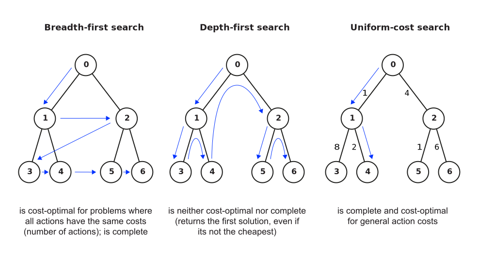
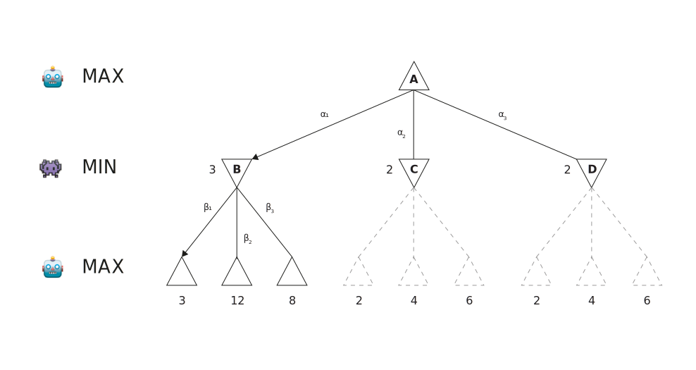
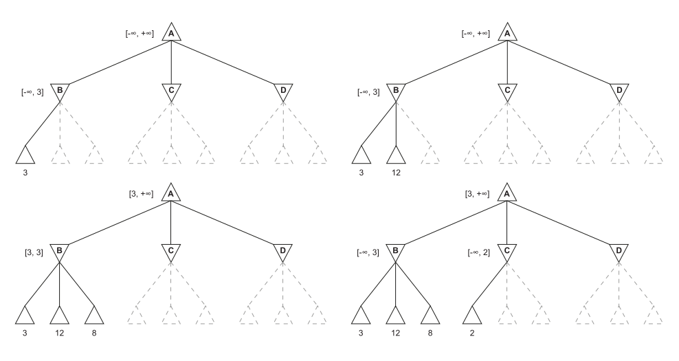
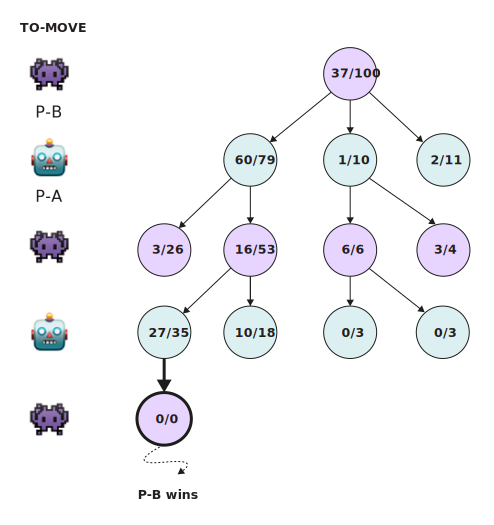
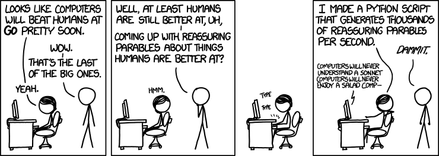

# Agenda

:::medium
- Warm-up [10 min]{.smaller}
- Search problems & modelling [20 min]{.smaller}
- Search algorithms in action [25 min]{.smaller}
- Adversarial search & MCTS [25 min]{.smaller}
- Wrap-up [10 min]{.smaller}
:::

# Search problems & modelling {.headline-only}

## Recap: Problem-solving process

Agents in simple environments follow a **four-phase process**:

:::incremental
1. **Goal formulation:** identify the objectives based on the current situation
2. **Problem formulation:** decide which states and actions to consider
3. **Search:** explore possible action sequences to find a solution path
4. **Execution:** carry out the solution in the environment
:::

:::notes
Emphasize the ordering constraint: problem formulation must follow goal formulation. 

Without a goal, you cannot decide what to include in the model (which states matter, which actions are relevant).
:::

## Formal search problem

A search problem is formally defined by:

:::incremental
- **State space:** all possible states the environment can be in
- **Initial state:** the state the agent starts in
- **Actions** $\textrm{ACTIONS}(s)$ -- available actions when in state $s$
- **Transition model** $\textrm{RESULT}(s, a)$ -- state resulting from action $a$ in state $s$
- **Goal test:** condition determining whether a state is a goal state
- **Action cost function** $\textrm{ACTION-COST}(s, a, s')$ -- numeric cost of performing $a$ from $s$ to $s'$
- **Path:** a sequence of actions leading from one state to another
- **Solution:** a path from the initial state to a goal state
:::

:::notes
Students need to be able to apply all six components in Exercise B. 

A common confusion: goal test is a condition (Boolean), while action cost is a number. Path and solution round out the vocabulary.
:::

## Recap: modelling

![A simplified map of Romania with road distances in miles [@RusselNorvig2022AIMA]](images/search-problem.svg)

## Recap: modelling #2

![A partial search tree for finding a route from Arad to Bucharest based on the simplified map of Romania [@RusselNorvig2022AIMA]](images/search-tree.svg){#fig-search-tree}

:::notes
Map each component to the figure: 

- state space = cities
- initial state = Arad
- goal state = Bucharest (goal test: is state Bucharest?)
- actions = road segments, 
- costs = distances.

Stress that this is a model, i.e., an abstraction that ignores weather, road quality, etc.
:::

## Definition sequence {.discussion-slide}

:::medium
Problem formulation must follow goal formulation.
:::

Is this statement true or false? Why?

:::notes
**TRUE** 

Without knowing the goal first, you cannot decide what to include in the model (which states matter, which actions are relevant).

Iterative cycles can occur in practice, but the conceptual ordering is fixed. Debrief quickly before moving to Exercise B.
:::

## Problem formulation  {.discussion-slide}

*There are six glass boxes in a row, each with a lock. Each of the first five boxes holds a key unlocking the next box in line; the last box holds a banana. You have the key to the first box and want the banana.*

Write out all formal components:

- State space
- Initial state
- Actions
- Transition model
- Goal test
- Action cost function



## Solution note

- **State space:** A state is defined by which boxes are open (or equivalently, which keys you hold). Since each box is either open or closed, there are 2⁶ = 64 possible states in theory, though only 7 are reachable in practice: you can have boxes 1 through k open (for k = 0, 1, ..., 6).
- **Initial state:** All six boxes are closed. You hold the key to box 1. You do not have the banana.
- **Actions:** $\textrm{ACTIONS}(s) = \{ \textit{unlock and open box } k \}$, where k is the next locked box for which you hold the key. In each reachable state, there is exactly one available action (or zero, if all boxes are open).
- **Transition model:** $\textrm{RESULT}(s, \textit{open box } k)$ = the state where box k is now open. If k < 6, you now hold the key to box k+1 (and no longer need the key to box k). If k = 6, you now hold the banana.
- **Goal test:** You have the banana, i.e., box 6 is open.
- **Action cost function:** $ACTION-COST(s, a, s')$ = 1 for each unlock action (uniform cost). Alternatively, 0 if only the final state matters, not the path.

# Search algorithms in action {.headline-only}

## Recap: uninformed search strategies

:::notes

Three queue types determine the expansion order:

- **FIFO queue** (breadth-first search): shallowest node first
- **LIFO queue** (depth-first search): deepest node first
- **Priority queue** (uniform-cost search): lowest cumulative cost first

Key insight: BFS, DFS, and UCS share the same algorithm structure; only the frontier data structure differs. 
BFS is complete and optimal for unit-cost problems. UCS is complete and optimal for general action costs.
:::

## Recap: informed search

| Algorithm         | Evaluation function  | Information used                      |
|-------------------|----------------------|---------------------------------------|
| Greedy best-first | $f(n) = h(n)$        | Heuristic estimate to goal only       |
| A*                | $f(n) = g(n) + h(n)$ | Actual path cost + heuristic estimate |

:::fragment
**Key question:** What information does each algorithm use to decide which node to expand next?
:::

:::fragment
A* is cost-optimal if $h(n)$ is **admissible** (never overestimates the true cost to goal).
:::

:::notes
Greedy best-first is fast but not optimal as it ignores past costs. 

A* balances past cost g(n) with future estimate h(n). With an admissible heuristic, A* is both complete and cost-optimal. 

In routing, straight-line distance is a classic admissible heuristic.
:::

## Trace the frontier {.discussion-slide}

**Simplified graph** (edge costs in parentheses):

Arad -> Sibiu (140) -> Fagaras (99) -> Bucharest (211);\
Sibiu -> Rimnicu Vilcea (80) -> Pitesti (97) -> Bucharest (101)

[Tasks]{.h4}

1. **Breadth-first search** from Arad to Bucharest.\
   List the frontier after each expansion. Which path does BFS return?
2. **Uniform-cost search** on the same graph.\
   List the frontier with cumulative costs after each expansion. Which path does UCS return? Compare with BFS.
3. *(Bonus)* Straight-line distance to Bucharest:\
   Arad=366, Sibiu=253, Fagaras=176, Rimnicu Vilcea=193, Pitesti=100.\
   Trace **A***: how does the heuristic change the expansion order?



:::notes
Expected answers: 

1. BFS: Arad -> Sibiu -> Fagaras -> Bucharest (3 hops, total cost 450). 
2. UCS: Arad -> Sibiu -> Rimnicu Vilcea -> Pitesti -> Bucharest (total cost 418, cheaper than the Fagaras route). 
3. A* prefers Rimnicu Vilcea over Fagaras earlier because its f = g + h is lower. 
 
Debrief: BFS = fewest hops, UCS = lowest cost, A* = lowest cost with smarter ordering.
:::

# Adversarial search & MCTS {.headline-only}

## Recap: MinMax

:::notes

- **MAX** selects the action leading to the **maximum** MinMax value
- **MIN** selects the action leading to the **minimum** MinMax value
- Values propagate **bottom-up** through the tree (from terminal nodes to root)

Walk through the tree: assign terminal values, then propagate upward, alternating MAX and MIN. Emphasize the key assumption: MinMax treats the opponent as rational and always playing optimally. This sets up Exercise E.
:::

## Recap: Alpha-beta pruning

:::notes
Maintains two bounds during tree traversal:

- $\alpha$: best value MAX is guaranteed so far ("at least this much")
- $\beta$: best value MIN is guaranteed so far ("at most this much")

**Pruning condition:** if $\alpha \geq \beta$ at any node, skip the remaining children.

Result: the same optimal decision as MinMax, with fewer node evaluations.

Pruning does not change the final decision -- it avoids evaluating subtrees that cannot possibly influence the result at the root. This is pure efficiency.
:::

## Monte Carlo Tree Search (MCTS)

Instead of exhaustive traversal, MCTS uses **repeated simulation:**

:::incremental
1. **Selection:** follow tree policy (e.g., UCT) from root to a leaf
2. **Expansion:** add a new child node at the selected leaf
3. **Simulation:** play out the game randomly to a terminal state
4. **Backpropagation:** update win/playout counts up to the root
:::

## Monte Carlo Tree Search (MCTS) #2

:::fragment

:::

:::notes
Contrast with MinMax: instead of computing exact values for every node, MCTS approximates value through sampling. 

No leaf evaluation function is needed, instead play to the end and record the outcome. MCTS scales to games where exhaustive search is infeasible (e.g., Go).
:::

## Pruning {.discussion-slide}

Your task:

1. Draw a game search tree with 3 levels of depth (MAX at root, MIN at level 1, terminal values at level 2). Assign arbitrary terminal values.
2. Apply alpha-beta pruning step by step, tracking $\alpha$ and $\beta$ at each node.
3. Mark the **pruned branches** and explain why each is skipped (i.e., state the $\alpha \geq \beta$ condition).

:::notes
10 min exercise, individual or pairs. Circulate and check that students track alpha/beta correctly. Common mistake: pruning too early or failing to propagate bounds. Debrief on the board using images/pruning.svg as a reference. Ask one student to walk through their tree.
:::

## Can MinMax be beaten? {.discussion-slide}

:::medium
Can the MinMax algorithm be beaten by an opponent playing suboptimally?
:::

Why or why not?

- Discuss and reach a verdict
- Sketch a small game tree where MAX wins against a **suboptimal** MIN

:::notes
7 min think-pair-share, then 2 min debrief. Target answer: NO -- if MIN plays suboptimally (not minimizing), MAX does at least as well as against an optimal opponent, possibly better. The sketch should show MIN choosing a higher value than optimal, which only benefits MAX. Call on one pair to share their tree.
:::

# Wrap-up {.headline-only}

## Key Takeaways

[Search]{.h4 .fragment}

:::incremental
- Search operates over models; planning is "in simulation"
- Search is only as good as the models it uses
- BFS finds shortest paths (fewest hops); UCS finds cheapest paths (lowest cost); A* adds a heuristic to guide expansion toward the goal
:::

[Adversarial search]{.h4 .fragment}

:::incremental
- MinMax assumes optimal adversarial play; a suboptimal opponent only helps MAX
- Alpha-Beta Pruning achieves the same result as MinMax while evaluating fewer nodes ($\alpha \geq \beta$ prune)
- MCTS estimates state value via simulation rather than exhaustive search -- no evaluation function needed
:::

## xkcd

:::notes
Close the session with the comic. Optional prompt: "What is the 'model' that breaks down in this scenario, and how does it connect to what we discussed today?"
:::

# Q&A {.html-hidden .unlisted .headline-only background-image="../assets/bg.jpg"}

# Literature
::: {#refs}
:::