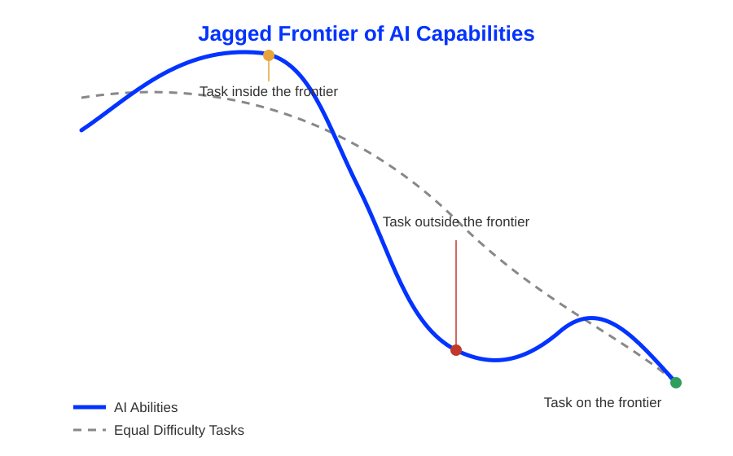

# Motivation {.vertical-center background-color="#0333ff" .no-headline}

:::html-hidden
:::large
Generation is cheap.\
Verification is not.
:::
:::

:::medium
How can we structure our work with AI to ensure that the sum is greater than the parts, rather than less?
:::

:::notes
The widespread deployment of generative AI has created an illusion of frictionless productivity. Empirical studies of high-stakes knowledge work show a recurring **complementarity deficit:** naive human-AI combinations often underperform both unassisted humans and autonomous AI models [@vaccaro2024when; @brodeur2026aiassisted]. @brodeur2026aiassisted give a stark demonstration: in a large-scale reproducibility-assessment task, AI-assisted teams outperformed AI-led teams, but neither beat human-only teams.

Generating plausible text, code, or strategic analysis now costs near-zero marginal cognitive effort. The cost of evaluating, verifying, and debugging what that generation produces has stayed constant, or increased. That asymmetry, the **generation-verification gap**, is the starting point for this session.

Artificial intelligence is neither a uniform productivity multiplier nor a cognitive replacement. It behaves like an **asymmetric amplifier:** it amplifies whatever interaction structure surrounds it, good or bad. Without deliberate, evidence-based interaction architectures, pairing capable humans with capable AI frequently yields outcomes that are worse, more homogeneous, and harder to maintain than unassisted work.

Three concepts anchor the session:

- **Complementarity vs. substitution:** does the pairing produce something neither party could produce alone, or does the AI simply replace human effort?
- **Naive delegation vs. co-construction:** is the human handing off a task wholesale, or actively shaping how the AI contributes to it?
- **Epistemic agency:** does the human retain ownership of judgment, or does the AI's confident output quietly replace the human's own reasoning?

:::

## Exercise {.unlisted .unnumbered .html-hidden .discussion-slide}

:::medium
Think about the last time you used an AI tool for university or work.
:::

Did it save you time **overall**, once you count the time spent reviewing, correcting, and rewriting what it produced?

Discuss with a neighbor.



# The light side {.headline-only}

## Execution velocity

:::fragment
:::medium
AI compresses the time it takes to get from blank page to first draft.
:::
:::

:::html-hidden
:::incremental
- Substantial completion-time reductions in routine writing and standard coding tasks [@noy2023experimental; @peng2023impact; @merali2025scaling]
- Rapid prototyping and cold-start knowledge retrieval
- Reduced friction when summarizing unfamiliar material
:::
:::

:::notes
Field and lab experiments consistently find large completion-time reductions for routine writing, standard coding, and initial drafting once generative AI is introduced into the workflow. @noy2023experimental found that ChatGPT cut the time professionals needed for writing tasks by roughly 40 percent while improving output quality, as judged by peer graders. @peng2023impact found comparable gains for developers using GitHub Copilot, and @merali2025scaling extend the pattern to consulting, data-analyst, and management tasks more broadly.

Beyond raw speed, AI reduces the friction of **cold-start knowledge retrieval:** instead of searching, skimming, and synthesizing background material, a worker can ask directly and get a serviceable orientation within seconds. This is valuable, but it is also where the light side quietly borders the dark side: speed at the input stage does not guarantee speed, or quality, at the output stage. That tension carries through the rest of the session.
:::

## The equalizer effect

:::fragment
:::medium
AI narrows the gap between novices and experts, at least initially.
:::
:::

:::html-hidden
Disproportionate performance gains accrue to novices and bottom-quartile performers [@brynjolfsson2023generative; @cruces2025does].
:::

:::notes
@brynjolfsson2023generative studied customer-support agents using a generative AI assistant and found that the assistant raised the productivity of novice and low-skilled agents substantially more than that of experienced agents. AI acted as an immediate scaffold, elevating baseline output to a competent standard and compressing the internal performance variance of the team. @cruces2025does found the same pattern in a randomized experiment on education-based productivity gaps: generative AI narrowed the gap between lower- and higher-skilled workers substantially.

This "bottom-up leveling" is genuinely valuable for onboarding and for closing skill gaps quickly. It also raises a question we return to under the dark side: what happens to the *learning* that used to occur while novices struggled through that gap unassisted?
:::

## Individual divergent thinking

:::fragment
:::medium
More ideas, further apart, faster.
:::
:::

:::html-hidden
Higher ideation fluency and greater semantic distance between ideas when individuals brainstorm with an LLM [@doshi2024generative; @hubert2024current].
:::

:::notes
When individuals query LLMs during early brainstorming, they tend to produce more ideas per minute and ideas that are further apart in meaning (higher semantic distance) than when brainstorming alone [@doshi2024generative]. @hubert2024current go further, finding that current generative language models outperform humans on standard divergent-thinking tasks. For an individual working alone, this is a genuine creativity boost.
:::

## Light side at a glance {.scrollable}

| Mechanism | What changes | Representative evidence |
|---|---|---|
| **Execution velocity** | Faster drafts, faster prototypes, faster orientation | @noy2023experimental; @peng2023impact; @merali2025scaling |
| **The equalizer effect** | Novices and low performers gain the most | @brynjolfsson2023generative; @cruces2025does |
| **Individual divergent thinking** | More ideas, greater semantic distance | @doshi2024generative; @hubert2024current |

: Three well-replicated, immediate benefits of individual AI use {#tbl-lightside}

# The dark side {.headline-only}

## Cognitive offloading and skill degradation

:::fragment
:::medium
Faster answers today, weaker retrieval tomorrow.
:::
:::

:::html-hidden
:::incremental
- Immediate problem-solving speed increases with AI help
- Independent exam performance drops significantly afterward [@bastani2024generative]
- Continuous assistance is associated with erosion of unaided professional judgment in high-stakes domains [@lancet2025endoscopist]
:::
:::

:::notes
@bastani2024generative ran field experiments with high-school students working through math problems, some with access to a generative AI tutor and some without. Students with AI access solved practice problems faster and with fewer errors. When the AI was removed for a subsequent unaided exam, however, their performance dropped significantly relative to the control group. The likely mechanism is that AI assistance bypassed the active retrieval and struggle that normally consolidate learning.

A parallel pattern has been observed in professional settings that depend on trained intuition. @lancet2025endoscopist is a clinical commentary, not a randomized trial, but it synthesizes observational and early-cohort evidence pointing to an emerging **deskilling risk:** endoscopists accustomed to continuous AI assistance during colonoscopy show signs of reduced vigilance and unaided polyp-detection accuracy once that assistance is withdrawn. The proposed mechanism is the same as in the classroom case: **the effort that used to build the skill has been offloaded, so the skill stops accumulating,** though here the evidence is a risk signal rather than a settled causal finding.

This is not an argument against AI-assisted learning as such. However, we need to be deliberate about *when* assistance is appropriate.
:::

## The reviewer's bottleneck and technical debt

:::fragment
:::medium
AI writes faster than humans can review.
:::
:::

:::html-hidden
Fast generation produces high volumes of superficially correct but subtly flawed work [@he2026aiwrites; @he2026speed]; downstream, this shows up as silent coupling and structural complexity in code and analysis [@xu2025aiassisted; @borg2026echoes].
:::

:::notes
Generation happens at machine speed, but verification, the reading, tracing, and testing needed to catch subtle errors, still happens at human speed [@he2026aiwrites]. In a separate longitudinal study of open-source projects, @he2026speed find that Cursor AI raises short-term commit velocity while measurably increasing long-term code complexity. The result is a volume of output that looks correct on a first pass but accumulates undetected flaws.

In software engineering specifically, @xu2025aiassisted find that AI-assisted code, while faster to produce, is associated with **decreased productivity for experienced developers** once maintenance is accounted for: AI-generated code tends to introduce silent coupling between components and structural complexity that is expensive to unwind later. @borg2026echoes corroborate this at the codebase level, tracing downstream maintainability costs directly to AI-assisted commits. The technical-debt bill does not arrive at commit time. It arrives months later, in the review, refactor, or incident that the shortcut eventually causes.
:::

## The fixation and homogenization trap

:::fragment
:::medium
Everyone converges on the model's first idea.
:::
:::

:::html-hidden
:::incremental
- **Micro-mechanism:** early exposure to AI output anchors the human's own search space [@wadinambiarachchi2024effects; @lin2026stimulating]
- **Macro-outcome:** because LLMs sample around dense semantic centroids, many independent users converge on similar solutions, collapsing collective variance [@doshi2024generative; @boussioux2024crowdless; @zhou2025when]
- AI evaluation models tend to favor smooth, conventional structures over genuinely novel or eccentric ideas [@williams2026search]
:::
:::

:::notes
Two mechanisms compound each other here.

1. At the individual level, **idea fixation:** @wadinambiarachchi2024effects show that designers and analysts who see an AI-generated concept early in their process tend to anchor on its framing, even when instructed to generate independently, narrowing the space of solutions they go on to consider. @lin2026stimulating replicate the pattern in product design specifically, comparing generative AI against traditional ideation methods.
2. At the collective level, this compounds into a **variance collapse**. Large language models sample text from dense regions of their learned probability distribution, so their outputs cluster around a small number of "central" answers. @doshi2024generative show that while an *individual* using an LLM produces more ideas (the light-side finding above), a population of *many* people using the same LLM produces conceptually more similar outputs to each other than an equivalent population working unaided. @boussioux2024crowdless find the same collapse in crowdsourced problem-solving, and @zhou2025when show it compounding over time: once continuous AI use stops, individual creativity fails to recover even as homogeneity keeps climbing. Individual creativity goes up; collective diversity goes down.

A related, subtler effect: @williams2026search find that AI systems used to evaluate ideas (screening pitches, ranking submissions) tend to favor smooth, familiar narrative structures over genuinely novel or "weird" ones, penalizing exactly the kind of outlier idea that breakthrough innovation tends to require.

The practical implication for teams: if everyone on a project queries the same model the same way, the team's apparent productivity gain can mask a real loss of strategic and creative diversity.
:::

## Reasoning biases and verification failures

:::fragment
:::medium
Confidence is not correctness, but it is persuasive.
:::
:::

:::html-hidden
:::incremental
- **Automation bias:** high-confidence, incorrect AI suggestions mislead decision-makers [@qazi2025automation; @goh2024influence]
- **Selective adherence:** people accept wrong AI advice that confirms their priors, and reject correct advice that contradicts them [@alonbarkat2023human]
:::
:::

:::notes
@vasconcelos2023generation study how decision-makers interact with AI-generated recommendations under time pressure and find that confident, fluent AI output is trusted more than its accuracy warrants. @qazi2025automation and @goh2024influence document the same **automation bias** directly in clinical diagnostic reasoning: physicians shown a confident but incorrect AI suggestion were measurably more likely to reach the wrong diagnosis themselves. The danger is not that people trust AI too much in general; it is that they cannot reliably tell *when* to trust it, because confident and unconfident outputs often look identical.

A closely related failure is **selective adherence**, the term coined by @alonbarkat2023human in a study of public-sector decision-making: decision-makers tend to accept AI suggestions that confirm what they already believed, and reject AI suggestions that contradict their priors, regardless of which suggestion was actually correct. @rounding2025impact confirm the pattern in a multi-country randomized trial of physician decision-making. This means AI does not simply add noise to decision-making; it can *amplify existing bias* by giving it an authoritative-sounding second opinion.

Both failures point to the same design requirement for human-AI collaboration: verification needs to be structured, not left to intuition.
:::

## Dark side at a glance {.scrollable}

| Failure mode | Mechanism | Representative evidence |
|---|---|---|
| **Cognitive atrophy** | Offloaded effort stops building the underlying skill | @bastani2024generative; @lancet2025endoscopist |
| **Reviewer's bottleneck** | Generation outpaces verification, debt accumulates silently | @he2026aiwrites; @he2026speed; @xu2025aiassisted; @borg2026echoes |
| **Fixation & homogenization** | Individual anchoring plus collective variance collapse | @wadinambiarachchi2024effects; @doshi2024generative; @zhou2025when |
| **Reasoning biases** | Automation bias and selective adherence to AI advice | @vasconcelos2023generation; @alonbarkat2023human |

: Four systemic penalties hidden behind the light side's immediate gains {#tbl-darkside}

# The jagged frontier {.headline-only}

## Mapping task performance

:::fragment
:::medium
AI competence is not uniform. It has a shape.
:::
:::

{#fig-jagged}

:::notes
@delacqua2023jagged had management consultants complete realistic business tasks with and without access to GPT-4 and found dramatically uneven effects depending on the task. For tasks **inside the frontier** (closed-form problems with a checkable structure, such as market analysis or product ideation from a given brief), consultants using AI completed more tasks, faster, and at higher quality, with quality gains of roughly 40 percent. For tasks **outside the frontier** (problems that looked similar on the surface but required subtle, multi-step causal reasoning the model could not reliably do), consultants who trusted the AI's competence performed **worse** than a control group working unaided, with quality dropping by roughly 19 percent.

The frontier is called "jagged" because it does not track task difficulty in any intuitive way. Some hard-looking tasks are safely inside it; some easy-looking tasks are outside it. The only way to know which is which is to test, not to guess from how complex a task *feels*.

Two further findings sharpen the picture:

- **The expert penalty:** novices gain the most leverage from AI assistance, but domain experts often experience *net negative* time balances, because reviewing and correcting an AI draft can take longer than producing an expert solution from scratch [@cui2025effects; @becker2025measuring; @xu2025aiassisted].
- **Determinants of complementary success:** the tasks where human-AI pairing reliably helps share two properties, **verifiability** (can an error be caught by a linter, a unit test, or a simple check, rather than requiring careful reading, the generation-verification tradeoff formalized by @vasconcelos2023generation) and **task modularity** (can the sub-problem be fully isolated from the rest of the analysis?) [@vaccaro2024when; @hemmer2025complementarity].
:::

## Exercise: the jagged frontier diagnostic {.unlisted .unnumbered .html-hidden .discussion-slide}

:::medium
Two tasks, two conditions.
:::

You will receive two short tasks: one that looks complex but is actually standard and closed-form (**inside** the frontier), and one that looks simple but requires a counter-intuitive causal judgment (**outside** the frontier).

1. Half the room solves both tasks with unrestricted AI access.
2. Half the room solves both tasks unaided.
3. Compare the two groups' accuracy on each task, separately.



:::notes
Debrief: the AI-assisted group should outperform on the inside-frontier task and underperform, or show no advantage, on the outside-frontier task, mirroring @delacqua2023jagged's roughly +40 percent / -19 percent split. Ask students to articulate, in their own words, what made the second task deceptively "outside" the frontier. The goal is to build an intuition for the *shape* of the frontier, not a checklist of task types.
:::

## What makes complementarity work

:::fragment
:::medium
Verifiable and modular tasks are where humans and AI genuinely add up.
:::
:::

| Determinant | Question to ask | Why it matters |
|---|---|---|
| **Verifiability** | Can an error be caught mechanically (linter, test, calculation check), rather than only by careful reading? | Converts verification from an open-ended cognitive task into a fast, reliable one |
| **Task modularity** | Can the sub-problem be fully isolated from the rest of the analysis? | Bounds what the AI can silently get wrong, and what the human must review |

: Two properties that predict when human-AI pairing outperforms either party alone [@vaccaro2024when; @hemmer2025complementarity] {#tbl-determinants}

:::notes
@vaccaro2024when synthesize a large body of human-AI teaming studies and find that superadditive complementarity is not evenly distributed across task types. It concentrates in tasks that are **verifiable** and **modular**. @hemmer2025complementarity arrive at the same two determinants independently, through a conceptual synthesis of the sources of human-AI complementarity in information systems research. When both properties are present, review is fast and errors are contained. When either is absent, review becomes as expensive as doing the task unaided, and the "productivity gain" from generation is fully offset, or reversed, by the cost of verification.

This gives us a practical diagnostic question to ask before delegating any task to AI: *if the AI gets this wrong, how would I find out, and how far would the error spread before I did?*
:::

# Interaction modes {.headline-only}

## From diagnosis to protocol

:::medium
Four modes, matched to four failure risks.
:::

::::columns
:::{.column width="50%"}
:::incremental
- **Socratic Scaffold** protects skill acquisition
- **Centaur Modularizer** structures large workflows
:::
:::

:::{.column width="50%"}
:::incremental
- **Cognitive Forcer** mitigates overreliance
- **Delayed Access** preserves creative variance
:::
:::
::::

:::notes
Each mode below targets a specific failure mode identified above. None of them asks you to stop using AI. All of them ask you to change *when* and *how* you bring it into the workflow.
:::

## The Socratic Scaffold

:::large
Cognitive protection for skill acquisition
:::

:::html-hidden
The model is prohibited from giving direct solutions. It is prompted to act as an examiner: asking guiding questions, hinting at missing boundary conditions, checking the human's mental model.
:::

:::notes
**Objective:** skill acquisition, conceptual learning, and problem formulation, without the mental atrophy documented in @bastani2024generative.

**Mechanism:** the human explicitly instructs the model not to output a direct solution or completed code. Instead, the model is prompted to behave like an examiner or tutor: it asks clarifying questions, points to missing boundary conditions or edge cases, and checks whether the human's stated reasoning is sound, without supplying the reasoning itself. @macneil2024exploring's design space of conversational AI for programming education documents this examiner-style configuration directly.

**When to use it:** any situation where the point of the task is what you learn from doing it, not just the artifact you produce, coursework, first attempts at a new technique, early-career skill building.
:::

## The Centaur Modularizer

:::large
Structural separation for large, multi-step workflows
:::

:::html-hidden
The human owns strategy, problem architecture, and final synthesis. The AI is delegated bounded, non-overlapping subroutines, formatting, extraction, boilerplate.
:::

:::notes
**Objective:** navigating large, multi-step analytical or writing workflows without losing coherence or accumulating undetected errors, directly addressing the reviewer's bottleneck discussed under the dark side.

**Mechanism:** enforce strict spatial and functional separation between human and AI contributions, following the "centaur" pattern documented by @delacqua2023jagged and studied further in a team setting by @delacqua2025cybernetic. The human retains complete ownership of strategy, problem architecture, and final synthesis. The AI is delegated bounded, non-overlapping subroutines, formatting, data extraction, boilerplate code, first-pass summaries, where the scope of a possible error is small and easy to locate.

**When to use it:** large deliverables (reports, codebases, presentations) where losing the thread of the overall argument to the AI would be costly, but where clearly delimited sub-tasks are genuinely verifiable and modular (recall @tbl-determinants).
:::

## The Cognitive Forcer

:::large
Adversarial review for high-stakes decisions
:::

:::html-hidden
The human commits to an independent hypothesis in writing first. The AI is then prompted as an adversarial red team to find edge-case failures and unstated assumptions.
:::

:::notes
**Objective:** high-stakes decision-making, policy analysis, and code review, directly countering the automation bias and selective adherence documented above in the discussion of @vasconcelos2023generation, following the cognitive forcing functions proposed by @bucinca2021trust.

**Mechanism:** before consulting the model at all, the human must commit, in writing, to an independent hypothesis, recommendation, or architecture. Only after that commitment exists is the AI introduced, and only in an adversarial role: it is prompted explicitly to red-team the human's position, to poke holes, surface edge-case failures, and expose unstated assumptions.

**Why the order matters:** asking for a critique *after* you have committed to a position removes the anchoring effect that a first AI answer otherwise has on your own thinking. It also converts the AI from a source of the decision into a check on the decision, structurally undermining automation bias rather than relying on individual vigilance to overcome it.

**When to use it:** irreversible or costly decisions, code review before merge, any moment where being wrong quietly is more expensive than being challenged loudly.
:::

## Exercise: cognitive forcing vs. direct generation {.unlisted .unnumbered .html-hidden .discussion-slide}

:::medium
Same flawed case study. Two protocols.
:::

You will receive a business case study with a subtle but critical flaw.

- **Group A:** ask the AI directly for a recommendation.
- **Group B:** write a three-bullet hypothesis first. Then use the AI *only* to critique that hypothesis.

Compare: which group caught the flaw?



:::notes
Debrief: Group A typically adopts the AI's confident recommendation and inherits its blind spot, a live demonstration of automation bias. Group B, having committed to a position first, is far more likely to catch the flaw when the AI is used adversarially against their own hypothesis. Make the mechanism explicit: the *order* of AI involvement, not just its presence or absence, determined the outcome.
:::

## Delayed AI access

:::large
Preserving variance in creative and strategic work
:::

:::html-hidden
Enforce an initial period of unassisted divergent thinking. Introduce AI downstream, using diverse prompting personas to break out of central semantic distributions.
:::

:::notes
**Objective:** creative ideation, strategic direction, and novel product design, directly countering the fixation and homogenization trap discussed under the dark side.

**Mechanism:** enforce an initial period of fully unassisted human divergent thinking, generating your own ideas before you see the model's, to establish a genuine personal variance baseline before any AI framing can anchor it (recall @wadinambiarachchi2024effects on idea fixation). This staged-access protocol is directly studied by @romero2025delayed, who show that delaying AI access in collaborative problem-solving mitigates the homogenising effects of introducing it too early. AI is introduced only downstream, for expansion and elaboration, and ideally through diverse prompting personas rather than a single default query, deliberately pushing the model away from the dense central region of its output distribution that drives the collective variance collapse documented by @doshi2024generative. @wan2025diverse show directly that varying the AI's persona across a team measurably mitigates this homogenization effect in collaborative ideation.

**When to use it:** early-stage brainstorming, product concepting, strategy formation, anywhere that the *diversity* of the option set matters as much as the quality of any single option.
:::

# Challenges

You want to become a more deliberate collaborator with AI, not just a faster one? Here are three challenges that might help you along the way.

:::incremental
- **Level 1 (Reflect):** Keep a 14-day AI reliance diary. Log every AI interaction relevant to your studies or work, noting where the task sat on the jagged frontier, whether your stance was passive or active, how long verification took, and any moment you noticed automation bias in yourself. Close with a written reflection on your personal dependency and verification bottlenecks.
- **Level 2 (Change):** Over three weeks, commit to applying at least two of the four protocols above (Cognitive Forcer and Delayed Access work well together) across your coursework or projects. Compare your outputs against your usual habits: what changed in cognitive effort, in the maintainability of what you produced, and in what you actually remember afterward?
- **Level 3 (Grow):** Design and run a small field experiment (4 to 8 people, a study group or a work team). Compare a human-only team, a naive-AI team, and a Centaur-style team on the same complex deliverable. Write up whether true complementarity appeared, whether technical debt accumulated, and whether the AI-assisted teams' outputs converged more than the human-only team's did.
:::

# Reading list

For digging deeper, I recommend the sources cited here, organized by theme.

**Frontiers and productivity**

- The jagged technological frontier: @delacqua2023jagged
- Productivity effects of generative AI: @noy2023experimental
- Generative AI at work: @brynjolfsson2023generative
- Generative AI and developer productivity (GitHub Copilot): @peng2023impact
- Scaling laws for AI-assisted knowledge work: @merali2025scaling
- Generative AI and education-based productivity gaps: @cruces2025does

**Cognitive offloading and reliance**

- Generative AI and learning: @bastani2024generative
- Endoscopist deskilling after AI exposure: @lancet2025endoscopist
- Cognitive forcing functions: @bucinca2021trust
- Generation, verification, and AI-assisted decisions: @vasconcelos2023generation
- Generative AI and critical thinking: @lee2025impact

**Fixation and collective homogenization**

- Individual creativity vs. collective diversity: @doshi2024generative
- AI more creative than humans on divergent thinking: @hubert2024current
- Generative AI and design fixation: @wadinambiarachchi2024effects
- Generative AI and divergent thinking in product design: @lin2026stimulating
- The crowdless future: generative AI and collective problem-solving: @boussioux2024crowdless
- When ChatGPT is gone: creativity and homogeneity over time: @zhou2025when
- Delayed AI access: @romero2025delayed
- Diverse AI personas and homogenization: @wan2025diverse
- Diagnosing the limits of convergent AI: @williams2026search

**Reasoning biases and verification**

- Automation bias and selective adherence in public-sector decisions: @alonbarkat2023human
- Automation bias in AI-assisted diagnostic reasoning: @qazi2025automation
- LLM influence on diagnostic reasoning: @goh2024influence
- LLM assistance and physician decision-making: @rounding2025impact

**Complementarity and downstream technical debt**

- AI-assisted teams vs. AI-led vs. human-only teams: @brodeur2026aiassisted
- Field experiment on generative AI and teamwork: @delacqua2025cybernetic
- AI writes faster than humans can review: @he2026aiwrites
- Speed at the cost of quality (Cursor AI): @he2026speed
- AI-assisted programming and developer productivity: @xu2025aiassisted
- Downstream effects of AI assistants on maintainability: @borg2026echoes
- The expert penalty in high-skilled work: @cui2025effects
- Early-2025 AI and experienced developer productivity: @becker2025measuring
- When combinations of humans and AI are useful: @vaccaro2024when
- Complementarity in human-AI collaboration: @hemmer2025complementarity
- Conversational AI for learning programming: @macneil2024exploring

# Q&A {.html-hidden .unlisted .headline-only background-image="../assets/bg.jpg"}

# Literature

:::{#refs}
:::
