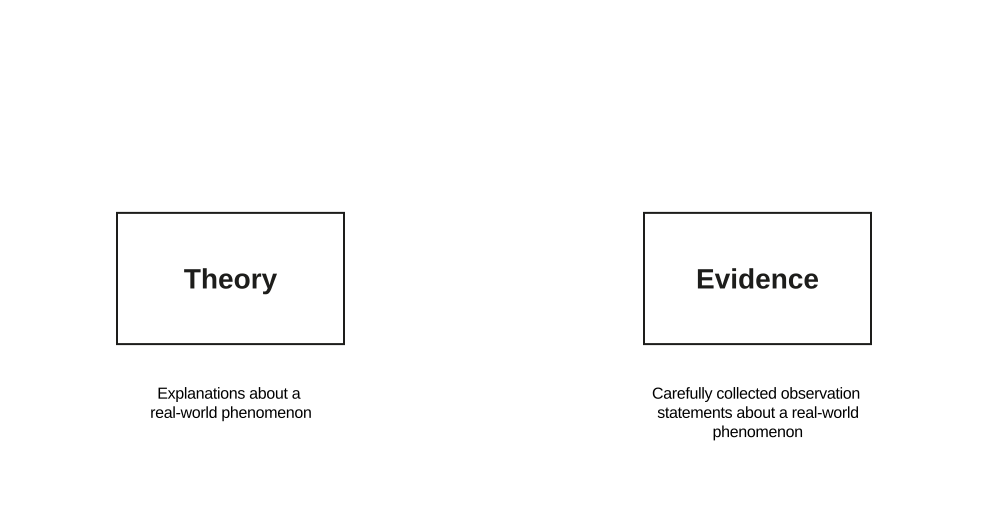
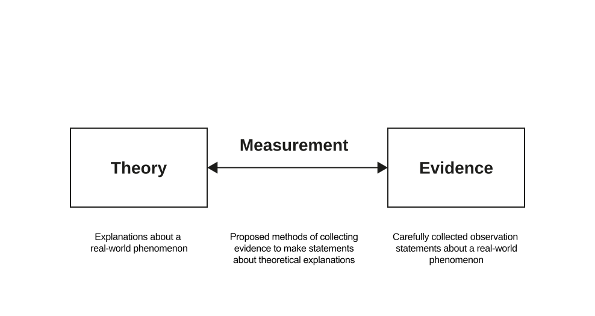
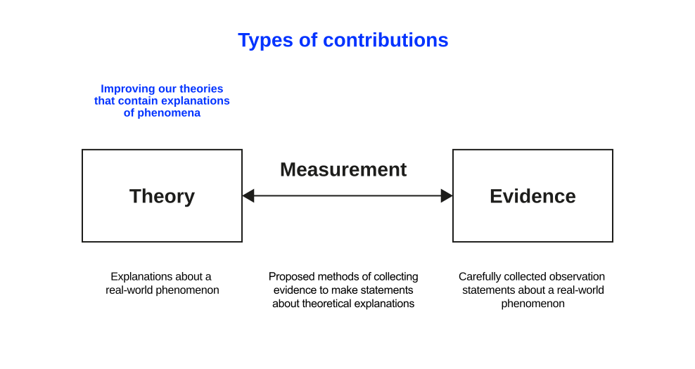
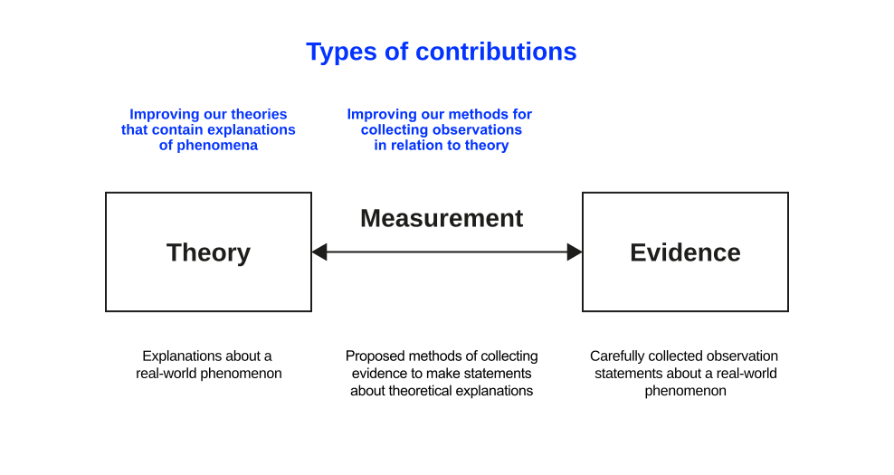
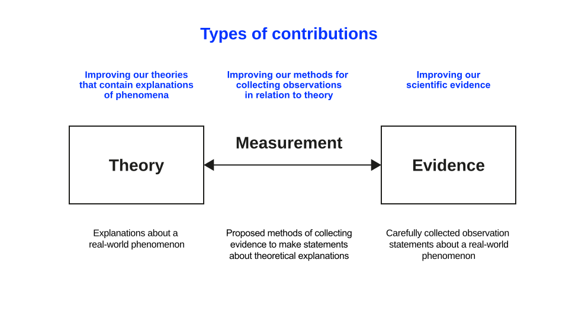

# Opening Remarks {background-color="#0333ff" .headline-only}

-----

:::large
What does it mean to **know** something?
:::

:::fragment
:::large
And what makes a knowledge claim **scientific?**
:::
:::

:::notes
You have spent three weeks listening to several practitioners describe the same challenge from eight different positions, and you have started to name the tension you want to pursue. Before you frame it theoretically, one question needs answering first: what does it even mean to *know* something about that tension, and what would make a claim about it scientific rather than merely a strongly held opinion?

This unit covers the foundation underneath every research method: how we come to know things, and what separates a knowledge claim science can stand behind from one it cannot. Research methods themselves come later.
:::

## Learning Outcomes

By the end of this unit, you will be able to:

::: incremental
- Distinguish ontological (objectivist or subjectivist) and epistemological (positivist or interpretivist) commitments, and name which ones a given research design assumes.
- Apply the four principles of scientific knowledge, replicability, independence, precision, and falsification, to judge whether a claim counts as rigorous.
- Assess what a fast-moving phenomenon like agentic AI demands of these principles that a stable, slow-moving phenomenon does not.
:::

# Science {background-color="#0333ff" .headline-only}

## Origins

:::html-hidden
The history of humankind [@harari2015sapiens]:

:::large
[willingness to admit **ignorance**]{.fragment .fade-in-then-semi-out}\
[+ centrality of **observation**]{.fragment .fade-in-then-semi-out}\
[= acquisition of **new capabilities**]{.fragment .fade-in-then-semi-out}
:::
:::

:::notes
@harari2015sapiens's account of the origins of science and our ability to conquer the world rests on three moves:

1. **The willingness to admit ignorance.** Science assumes that we don't know everything. Even more critically, it accepts that the things we think we know could be proven wrong as we gain more knowledge. No concept, idea, or theory is sacred and beyond challenge.
2. **The centrality of observation.** Having admitted ignorance, science aims to obtain new knowledge. It does so by gathering observations and then using formal tools such as logic or mathematics to connect these observations into comprehensive theories.
3. **The acquisition of new capabilities.** Science goes beyond creating theories: it uses them to acquire new powers, and in particular to develop new technologies.
:::

## Definition

:::large
> Science is the attempt to **derive knowledge** from facts through certain methods in a systematic and organized way. *@recker2021research [p. 17]*
:::

:::notes
Two types of science can be distinguished:

- **Natural sciences** concern the study of naturally occurring phenomena. The phenomena are real and tangible (such as bodies, plants, or matter), though sometimes difficult to observe (e.g., subatomic particles).
- **Social sciences** concern the study of people or collections of people. These sciences are composed of psychology, sociology, organizational science, and economics.
:::

## Types of Sciences

:::html-hidden
:::large
[Natural sciences]{.fragment .highlight-current-blue}\
and [social sciences]{.fragment .highlight-current-blue}
:::

:::fragment
What is the difference?
:::
:::

:::notes
The distinction is important because the research process for the two is very different.

The **natural sciences** are the "exact sciences": these inquiries rely on precise and accurate measurements of phenomena or their properties. In physics, for example, properties such as the speed of light or gravity have been calculated and remain invariant.

The **social sciences** are further removed from precision: phenomena and measurements are often vague, imprecise, non-deterministic, and ambiguous, which produces **measurement error**, the imprecision present in both how a phenomenon is measured and the findings that measurement in turn produces. A study asking whether happy people sleep more or less than unhappy people illustrates the problem: happiness itself resists clean definition, and noise, light, diet, dreams, and dozens of other factors compete with it to explain variation in sleep length.
:::

# Knowledge {background-color="#0333ff" .headline-only}

## Knowledge and Truth

:::large
> We can only know things from our own **perspective.** *Plato*
:::

:::fragment
What can we know, what do we believe?
:::

:::notes
Reality is a subjective experience because we are limited and confined to our own way of seeing things. Plato's allegory of the cave makes the point directly: a person who has never left the cave can never know any other reality. People see things from the perspective of their own "cave."

The Greeks classified knowledge into

- **Doxa**, believed to be true
- **Episteme**, known to be true

Is episteme ever fully possible? Probably only for mathematics, where information does not need to be interpreted. For everything else, current views on knowledge suggest that accepted knowledge claims are those that stand "the force of the better argument" (cf. Habermas), an agreed best understanding produced at a particular point in time (cf. Popper).
:::

## Ontology and Epistemology

. . .

**Ontology** is concerned with assumptions about existence and definitions of reality.

:::incremental
- **Objectivism** is the belief in an external reality whose existence is independent of knowledge of it; the world exists as an independent object waiting to be discovered [@trivedi2021].
- **Subjectivism** is the belief that you cannot know an external or objective reality apart from your subjective awareness of it. Social reality only exists when we experience it and give it meaning [@trivedi2021].
:::

. . .

**Epistemology** is the theory of knowledge, concerned with how we know and what knowledge is.

:::incremental
- **Positivism** is the belief that truth or knowledge can be discovered through valid conceptualization and reliable measurement, which allows the testing of knowledge against the objective world [@trivedi2021].
- **Interpretivism** is the belief that all knowledge is relative to the knower and can only be understood from the point of view of individuals who are directly involved; truth is socially constructed via multiple interpretations by the subjects of knowledge [@trivedi2021].
:::

:::notes
:::callout-note
#### Project Relevance

You do not need to declare a paradigm today. But every research design smuggles in ontological and epistemological commitments whether you name them or not. If your Map of Perspectives treats the eight practitioner accounts as competing windows onto one external truth, you are working from an objectivist, broadly positivist stance. If you treat those accounts as constituting the phenomenon rather than merely describing it, you are closer to subjectivism and interpretivism. Neither stance is wrong. The problem arises when you do not know, or do not say, which one you are working from.
:::
:::

## Exercise {.html-hidden .unnumbered .unlisted background-color="#000" background-image="images/raindance.jpg"}

:::html-hidden
> A rain dance ceremony performed by all participants\
> with a pure heart will cause rain the next day.

:::fragment
::: large
Why is this (not) scientific knowledge?
:::
:::
:::

:::notes
Proposing this theory is not a scientific undertaking because it is not falsifiable. If you perform the ceremony and it rains, the theory is confirmed. If you perform the ceremony and it does not rain, that suggests one of the participants was not pure of heart, and the theory is confirmed again.

Being pure of heart is not a property we can precisely, reliably, and independently measure, so we cannot construct a scenario in which the theory could be disproven.
:::

## Discussion {.unlisted .unnumbered .html-hidden background-color=black}

:::large
What is **scientific knowledge,** then?
:::

## Scientific Knowledge

:::html-hidden
:::fragment
To gain scientific knowledge, sciences need to follow the principles of
:::

:::large
[replicability, ]{.fragment .fade-in}\
[independence, ]{.fragment .fade-in}\
[precision &]{.fragment .fade-in}\
[falsification]{.fragment .fade-in}
:::
:::

:::notes
To gain scientific knowledge, sciences need to follow the principles of replicability, independence, precision, and falsification [@recker2021research].

Replicability
: The extent to which research procedures are repeatable, such that the procedures by which research outputs are created are conducted and documented in a manner that allows others outside the research team to independently repeat the procedures and obtain similar results.

Independence
: The extent to which the research conduct is impartial and freed from any subjective judgement or other bias stemming from the researcher(s).

Precision
: The concepts, constructs, and measurements should be defined as carefully and precisely as possible so that others can build on the research.

Falsification
: Theories are sets of suggested explanations that are assumed to be true because the evidence collected to date does not state otherwise.[^falsification]

[^falsification]: Falsification is probably the most important principle in scientific research. It originates from the thinking of philosopher @popper2005logic, who argued that it is logically impossible to prove theories in scientific research. Instead, he argued that scientific theories can only be disproven or falsified.
:::

## Discussion {background-color=black}

:::medium
What does falsifiability mean when the thing you are studying changes faster than knowledge about it can accumulate?
:::

:::fragment
This is not a hypothetical problem for your project. 

A field as young as agentic AI moves faster than the review cycle of the journals that would report on it. A claim can be well-supported by the evidence available in March and already out of date by October because the phenomenon it described has changed shape, even though the claim itself was never falsified.
:::

:::notes

The four principles still apply. This only sharpens what they demand of you:

- **Precision** requires you to be explicit about *when* a claim was true, not just whether it is true. Boundary conditions in a fast-moving field include a boundary condition in time.
- **Replicability** becomes a claim about a system state, not just a procedure. If a colleague repeated your search or your protocol six months from now, would the underlying phenomenon still be recognizably the same one?
- **Falsification** still applies to the mechanism you propose, even when the specific technology that instantiates it has moved on. A theory that only explains this week's tools cannot generalize beyond them, so it functions as a product review rather than a scientific theory.

Hold this question while you read the literature in the coming weeks. Good reviews of fast-moving fields are explicit about their own shelf life.
:::

# Body of Knowledge {background-color="#0333ff" .headline-only}

## Definition

The body of scientific knowledge in a domain, that is, the outcome of all research to date, is always the **current accumulation of suggested theories, evidence, and measurement methods** in that domain [@recker2021research, p. 20].

. . .

Progress in scientific research, that is, progress in general human knowledge, can be studied by comparing how well we are **improving the body of knowledge**, the current accumulation of theories, evidence, and measurements in a given area.

## Contributions

::: {.r-stack .html-hidden}
![The body of knowledge [@recker2021research, p. 21]](images/contributions-1.svg){.fragment height="420"}

{.fragment height="420"}

{.fragment height="420"}

{.fragment height="420"}

{.fragment height="420"}

{.fragment height="420"}
:::

:::notes
![The body of knowledge [@recker2021research, p. 21]](images/contributions.svg){#fig-contrib}

Researchers can contribute to the body of knowledge in three ways, or combinations of them:

- **Improve our explanation of a particular phenomenon:** creating new or extending existing explanations about a real-world phenomenon (e.g., Darwin's theory of evolution).
- **Improve our collections of scientific evidence:** adding evidence to make statements about theoretical explanations (e.g., Darwin's collection of previously unknown species).
- **Improve our methods for collecting observations in relation to theory:** proposing methods of collecting evidence (e.g., Galileo's improvements of telescopes).

A systematic literature review, the deliverable this module works toward, is itself a route to contribution. It rarely produces new evidence directly, but it can improve explanation (by synthesizing what fragmented studies only implied separately) and improve method (by exposing where the field's existing measurement approaches disagree or fall short). Keep that in mind once you reach the [screening and appraisal](../slr-screening/) stage of your review: what you are screening for is evidence quality, in service of one of these three contributions.
:::

## Conclusion

. . .

:::large
Research aims at **improving scientific knowledge of a particular phenomenon.**
:::

All scientific knowledge is, by definition, a set of suggested explanations of particular phenomena.

# Homework

:::medium
Go back to your individual perspective notes.
:::

Pick one of the eight industry inputs and answer:

1. Which ontological stance does that practitioner's account implicitly take: is the problem "out there" waiting to be discovered, or is it constituted by how people in the organization talk about and act on it?
2. Which epistemological stance follows from that: would you expect this practitioner to trust a large-sample measurement, or a rich account from someone close to the situation, more?
3. If two practitioners you heard from would disagree on the answers to (1) and (2), what does that tell you about the tension you are considering pursuing?

# Q&A {.html-hidden .unlisted background-image="../assets/bg.jpg" .headline-only}

# Literature {visibility="hidden"}

::: {#refs}
:::
