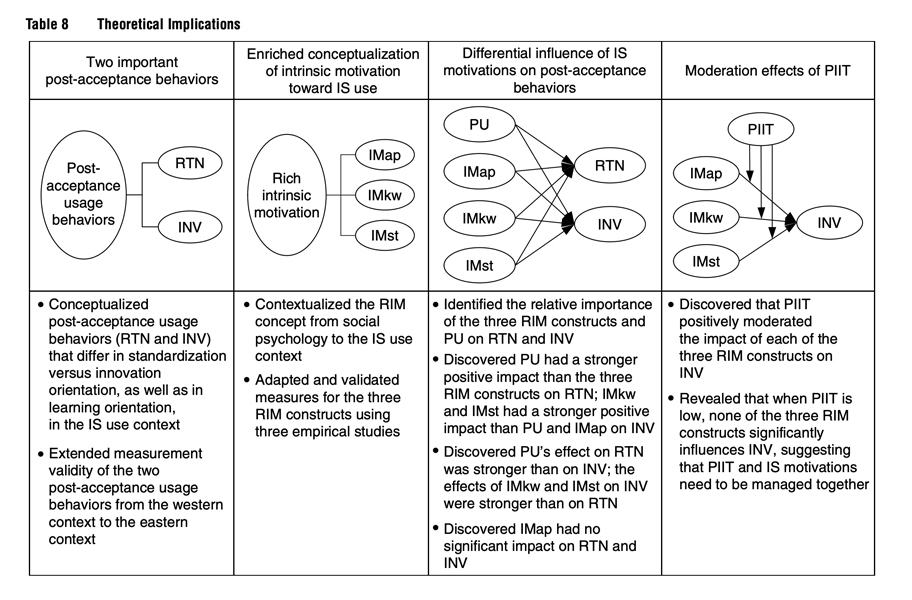

# Opening Remarks {.headline-only}

## Audience Format {.no-headline .vertical-center}

> When developing or revising the structure for your own paper, remember that a good option is always to follow as closely as possible the standard paper structure instead of inventing new structures. Innovative structures are not always well received in the academic community because the novel structure makes reading the paper more difficult. *@recker2021scientific [p. 178]*

:::notes
You have a concept matrix and a synthesis from the previous unit. This unit is about the container that carries it to a reader: what a paper in your field is expected to look like, and why departing from that expectation costs you more than it earns you.
:::

## Learning Outcomes

By the end of this unit, you will be able to:

::: incremental
- Map your review's sections onto the canonical structure your paper template requires, rather than inventing a novel structure or importing an empirical paper's.
- Diagnose where a real, published review deviates from that canonical structure and why, and judge whether a given deviation is worth borrowing or is a genre convention your own template does not allow.
- Write an introduction using the six-paragraph formula, hook, background, tension, resolution, contribution, outline, and a discussion that explains, abstracts, and theorizes findings rather than only restating them.
:::

# Structure {.headline-only}

## Structure's Function

:::medium
Science is about new ideas in old formats.
:::

. . .

Reviewers and readers are accustomed to certain ways of reading an article, the so-called "script" [@grover2015new].

. . .

Innovative structures are not always well received by scholars because the novel structure makes the paper difficult to read.

. . .

An innovative structure **distracts from the content**, forcing readers to focus more on the structure, which leaves them less capacity to focus on the content [@recker2021scientific].

. . .

Thus, a good rule is to follow the script and make only mindful variations.

## For Comparison {.smaller .scrollable}

Two paper types you will cite constantly but not write in this module:

::::columns
:::{.column width="50%"}
| Section | Content |
|---|---|
| Introduction | [Problem statement, gap, RQ, approach, contributions]{.fragment} |
| Background | [Literature, gap, general theory]{.fragment} |
| Theory | [Assumptions, propositions, hypotheses]{.fragment} |
| Methodology | [Sampling, data collection and analysis]{.fragment} |
| Findings | [Descriptive results of the analysis]{.fragment} |
| Discussion | [RQ answers, contributions, limitations]{.fragment} |
| Conclusion | [Closing frame]{.fragment} |

: Empirical paper {#tbl-empirical-structure}
:::
:::{.column width="50%"}
| Section | Content |
|---|---|
| Introduction | [Problem statement, gap, RQ, approach, contributions]{.fragment} |
| Background | [Research context, what's known about the artifact]{.fragment} |
| Justification | [Theory informing the design]{.fragment} |
| Methodology | [Design science research approach]{.fragment} |
| Specification | [Meta-requirements, testable design properties]{.fragment} |
| Instantiation | [The artifact, system, or method itself]{.fragment} |
| Evaluation | [Test of the artifact]{.fragment} |
| Discussion | [Contributions, limitations, further research]{.fragment} |
| Conclusion | [Closing frame]{.fragment} |

: Design science paper {#tbl-dsr-structure}
:::
::::

## The Review Structure {.smaller}

| Section | Content |
|---|---|
| Introduction | [The motivation must justify reviewing, not just justify caring about the topic]{.fragment} |
| Conceptual background | [Definition and boundaries of the focal concept, plus the theoretical lens if there is one]{.fragment} |
| Review method | [Review type and scope, search strategy, inclusion/exclusion criteria, selection process, quality appraisal, data extraction and analysis]{.fragment} |
| Descriptive results | [The bibliometric layer: publications over time, outlets, geographies, methods, theories mobilized]{.fragment} |
| Synthesis of findings | [Concept-centric, not author-centric: a framework, typology, process model, or set of tensions across the corpus]{.fragment} |
| Discussion | [What we collectively know, what the synthesis adds, and a research agenda with gaps derived visibly from the concept matrix. Plus limitations of the review and a closing frame]{.fragment} |
| Appendices | [Protocol, search documentation, selection counts, coding scheme, corpus, intercoder agreement]{.fragment} |

: The canonical structure of a systematic literature review, per your paper template and the reporting conventions described by @webster2002analyzing and the review typology of @pare2015synthesizing {#tbl-review-structure}

:::notes
This is the structure your own paper needs to follow, section by section, in this order. It is not the same table as the empirical and design science ones: three rows here (conceptual background, descriptive results, appendices) have no clean empirical-paper equivalent, and two rows there (theory, findings-as-primary-data) have no place here at all. A review's theoretical work happens inside the synthesis, by organizing and reconciling what the literature already reports, not by proposing new hypotheses. Discussion absorbs what a separate limitations-and-conclusion section would otherwise cover: this section closes the whole paper, not just the synthesis.

The Review Method row's "scope" entry restates, rather than re-decides, the six Cooper dimensions argued for in [SLR I](../slr-types/).
:::

## How Reviews Differ

Relative to an empirical paper:

::: incremental
- **Dropped:** *Theory* (no new hypotheses to propose) and *Findings* (no primary data, a review reports on the literature, not on data it collected).
- **New:** *Conceptual Background* (makes your inclusion and exclusion criteria defensible later) and *Descriptive Results* (the corpus' bibliometric profile).
- **Renamed:** *Methodology* becomes *Review Method* (the method *is* the search, screening, and appraisal process you already ran and documented in your *Review Protocol*) and *Findings* becomes *Synthesis of Findings* (remember: concept-centric not author-centric) [@webster2002analyzing].
- **Merged:** *Limitations* and *Conclusion* sit inside *Discussion*, not as separate sections of their own.
:::

:::notes
This is why your *Review Protocol* from [SLR I](../slr-types/) through [SLR III](../slr-screening/) is not some secondary material, but actually your review method section, condensed and made reportable. It is also why the transparency this section demands is exactly what got your own protocol reproduced by another team in [Peer-Review Workshop II](../peer-review-2/): a review earns the label "systematic" by being rerunnable, and rerunnability starts with what you choose to report here [@templier2018transparency; @vombrocke2015standing].
:::

## Examples

:::medium
Real reviews deviate from the canonical structure. The question is whether the deviation is worth copying.
:::

:::notes
None of the four examples below matches @tbl-review-structure exactly. Some skip a section, some split one section into several, some rename every section after its own content instead of using generic labels. What matters is not matching the table line for line, it is knowing, for each gap, whether it reflects a legitimate choice for a different review type or a genre convention your own template does not allow.
:::

## Example: Hund et al. (2021)

Digital innovation, 227 articles, *The Journal of Strategic Information Systems*. The fullest match to @tbl-review-structure of any example here, and it still deviates.

::: incremental
- No separate *Conceptual Background* (the definition is a *Finding*, derived inductively, not stated upfront; defensible for a grounded-theory review; most teams need this section before, not after).
- No separate *Descriptive Results* (folded into the *Review Method* section's search table).
- *Findings* reported in two chapters ("A fresh perspective on..." and "Current themes...: A framework").
- Research agenda gets its own section, "Avenues for future research," not embedded in *Discussion* (remarkable: named avenues each traced to a gap table).
- *Discussion*, *Avenues for future research*, *Limitations*, and *Conclusion* are four separate sections; your template folds all of this into one *Discussion*.
:::

:::notes
You already read this paper closely in [What Is Theorizing](../theorizing/) (U8), analyzing how it theorizes. Its Appendix B, excerpt to open code to axial code to selective code, is a directly reusable model for your own coding scheme.
:::

## Example: de Reuver et al. (2018)

Digital platforms, *Journal of Information Technology*. Best model here for Conceptual background: "Conceptualisations of digital platforms" defines and bounds the concept, with a definitions table, before anything else happens.

::: incremental
- No *Review Method* section at all, no database, no search string, no screening counts. Reads as an expert narrative synthesis, not a systematic search.
- *Discussion* is six explicit forward-looking questions, a strong model for a research-agenda-heavy *Discussion*, just not formatted as propositions or a table.
:::

:::fragment
Use this as a role model for its *Conceptual Background*, not as a review to structurally clone. Without a documented search, it cannot claim what your assignment's review method criteria require: that a reader could rerun it and land on approximately the same corpus.
:::

## Example: Duan et al. (2019)

AI for decision making, *International Journal of Information Management*. Best model here for a propositions-based research agenda: twelve numbered propositions, grouped into three themes.

::: incremental
- Labeled an **Opinion Paper** by the journal itself, not a review.
- Its one search-like step covers only its own journal's back catalogue, a 'toy-scale' illustration of screening logic, not a multi-database search.
:::

:::fragment
Use this one specifically for the *shape* of a propositions-driven Discussion, one proposition per identified gap, grouped by theme, exactly the format we suggest. However, do not take it as evidence for what a *Review Method* section should contain.
:::

## Example: Kellogg et al. (2020)

Algorithmic control at work, *Academy of Management Annals*. Best model here for synthesis as a typology: the "6 Rs" framework is named for its own contribution, not for the generic word *Findings*.

::: incremental
- *Method* exists, Web of Science and Google Scholar, over 1,100 articles, but sits in a one-paragraph appendix at the very end, not a body section.
:::

:::fragment
Borrow the idea that synthesis can output a typology, not only a thematic framework the way Hund et al.'s does.
:::

## Exercise {.unlisted .unnumbered .html-hidden .discussion-slide}

An invented paper's table of contents, headings only:

1. Introduction
2. Related Work
3. System Design
4. Evaluation
5. Threats to Validity
6. Conclusion

Map these six headings onto @tbl-review-structure. Which review-structure section does each one correspond to, if any? Which review-structure section has no match here, and why might that be?



## Macro-Structure (Empirical Papers) {visibility="hidden"}

The structure of many empirical papers can be further abstracted to a macro-structure.

| Section | Associated headings |
|---|---|
| Introduction | Introduction Motivation Problem statement |
| Theoretical front end | Background Conceptual development Hypotheses development Literature review Research hypotheses Research model Research questions Theory Theoretical background Theoretical development Theoretical model |
| Method | Analysis Data collection Methodology Methods Model testing Procedure Research methodology |
| Findings | Findings Results |
| Implications | Contributions Discussion Future research Implications Implications for practice Limitations Practical implications Recommendations Theoretical implications |

: Macro-structure [@tams2010effect] {#tbl-macro}

## Exercise {.unlisted .unnumbered .html-hidden background-color="#000"}

Select two papers relevant to your review and analyze them.

:::large
What commonalities in structure do you observe?
:::

Take 5 minutes to discuss your results with your team. Prepare to present your insights.

# Section Guidance {.headline-only}

## Introduction

### Function

Capture the reader's curiosity and set the right frame [@kane2022write].

. . .

:::large
The **expectations of the readers** are set here.
:::

::: incremental
- Answer the questions, "What does the literature get wrong?" and "Why does it matter?"
- Outline how to correct these inadequacies.
- Put the study in the context of previous research, but keep it concise.[^concise]
- Good introductions are short.[^short]
- Do not include a summary of the paper.
:::

[^short]: Introductions in articles should be no longer than 2.5 pages [@baird2021writing].
[^concise]: Say only what the reader needs to know to understand the work at hand.

### Motivation

::: large
Motivate your research with a [hook]{.link-color}, not a gap.
:::

. . .

The **gap** is usually the argument that something hasn't been done yet. Necessary, but not sufficient, since some things should not be done [@grant2011publishing].

. . .

The **hook** is a strategy to find a problem that someone cares about [@grant2011publishing].

:::notes
A hook

- resolves a contradiction in the literature,
- expands the literature to include specific, important phenomena, understandings, or contexts, and why,
- resolves a puzzle for practitioners that is important but not yet addressed, and/or
- demonstrates how the existing literature can mislead our thinking.

For a review specifically, your template is direct about this: "the motivation must justify reviewing, not just justify caring about the topic." The question you raise has to be a question *about the literature*, not only about the phenomenon, and your scope has to be stated, not implied. @hund2021digital's introduction does this cleanly: two numbered research questions, what constitutes digital innovation, and what themes and gaps run across it, framed against a stated problem, cross-disciplinary research on digital innovation is fragmented and lacks a shared vocabulary, not just "digital innovation matters."
:::

### Formula

Based on @baird2021writing and @recker2021scientific, the following "script" can be derived:

::: incremental
- Paragraph 1, **Hook:** What is the context of this research? Why is it interesting or why does it matter?
- Paragraph 2, **Background:** Synthesis of research relevant to your area, target audience, and objective.
- Paragraph 3, **Tension:** What is unresolved? What am I going to get wrong if I don't read this paper?
- Paragraph 4, **Resolution:** How is this paper going to resolve this issue? (objective, theory, and design)
- Paragraph 5, **Contribution:** What is the expected contribution?
- Paragraph 6, **Outline:** How is the rest of the paper structured?
:::

:::notes
Mapped onto @hund2021digital's actual introduction: hook is the cross-disciplinary interest in digital innovation, tension is the lack of a shared vocabulary and conceptual clarity, resolution is the review's own new definition and framework, and the outline paragraph previews the method and the structure of findings that follow, the same six beats, in order.
:::

## Conceptual Background

### Function

:::medium
For a review, this section defines and bounds the concept you are reviewing, and states the theoretical lens if you have one.
:::

. . .

Your template is explicit about why: this is **what makes the inclusion and exclusion criteria that follow defensible later**. A reader has to be able to see, before you screen a single paper, why a study counts as being about your focal concept and why another one does not.

::: incremental
- relevant prior theory, assumptions and tensions,
- the concepts you need, defined clearly enough to operationalize as search terms and screening criteria, and
- the theoretical lens, if any, you will use to organize and interpret the literature.
:::

:::notes
@dereuver2018digital is the strongest model among this unit's examples for this specific section: "Conceptualisations of digital platforms" defines and bounds the concept, with a table of competing definitions, before anything else happens in the paper. @hund2021digital, by contrast, has no separate section like this at all, its definition emerges as a finding, which is defensible for a grounded-theory review but not a substitute for this section in a more conventional one.
:::

::::notes
:::{.callout-note}
#### Writing the Background Section
- Organize the section according to topics, not as a list of studies.
- Discuss related work, rather than just listing it.
- Explain how your work complements others' work, and how it contradicts previous work.
- Highlight areas in which your work builds on others' work. Keep it concise.
- In the last section, briefly summarize what is known, but also what is either not known or assumed and needs to be revised (in this paper).
:::
::::

### Exercise {.unlisted .unnumbered .html-hidden .discussion-slide}

An illustrative weak background paragraph:

> Much research exists on chatbots. Some studies look at trust, some look at adoption, and some look at design. Chatbots are used in many industries. This section reviews the literature on chatbots.

Check it against the tips above. Name at least three things missing, then rewrite one sentence to fix one of them.



## Review Method

### Function

This section is your Review Protocol, made concrete and reportable.

. . .

:::larger
Here you show [how]{.link-color} the review was carried out, in enough detail to rerun it.
:::

::: incremental
- Justify your review type, not just name it [@pare2015synthesizing].
- Document your search strategy: databases, search strings, and the forward and backward search you ran [@vombrocke2015standing].
- State your screening process and inclusion/exclusion criteria as rules, and your quality-appraisal approach.
- Describe your coding scheme: extraction fields, a priori codes, and how disagreements were resolved.
:::

:::notes
"Justify, not just name" matters concretely: @hund2021digital does not just say "broad theorizing review," it cites Leidner (2018) to argue why that type fits a fragmented, undertheorized field, then documents a full five-stage process, Define, Search, Select, Analyze, Present, with exact counts at each stage. Its Appendix B, excerpt to open code to axial code to selective code, is a directly reusable model for documenting your own coding scheme.

One thing not to copy from it: your assignment criteria require a subsample coded independently by both authors, with the agreement measure reported. Hund et al.'s intersubjectivity check is a four-author consensus discussion instead, a legitimate choice for that paper, not what your own protocol committed to.
:::

### Descriptive Results

:::medium
A short, separate section profiling the corpus itself, not yet its content.
:::

::: incremental
- Publications over time.
- Outlets and, where relevant, geographies.
- Methods used and theories mobilized across the corpus.
:::

:::notes
Your template says to keep this short, and it means it: this is a profile of *what you found*, not an analysis of *what it says*, that is the next section's job. @hund2021digital folds this into its Method section's search table rather than giving it a section of its own; your template treats it as mandatory and distinct, so do not skip it the way that example does.
:::

### Synthesis of Findings

:::medium
The heart of the paper, and per your template, its longest section.
:::

::: incremental
- Concept-centric, not author-centric [@webster2002analyzing]: organized by the concept matrix from [SLR IV](../slr-synthesis/), not by summarizing paper after paper.
- The output is a framework, a typology, a process model, or a set of tensions and contradictions across the corpus, your template names all four as legitimate.
:::

:::notes
Two of this unit's examples model different legitimate output types. @hund2021digital produces a framework, five named themes, each with its own table, built up across two renamed sections rather than one section called "Findings." @kellogg2020algorithms produces a typology instead, the "6 Rs" of algorithmic control, presented as a single named diagram rather than a set of thematic subsections. Neither is more correct than the other; the template's own list makes room for both.

If the conceptual background and the review method together take up more room in your draft than this section, you have written a protocol, not a review.
:::

## Discussion

### Function

This section is all about the contributions and implications, and, per your template, closes the paper: it is where limitations and the conclusion belong too, not in sections of their own.

. . .

:::large
Here the paper becomes [most interesting]{.link-color}.
:::

::: incremental
- It usually starts with a summary of the main findings.
- Then proceeds with their interpretation (sensemaking, **present tense**): what do they actually mean? Why did you get the results that you obtained?
- **Explain** results: why did you find what you found?
- **Abstract** the results to concepts: what does it mean in a larger view?
- **Theorize** the results: what do they tell us about the existing or new theory?
:::

### Worked Example

@hund2021digital's Discussion opens with three numbered contributions, each explaining what the synthesis produces, not restating it.

::: incremental
- **First:** the new definition and reframing overcomes four specific conceptual ambiguities in existing definitions, not just adds one more to the pile.
- **Second:** relating central concepts, digitization, digitalization, ontological reversal, to the new conceptualization lets future research position itself explicitly on a technical-to-social continuum.
- **Third:** organizing 227 articles across eight disciplines around five themes takes a concrete step toward a shared vocabulary for a field that lacked one.
:::

:::notes
Notice the shape of each: state what the finding *does* for a reader, not just what it *is*. "We found five themes" restates a finding. "Organizing research around five themes takes a step toward a shared vocabulary for a fragmented field" theorizes it, exactly the explain, abstract, theorize move from the Function slide.
:::

### Formula

Start by reminding the reader of the area of focus and the tension [@baird2021writing].

. . .

**Implications for research (theoretical contributions)**

::: incremental
- Start with the primary finding, explain how it relates to prior research, and its implications.
- Add secondary findings, and how they extend research and its implications.
:::

. . .

**Implications for practice (practical contributions)**

::: incremental
- How might your primary finding be applied by practitioners?
- How about your secondary findings?
:::

. . .

**Research agenda**

::: incremental
- Name gaps that trace visibly back to your concept matrix, not general calls for "more research."
- State them as propositions or a table of research questions with a suggested approach for each, your template's own suggestion, these are the candidates for your work in semester 2 and 3.
:::

:::notes
@duan2019artificial is the clearest model for this specific move among this unit's examples: twelve numbered propositions, grouped into three themes, each grounded in a specific claim from the literature discussed just before it. @hund2021digital sets a comparable bar differently, two named avenues, each with its own table of concrete research questions, though it gives the agenda its own section rather than embedding it here. Keep yours inside Discussion, per your template, but aim for the same traceability either example shows.
:::

### Visualization

:::notes
Implications should be visualized to enhance understanding and make them catchy.
:::

{#fig-visualization}

### Limitations and Conclusion

:::medium
The closing part of Discussion, per your template: limitations of the review, then the closing frame.
:::

::: incremental
- Limitations **of the review**, search bias, database coverage, publication bias, coder subjectivity, not of the primary studies you reviewed.
- The conclusion itself is often not much more than an abstract statement, no new details, that reflects on the contribution and closes the frame [@recker2021scientific].
:::

:::notes
@hund2021digital's Limitations section names three concrete, review-specific ones: the breadth-over-depth trade-off inherent to a broad theorizing review, the risk of human coding error, and a corpus skewed toward qualitative approaches. Notice what is absent: nothing about whether the *primary studies it reviewed* had good or bad methods, that critique belongs to those studies' own limitations sections, not to this one.

One structural choice not to copy: @hund2021digital keeps Discussion, its research agenda, Limitations, and Conclusion as four separate sections. Your template folds all of it into Discussion; follow the template.
:::

# Homework

:::medium
Outline your own paper, section by section, using @tbl-review-structure.
:::

For each section, write two to three bullet points of what will actually go there, not the generic description, your own content plan. Bring this outline to the next coaching slot.

# Q&A {.vertical-center .html-hidden .headline-only}

# Literature {visibility="hidden"}

::: {#refs}
:::
