# Opening Remarks {.headline-only background-color="#0333ff"}

## Recognising Theory {.vertical-center .no-headline background-color="#0333ff"}

:::large
A theory is a general and abstract account of something.
:::

:::notes
You will read a lot of literature in the coming weeks, some of it genuine theory and some of it description, a model, or a hypothesis dressed up in theoretical language. Telling the two apart matters directly for your review, since identifying what kind of contribution a paper makes is the same skill as identifying what your own review contributes.
:::

## Learning Outcomes

By the end of this unit, you will be able to:

::: incremental
- Distinguish a genuine theory from data, description, hypotheses, or a model, and identify which of Gregor's five types a given theoretical claim belongs to.
- Name a theory's constructs, propositions, logic, and boundary conditions, and use boundary conditions to judge where the theory's validity actually holds.
- Decide which theory type your own research question needs, and which type a given review is positioned to produce.
:::

# Concepts {.headline-only background-color="#0333ff"}

## What Do You See? {.unlisted .unnumbered .html-hidden background-color="black"}

::: {.r-stack .html-hidden}
{.fragment height="420"}

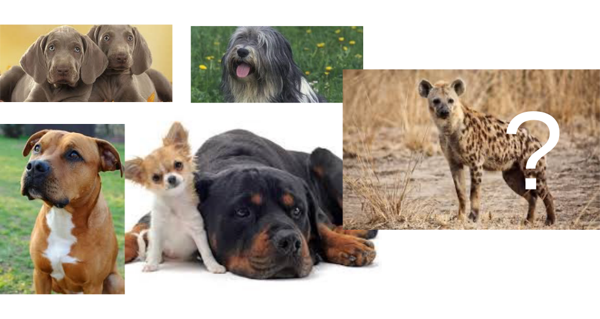{.fragment height="420"}
:::

## Definition

A concept is an abstract idea, notion, or mental representation that represents a specific category of objects, events, behaviors, or phenomena [@podsakoff2016recommendations].

:::: html-hidden
::: fragment
::: large
Concepts are fundamental to human cognition and communication **and to research in particular.**
:::
:::
::::

:::notes
Concepts are fundamental to

- human cognition and communication in general, as they enable us to organize and make sense of the complex world around us; and
- research in the organizational, behavioral, and social sciences, as they serve as a **building block for theories, hypotheses, and empirical investigations** [@podsakoff2016recommendations].

Concepts can vary in complexity, ranging from simple and well-defined ideas to more complex and multidimensional constructs. They are typically developed based on experience, that

- can be of *real phenomena* (e.g., weight) as well as of some *latent phenomena* that we can agree upon (e.g., usefulness), and
- can be linked to one another via propositions.
:::

## Visualization

::: {.r-stack .html-hidden}
![Concepts in the scientific research process (based on @recker2021research [p. 26])](images/concept-1.svg){.fragment height="420"}

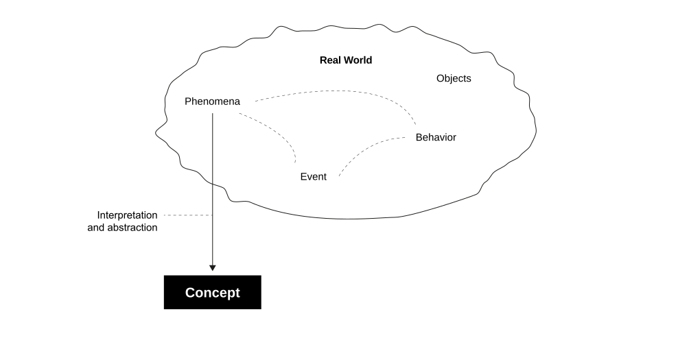{.fragment height="420"}

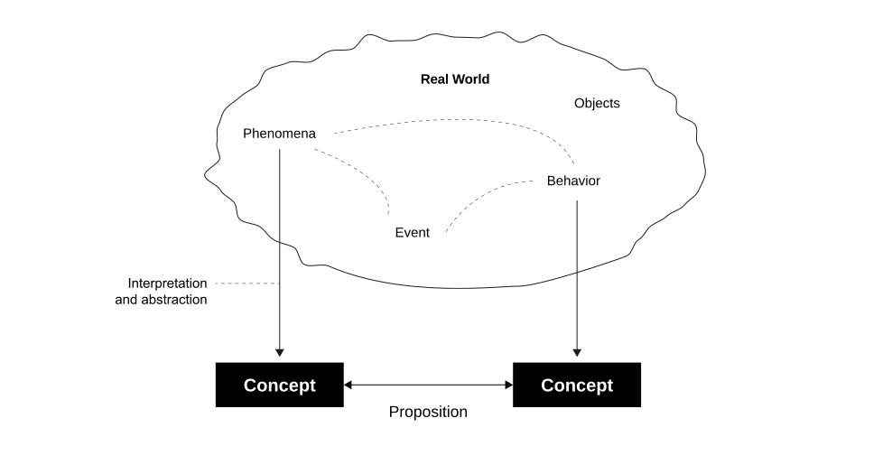{.fragment height="420"}
:::

:::notes
![Concepts in the scientific research process (based on @recker2021research [p. 26])](images/concept.svg){#fig-concept}
:::

## Guidelines

@podsakoff2016recommendations propose a set of recommendations for creating better concept definitions:

:::: html-hidden
::: large
[clear and precise,]{.fragment .fade-in-then-semi-out}\
[differentiated,]{.fragment .fade-in-then-semi-out}\
[explicit &]{.fragment .fade-in-then-semi-out}\
[theoretically founded]{.fragment .fade-in-then-semi-out}
:::
::::

:::notes
Clarity and precision
: Concept definitions should be clear, concise, and unambiguous. Authors should avoid jargon and complex language that might obscure the intended meaning.

Differentiation
: Concepts should be clearly differentiated from related concepts. Authors should explicitly state the boundaries of the concept and explain how it differs from similar terms.

Explicitness
: Authors should explicitly specify the elements, dimensions, or components that constitute the concept.

Theoretical foundation
: Concept definitions should be grounded in relevant theories and existing literature. Authors should connect their definitions to established concepts and frameworks.

Measurement implications
: Authors should consider the practical implications of their concept definitions for measurement. A well-defined concept should have clear measurement indicators.
:::

## Operationalization

::: {.r-stack .html-hidden}
![Operationalization of concepts (based on @recker2021research [p. 26])](images/operationalization-1.svg){.fragment height="420"}

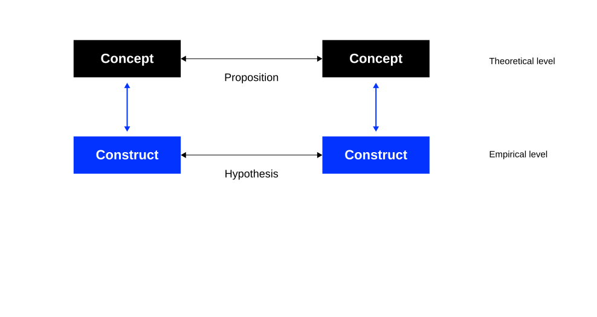{.fragment height="420"}

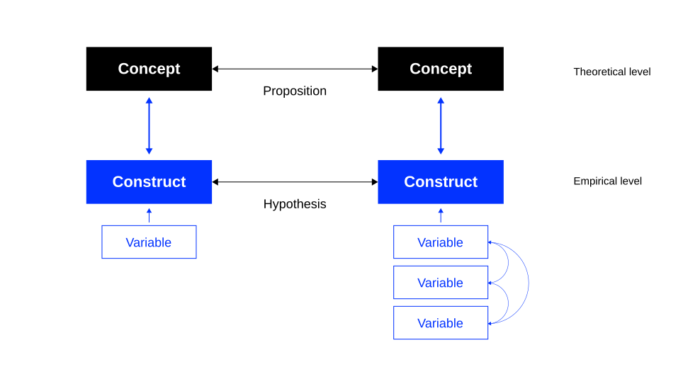{.fragment height="420"}
:::

:::notes
Concepts need to be operationalized to something in the real world that can be measured. The concept education, for instance, could be operationalized as "highest degree earned," which in turn could be measured by ascertaining what type of course a person had completed [@recker2021research].

Most constructs are composed of a multidimensional set of underlying concepts. Intelligence, for example, can hardly be measured with just one variable, since it includes abstract thinking, comprehension, communication, reasoning, learning, and problem solving, among others. We call such constructs multidimensional constructs because they have multiple underlying dimensions, all of which need to be measured separately through specific variables.

![Operationalization of concepts (based on @recker2021research [p. 26])](images/operationalization.svg){#fig-operationalization}
:::

# Theory {.headline-only background-color="#0333ff"}

::: html-hidden
A theory is a general and abstract account of something.
:::

## Definition

@sutton1995theory define theory as a comprehensive framework that [goes beyond simple descriptions, hypotheses, data, or metaphors]{.fragment .highlight-current-blue}. A true theory [provides a systematic and explanatory understanding of a set of phenomena]{.fragment .highlight-current-blue}, offering insights into the underlying mechanisms and causal relationships.

::: incremental
- Theory is about **the connections between phenomena,** a story about why actions, events, structures, and thoughts occur.
- Theory emphasizes **the nature of causal relationships** by determining what occurs first and the timing of such events.
- Theory delves into the underlying processes to understand **the systematic reasons for a particular event or non-event.**
- Theory is usually accompanied by **a series of convincing and logically coherent arguments.**
:::

## Common Misconceptions

@sutton1995theory argue that theory is often misunderstood and misused in academic and scholarly contexts. They provide a clear distinction between what theory is and what it is not:

:::: html-hidden
::: large
[Universal]{.fragment .strike}, [data]{.fragment .strike}, [descriptive]{.fragment .strike}, [hypotheses]{.fragment .strike}, [models]{.fragment .strike}, [design]{.fragment .strike}
:::
::::

:::notes
Theory is not data
: Data alone is not theory. Data provides evidence and information, but theory involves interpreting and making sense of the data by providing underlying principles or causal mechanisms.

Theory is not descriptive
: Theory is not merely a description of observed phenomena. It goes beyond summarizing empirical findings and involves explaining why and how certain patterns or relationships occur.

Theory is not hypotheses
: While hypotheses are specific statements or predictions derived from theory, theory itself is a broader framework that provides a coherent explanation for a set of related phenomena (*the why*).

Theory is not trivial insights
: Theory should offer more than just common-sense observations. A true theory provides a systematic and organized understanding that extends beyond obvious observations.

Theory is not model building
: While models can illustrate the components and relationships within a theory, creating models is not the same as developing a theory. Theory involves explaining the logic and rationale behind the model.
:::

## Function

::: large
Theories guide and give meaning to what we see.
:::

::: incremental
- Help to organize relevant empirical facts (i.e., what can be observed and measured) to provide description, explanation, or prediction of phenomena.
- Allow us to generalize from "the known" to "the unknown."
:::

## Scientific Theories

According to @bacharach1989organizational, a scientific theory

::: incremental
- helps us to synthesize prior empirical findings and to reconcile contradictory findings by discovering contingent factors;
- can be empirically tested using scientific methods;
- needs to be able to be falsified, but not necessarily to be proven positive;
- offers guidance for future research by helping identify constructs (reflecting concepts) and hypotheses (relationships between the constructs);
- contributes to cumulative knowledge by bridging gaps between theories and causing existing theories to be re-evaluated.
:::

## Levels of Theory

::: {.r-stack .html-hidden}
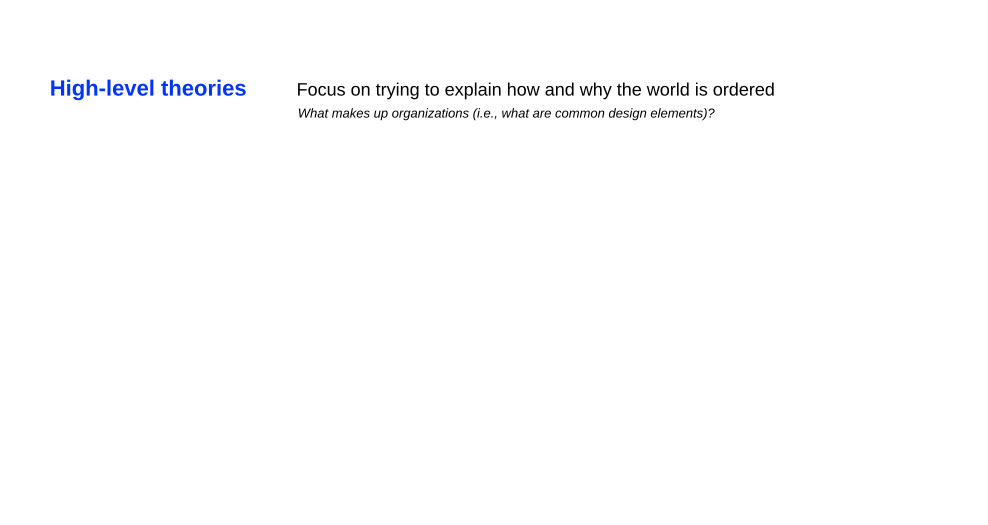{.fragment height="420"}

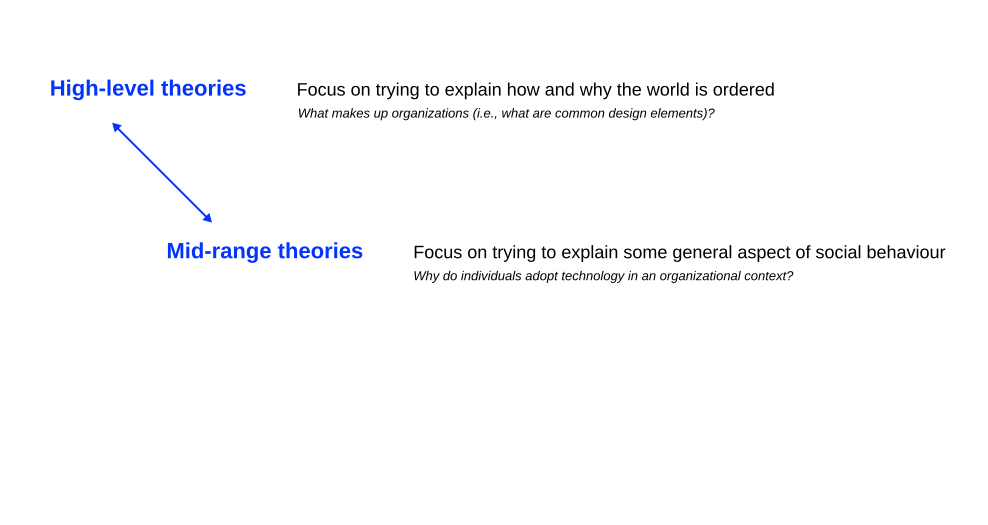{.fragment height="420"}

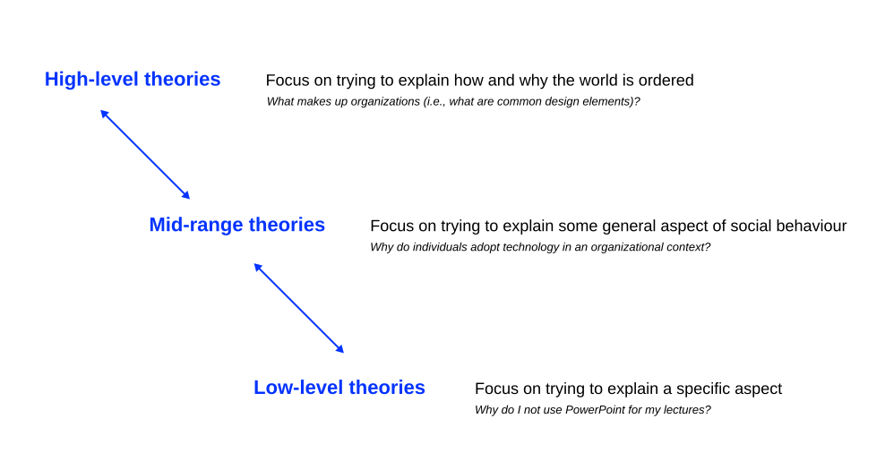{.fragment height="420"}
:::

:::notes
{#fig-levels}

High-level theories are usually known by their more common label, "perspectives." A perspective is a way of looking at and understanding the world or social constructions within it. Different researchers, working within different perspectives, construct different theories about the nature of that world. Mid-range and low-level theories are often based on the principles underpinning these perspectives.
:::

## Types of Theory

:::: html-hidden
::: large
[Analysis]{.fragment .fade-in-then-semi-out}\
[Explanation]{.fragment .fade-in-then-semi-out}\
[Prediction]{.fragment .fade-in-then-semi-out}\
[Explanation & prediction]{.fragment .fade-in-then-semi-out}\
[Design & action]{.fragment .fade-in-then-semi-out}
:::
::::

:::notes
@gregor2006nature elaborates five types of theories used in information systems research.

I Analysis
: The theory says **what is.** It does not extend beyond analysis and description. No causal relationships among phenomena are specified and no predictions are made. Example: Gregor's own typology of theory.

II Explanation
: The theory says **what is, how, why, when, and where.** It provides explanations but does not aim to predict with precision. There are no testable propositions. Example: Adaptive Structuration Theory.

III Prediction
: The theory says **what is and what will be.** It provides predictions and has testable propositions but does not have well developed justificatory causal explanations. Example: Moore's Law.

IV Explanation and prediction
: The theory says **what is, how, why, when, where, and what will be.** It provides predictions and has both testable propositions and causal explanations. Example: Technology Acceptance Model (TAM).

V Design and action
: The theory says **how to do something.** It gives explicit prescriptions (methods, techniques, principles of form and function) for constructing an artifact. Example: Progressive Learning Theory, "learning by doing."
:::

## Known Theories {.unlisted .unnumbered .html-hidden background-color="#000" background-image="images/bigbang.jpg"}

# Building Blocks {.headline-only background-color="#0333ff"}

## Concepts and Constructs

::: large
The "what" of theories.
:::

:::notes
Concepts and constructs form the "what" of theories [@whetten1989constitutes].
:::

::: incremental
- A construct is the operationalization of a concept that is chosen to explain the phenomenon [@podsakoff2016recommendations].
- Constructs must have a clear and **unambiguous operational definition** that specifies exactly how the construct will be measured and at what level of analysis (individual, group, organizational, etc.).
- The constructs included in a theory must be **equally comprehensive and parsimonious,** all relevant concepts are included, but only those that enhance understanding [@whetten1989constitutes].
:::

## Propositions and Hypotheses

::: large
The "how" of theories.
:::

:::notes
Propositions and hypotheses form the "how" of theories.
:::

. . .

Propositions are associations postulated at the theoretical level (they relate concepts), hypotheses are tested at the empirical level (they relate constructs) [@whetten1989constitutes].

::: incremental
- Propositions are stated in **declarative form** and should ideally indicate a cause-effect relationship (e.g., if X occurs, then Y will follow).
- Propositions may be speculative but must be testable, and should be rejected if they are not supported by empirical observations.
:::

## Nomological Nets

::: {.r-stack .html-hidden}
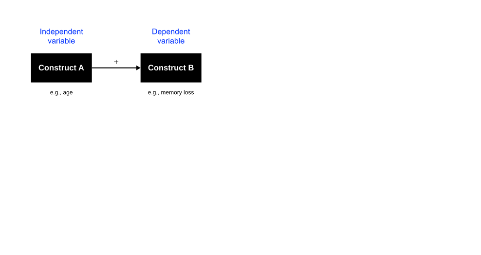{.fragment height="420"}

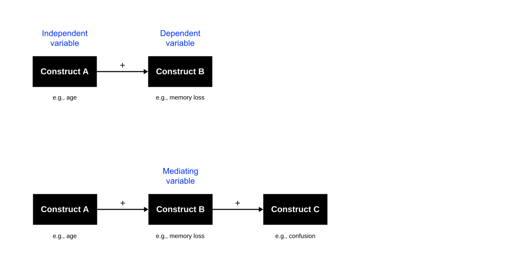{.fragment height="420"}

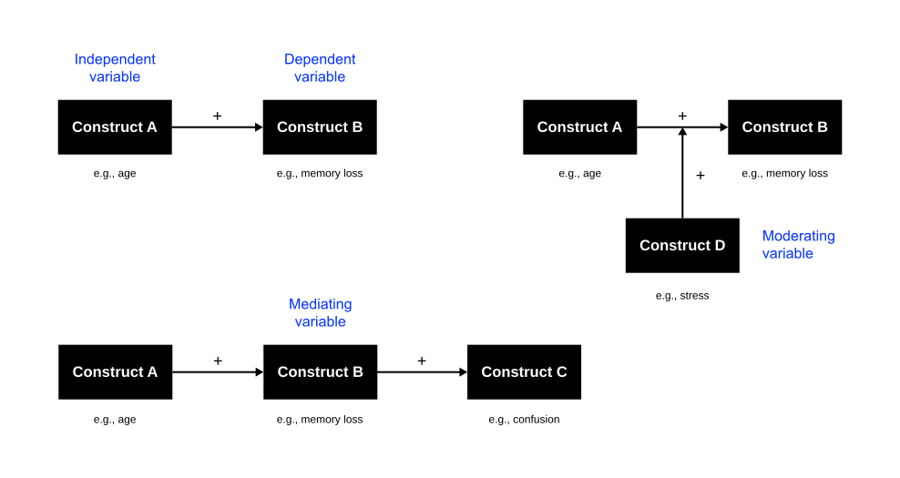{.fragment height="420"}
:::

:::notes
{#fig-variable-roles}
:::

## Logic

::: large
The "why" of theories.
:::

. . .

The logic provides the basis for justifying the propositions as postulated [@whetten1989constitutes].

::: incremental
- Acts like a "glue" that **connects the theoretical constructs and provides meaning** and relevance to the relationships between these constructs.
- **Represents the "explanation"** that lies at the core of a theory.
:::

. . .

Without logic, propositions are ad hoc, random, and meaningless.

## Boundary Conditions

::: large
The **constraints** of theories.
:::

::: incremental
- Assumptions about values, time, and space that govern where the theory can be applied and where it cannot, **the boundaries of generalizability** [@whetten1989constitutes].
- If a theory is to be properly used or tested, **all its implicit assumptions must be properly understood** (cultural, temporal, or spatial assumptions).
- Although it is important to consider potential constraints through theory development, these boundaries **are usually discovered through subsequent tests.**
:::

## Conclusion

::: large
> Just as a collection of words does not make a sentence, a collection of constructs and variables does not make a theory. *@bacharach1989organizational [p. 496]*
:::

# Example {.headline-only background-color="#0333ff"}

::: html-hidden
Technology acceptance
:::

## Problem Statement

[**Phenomenon**]{.h4}

::: incremental
- Firms heavily invest in IT applications to improve organizational performance.
- There are often low financial returns on IT investments.
- IT applications **need to be used** to improve performance.
- Understanding user acceptance of new IT is of high importance.
:::

[**Research aim**]{.h4}

[Providing an explanation of IT acceptance]{.fragment}

[**Contribution**]{.h4}

[The Technology Acceptance Model (TAM) [@davis1989perceived]]{.fragment}

## Theoretical Basis

Theory of Reasoned Action (TRA), an established theory in psychology used to understand an individual's behavior [@ajzen1985intentions].

::: {.r-stack .html-hidden}
![The nomological net of the Theory of Reasoned Action [@ajzen1985intentions]](images/tra-1.svg){.fragment height="320"}

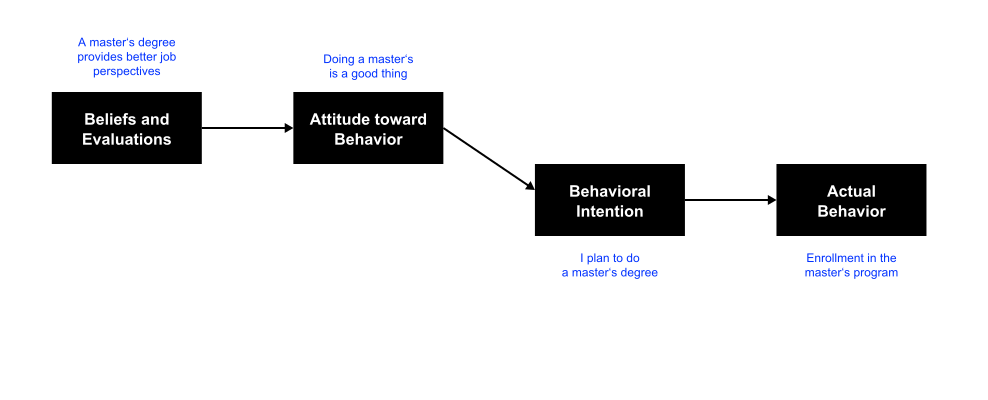{.fragment height="320"}

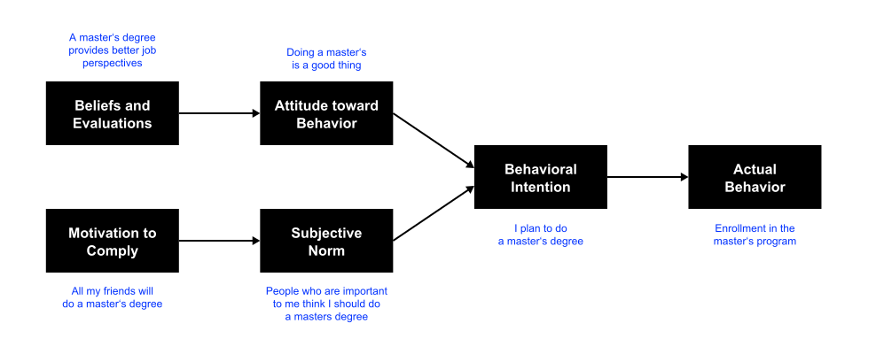{.fragment height="320"}
:::

:::notes
![The nomological net of the Theory of Reasoned Action [@ajzen1985intentions]](images/tra.svg){#fig-tra}
:::

## Technology Acceptance Model

The Technology Acceptance Model (TAM) [@davis1989perceived] translates the key tenets of TRA into the IT acceptance domain, except for subjective norms.

::: {.r-stack .html-hidden}
![The Technology Acceptance Model [@davis1989perceived]](images/tam-1.svg){.fragment height="320"}

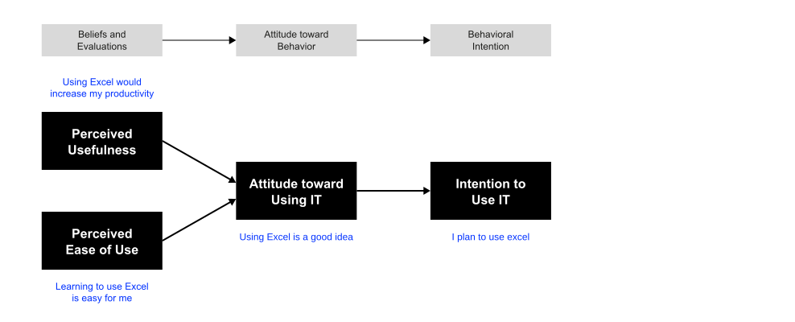{.fragment height="320"}

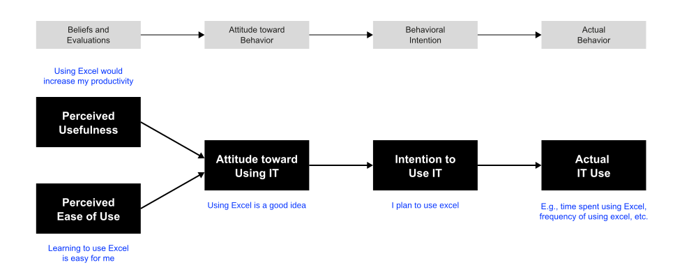{.fragment height="320"}
:::

:::notes
![The Technology Acceptance Model [@davis1989perceived]](images/tam.svg)
:::

## Exercise {.html-hidden .unnumbered .unlisted background-color="#000"}

Form small groups, research the Unified Theory of Acceptance and Use of Technology (UTAUT) [@venkatesh2003user], and try to understand how it relates to TAM.

- What (constructs) does it add?
- How (relationships) do they connect?
- Why (justification), and who, where, when (boundary conditions)?

# Theory-Review Alignment

:::medium
Which theory type does your question need, and which will your review produce?
:::

:::fragment
Gregor's five types function as a decision tool for the review you are about to design:
:::

:::html-hidden
::: incremental
- **"What is X?"** (analysis or explanation: synthesize existing conceptualizations)
- **"How does X affect Y?"** )explanation and prediction: surface competing causal mechanisms)
- **"How should we design for X?"** (design and action: synthesize design principles, not causal claims)
:::
:::

:::notes
A question phrased as "what is X" is usually aiming at an **analysis** or **explanation** type theory: your review's job is to synthesize existing conceptualizations into a clearer account of what the phenomenon is. A question phrased as "how does X affect Y" is aiming at **explanation and prediction**: your review needs to surface competing causal mechanisms, not just definitions. A question phrased as "how should we design for X" is aiming at **design and action**: your review needs to synthesize design principles, not causal claims.

This matters because it constrains what a good review of your topic can look like. A review that synthesizes definitions when your question needs causal mechanisms will not answer your question, no matter how many papers it covers. Hold this thought, it is the first decision in the sequence you formalize properly in [SLR I: Types, Goals and Alignment](../slr-types/), where review type, question type, and theory type are placed into a single matrix.
:::

# Homework

:::medium
Bring one candidate theoretical lens to the next session.
:::

For the tension your team has chosen to pursue, identify one theory, model, or framework that might explain it, from your own reading so far, not necessarily from a full literature search yet.

1. Which of Gregor's five types is it (analysis, explanation, prediction, explanation and prediction, or design and action)?
2. What are its constructs (the *what*), its propositions (the *how*), and its logic (the *why*)?
3. What boundary conditions would you expect it to have, and does your team's context fall inside or outside them?

# Q&A {.html-hidden .unlisted background-image="../assets/bg.jpg" .headline-only}

# Literature {visibility="hidden"}

::: {#refs}
:::
