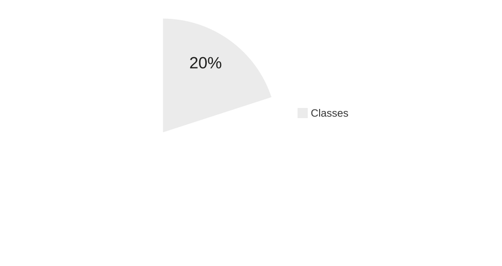
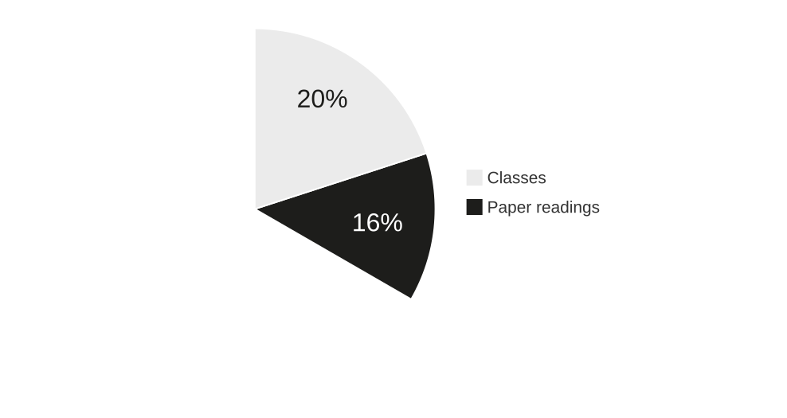
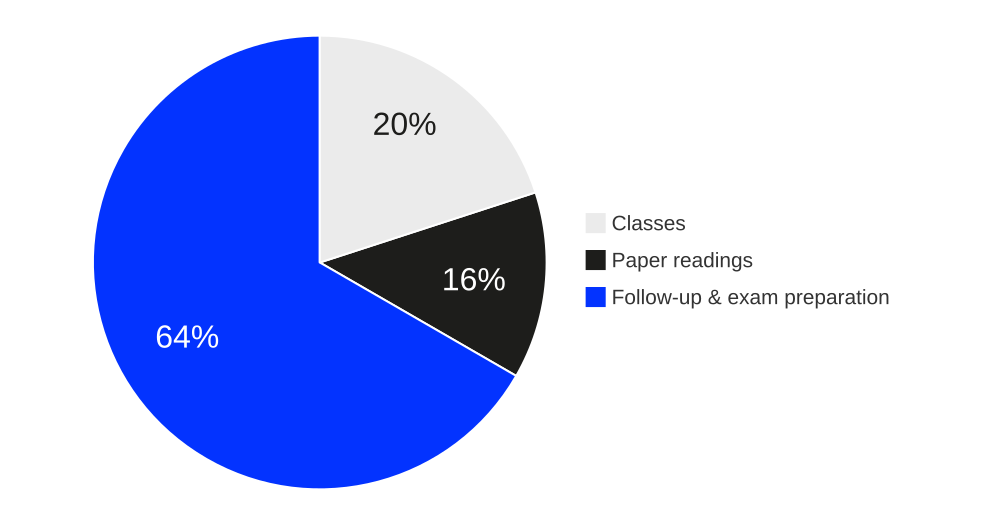

# Motivation {background-color="#0333ff"}

:::large
> There is more vacuity about strategy than about any other topic in business today. *John Kay, Financial Times in @mintzberg2005strategy*
:::

:::notes
While this observation about strategic vacuity remains painfully relevant, it reflects a deeper challenge: in contemporary firms, strategy can no longer be untangled from digital technologies, particularly AI. Modern strategizing processes—from competitive analysis and resource allocation to performance monitoring and strategic adaptation—are increasingly embedded within and enabled by digital systems. 

Understanding business strategy frameworks, strategic planning processes, and performance measurement approaches is therefore essential for developing digital solutions that truly create value rather than simply automating existing inefficiencies. Without grounding in how organizations formulate strategies, assess performance through balanced scorecards and variance analysis, and manage through control systems, IT and AI professionals risk building sophisticated technologies that miss strategic context entirely. 

Conversely, strategic thinking divorced from digital capabilities remains the kind of empty rhetoric Kay criticizes. In an era where strategy and technology are fundamentally intertwined, mastering both strategic frameworks and performance management principles becomes prerequisite for creating digital solutions that drive genuine competitive advantage.
:::

## Discussion {.html-hidden .discussion-slide}

:::large
How would you explain the term **strategy**?
:::

# Contents

In this course, we will have a look at following topics

:::incremental
1. **Understanding strategy:**\
   definition, formation, and competitive positioning (lectures 1-3)
2. **Building strategic advantage:**\
   resources, capabilities, and organizational design (lectures 4-6)
3. **Performance management and control:**\
  measuring and managing strategic performance (lectures 7-9)
:::

## {.html-hidden .unlisted background-color=black background-iframe="https://www.menti.com/al1npw2uq1mu"}

# Learning objectives

During this course, you should advance your skills in the following areas:

:::incremental
- Understanding of concepts and taxonomies of strategy
- Basic knowledge of underlying theories of strategic management and decision-making
- Understanding of tools and frameworks for the development, analysis and implementation of strategies
- Knowledge of key concepts and frameworks for decision making under uncertainty
- Understanding of the role of IT strategy and its relationship with business strategy
- Ability to work independently with literature to derive key-insights
- Application of concepts, tools, and framework in real-life cases
:::

# Delivery

This course will be taught using traditional synchronous lectures.

. . .

The focus of the classes is to briefly introduce, discuss and apply major concepts, tools and methods of strategic management.

. . .

Many of the classes will involve group work, discussions and short presentations.

. . .

**The greatest amount of work is in preparing for and following up lectures in order to become sufficiently familiar with and understand the content.**

. . .

It is necessary to prepare for each session, for instance by reading a paper, details (see @tbl-schedule).

. . .

**Please prepare your schedule accordingly.**


# Effort

::: {.r-stack .html-hidden}

{.fragment height="420"}

{.fragment height="420"}

{.fragment height="420"}

:::

:::notes

{#fig-effort}

For this course you will receive 5 ECTS. This corresponds to **approx. 150 hours of work** required by an **average student** to pass the course.

- Classes (approx. 30 hours)
- Paper reading (approx. 25 hours; approx. 2.5 hours per paper)
- Follow-up and exam preparation (do the math yourself)

:::

# Grading {.headline-only}

## Exam

There will be a written exam at the end of the semester. 

The exam will

:::incremental
- take place during the examination weeks,
- will last __90 minutes__,
- cover all contents discussed in lecture,
- focus on the application of the knowledge gained in the course.
:::

## A note on grades

:::notes
It is unlikely that every student will receive a very good grade, i.e. deliver an outstanding performance — see the meaning of grades.  Instead, it is to be expected that the grades will spread across the spectrum.
:::

| Grade                    | Meaning
| ------------------------ | -------------------------------------------------------------------- |
| `1` — very   good            | [A   truly outstanding achievement that (not only) shows no deficiencies in the criteria mentioned, but also gives both the supervisor and external assessors an excellent   impression.]{.fragment} |
| `2` — good                   | [Work   that exceeds the average requirements/performance and is easily recognizable   and presentable to the outside world as a “good performance”.]{.fragment}                                              |
| *Note*                   | *2.5   is the average of passed assessments, i.e., an “average   performance”*                                                                                             |
| `3` — satisfactory           | [A   performance that achieves the desired goal "to a satisfactory   extent";       however, deficiencies can be identified here and there. ]{.fragment}                                                      |
| `4` — sufficient             | [A   performance that “still adequately satisfies” the requirements,       but deviates from the expectations placed on it in several ways.  ]{.fragment}                                                     |
| `5` — not   sufficient      | [A   performance that does not meet several of the criteria mentioned.]{.fragment} 

: Meaning of grades {#tbl-grades}

### Last year's results

This is the grade distribution from last year:

:::{#fig-grading}
```{mermaid}
%%{init: {'theme':'base', 'themeVariables': { 'xyChart': {'backgroundColor': 'transparent', 'titleColor': '#0333ff', 
'xAxisLabelColor': '#333', 'yAxisLabelColor': '#333', 'plotColorPalette': '#0333ff'}}, 'xyChart': {'width': 700, 
'height': 350}}}%%
xychart-beta
    x-axis "Grade" ["1,00", "1,30", "1,70", "2,00", "2,30", "2,70", "3,00", "3,30", "3,70", "4,00", "5,00"]
    y-axis "Count" 0 --> 20
    bar [3, 8, 1, 3, 5, 2, 4, 2, 7, 8, 18]
```

Grading statistics for winter term 2025/26

:::


# Schedule {.scrollable}

:::smaller

:::column-page-right

| Date     | Topic                                    | Preparation                             |
|----------|------------------------------------------| --------------------------------------- | 
| 06.10.26 | **Strategy Definition and Schools**      | —
| 13.10.26 | **Competitive Analysis and Positioning** | Read @hallegatte2009strategies
| 20.10.26 | **Resource-based Advantages**            | Read @peteraf1993cornerstones
| 27.10.26 | **Strategy Formation**                   | Read @mintzberg1978patterns, research on Netflix
| 03.11.26 | **Organizational Design**                | Listen to [Decoder](https://www.theverge.com/24242833/philips-ceo-roy-jakobs-ai-healthcare-fda-cpap-recall-decoder-podcast-interview) and read @lorenz2023perfect
| 10.11.26 | **Ethics and Values**                    | Read @barnett2012does
| 17.11.26 | **Meta Case Study** (Pt. 1)              | Listen to [Meta Story on Acquired](https://www.acquired.fm/episodes/meta)
| 24.11.26 | **Corporate Performance Management**     | — 
| 01.12.26 | **CPM**                                  
| 08.12.26 | **OKRs**                                 | —
| 15.12.26 | **Excercise Debriefing**                 | Upload your solutions and questions 
| 22.12.26 | **Meta Case Study** (Pt. 2)              | Research data for all case study tasks
| 12.01.26 | **IT Strategy**                          | Read @chen2010information 
| 19.01.26 | **Exam Preparation**                     | Review the contents, prepare questions

: Schedule winter term 2026/2027 (may be subjected to changes) {#tbl-schedule}

:::
:::

# Q&A {.html-hidden .unlisted .headline-only background-image="../assets/bg.jpg"}

# Literature

::: {#refs}
:::