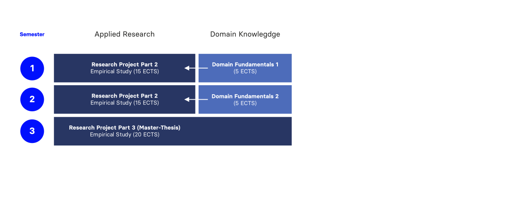
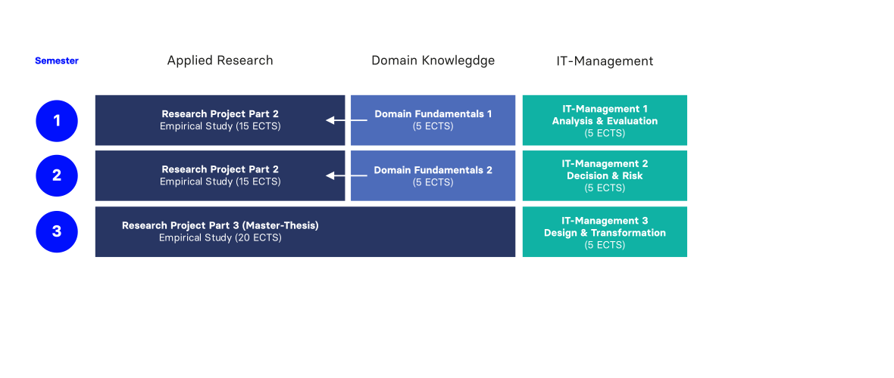
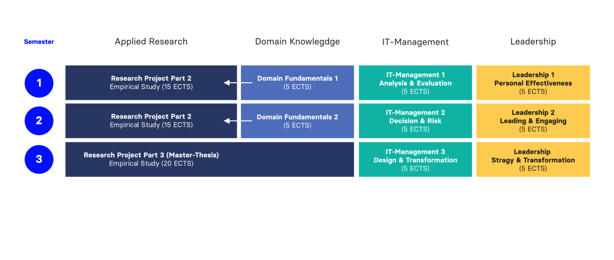
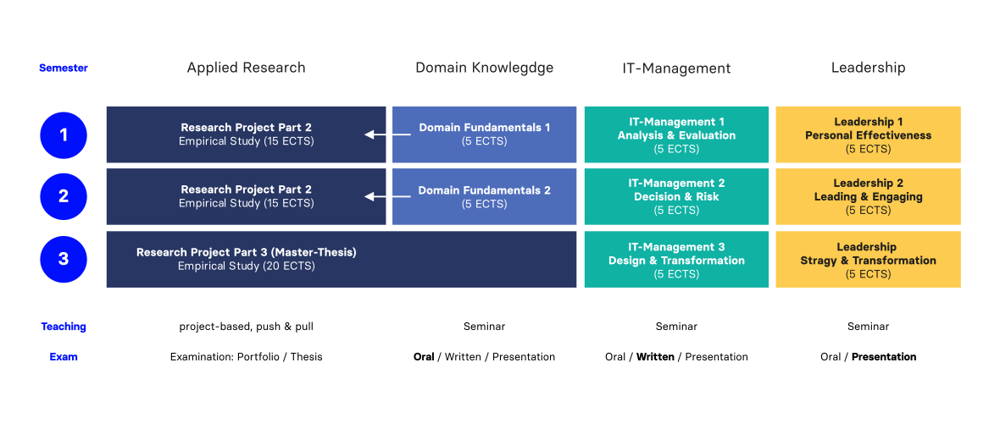

# Future has no recipe {.no-headline background-image="images/future.png" background-color="#000000"}

:::large
[Cyber attacks.]{.fragment}\
[AI transformation.]{.fragment}\
[Platform shifts.]{.fragment}\
[Unknown unknowns.]{.fragment}
:::

:::fragment
Future has no recipe.\
[It's all about **your capabilities** to see, prioritize and solve problems.]{.fragment}
:::

:::aside
:::smaller
Image generated with google Gemini and edited with Photoshop
:::
:::

:::notes
Welcome everyone, and thank you for being here. My name is Andy Weeger, and I'm Professor for Information Management at HNU. Today I want to walk you through the DLI master's program: what it is, who it's for, what you'll be able to do after it, and how you can apply.

I'll keep the presentation to around 25 minutes so we have enought time for your questions at the end. 
There are no dumb questions here; if something is unclear or seems too good to be true, push back.

Let me open with a question. Who learned in their bachelor's program how to lead an organization through an AI transformation when the technology itself is still changing week by week?

No one. Because there's no recipe for that yet.

And this is the central challenge of IT leadership today: you will walk into situations where the standard playbook doesn't apply. The problem is genuinely new, the stakes are high, and someone has to figure it out.

That someone needs a toolbox, not a recipe book. A toolbox with three compartments.

First: mental models (theories and frameworks that help you penetrate complexity; not memorized answers, but lenses that let you see problems differently). Second: methods (proven practices for moving from a fuzzy problem to a defensible solution). Third: social skills (the ability to lead, persuade, and collaborate, because none of this happens alone).

Building that toolbox is what the DLI is about. You'll see this image come back throughout the presentation; it's the central idea.
:::

# For you? {.no-headline background-image="images/future-2.png" background-color="#0333ff"}

:::medium
If you ...
:::

:::medium
:::incremental
- have a Bachelor in IM, CS, or BA (with IT);
- want to take responsibility, not just execute;
- & want to create new knowledge
- to solve real problems.
:::
:::

:::fragment
:::large
Welcome.
:::
:::

:::aside
:::smaller
Image generated with google Gemini and edited with Photoshop
:::
:::

:::notes
Let me be direct with you, because I think you deserve that.

This program is not for everyone. That's by design.

If you're looking for a master's that checks a box on your CV and doesn't ask too much of you, this is the wrong place, and I'd rather tell you that now than have you find out in semester one.

But if you want depth, if you're the kind of person who gets frustrated when a case study says "assume a stable environment," if you want to work on problems that don't have a clean solution at the back of the book, then you are exactly the person this program is built for.

We expect intellectual curiosity. We expect willingness to wrestle with ambiguity. We expect you to show up and engage, not just consume.

The DLI selects for research orientation. The motivation letter we ask for is not a formality; it's how we read whether you're in that mindset.
:::

# Learning opportunities {background-color="#283663"}

The programme is designed to provide you with the **opportunity to learn**

:::fragment
**mental models** for\
[thinking in systems,]{.large}
:::

:::fragment
**methods** to make\
[evidence-based decisions,]{.large}
:::

:::fragment
& **social skills** to\
[lead from day one.]{.large}
:::

:::notes
Let me make the connection explicit, because this is the intellectual core of the program.

The three principles you'll hear about DLI (Think in Systems, Decide with Evidence, Learn by Doing Research, Lead from Day One) are not separate marketing claims. They describe how we fill the three compartments of the toolbox.

"Think in Systems" means that when you're working on a cyber resilience challenge, you don't just look at the firewall or the software stack. You map the suppliers, the employees, the regulatory environment, the dependencies you haven't thought of yet. That's a mental model at work.

"Decide with Evidence" means your recommendations are grounded in data you gathered and analyzed yourself, not gut feeling, not "best practice" copied from a consultant deck.

"Lead from Day One" is the social skills compartment. From the first semester, you present, you defend, you collaborate under pressure. You don't get a "leadership simulation" in semester four; you're already doing it.
:::

# Outcomes {background-color="#fde28b"}

The programme is designed to qualify you to

:::incremental
- decompose complex socio-technical problems,
- build evidence-based (digital) solutions in uncertain situations,
- defend solutions to leadership and the team,
- and to navigate independently at the frontier of knowledge.
:::

:::fragment
:::large
It takes complexity\
to defeat complexity.
:::
:::

:::notes
Let me translate this into concrete capabilities (not learning objectives from a module handbook, but what you can actually do when you walk out of here).

One: you can take a complex, messy IT problem (the kind where the first challenge is just understanding what the problem actually is) and decompose it into tractable pieces. That's the mental models compartment working.

Two: you can design and execute a path from that decomposed problem to a solution that stands up to scrutiny. Not an opinion; a solution with evidence behind it. That's methods.

Three: you can walk into a room of senior executives and make the case for the strategy you developed: defend it under questioning, adjust to objections, persuade people who weren't in the room when you gathered the evidence. That's social skills.

Four: you can pick up a new topic (a technology area, a management challenge, a regulatory development) and independently map what is known, what is contested, and where the frontier is. That's the research capability underneath all three compartments.

These four capabilities travel with you regardless of what industry you end up in or what role you grow into.
:::

# Career direction  {background-color="#087065"} 

A well-stocked toolbox is a foundation. It supports very different directions.

:::medium
:::incremental
- Digital transformation leadership
- Consulting with original insight
- IT project management
- Tech-to-business innovation
- Applied research / PhD
:::
:::

:::fragment
And other jobs we haven't heard of yet
:::

:::aside
:::smaller
This image was licensed through Adobe Stock (Educator License)
:::
:::

:::notes
A well-stocked toolbox isn't a career corset; it's a foundation that supports very different directions.

Let me highlight two or three depending on what I'm reading from the room.

Digital Transformation Leadership: organizations at every scale are restructuring around digital capabilities, and they need people who can lead that process from a position of both technical credibility and strategic judgment. That's DLI.

Consulting with original insight: this one I want to be specific about. There's a difference between a consultant who applies existing frameworks to a client's situation, and a consultant who can go beyond where the frameworks end, who builds new evidence, develops an original argument, and brings something the client couldn't have bought from a template. DLI prepares you for the second kind.

Applied Research or PhD: if you find during the program that you want to go deeper into a research question, that path is open. The research orientation of the program is a genuine preparation for doctoral work.
:::

## Structure

:::r-stack
{.fragment height="600"}

{.fragment height="600"}

{.fragment height="600"}

{.fragment height="600"}
:::

## The challenge {.no-headline background-color="#0333ff"}

:::fragment
The research challenge: **Cyber Resilience and Agentic AI**
:::

:::fragment
:::large
Agentic AI is the new asset to defend *and* the new force on both sides of the attack. [**The playbook for either role hasn't been written yet.**]{.fragment}
:::
:::

## Application and admission

The study program starts early October 2026. The application portal is open from 2 May to 15 July (winter term).

:::fragment
[Admission requirements]{.h4}
:::

::: incremental
- 210 ECTS Bachelor's degree (IM, CS, Business Administration)
- Minimum grade: 2.5 or better
- Language level: Minimum English level: B2
- For international applicants: German A2
- Applicants with a Bachelor's degree from outside the Lisbon Convention must provide a Graduate Record Examination (GRE) General Test.
:::

:::fragment
Details: www.hnu.de/dli
:::

:::aside
:::fragment
Applicants with a 180 ECTS Bachelor’s degree from a higher education institution within the Lisbon Convention may alternatively have at least 6 months of relevant professional experience gained after obtaining their Bachelor’s degree recognised.
:::
:::

## {.no-headline .vertical-center background-color="#0333ff"}

:::medium
[The hardest problems in IT management don't come with answers.]{.fragment} 
[The DLI is where you learn to find them.]{.fragment} 
[With the depth of a researcher and the eye of a leader.]{.fragment} 
[Build the toolbox.]{.fragment} 
[**Lead what comes next.**]{.fragment}
:::

:::notes
That quote captures the two poles we've been navigating throughout this presentation.

Depth: the mental models and methods that let you go beyond surface-level recommendations. Eye: the judgment, the communication, the leadership that lets you act on that depth in real organizations.

The toolbox is the bridge between the two.

I'll stop there. Let's open the floor for questions. And I genuinely mean the invitation; there's nothing too basic or too specific to ask.
:::

# Questions? {.headline-only}

:::aside
:::medium
andy.weeger@hnu.de
:::
:::

:::notes
Some things audiences often want to know that we didn't cover:

- Tuition fees and financial support options
- Whether the program is compatible with part-time work
- Exchange semester options
- What thesis topics have looked like in comparable programs
- Specific module content or faculty profiles

Close with: "Thank you for your time and your questions. I'm here for a few minutes afterwards as well. Good luck with your decision, and I hope to see some of you in October."
:::

