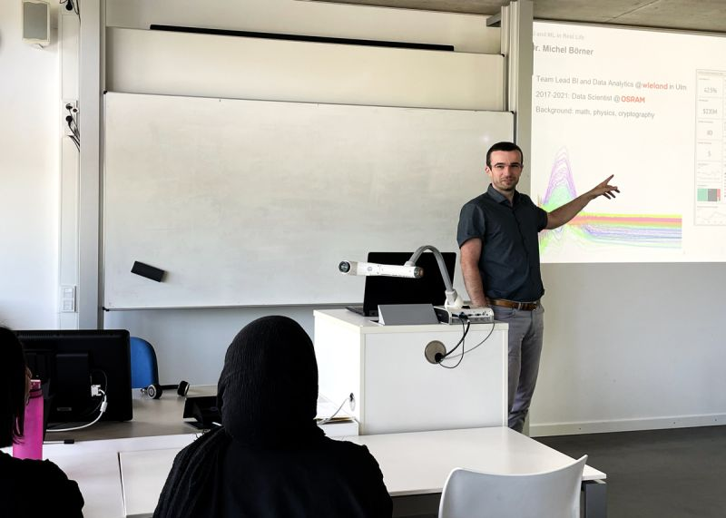
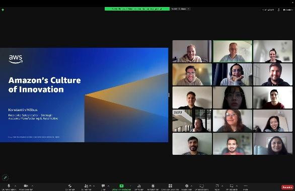
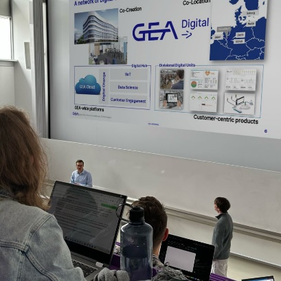
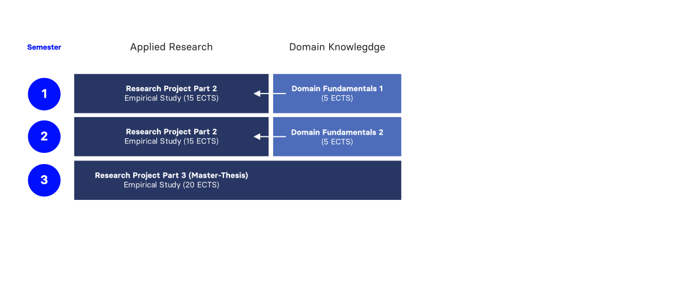
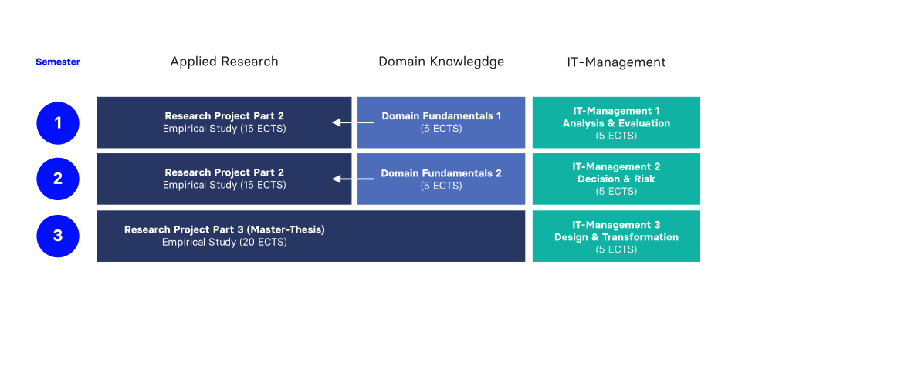
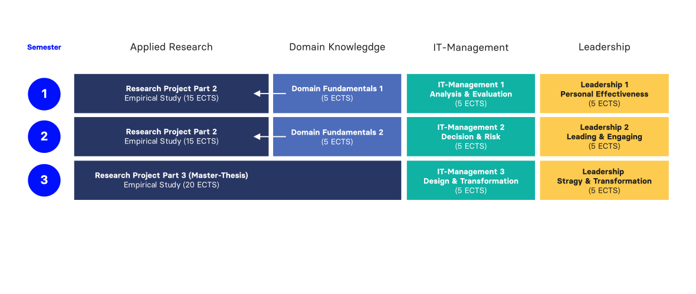
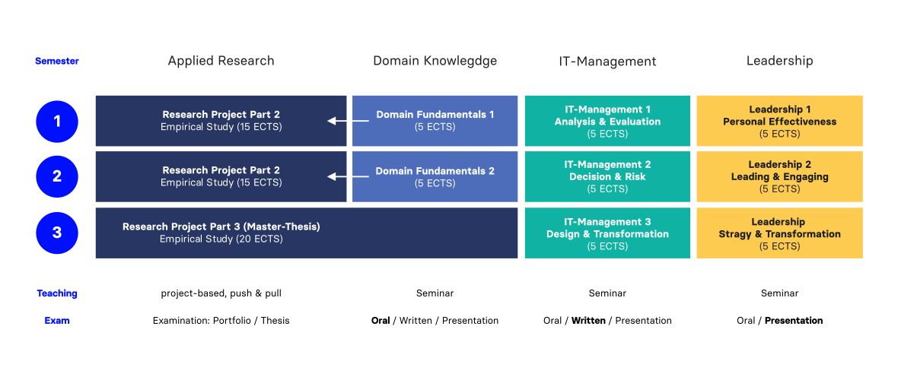
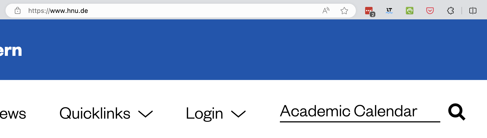
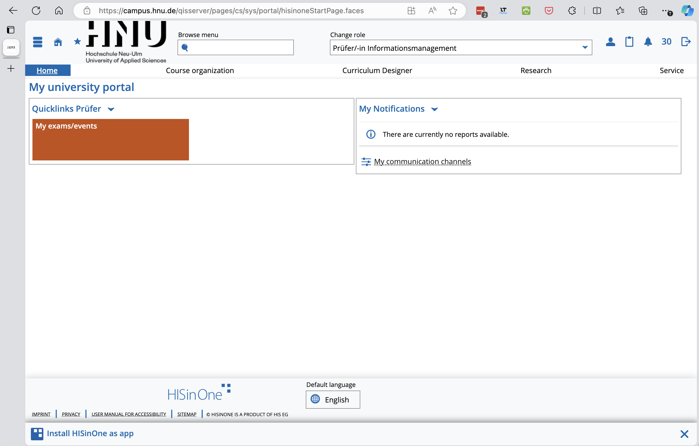

# Future has no recipe {.no-headline background-image="images/future.png" background-color="#000000"}

:::large
[Cyber attacks.]{.fragment}\
[AI transformation.]{.fragment}\
[Platform shifts.]{.fragment}\
[Unknown unknowns.]{.fragment}
:::

:::fragment
Future has no recipe.\
[It's all about **your capabilities** to see, prioritize and solve problems.]{.fragment}
:::

:::aside
:::smaller
Image generated with google Gemini and edited with Photoshop
:::
:::

# Expectations {background-color="#0333ff"}

:::medium
If you are here, you ...
:::

:::medium
:::incremental
- want to take responsibility, not just execute;
- & want to create new knowledge
- to solve real problems.
:::
:::

:::fragment
:::large
Warm welcome.
:::
:::

# Science x Practice {.no-headline}

:::large
Digital Leadership in\
Information Management (MSc)
:::

:::medium
[Science]{.fragment} [x Practice]{.fragment}
:::

:::fragment
We create learning opportunities for you to acquire ...
:::

:::incremental
- [professional competencies]{.highlight} through the transfer of theory and evidence-based knowledge, their interconnection and application — **mental models for thinking in systems**\
- [methodological competencies]{.highlight} through independent processing of practice-relevant problems at the border of existing knowledge — **capacity to make evidence-based decisions**\
- [social competencies]{.highlight} through theoretical inputs, continuous self-reflection and teamwork in an international context — **skills to lead from day one**.
:::

# International Business School {background-image="images/campus-hnu-letters.png" background-color="#000000"}

Three decades old\
and far from worn out

## International Business School {background-color="#000"}

Focus on innovation, sustainable entrepreneurship and digital transformation

:::incremental
- Founded in 1994 and rooted in the region Neu-Ulm/Ulm
- Spans three faculties: Health Management, Business and Economics,\
  and [Information Management]{.highlight}
- Educates about 4,300 students
- Doctoral center "Digital Innovations for the Changing Society" (DIWAG)\
  in cooperation with OTH Amberg-Weiden and HS Landshut
:::

## Students

::: {style="max-width: 60%;"}
:::medium
Diverse cultural\
and professional backgrounds
:::

Mostly German, with India, Spain, Chile, and Kazakhstan also represented.

Prior degrees mostly in _Wirtschaftsinformatik_ and _Information Management_, alongside _Computer Science_, _International Business_, _Game_, and _Digital Health_.
:::

{.absolute top="100" right="40" height="220"}

# Communalities Game  {background-color="#fde28b"}

:::large
A quick icebreaker
:::

:::aside
Create group of four and "compete" to find the most unique shared attributes.
:::



## Interactive teaching formats

:::medium
We employ a variety of\
different teaching formats.
:::

:::incremental
- Particularly the Research Project is closely intertwined\
  with hands-on insights from seasoned practitioners.
- To foster interpersonal interactions,\
  most of the modules will be on-site.
:::

{.absolute top="100" right="40" height="235"}
{.absolute top="250" right="225" height="195"}
{.absolute top="310" right="85" height="210"}

# Curriculum

:::r-stack
{.fragment height="600"}

{.fragment height="600"}

{.fragment height="600"}

{.fragment height="600"}
:::

# Hands-On

:::large
intern.hnu.de\
elearning.hnu.de\
Academic Calendar
:::

{.absolute top="100" right="40" height="150"}

# Examination Questions

:::medium
For all examination questions,\
the **Department of Studies & Examination**\
is your single point of contact.
:::

master@hnu.de\
campus.hnu.de

{.absolute top="100" right="40" height="220"}

# Shared Responsibilities {background-color="#0333ff"}

::::columns
:::{.column width="50%"}
[Your responsibilities]{.h4}

:::incremental
- Show up on time
- Come to class prepared
- Use opportunities to participate, learn, and practice proactively
- Use the online learning platform rather than bilateral mails
- Give feedback
:::
:::
:::{.column width="50%"}
[Our responsibilities]{.h4}

:::incremental
- Finish on time
- Come to class prepared
- Provide a conducive learning environment
- Support and enable achievement of learning goals
- Allow for active participation
:::
:::
::::

# {.no-headline .vertical-center background-image="images/future-2.png" background-color="#000000"}

:::large
Enjoy your\
learning journey
:::

# Q&A {.no-headline background-image="images/qa-card.jpeg" background-color="#000000"}

:::large
Q&A
:::

# {.no-headline .vertical-center background-image="images/campus-exterior.jpeg" background-color="#000000"}

:::large
erica.weilemann@hnu.de
andy.weeger@hnu.de
:::

:::aside
Hochschule für angewandte Wissenschaften Neu-Ulm\
Neu-Ulm University of Applied Sciences\
Wileystrasse 1, D-89231 Neu-Ulm
:::

